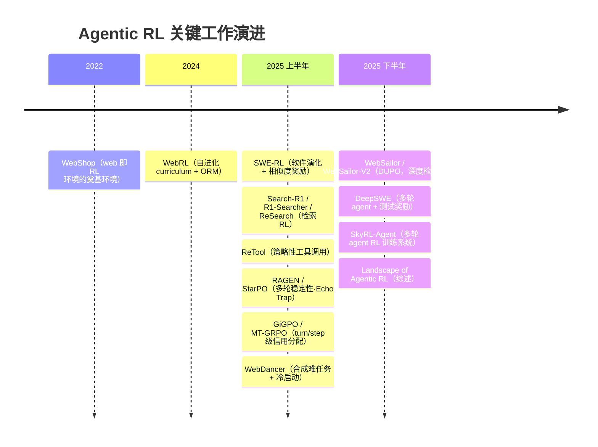
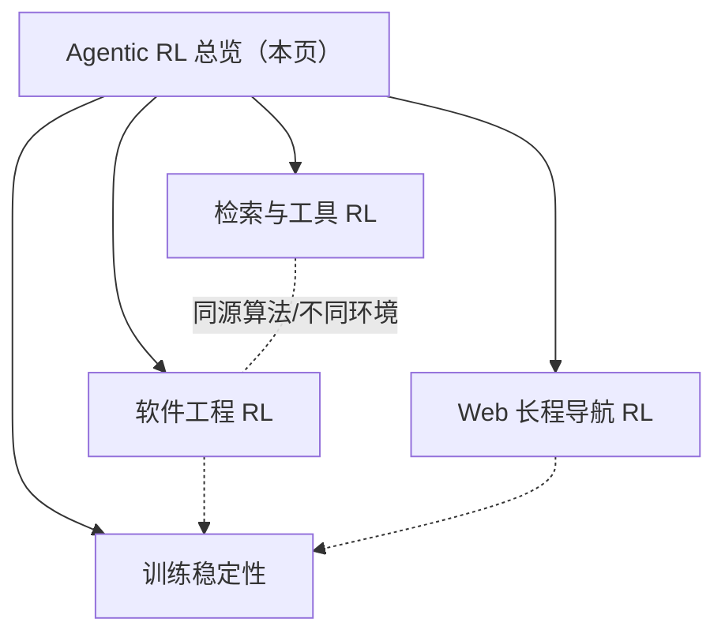

# Agentic RL（多轮环境交互的强化学习）

> **一句话**：把 RL 从"生成一段答案"扩展到"生成 → 执行 → 观测 → 再生成"的多轮轨迹，工具调用、检索、代码执行都成了动作，奖励来自任务是否真正完成——本节是这一方向的总览与导航。

前置阅读：[RLHF 总览](/rlhf/)、[PPO](/rlhf/ppo)、[GRPO](/rlhf/grpo)、[Tool Use 训练](/agent/tool-use)。

## 演进时间线

各方法的提出年份与机构见各子页开头引用块。

## 它和单轮 RLHF / RLVR 有什么不同

经典 RLHF（[PPO](/rlhf/ppo) + [Reward Model](/rlhf/reward-model)）与可验证奖励 RL（RLVR，如 [GRPO](/rlhf/grpo)/[DAPO](/rlhf/dapo) 训数学代码）本质上都是**单轮**：给定 prompt $x$，策略一次性吐出完整回答 $y$，奖励只对 $y$ 打一次分。用 MDP 的语言说，这是一个退化的"单步决策"问题——模型是被动的序列生成器。

Agentic RL 把场景换成**时序展开、部分可观测**的环境。一条轨迹是

$$
\tau = (x,\, a_1,\, o_1,\, a_2,\, o_2,\, \dots,\, a_T)
$$

其中 $a_t$ 是策略生成的动作（思考 + 工具调用，或最终回答），$o_t$ 是环境返回的观测（代码执行结果、检索文档、网页 DOM、单测报告等）。三点关键区别：

- **动作不止是文字**：调用搜索引擎、跑一段代码、点一个网页按钮、读写文件都是动作；模型从"会说"变成"会做"。
- **观测 token 不是策略生成的**：$o_t$ 由环境注入，必须从 loss 里掩掉（同 [Loss Masking](/sft/loss-masking) 的道理）。漏掩会让训练去优化"生成检索结果"这种不可能目标，Search-R1 把 retrieved-token masking 列为不发散的前提。
- **轨迹级优化**：奖励通常只在整条轨迹结束时产生（稀疏、延迟），优化目标针对整条交互而非单步输出，rollout 是"生成与执行交替"，对推理引擎和沙箱提出了单轮训练没有的要求。

形式上目标仍是带 KL 约束的期望回报 $\max_{\pi_\theta}\mathbb{E}_{\tau\sim\pi_\theta}[R(\tau)] - \beta\,\mathbb{D}_{\text{KL}}[\pi_\theta\,\|\,\pi_{\text{ref}}]$，但 $\tau$ 含环境步，$R$ 来自真实任务结果。

## Reward 从哪来

奖励工程是 agentic RL 的命门，常见三类来源：

| 类型 | 怎么算 | 代表 |
| --- | --- | --- |
| **结果验证（二值）** | 单测通过 / 答案精确匹配 / 数据库终态比对 | Search-R1、ReTool、τ-bench 式环境 |
| **规则可验证（连续）** | 生成补丁与真实补丁的相似度，无需跑测试 | SWE-RL |
| **结果奖励模型（ORM）** | 训练判别器给整条轨迹打分（环境无法程序化判定时） | WebRL |

优先级一般是"能程序化验证就别用 RM"：可验证奖励几乎不可被讨好，而 RM 会被 reward hacking。但 agent 场景的 hacking 更有创造力——删改失败的单测、硬编码期望输出、伪造工具返回格式骗过验证器。对策是验证器与策略隔离（独立沙箱、只读测试文件）加定期人工审计高分轨迹。

## 多轮 credit assignment 的难点

单轮 RL 里奖励天然对齐到唯一的输出，agentic RL 的核心难题在于：**一个终局奖励要分摊给十几步动作，哪一步该负责?**

[GRPO](/rlhf/grpo)/[RLOO](/rlhf/rloo) 这类 critic-free 方法的默认做法是把组内归一化的**轨迹级优势 $A_i$ 广播到该轨迹的全部动作 token**——简单稳健，但无法区分一条成功轨迹里哪几步是真功臣、哪几步是搭便车，对早期因果关键步的信用传播很慢。[PPO](/rlhf/ppo) 用 critic 估值本可做更细的逐步 advantage，但在长程稀疏奖励下 critic 自身就难训准。

这是当前最活跃的研究缝隙，思路大致分三档：(1) 沿用轨迹级优势，靠课程与采样把信号做密（见 [DAPO](/rlhf/dapo) 动态采样思想）；(2) 构造**逐轮/逐步奖励**，把即时反馈与终局优势混合（如按工具调用是否有效给中间分）；(3) 借树搜索 / 图结构在轨迹内部做更精细的归因。没有银弹——奖励越稀疏、轮数越长，credit assignment 越是瓶颈。

## 与 GRPO / PPO 的关系

Agentic RL 不是新的优化算法，而是**把已有 policy-gradient 算法搬到多轮环境**：底座仍是 [PPO](/rlhf/ppo)（带 critic）或 [GRPO](/rlhf/grpo)/[DAPO](/rlhf/dapo)/[RLOO](/rlhf/rloo)（group baseline，省 critic）。差异落在工程与细节而非更新公式：

- rollout 从"纯推理引擎采样"变成"生成—执行交替"，要支持在工具调用处停下、外部执行、复用 KV cache 续写，环境执行远慢于生成，异步 rollout 几乎是刚需；
- logprob、重要性比值、KL 估计**全程只在动作 token 上算**，任何一处漏掩观测都会引入系统性偏差；
- 长度与轮数都要设上限，超限样本的优势处理可参考 [DAPO](/rlhf/dapo) 的 overlong 思路。

实践共识：先用少量合成轨迹 [SFT](/sft/) 冷启动到"能跑通格式与流程"，再 RL 提升成功率（WebRL、ReTool 的共同配方）；环境是最大的工程变量，先做到确定性、可重放再扩规模。

## 本节地图

四个子页按环境类型与共性难点划分：

- [检索与工具 RL](/agent/agentic-rl/search-rl)：搜索引擎 / 计算器 / 代码解释器作为动作，结果奖励 + 检索掩码。代表 Search-R1（7 个 QA 数据集较 RAG 基线提升约 41%，Qwen2.5-7B）、ReTool（AIME 2024 用约 400 步 RL 达 67%，远超纯文本 RL）。
- [软件工程 RL](/agent/agentic-rl/swe-rl)：在真实代码仓库上做补丁生成、bug 修复、跑测试。代表 SWE-RL（用补丁相似度规则把开源软件演化史变成可规模化 RL 数据，并展现跨域迁移）。
- [Web 长程导航 RL](/agent/agentic-rl/web-agent-rl)：浏览器环境下的多步操作，轨迹长、奖励极稀疏。代表 WebRL（ORM + 自进化在线课程，让任务难度始终贴着模型能力边缘）。
- [训练稳定性](/agent/agentic-rl/stability)：贯穿四类环境的共性工程——观测掩码、异步 off-policy 控制、reward hacking 防御、环境噪声治理、课程与动态采样。

系统化的全景梳理可参考综述《The Landscape of Agentic Reinforcement Learning for LLMs》（2025），其将 agentic RL 形式化为时序展开的 POMDP，并按规划、工具使用、记忆、推理、自我改进等核心能力组织。

## 参考链接

- Zhang et al., 2025. *The Landscape of Agentic Reinforcement Learning for LLMs: A Survey.* arXiv:2509.02547 — <https://arxiv.org/abs/2509.02547>
- Jin et al., 2025. *Search-R1: Training LLMs to Reason and Leverage Search Engines with RL.* arXiv:2503.09516 — <https://arxiv.org/abs/2503.09516>
- Wei et al., 2025. *SWE-RL: Advancing LLM Reasoning via RL on Open Software Evolution.* arXiv:2502.18449 — <https://arxiv.org/abs/2502.18449>
- Qi et al., 2024. *WebRL: Training LLM Web Agents via Self-Evolving Online Curriculum RL.* arXiv:2411.02337 — <https://arxiv.org/abs/2411.02337>
- Feng et al., 2025. *ReTool: Reinforcement Learning for Strategic Tool Use in LLMs.* arXiv:2504.11536 — <https://arxiv.org/abs/2504.11536>
- Yao et al., 2024. *τ-bench: A Benchmark for Tool-Agent-User Interaction in Real-World Domains.* arXiv:2406.12045 — <https://arxiv.org/abs/2406.12045>
