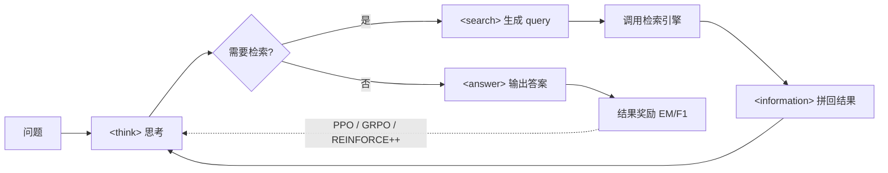

# 检索与工具 RL（Search-R1 系）

> **一句话**：以 Search-R1（[arXiv:2503.09516](https://arxiv.org/abs/2503.09516)，2025）为代表的一类工作，用 RL 训练 LLM 在推理链中自主决定"何时检索、检索什么"，把搜索/工具调用变成可学习的策略，而非外挂的固定流水线。
>
> 提出年份：2025（3 月）· 机构/团队：UIUC（Jin et al.）· 会议/来源：COLM 2025 / arXiv:2503.09516

::: tip 前置阅读
建议先读 [Agentic RL 总览](/agent/agentic-rl/) 了解"把多步交互纳入 RL 优化"的整体思路，以及 [GRPO](/rlhf/grpo) 掌握本页反复用到的 group-relative 优势估计。本页是 Agentic RL 的检索/工具子方向。
:::

## 直觉与动机

传统 RAG 的检索时机是写死的：要么在生成前一次性检索（retrieve-then-read），要么按固定模板迭代。问题在于——**何时该查、查什么 query、查到的结果如何影响下一步推理，本应是模型自己决策的一部分**。对多跳问答（multi-hop QA）尤其如此：第二跳的 query 依赖第一跳检索回来的实体，靠固定流程很难覆盖。

另一条线索来自 DeepSeek-R1 式的纯 RL 推理：只用结果奖励（答案对不对）就能涌现出长链反思。一个自然的问题是——如果在推理链中间允许模型发出"搜索动作"，并把检索引擎当成**环境**而非数据源，能否用同样的结果奖励教会模型把检索织进思维链？

Search-R1、R1-Searcher、ReSearch 等几乎同期（2025 年 3 月）给出的答案是肯定的：把"生成搜索 query → 调用检索 → 读结果 → 继续推理"作为一个多轮 rollout，用 PPO/GRPO/REINFORCE++ 优化，模型会自发学会按需检索、改写 query、甚至多跳追问。相比提示工程（few-shot 教模型用搜索）和 SFT（蒸馏固定轨迹），RL 路线让"交互策略"本身可学，泛化性更好。

## 方法与流程

### 交错式 rollout

核心是把单轮生成扩展为"思考—检索—再思考"的多轮交错轨迹。以 Search-R1 的模板为例，模型被约束按特殊标记输出：

```
<think> 推理 </think>
<search> 搜索 query </search>
<information> 检索引擎返回的 passage </information>
<think> 基于检索结果继续推理 </think>
...
<answer> 最终答案 </answer>
```

rollout 时由训练框架解析输出流：一旦检测到 `</search>`，就暂停生成、调用检索器、把结果包进 `<information>...</information>` 拼回上下文，再让模型续写。如此循环直到出现 `<answer>` 或达到检索次数上限（Search-R1 默认最多约 4 次搜索）。




> 图源：Jin et al., *Search-R1: Training LLMs to Reason and Leverage Search Engines with Reinforcement Learning*, [arXiv:2503.09516](https://arxiv.org/abs/2503.09516)（用于学习注解，版权归原作者）

### 奖励设计

Search-R1 走极简路线：**纯结果奖励、规则化**，奖励就是答案与标注的精确匹配（EM）：

$$
r_\phi(x, y) = \mathrm{EM}(a_{\text{pred}}, a_{\text{gold}})
$$

作者明确不加格式奖励，认为结果奖励足够、避免 reward hacking。R1-Searcher 则采用**两阶段奖励**应对冷启动：第一阶段用"检索激励"——只要发起过检索就给 0.5、格式正确再给 0.5，不看答案对错，先让模型快速学会调用格式；第二阶段切到答案奖励（F1 分数），格式错则罚 −2。ReSearch 走 GRPO + 结果奖励（答案正确性 + 格式）路线。

### 对检索结果做 loss masking（关键工程点）

这是把"环境返回"塞进自回归序列后必须处理的细节。检索回来的 `<information>` token **不是模型生成的**，若把它们也算进策略梯度，等于让模型去"拟合"外部文本，会带来不稳定的学习动态。三家工作不约而同地引入**检索 token 掩码**：用指示函数 $I(y_t)$ 标记——LLM 生成的 token 取 1、检索返回的 token 取 0，损失只在 $I(y_t)=1$ 处计算。Search-R1 的带掩码 PPO 目标可写为：

$$
\mathcal{J}_{\text{PPO}}(\theta) = \mathbb{E}\Big[\frac{1}{\sum_t I(y_t)} \sum_{t:\,I(y_t)=1} \min\big(\rho_t A_t,\ \mathrm{clip}(\rho_t, 1{-}\epsilon, 1{+}\epsilon) A_t\big)\Big]
$$

其中 $\rho_t = \pi_\theta / \pi_{\text{old}}$。GRPO 版本同理在 group 内做归一化并只在生成 token 上累加。Search-R1 的消融显示，加掩码在多个数据集上稳定提升表现（如 7B-base 在 NQ 上 0.480 vs 不掩码的 0.388）。R1-Searcher 把这一点称作"retrieval mask-based loss calculation"，与"RAG-based rollout"并列为对 REINFORCE++ 的两处改动。

## 代表工作

- **Search-R1**（[arXiv:2503.09516](https://arxiv.org/abs/2503.09516)，COLM 2025）：基于 [veRL](/harness/systems) 的可扩展 RL 框架，支持 PPO/GRPO/REINFORCE，本地稠密检索（flat / ANN）与搜索 API。在 7 个 QA 数据集上，Qwen2.5-7B 相对 RAG 基线提升约 41%、3B 提升约 20%。代码 [PeterGriffinJin/Search-R1](https://github.com/PeterGriffinJin/Search-R1)（约 4.9k star，近似）。
- **R1-Searcher**（[arXiv:2503.05592](https://arxiv.org/abs/2503.05592)）：两阶段 outcome-based RL，基于 REINFORCE++，先学检索格式再学答对。Qwen-2.5-7B-Base 在 HotpotQA 上相对 GPT-4o-mini 基线（ReARTeR）大幅领先。代码 [RUCAIBox/R1-Searcher](https://github.com/RUCAIBox/R1-Searcher)（约 0.7k star，近似）。
- **R1-Searcher++**（[arXiv:2505.17005](https://arxiv.org/abs/2505.17005)）：在 RL 中引入"内部知识利用奖励"+"记忆机制"，让模型优先用已掌握的知识、必要时才外检索。相比 vanilla RL，效果略升的同时检索次数下降约 42.9%——直指 Search-R1 系"过度检索"的痛点。
- **ReSearch**（[arXiv:2503.19470](https://arxiv.org/abs/2503.19470)，NeurIPS 2025）：GRPO 训练、无需推理步骤监督，把搜索当作推理链的组成部分，在 Qwen2.5-7B/32B 上训练并展现出反思、自纠等行为。代码 [Agent-RL/ReCall](https://github.com/Agent-RL/ReCall)（含后续把"搜索"推广到通用工具调用的 ReCall，约 1.4k star，近似）。

从 Search 推广到通用工具调用（ReCall）、再到多模态检索（MMSearch-R1）的演进，说明这套"交错 rollout + 结果奖励 + 调用结果掩码"的范式具备相当的通用性。

## 局限与对比

- **奖励太稀疏 / 偏 EM**：纯结果奖励对短答案 QA 友好，但对开放生成、长答案场景不好评判；EM 还会鼓励"猜短答案"。靠近 [GRPO](/rlhf/grpo) / [DAPO](/rlhf/dapo) 的优势归一化和长度处理可缓解。
- **过度检索与检索成本**：模型容易学成"逢题就查"，推理时延和检索开销高。R1-Searcher++ 用内部知识奖励显式压低检索频次是主要应对方向。
- **检索器是固定环境**：检索质量上限锁死策略上限；检索器与策略不联合优化，query 写得再好也受限于召回。
- **训练稳定性**：多轮交错让序列变长、reward 更稀疏，PPO 偏稳但慢、GRPO 快但易抖。相关讨论见 [Agentic RL 稳定性](/agent/agentic-rl/stability)。
- 与同属 Agentic RL 的 [SWE-RL](/agent/agentic-rl/swe-rl)、[Web Agent RL](/agent/agentic-rl/web-agent-rl) 相比，本方向动作空间最简单（只有"搜索"一类工具）、环境最可控，因此常作为 agentic RL 的入门/验证场景。RL 与 SFT、纯 RAG 的取舍可参考 [RL vs RAG vs 微调](/skills/vs-rag-finetune)。

## 参考文献

- Jin et al. *Search-R1: Training LLMs to Reason and Leverage Search Engines with Reinforcement Learning.* arXiv:2503.09516. <https://arxiv.org/abs/2503.09516>
- Song et al. *R1-Searcher: Incentivizing the Search Capability in LLMs via Reinforcement Learning.* arXiv:2503.05592. <https://arxiv.org/abs/2503.05592>
- Song et al. *R1-Searcher++: Incentivizing the Dynamic Knowledge Acquisition of LLMs via Reinforcement Learning.* arXiv:2505.17005. <https://arxiv.org/abs/2505.17005>
- Chen et al. *ReSearch: Learning to Reason with Search for LLMs via Reinforcement Learning.* arXiv:2503.19470. <https://arxiv.org/abs/2503.19470>
- 代码：[PeterGriffinJin/Search-R1](https://github.com/PeterGriffinJin/Search-R1)、[RUCAIBox/R1-Searcher](https://github.com/RUCAIBox/R1-Searcher)、[RUCAIBox/R1-Searcher-plus](https://github.com/RUCAIBox/R1-Searcher-plus)、[Agent-RL/ReCall](https://github.com/Agent-RL/ReCall)
