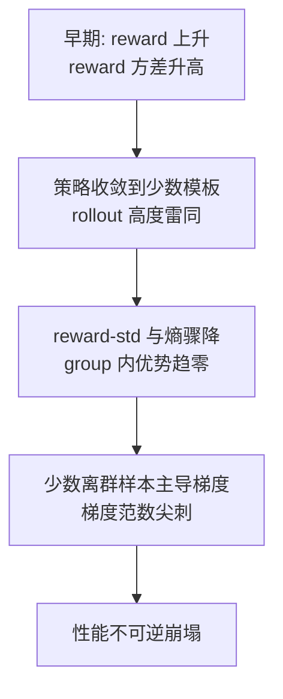

# 多轮 Agentic RL 的训练稳定性

> **一句话**：多轮 agent RL 比单轮推理 RL 更容易崩——StarPO / RAGEN（2025）系统刻画了 "Echo Trap"（reward 方差悬崖 + 梯度尖峰）这一典型失稳模式，并给出过滤、去 KL、非对称裁剪等稳定化手段。
>
> 提出年份：2025（4 月）· 机构/团队：RAGEN 团队（含 UIUC / Michigan 等）· 会议/来源：arXiv:2504.20073

::: tip 前置阅读
建议先读 [Agentic RL 总览](/agent/agentic-rl/) 与 [GRPO](/rlhf/grpo)。本页假设你已熟悉 group-based 优势估计与 PPO 裁剪目标。
:::

## 直觉与动机

把单轮推理 RL（一道题→一段 CoT→一个标量 reward）直接搬到多轮 agent（多轮 think→action→observation，环境给延迟/稀疏 reward）上，训练曲线常常先涨后崩：reward 一度上升，随后方差骤降、熵塌缩，紧接着梯度范数尖刺，模型性能不可逆地恶化。RAGEN 团队把这种复现性很强的失稳称为 **Echo Trap**——策略过早收敛到几条"被奖励过的话术"，rollout 之间高度雷同，group 内优势趋零，梯度被少数离群样本主导而爆炸。

为什么多轮场景更脆弱？三个结构性原因：

- **轨迹更长、reward 更稀疏**：终局 reward 要回传到几十个 token、多个 turn，信用分配（credit assignment）误差被放大。
- **环境 token 进入序列**：observation 是环境注入的、非策略生成的文本，若不 mask 会污染梯度。
- **方差来源叠加**：采样随机性 + 环境随机性 + 长序列，使 group 内 return 的方差结构远比单轮复杂，朴素 GRPO 的归一化优势容易失真。

## 方法与流程

### 轨迹级目标与失稳链条

StarPO（State-Thinking-Actions-Reward Policy Optimization）把整条多轮交互当作一条轨迹 $\tau$ 优化，目标是

$$J_{\text{StarPO}}(\theta) = \mathbb{E}_{\mathcal{M},\, \tau \sim \pi_\theta}\big[R(\tau)\big]$$

其中 $\mathcal{M}$ 是环境/任务，$R(\tau)$ 是整条轨迹的累计 reward。Echo Trap 的演化大致是：

> 图源：Wang et al., *RAGEN: Understanding Self-Evolution in LLM Agents via Multi-Turn Reinforcement Learning*, [arXiv:2504.20073](https://arxiv.org/abs/2504.20073)（用于学习注解，版权归原作者）

### StarPO-S 的三类稳定化

针对上述链条，StarPO-S（stabilized）给出三组手段：

1. **基于不确定性的轨迹过滤**。按初始状态计算 reward 不确定性 $U(\pi_\theta,\mathcal{M},s_0)=\operatorname{Std}_{\tau\sim\pi_\theta(\cdot\mid s_0)}\big[R(\tau)\big]$，只保留 $U$ 最高的 top-$p\%$（论文取 $p\approx25\sim50$）样本做梯度更新。直觉：方差已塌缩（确定会成/会败）的样本提供不了学习信号，把算力集中到仍有不确定性的难例上，反而延缓收敛过快导致的崩塌。
2. **去 KL + 非对称裁剪（gradient shaping）**。去掉对参考策略的 KL 惩罚项（改用熵奖励维持探索），并采用 clip-higher 式非对称裁剪（如 clip-low $=0.2$、clip-high $=0.28$），给"抬升低概率探索 token"更大的上行步长，缓解熵塌缩——这与 [DAPO](/rlhf/dapo) 的 decouple-clip 思路同源。
3. **方差缩减 / critic 引入**。在高方差结构下，相比纯 critic-free，引入价值基线（$A_{i,t}=R(\tau_i)-V_\phi(s_{i,t})$）可进一步稳住更新。

### Turn-level vs Trajectory-level 信用分配

轨迹级（StarPO/GRPO 默认）把同一个标量优势平摊到全轨迹所有 token：实现简单，但 reward 稀疏时要么过度奖励最后一步、要么埋没关键中间决策。**Turn-level** 思路把信用细化到每一轮：

- **MT-GRPO / turn-level reward design**：为每个 turn 设计可验证 reward 或 LLM-as-judge reward，早期 turn 同时拿到本轮 reward 与终局优势的一部分，显著改善工具调用率与最终正确率。
- **GiGPO（Group-in-Group）**：critic-free 地把 group 比较从 episode 级下推到 step 级——按"锚点状态"（不同轨迹中复现的相同环境状态）分组算 step 相对优势，再与 episode 级优势加权融合，在 ALFWorld / WebShop 上较 GRPO 有可观增益。

### 工程必备：mask 环境 token

多轮序列里只有策略生成的 think/action token 该回传梯度；observation、检索回的文档、工具返回等环境注入 token 必须 mask（loss mask = 0），否则梯度会"穿过"环境文本，制造虚假信用并加速失稳。参见 [损失掩码](/sft/loss-masking) 的一般做法。

## 代表工作

- **RAGEN / StarPO / StarPO-S**（[arXiv:2504.20073](https://arxiv.org/abs/2504.20073)，2025）：首次系统刻画 Echo Trap，提出轨迹级 StarPO 与稳定化变体 StarPO-S；在 Sokoban、Bandit、FrozenLake 等可控环境上得出"多样初始状态、中等交互粒度、更频繁采样"利于稳定，以及"缺乏细粒度、reasoning-aware 的 reward，多轮 RL 难以涌现真正推理（易出现浅层套路或幻觉式 think）"等结论。
- **GiGPO**（[arXiv:2505.10978](https://arxiv.org/abs/2505.10978)，NeurIPS 2025）：critic-free 的 step 级信用分配，保留 group RL 低显存、稳定收敛的优点。
- **Turn-level Reward Design / MT-GRPO**（[arXiv:2505.11821](https://arxiv.org/abs/2505.11821)，2025）：首个系统研究多轮 RL turn-level reward 设计的工作，把 GRPO/PPO 扩展为多轮变体。
- **DAPO**（[arXiv:2503.14476](https://arxiv.org/abs/2503.14476)，2025）：clip-higher、动态采样、token-level loss、overlong reward shaping 等抗熵塌缩组件，被多轮 agent RL 广泛复用，见 [DAPO](/rlhf/dapo)。

## 局限与对比

| 维度 | 轨迹级（StarPO/GRPO） | Turn-level（MT-GRPO） | Step-level（GiGPO） |
| --- | --- | --- | --- |
| 信用粒度 | 整条轨迹一个优势 | 每轮一个 reward | 每步相对优势 |
| 是否需 critic | 可 critic-free | 看实现 | critic-free |
| 主要风险 | Echo Trap、稀疏信用 | turn reward 设计成本/可被 hack | 锚点状态需可复现 |
| 适用场景 | 短交互、终局可判 | 工具调用/搜索 agent | 长 horizon、状态可比对 |

需要警惕的共性陷阱：

- **Reward 设计陷阱**：只给格式/终局 reward 容易诱发 reward hacking 与浅层套路；turn-level reward 又引入新的可被 hack 面，需配合可验证信号。
- **过滤的副作用**：不确定性过滤丢弃过多样本会拖慢吞吐，$p$ 需按任务调。
- **去 KL 的代价**：去掉 KL 提升探索，但也削弱了对参考策略的约束，需用熵奖励与裁剪共同兜底。
- **稳定 ≠ 学会推理**：稳住训练曲线只是必要条件；没有 reasoning-aware 的 reward，agent 仍可能学到"看起来在思考"的幻觉式 think。

工程缓解清单（落地优先级从高到低）：

1. mask 所有环境/observation/工具返回 token，loss 只算策略生成 token。
2. 监控 reward-std、policy entropy、gradient norm 三条曲线，出现"std 跌→熵跌→梯度尖刺"立即介入。
3. 采用 clip-higher 非对称裁剪 + 熵奖励，弱化或去掉 KL 惩罚。
4. 对 group 内 return 做不确定性/方差过滤，丢弃零方差样本。
5. 视任务下推到 turn-level / step-level 信用分配（MT-GRPO / GiGPO）。
6. 保持采样新鲜度，控制 off-policy staleness；增大 group size 稳定优势归一化。
7. reward 配可验证信号，定期人审 rollout 防 reward hacking 与幻觉式 think。

## 参考文献

- RAGEN: Understanding Self-Evolution in LLM Agents via Multi-Turn Reinforcement Learning — <https://arxiv.org/abs/2504.20073>
- RAGEN 项目主页 — <https://ragen-ai.github.io/>
- Group-in-Group Policy Optimization for LLM Agent Training (GiGPO, NeurIPS 2025) — <https://arxiv.org/abs/2505.10978>
- Reinforcing Multi-Turn Reasoning in LLM Agents via Turn-Level Reward Design (MT-GRPO) — <https://arxiv.org/abs/2505.11821>
- DAPO: An Open-Source LLM Reinforcement Learning System at Scale — <https://arxiv.org/abs/2503.14476>
- StarPO-S Stabilization（综述条目）— <https://www.emergentmind.com/topics/starpo-s-stabilization>
