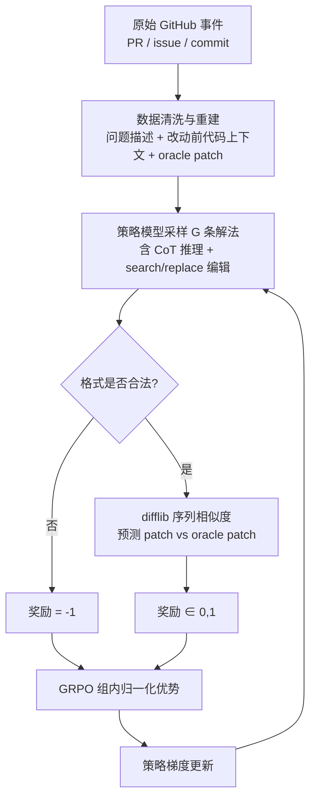

# 软件工程 Agentic RL：SWE-RL

> **一句话**：SWE-RL（Meta，2025，arXiv:2502.18449）用开源软件演化数据 + 规则化相似度奖励做大规模 RL，让中等规模模型学会修真实 GitHub bug，并把代码推理能力泛化到数学等域外任务。
>
> 提出年份：2025（2 月）· 机构/团队：Meta（FAIR，Wei et al.）· 会议/来源：NeurIPS 2025 / arXiv:2502.18449

> 前置阅读：[Agentic RL 总览](/agent/agentic-rl/) · [GRPO](/rlhf/grpo)

软件工程是 agentic RL 最适合落地的场景之一：任务来源海量（GitHub 上无穷多的 issue 与 PR），且天然带可执行的验证信号（单元测试）。本页聚焦的是**训练**——如何用 RL 把基座模型炼成会修 bug 的代码模型，而不是 SWE-agent 那类**推理时脚手架**（harness 部分见 [Agent Loop](/harness/agent-loop) 与 [沙箱](/harness/sandbox)）。

## 直觉与动机

让 LLM 修 bug 有两条路。一条是构造 SFT 数据做监督蒸馏；另一条是给定一个 issue，让模型采样多条解法，用某种奖励筛出好的解法去做策略梯度更新——这就是 RL 路线。RL 的吸引力在于：

- **数据近乎无限且免标注**。每个合并的 PR 都隐含「问题描述 → 代码改动」这对监督信号，无需人工标注解法。
- **奖励可以很「轻」**。不必每条 rollout 都跑测试（在数万仓库上搭沙箱、装依赖、跑测试代价极高），SWE-RL 的核心洞见是：用模型生成的 patch 与开发者真实 patch 的**文本相似度**作为稠密奖励，就足以驱动学习。
- **代码推理能力可迁移**。在「读 issue → 定位 → 推理改动」上反复训练，习得的是一种通用的「在约束下逐步推理」能力，能溢出到代码外的任务。

这与 [Search-RL](/agent/agentic-rl/search-rl)、[Web Agent RL](/agent/agentic-rl/web-agent-rl) 是同一族思路：用可验证奖励（RLVR）替代训练 [奖励模型](/rlhf/reward-model)，规避奖励黑客。

## 方法与流程

SWE-RL 的训练对象是 **Llama-3.3-70B-Instruct**，算法用 [GRPO](/rlhf/grpo)：对同一问题采样一组 rollout，用组内相对优势做更新，省去 critic。流程如下。

> 图源：Wei et al., *SWE-RL: Advancing LLM Reasoning via Reinforcement Learning on Open Software Evolution*, [arXiv:2502.18449](https://arxiv.org/abs/2502.18449)（用于学习注解，版权归原作者）

**数据管线**。从开源软件的完整生命周期（代码快照、commit、issue、PR）重建训练样本：每条样本给模型提供问题描述与改动前的相关代码上下文，oracle 即该 PR 真实合并的代码改动。Meta 对原始 PR 做了大量过滤（去噪、去除机器人提交、保证 issue–patch 对齐等）后才用于训练。

**奖励函数**。这是 SWE-RL 最关键的设计，逻辑非常简洁：

$$
R(\hat{y}, y^*) =
\begin{cases}
-1, & \text{输出格式非法（无法解析出合法编辑）} \\[4pt]
\operatorname{sim}(\hat{y}, y^*), & \text{格式合法}
\end{cases}
$$

其中 $\hat{y}$ 是模型生成的 patch，$y^*$ 是 oracle patch，$\operatorname{sim}(\cdot)$ 是 Python `difflib.SequenceMatcher` 计算的序列相似度，取值 $[0,1]$。相比「测试通过 = 1 / 否则 = 0」的稀疏 0/1 奖励，这个连续相似度给出了**稠密**信号：哪怕没完全改对，越接近真实改动得分越高，partial credit 让早期训练梯度更平滑。代价是它只是 oracle 的「代理」——和真正跑测试通过不完全等价（见局限）。

**编辑格式**。模型被要求先输出推理（CoT），再输出 search/replace 形式的代码编辑（指明要替换的原文片段与新内容）；官方实现也支持 unified diff 等格式。格式不合法直接判 $-1$，逼模型学会稳定产出可解析的结构化编辑。

**训练配置**。论文公开的设置约为：1600 步、16k 上下文、全局 batch 512（每批 32 个问题、每题 16 条 rollout）。

**推理管线（Agentless Mini）**。SWE-RL 训练出的是基座能力，评测时套用一个轻量、无 agent 循环的流水线：**定位**（找到相关文件）→ **修复**（生成多个候选 patch）→ **重排**（用复现测试等信号选最优 patch）。注意这是一个固定步骤的 pipeline，而非自主多轮的 agent harness。

**结果与泛化**。Llama3-SWE-RL-70B 在 [SWE-bench](/harness/auto-agents/) Verified 上取得 **41.0%** 解决率，是当时 <100B 中等规模模型的最好成绩之一，与 GPT-4o 等闭源模型相当。更值得注意的是：只在软件演化数据上做 RL，模型却在函数级编程、库使用、代码推理、数学、通用语言理解五类**域外任务**上同步变强——印证了「代码 RL 习得通用推理」的假设。

## 代表工作

SWE-RL 之后，开源社区在 agentic coding RL 上快速跟进，路线与之形成对照：

| 工作 | 年份 | 基座 | 奖励信号 | 交互形态 | SWE-bench Verified |
| --- | --- | --- | --- | --- | --- |
| **SWE-RL**（Meta） | 2025.02 | Llama-3.3-70B | patch 相似度（稠密） | 单步生成 + Agentless 流水线 | 41.0% |
| **DeepSWE**（Together AI / Agentica） | 2025.07 | Qwen3-32B | 测试通过（稀疏 0/1） | 多轮 agent（bash/编辑/搜索/提交） | 42.2% Pass@1，59%（含测试时扩展） |
| **SkyRL-Agent**（UC Berkeley / NovaSky / Anyscale） | 2025.11 | Qwen3-32B | 测试通过 | 多轮 agent（简化 ReAct：bash + 文件编辑工具） | 39.4% Pass@1（SA-SWE-32B） |

- **DeepSWE**：用 Agentica 的 rLLM 框架，在 R2E-Gym 的约 4500 个真实 SWE 任务环境上做纯 RL（GRPO++ 扩展到多轮），奖励是补丁能否通过选定测试的稀疏 0/1。它与 SWE-RL 最大区别是**真·agentic**——模型在沙箱里多轮调用工具（执行 bash、搜索、文件编辑、提交），训练的是完整轨迹，并出现了「主动想边界情况」「按步骤难度分配 token」等涌现行为。数据集、代码、训练与评测日志全部开源。
- **SkyRL-Agent**：聚焦多轮 agent RL 的**训练系统效率**（异步 rollout 调度、轻量工具集成、可对接 veRL/Tinker 等后端），在简化 ReAct 脚手架（仅 bash + 文件编辑工具）上把 Qwen3-32B 从 24.4% 提到 39.4% Pass@1（SA-SWE-32B），并报告约 1.55× rollout 加速、训练成本降低 2× 以上。更早的 SkyRL-v0 基于 veRL + OpenHands 脚手架，用约 300 个样本就显著提升 SWE-bench，验证了长程真实环境 RL 的可行性。

一个清晰的分野：**SWE-RL = 稠密相似度奖励 + 单步生成**，工程上最省（不必逐条跑测试）；**DeepSWE / SkyRL = 稀疏测试奖励 + 多轮 agent**，更贴近部署形态但对沙箱与训练系统要求更高。两条路线在 SWE-bench 上的成绩已经接近，反映出相似度代理奖励与真测试奖励各有取舍。

## 局限与对比

- **相似度奖励 ≠ 正确性**。`difflib` 相似度只衡量「像不像 oracle」，可能奖励语义不同但文本相近的改动，也可能惩罚正确但写法不同的解法（oracle 本身并非唯一正解）。稠密换来的训练稳定性，是以奖励保真度为代价的。
- **单步生成的天花板**。Agentless Mini 是固定流水线，缺少真实 agent 的「跑测试→看报错→再改」反馈闭环；面对需要多文件协同、需要运行调试的复杂 bug，多轮 agent 路线（DeepSWE/SkyRL）更有上限。
- **数据偏置与污染**。训练数据来自历史 PR，可能与 SWE-bench 测试集存在仓库/时间上的重叠风险，评测时需关注数据污染。PR 质量参差，清洗管线的好坏直接决定信号质量。
- **这是训练，不是脚手架**。SWE-RL 产出的是「更会修 bug 的权重」，要在生产中用还需配合 agent loop、沙箱、检索等 harness 组件；它和 SWE-agent 这类脚手架是互补关系，不是替代关系。
- **训练稳定性**。长程 agentic RL 普遍存在 rollout 长尾、奖励稀疏、熵坍缩等问题，详见 [Agentic RL 训练稳定性](/agent/agentic-rl/stability)。

## 参考文献

- Wei et al. *SWE-RL: Advancing LLM Reasoning via Reinforcement Learning on Open Software Evolution* (NeurIPS 2025). arXiv:2502.18449 — <https://arxiv.org/abs/2502.18449>
- 官方代码（含奖励函数与 prompt 模板，CC BY-NC 4.0 / Agentless Mini 为 MIT）：<https://github.com/facebookresearch/swe-rl>
- DeepSWE 技术博客（Together AI / Agentica）：<https://www.together.ai/blog/deepswe>
- DeepSWE-Preview 模型：<https://huggingface.co/agentica-org/DeepSWE-Preview>
- Cao et al. *SkyRL-Agent: Efficient RL Training for Multi-turn LLM Agent*. arXiv:2511.16108 — <https://arxiv.org/abs/2511.16108>
- SkyRL 项目主页（UC Berkeley Sky Computing Lab）：<https://sky.cs.berkeley.edu/project/skyrl/>
- *The Landscape of Agentic Reinforcement Learning for LLMs: A Survey*. arXiv:2509.02547 — <https://arxiv.org/abs/2509.02547>
