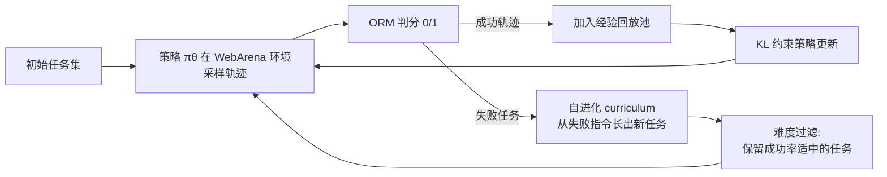

# Web 长程导航 / 信息检索 Agent 的 RL

> **一句话**：让开源 LLM 在真实/模拟网页上自主多轮检索与导航，以稀疏的"任务是否完成"为奖励做 RL——代表工作是 WebRL（2024）的自进化 curriculum + ORM，以及 WebSailor / WebDancer（2025）的合成高难度任务 + agentic RL。
>
> 提出年份：环境奠基 WebShop（2022，Princeton）→ WebRL（2024 年 11 月，THU/Zhipu，arXiv:2411.02337）→ WebDancer / WebSailor（2025，Tongyi Lab）· 详见下表与代表工作

> 前置阅读：[Agentic RL 总览](/agent/agentic-rl/)、[GRPO](/rlhf/grpo)。本页与 [Search-R1 路线](/agent/agentic-rl/search-rl) 相邻：后者侧重"单轮/少轮检索增强问答"，本页侧重"长程多轮浏览导航"。

## 直觉与动机

Web agent 要做的事是把自然语言目标（"帮我订一张最便宜的周五去上海的高铁票""这家公司 2023 年研发投入占比是多少"）翻译成对网页的一连串操作——点击、输入、滚动、翻页、调用搜索引擎、读正文。它和 [tool-use](/agent/tool-use) 的区别在于**长程（long-horizon）**：一条成功轨迹动辄几十步，中间任何一步走错（点错链接、漏看一个筛选项）整条轨迹就报废。

这给 RL 带来三个绕不开的难点：

- **奖励稀疏**：唯一可靠的信号是"最终任务是否完成"，是一个 0/1 的 outcome reward，落在轨迹末端。中间几十步没有 process 反馈，credit assignment 极难。
- **训练任务稀缺**：高质量、可自动判分的 web 任务很难大规模标注。WebArena 这类 benchmark 的任务量远不够撑起 online RL 的数据消耗。
- **分布漂移（distribution drift）**：online RL 中策略不断变化，新采的轨迹分布和旧数据脱节，朴素的 on-policy 更新容易训崩或遗忘。

应对思路分两条路线：一条是**在交互式环境里自进化造任务 + online RL**（WebRL，针对 WebArena 这类带状态的网站操作）；另一条是**离线合成高难度信息检索任务 + cold-start SFT + agentic RL**（WebSailor / WebDancer，针对 GAIA / BrowseComp 这类深度检索问答）。两者都把"造数据"当成与"造算法"同等重要的一环。

## 方法与流程

### WebRL：自进化 curriculum + ORM + KL 约束更新

WebRL（arXiv:2411.02337）的核心是一个**滚动闭环**：用上一轮失败的任务"长出"难度适配的新任务，喂给策略继续 online RL。

> 图源：Qi et al., *WebRL: Training LLM Web Agents via Self-Evolving Online Curriculum Reinforcement Learning*, [arXiv:2411.02337](https://arxiv.org/abs/2411.02337)（用于学习注解，版权归原作者）

三个部件：

1. **自进化 curriculum**：从未完成的任务出发，用 LLM 生成措辞/目标相近的新任务，再用一个判别器估计这些新任务对当前策略的难度，**只保留难度适中**（不太易也不太难）的任务进入下一轮。这相当于自动维持一条"略高于当前能力"的学习曲线，缓解任务稀缺。

2. **ORM（outcome-supervised reward model）**：训练一个二分类奖励模型判断"轨迹是否达成目标"，给出 $r\in\{0,1\}$ 的终局奖励，替代人工判分，让 online RL 能规模化跑起来。

3. **KL 约束的策略更新**：为对抗分布漂移，更新目标在最大化期望奖励的同时，约束新策略不要偏离参考策略 $\pi_{\text{ref}}$ 太远：

$$
\max_{\theta}\ \mathbb{E}_{\tau\sim\pi_\theta}\big[r(\tau)\big]\ -\ \beta\, \mathrm{KL}\!\big(\pi_\theta \,\|\, \pi_{\text{ref}}\big)
$$

并配合**经验回放**——把历史成功轨迹缓存复用，按与当前策略的契合度过滤，既提样本效率又防遗忘。结果上，WebArena-Lite 把 Llama-3.1-8B 从 4.8% 拉到 42.4%、GLM-4-9B 从 6.1% 拉到 43%，超过 GPT-4-Turbo（17.6%）与 GPT-4o（13.9%），也超过此前开源 SOTA AutoWebGLM（18.2%）。

### WebSailor / WebDancer：合成难任务 + cold-start + agentic RL

这条路线针对的是**深度信息检索**（给一个需要多跳搜索才能回答的问题），典型 pipeline 四段：浏览数据构造 → 轨迹采样 → SFT 冷启动 → RL。

- **WebDancer**（arXiv:2505.22648，Tongyi Lab）基于 ReAct 范式，先造多跳浏览数据、拒绝采样出高质量轨迹做 SFT 冷启动，再 RL 提泛化；用 QwQ-32B 在 GAIA 上达约 51.5% 平均分。
- **WebSailor**（arXiv:2507.02592）的关键在**任务难度**：用知识图谱采样 + **信息混淆（obfuscation）**刻意制造"高不确定性"的问题（SailorFog-QA），逼出超长推理；RL 阶段提出 **DUPO（Duplicating Sampling Policy Optimization）**——在 GRPO 基础上做 trajectory-level 重要性采样 + clip，并用 leave-one-out 估优势、在训练前与训练中两次动态采样，兼顾稳定性与吞吐（论文报告约 2–3× 加速）。**WebSailor-V2**（arXiv:2509.13305）进一步扩大合成数据与 RL 规模，对齐闭源 deep-research agent。

## 代表工作

- **WebShop**（arXiv:2207.01206，Princeton，NeurIPS 2022）：奠基性环境。120 万真实商品 + 1.2 万众包指令的模拟电商站，需理解组合式指令、重写 query、在噪声网页上探索购买。早期就用 IL + RL 训练 agent，是"web 即 RL 环境"范式的起点。
- **WebArena**：带真实软件后端（电商/论坛/CMS/GitLab 等）的可复现交互环境，提供可程序化判分的任务，是 WebRL 等 online RL 工作的主战场（常用其轻量子集 WebArena-Lite）。
- **WebRL**（arXiv:2411.02337，THU/Zhipu）：自进化 curriculum + ORM + KL 约束更新，把开源小模型在 WebArena-Lite 上的成功率拉到超 GPT-4o。
- **WebDancer / WebSailor / WebSailor-V2**（Tongyi Lab，[Alibaba-NLP/WebAgent](https://github.com/Alibaba-NLP/DeepResearch)）：面向 GAIA / BrowseComp 的 deep-research 路线，合成难任务 + 冷启动 + agentic RL。

## 局限与对比

| 维度 | WebRL 路线 | WebSailor / WebDancer 路线 |
| --- | --- | --- |
| 任务类型 | 有状态网站操作（点击/表单/导航） | 多跳信息检索问答 |
| 奖励来源 | ORM 对终局判分 | 答案可校验（rule-based / LLM 判分） |
| 数据来源 | online 自进化 curriculum | 离线合成（知识图谱 + 混淆） |
| RL 算法 | KL 约束 + 经验回放 | DUPO（GRPO 变体） |
| 主战场 | WebArena-Lite | GAIA / BrowseComp / WebWalkerQA |

共同的硬约束没有消失：

- **稀疏奖励 + 长程 credit assignment**：终局 0/1 奖励对几十步轨迹的归因仍粗糙；ORM 自身也可能误判，引入奖励噪声（参见 [stability](/agent/agentic-rl/stability)）。
- **轨迹采样昂贵且不稳定**：真实网页有延迟、反爬、动态内容与不可复现性；长轨迹 rollout 成本高，是工程瓶颈，也催生了 DUPO 这类动态采样的吞吐优化。
- **环境覆盖与泛化**：WebArena/WebShop 终究是受控环境，迁移到开放互联网时分布差异大；合成任务则可能过拟合到特定难度模板。
- **curriculum 的"自进化"依赖判别器质量**：难度估计不准会让 curriculum 偏离最优学习区间。

与 [Search-RL](/agent/agentic-rl/search-rl) 相比，本页的核心增量是**长程**：从"检索增强一次回答"升级到"在网页状态空间里规划与回溯"，因此对 curriculum、采样吞吐和分布漂移控制的要求显著更高。底层 RL 算法仍以 [GRPO](/rlhf/grpo) / PPO 家族为骨架，区别主要在奖励设计与数据生产。

## 参考文献

- WebRL: Training LLM Web Agents via Self-Evolving Online Curriculum Reinforcement Learning — https://arxiv.org/abs/2411.02337
- WebShop: Towards Scalable Real-World Web Interaction with Grounded Language Agents — https://arxiv.org/abs/2207.01206
- WebDancer: Towards Autonomous Information Seeking Agency — https://arxiv.org/abs/2505.22648
- WebSailor: Navigating Super-human Reasoning for Web Agent — https://arxiv.org/abs/2507.02592
- WebSailor-V2: Bridging the Chasm to Proprietary Agents via Synthetic Data and Scalable Reinforcement Learning — https://arxiv.org/abs/2509.13305
- Tongyi Lab WebAgent / DeepResearch 代码库 — https://github.com/Alibaba-NLP/DeepResearch
