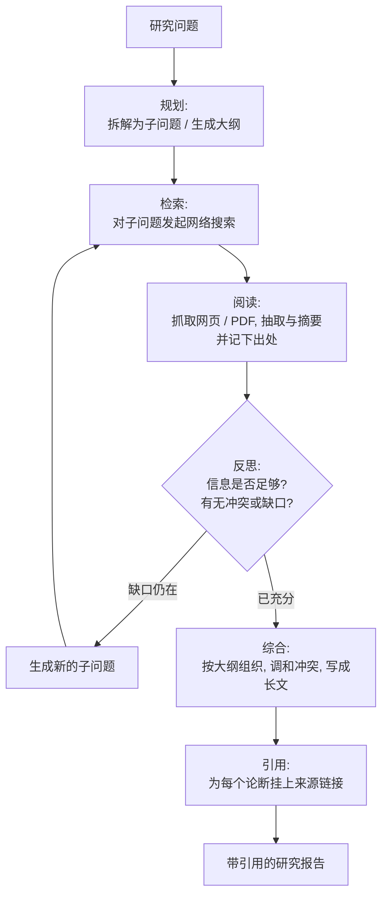
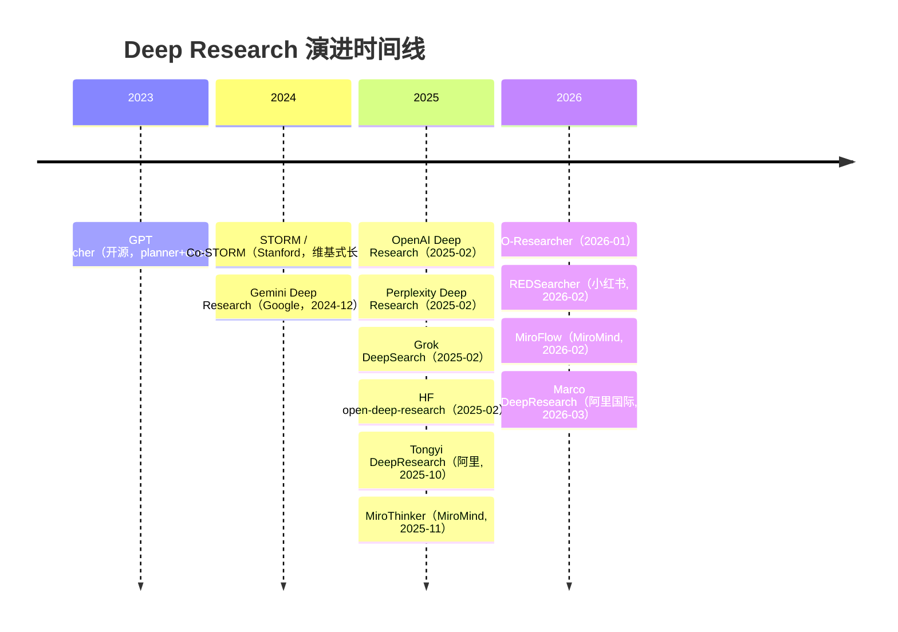

# Deep Research（深度研究 Agent）总览

> **一句话**：Deep Research 指一类自治 agent——给一个研究型问题，它自主完成"规划 → 多步网络检索 → 阅读 → 反思补检 → 综合 → 带引用成稿"的迭代循环，产出一篇可核查的长篇报告；它不是一次性的联网问答，而是把"做研究"本身当成一段可以跑几分钟到几十分钟的 agent 轨迹。代表性起点是 OpenAI Deep Research（2025-02）与 Google Gemini Deep Research（2024-12），开源侧有 GPT Researcher、HF open-deep-research（2025-02）、Stanford STORM（2024）等。

> 前置阅读：[Agent 总览](/agent/)、[工具使用](/agent/tool-use)、[多智能体](/agent/multi-agent)；与检索增强的边界见 [Skills vs RAG/微调](/skills/vs-rag-finetune)；训练这类浏览 agent 的 RL 见 [Web 长程导航 Agent 的 RL](/agent/agentic-rl/web-agent-rl)。

## 定义与能力边界

"Deep Research" 这个词在 2024 年底到 2025 年初被几家厂商几乎同时采用，所指大体一致：用户给一个**开放式、需要综合多个来源**的问题（"对比近三年三家云厂商的推理芯片路线""调研某疾病的最新一线疗法及证据等级"），agent 自主决定**搜什么、读什么、还缺什么、何时收尾**，最后交一篇结构化、带行内引用的报告。

它的能力边界由三件事划定：

- **要做的是"综合"，不是"查一条事实"**。单条事实（"某公司 CEO 是谁"）用普通联网问答即可；Deep Research 的价值在于需要交叉比对几十上百个网页、调和相互冲突的说法、并组织成有论点的长文。
- **它会自己规划和迭代**。不是固定 retrieve-then-read 一遍，而是边读边发现知识缺口、再生成新的子问题去补检，循环若干轮。
- **它产出带引用的可核查报告**，而非一段无出处的回答——引用是 Deep Research 区别于普通"会上网的聊天"的核心契约（尽管引用可靠性本身仍是开放问题，见下）。

## 典型 agent 循环

绝大多数 Deep Research 系统（无论闭源开源）都收敛到同一套迭代范式：先规划，再"检索—阅读—反思"循环若干轮，最后综合成稿并附引用。

各家的差异主要在三处：循环由**单 agent 自反思**驱动（GPT Researcher、HF open-deep-research）还是由**supervisor 派发多个并行子 agent**（LangChain open_deep_research、多数产品）；浏览是**纯文本网页**还是**带视觉的真实浏览器**；以及背后模型是否经过**针对浏览与推理的专门训练**（OpenAI Deep Research 即在 o 系列上专门优化）。

## 与 RAG / 普通联网问答的区别

|  | 普通 RAG / 联网问答 | Deep Research |
| --- | --- | --- |
| 检索次数 | 通常一轮（retrieve → read → answer） | 多轮迭代，边读边补检 |
| 是否自带规划 | 一般没有 | 有，先拆子问题/列大纲 |
| 反思补检 | 无 | 有，发现缺口再搜 |
| 输出形态 | 一段答案 | 结构化长报告 + 行内引用 |
| 耗时 | 秒级 | 数分钟到数十分钟 |
| 失败模式 | 检索没命中就答不好 | 长程轨迹任一步跑偏都会累积偏差 |

简言之：RAG 是"取一次资料来答"，Deep Research 是"像研究员一样反复查证再成稿"。Deep Research 通常**内部就包含 RAG**（每一轮检索-阅读就是一次 RAG），但在外面套了规划与反思的 agent 循环。

## 演进时间线

## 分类对比大表

| 名称 | 年份 | 闭源/开源 | 机构 | 一句话 | 链接 |
| --- | --- | --- | --- | --- | --- |
| GPT Researcher | 2023-07 | 开源 | Assaf Elovic（社区） | planner+execution 双 agent，可接任意 LLM，深研模式约 5 分钟/篇 | [GitHub](https://github.com/assafelovic/gpt-researcher) |
| STORM / Co-STORM | 2024 | 开源 | Stanford OVAL | 写维基式长文：先做 pre-writing 研究列大纲，再带引用成稿（Co-STORM 2024-09） | [详情](/agent/deep-research/storm) ·[GitHub](https://github.com/stanford-oval/storm) |
| Gemini Deep Research | 2024-12 | 闭源/产品 | Google | 2024-12 发布，先出研究计划给用户确认再执行 | [官博](https://blog.google/products/gemini/google-gemini-deep-research/) |
| OpenAI Deep Research | 2025-02 | 闭源/产品 | OpenAI | 在 o 系列上专门优化浏览与推理，2025-02 发布，HLE 26.6% | [详情](/agent/deep-research/openai-deep-research) ·[官博](https://openai.com/index/introducing-deep-research/) |
| Perplexity Deep Research | 2025-02 | 闭源/产品 | Perplexity | 2025-02 发布，主打快（多数任务 3 分钟内），HLE 21.1% | [官博](https://www.perplexity.ai/hub/blog/introducing-perplexity-deep-research) |
| Grok DeepSearch | 2025-02 | 闭源/产品 | xAI | 随 Grok 3（2025-02）推出，能整合 X 实时数据、调和冲突说法 | [发布](https://x.com/xai/status/1892400134178164775) |
| open-deep-research（HF） | 2025-02 | 开源 | Hugging Face | 24 小时复现 OpenAI 版，基于 smolagents 的 code agent，GAIA 验证集 55% | [详情](/agent/deep-research/open-deep-research) ·[官博](https://huggingface.co/blog/open-deep-research) |
| open_deep_research（LangChain） | 2025 | 开源 | LangChain | 基于 LangGraph 的 supervisor 架构，派发并行子 agent | [GitHub](https://github.com/langchain-ai/open_deep_research) |
| **Tongyi DeepResearch** | 2025-10 | 开源 | 阿里 Tongyi Lab | 30B-A3B MoE，agentic mid/post-training，开源刷榜标杆（BrowseComp 43.4 / HLE 32.9 / GAIA 70.9，以技术报告为准） | [详情](/agent/deep-research/tongyi-deepresearch) ·[arXiv](https://arxiv.org/abs/2510.24701) |
| **REDSearcher** | 2026-02 | 开源 | 小红书 RED · HIT · SJTU | 针对轨迹/奖励稀疏，低成本统一训练长程搜索 agent，含多模态版（BrowseComp 57.4 / GAIA 80.1，以原文为准） | [详情](/agent/deep-research/redsearcher) ·[arXiv](https://arxiv.org/abs/2602.14234) |
| **MiroFlow / MiroThinker** | 2026-02 | 开源 | MiroMind | 高鲁棒开源深研框架 + 研究 agent 模型，GAIA / BrowseComp(-ZH) / HLE / xbench 多榜 SOTA 级（以原文为准） | [arXiv](https://arxiv.org/abs/2602.22808) ·[模型](https://arxiv.org/abs/2511.11793) |
| **Marco DeepResearch** | 2026-03 | 论文 | 阿里国际 AIDC | verification-centric：数据合成 / 轨迹 / test-time 三层验证，主打高效 | [arXiv](https://arxiv.org/abs/2603.28376) |
| **O-Researcher** | 2026-01 | 开源 | 学术团队 | 多 agent 蒸馏 + agentic RL，不依赖闭源数据/模型即达有竞争力的深研成绩 | [arXiv](https://arxiv.org/abs/2601.03743) |

## 国产与开源的刷榜竞赛（2025–2026）

2025 下半年到 2026 年，Deep Research 从"几家产品发布"演变为一场**公开榜单上的硬碰硬**，主战场是 **BrowseComp / BrowseComp-ZH**（深度浏览找信息）、**HLE**（高难知识）、**GAIA**（通用助理）、**xbench-DeepSearch / WebWalkerQA / FRAMES** 等。这一波最有代表性的、**有论文且刷出高分**的工作几乎都来自国内大厂与开源社区：

- **Tongyi DeepResearch**（阿里 Tongyi Lab，[arXiv:2510.24701](https://arxiv.org/abs/2510.24701)）：30B-A3B MoE，用 **agentic mid-training + agentic post-training** 端到端训练 + 全自动数据合成管线，把开源深研 agent 拉到与 OpenAI Deep Research 同档；报告 BrowseComp 43.4 / BrowseComp-ZH 46.7 / HLE 32.9 / GAIA 70.9 / xbench-DeepSearch 75.0（以技术报告为准）。**详见 [Tongyi DeepResearch 专页](/agent/deep-research/tongyi-deepresearch)**。
- **REDSearcher**（小红书 RED × 哈工大 × 上交，[arXiv:2602.14234](https://arxiv.org/abs/2602.14234)）：直击"高质量搜索轨迹与奖励信号极度稀疏"的瓶颈，用**复杂任务合成（图拓扑 + 证据分散）+ 两阶段 mid-training + SFT/Agentic RL** 的低成本统一流水线，并在本地千万级文档闭库里做 rollout 省成本；30B-A3B 报告 BrowseComp 57.4 / GAIA 80.1（以原文为准），并扩展出多模态 REDSearcher-MM。**详见 [REDSearcher 专页](/agent/deep-research/redsearcher)**。
- **MiroFlow / MiroThinker**（MiroMind，[arXiv:2602.22808](https://arxiv.org/abs/2602.22808) / [arXiv:2511.11793](https://arxiv.org/abs/2511.11793)）：MiroFlow 是高鲁棒的开源深研**框架**（agent graph 编排 + 可选深推理模式），MiroThinker 是配套**模型**（model / context / interactive 三维 scaling）；在 GAIA、BrowseComp-EN/ZH、HLE、xbench-DeepSearch 等多榜刷到开源 SOTA 级（具体分数随版本变化，以各自原文为准）。
- **Marco DeepResearch**（阿里国际 AIDC，[arXiv:2603.28376](https://arxiv.org/abs/2603.28376)）：把**验证（verification）**贯穿数据合成、轨迹构造、test-time 三层——让 agent 自己当 verifier，抑制误差在各阶段向下游传播，主打"高效深研"。
- **O-Researcher**（[arXiv:2601.03743](https://arxiv.org/abs/2601.03743)）：用**多 agent 蒸馏 + agentic RL** 的两阶段训练，让多种规模的开源模型在深研榜上取得有竞争力的成绩，且不依赖闭源数据/模型。

> 看榜须知：这些分数来自各自论文/技术报告，**口径、时点、工具配置、test-time scaling（如 Heavy Mode / 并行子 agent）各不相同**，跨系统直接比绝对值意义有限；榜单（尤其 BrowseComp-ZH、xbench-DeepSearch）也在快速迭代。把它们当作"同一时期开源深研能力的量级参照"，而非精确排名。

## 评测与现状

这类系统主要在三个 benchmark 上比拼：

- **GAIA**（arXiv:2311.12983，2023-11，Meta 等）：466 道"对人简单、对 AI 难"的真实任务，需要推理、多模态、网页浏览与工具使用。HF open-deep-research 在验证集做到约 55%（pass@1），其官博引用 OpenAI Deep Research 约 67% 的平均分作对照。
- **Humanity's Last Exam（HLE）**：跨百余学科的高难度知识题。OpenAI Deep Research 官方报告 26.6%，Perplexity Deep Research 报告 21.1%——这些是各家自报数，口径与时点不同，横向比要谨慎。
- **BrowseComp**（arXiv:2504.12516，2025-04，OpenAI）：1266 道需要"持续翻找、信息深埋"的浏览题，答案短小易于自动判分，专门衡量 agent 在网上"刨"信息的能力。

现状与局限（这也是当前最值得警惕的部分）：

- **幻觉与引用不可靠**：报告读起来很权威，但论断未必真由其所挂引用支持，存在"挂了链接却对不上原文"或过度外推的情况；引用的存在 ≠ 引用的正确。
- **来源质量参差**：agent 难以稳定区分权威来源与营销/低质内容，容易把片面或过时信息写进结论。
- **成本与时延**：一篇报告动辄几分钟到几十分钟、调用大量检索与长上下文推理；开源方案（如 GPT Researcher 自报 o3-mini 下约 $0.4/篇）相对可控，但产品级深研仍偏贵。
- **可复现性差**：网页内容随时间变化、搜索结果不确定，同一问题两次跑结果可能不同，给评测和审计带来困难。

实践建议：把 Deep Research 当成**会列出处的初稿研究助手**而非终审，重要结论务必顺着引用回查原文。

## 参考链接

- OpenAI, *Introducing deep research*（2025-02）：<https://openai.com/index/introducing-deep-research/>
- Google, *Gemini Deep Research*：<https://blog.google/products/gemini/google-gemini-deep-research/>
- Perplexity, *Introducing Perplexity Deep Research*（2025-02）：<https://www.perplexity.ai/hub/blog/introducing-perplexity-deep-research>
- Hugging Face, *Open-source DeepResearch*（2025-02）：<https://huggingface.co/blog/open-deep-research>
- GPT Researcher（GitHub）：<https://github.com/assafelovic/gpt-researcher>
- LangChain open_deep_research（GitHub）：<https://github.com/langchain-ai/open_deep_research>
- Stanford STORM（GitHub）：<https://github.com/stanford-oval/storm>
- Mialon et al., *GAIA: a benchmark for General AI Assistants*（arXiv:2311.12983, 2023-11）
- Wei et al., *BrowseComp*（arXiv:2504.12516, 2025-04）
- Tongyi DeepResearch Team, *Tongyi DeepResearch Technical Report*（arXiv:2510.24701, 2025-10）·[GitHub](https://github.com/Alibaba-NLP/DeepResearch)
- *REDSearcher: A Scalable and Cost-Efficient Framework for Long-Horizon Search Agents*（arXiv:2602.14234, 2026-02）·[GitHub](https://github.com/RedSearchAgent/REDSearcher)
- *MiroFlow: Towards High-Performance and Robust Open-Source Agent Framework for General Deep Research Tasks*（arXiv:2602.22808, 2026-02）
- *MiroThinker: Pushing the Performance Boundaries of Open-Source Research Agents*（arXiv:2511.11793, 2025-11）
- *Marco DeepResearch: Unlocking Efficient Deep Research Agents via Verification-Centric Design*（arXiv:2603.28376, 2026-03）
- *O-Researcher: An Open Ended Deep Research Model via Multi-Agent Distillation and Agentic RL*（arXiv:2601.03743, 2026-01）
