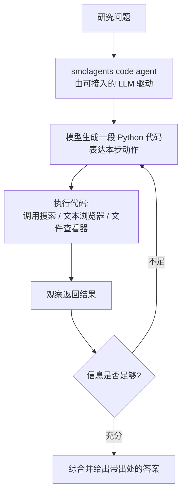

# open-deep-research（Hugging Face）

> **一句话**：open-deep-research（2025-02，开源，Hugging Face）是 smolagents 团队在 OpenAI Deep Research 发布后约 **24 小时内**做出的开源复现——核心是基于 **smolagents 的 "code agent"**（用可执行代码而非 JSON 表达动作）配上一个文本网页浏览器，在 **GAIA 验证集上达到约 55% pass@1**，把"深度研究 agent"的能力开放给了任意可接入的 LLM。
> 提出年份：2025（2025-02-04 发布）· 机构/团队：Hugging Face（smolagents 团队）· 会议/来源：HF 官方博客 *Open-source DeepResearch — Freeing our search agents*

> 上级页：[Deep Research 总览](/agent/deep-research/)。相关：[Agent 框架总览](/agent/frameworks/)、[工具使用](/agent/tool-use)、[多智能体](/agent/multi-agent)。

## 定位

OpenAI Deep Research（2025-02-02）发布后，Hugging Face 团队给自己定了一个 **24 小时**的复现目标，于 **2025-02-04** 公开了 open-deep-research，代码作为示例放在 `huggingface/smolagents` 仓库里。它的意义不在于"超越闭源"，而在于**用开源栈把同一套 agent 循环复现到接近的水平**，并把整条链路（agent 框架、浏览工具、评测脚本）摊开给社区研究。

它跑在 smolagents 这个轻量 agent 库上，关键选择是**用 "code agent"**：让 LLM 把每一步动作写成一段可执行的 Python 代码来调用工具，而不是输出结构化的 JSON 工具调用。

## 它怎么工作

整体仍是 Deep Research 的标准循环（规划 → 检索 → 阅读 → 反思补检 → 综合），但执行层是"模型写代码、运行代码、看结果、再写代码"的 code-agent 风格。浏览工具是一个**纯文本网页浏览器**加一个文本文件查看器，改编自微软研究院的 **Magentic-One** 项目。

> 图源：Hugging Face, *Open-source DeepResearch — Freeing our search agents*（图改编自 Wang et al., 2024），<https://huggingface.co/blog/open-deep-research>（用于学习注解，版权归原作者）

用 code agent 的好处是动作表达更灵活（一段代码可以组合多次工具调用、做循环和条件判断），这被认为是它在 GAIA 上爬分较快的原因之一。模型是**可替换的**——官博测试了包括 DeepSeek R1 在内的多种模型，并未绑定单一默认模型；agent 框架开源，但若想逼近闭源水平，仍需配一个强推理模型。

## 能力与局限

**能力**：

- **GAIA 验证集约 55.15% pass@1**——在 24 小时冲刺里从 Magentic-One 的约 46% 快速爬到这一水平，官博以 OpenAI Deep Research 约 67.36% 的平均分作对照。
- **完全开源、模型可插拔**：可接任意 LLM，便于做消融、改工具、二次开发，是研究"深度研究 agent 到底靠什么 work"的好底座。
- **code-agent 范式**带来更强的动作表达力。

**局限**（作者明确承认）：

- **浏览是纯文本的**：达到与闭源完全对齐"需要更好的浏览器使用与交互，比如 OpenAI Operator 提供的那种"，即超越当前纯文本网页交互；基于视觉的浏览器仍在开发而非完整落地。
- **与闭源仍有差距**：GAIA 上 55% vs 约 67%，差距主要来自浏览交互与底层模型。
- **能力依赖所接模型**：框架本身不提供推理能力，弱模型下效果会明显下降。

## 与同类对比

- 相比 **OpenAI Deep Research**：本项目是它的开源复现，可复现、可改、可自托管，但浏览交互弱、且需自带强模型；闭源版有专门训练的模型与更强浏览。
- 相比 **GPT Researcher**：GPT Researcher 用 planner+execution 的多 agent 流水线、更产品化（自带报告生成与多种输出格式）；open-deep-research 更"研究导向"，强调 code-agent 范式与在 GAIA 上的可比性。
- 相比 **LangChain open_deep_research**：后者主打 LangGraph 上的 supervisor + 并行子 agent 架构与企业可配置性；HF 版更轻、更贴近"最小可复现 OpenAI Deep Research"。

## 参考链接

- Hugging Face, *Open-source DeepResearch — Freeing our search agents*（2025-02-04）：<https://huggingface.co/blog/open-deep-research>
- 代码（smolagents 示例）：<https://github.com/huggingface/smolagents/tree/main/examples/open_deep_research>
- Mialon et al., *GAIA: a benchmark for General AI Assistants*（arXiv:2311.12983, 2023-11）
