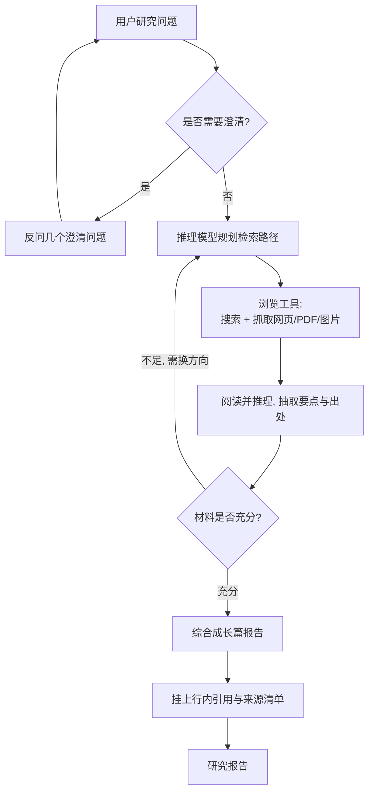

# OpenAI Deep Research

> **一句话**：OpenAI Deep Research（2025-02，闭源/产品）是 ChatGPT 内的一个自治研究 agent，跑在**专为网页浏览与数据分析优化的 o 系列模型**上，给一个问题就能自主搜索、阅读、推理、补检，几十分钟内综合数百个来源写成一篇研究分析师水准的带引用报告。
> 提出年份：2025（2025-02-02 发布，2025-02-25 放出 System Card）· 机构/团队：OpenAI · 会议/来源：OpenAI 官方博客 *Introducing deep research*

> 上级页：[Deep Research 总览](/agent/deep-research/)。相关：[工具使用](/agent/tool-use)、[Web 长程导航 Agent 的 RL](/agent/agentic-rl/web-agent-rl)。

## 定位

OpenAI 于 **2025-02-02** 发布 Deep Research，并在 **2025-02-25** 放出对应的 System Card。它是 OpenAI 在 Operator 之后推出的又一个"能替你独立干活"的 agent 形态，定位是**复杂研究任务的自动化**：你给一个 prompt，它独立完成多步在线研究，产出一篇有结构、有引用的长报告，把人类要花数小时的工作压缩到几十分钟。它由 **o3 的一个为浏览与分析专门优化的版本**驱动（发布时 OpenAI 称其为"即将推出的 o3 的一个版本"）。

这是 2025 年"agent 元年"叙事里的标志性产品之一——它把"推理模型 + 浏览工具 + 长程自治循环"组合成了一个面向终端用户的完整能力。

## 它怎么工作

Deep Research 的核心是**用强推理模型驱动一段长程浏览轨迹**：模型一边搜索、读网页/PDF/图片，一边根据读到的内容**动态调整方向**（pivoting），缺什么再去搜什么，直到自认为材料足够，再综合成稿并附引用。

与一般"调用一次搜索工具"的聊天不同，这里**推理与浏览是深度交织的**：模型不是把搜索当成一次性外挂，而是在整个推理过程中反复发起检索、判断证据、调整假设。单次任务通常持续约 5–30 分钟。任务开始前它常会**先反问几个澄清问题**，把研究范围收窄，以减少跑偏。

## 能力与局限

**能力**（基于官方发布与 System Card）：

- 在 **Humanity's Last Exam（HLE）** 上官方报告 **26.6%**——这是一个被设计得对当前 AI 极难的跨学科基准；OpenAI 给出的对照里，GPT-4o 等通用模型分数低得多，凸显了"推理 + 浏览"组合带来的提升。
- 在 **GAIA** 上，HF 官博引用 OpenAI Deep Research 约 **67%** 的平均分作为开源复现的参照标杆。
- 擅长需要交叉多来源、调和冲突说法的综合型任务，能处理文本、图片、PDF 等多模态网页内容。

**局限**（OpenAI 自己也明确指出）：

- **会幻觉、会引用错来源**：报告读起来自信权威，但可能编造事实或把论断错误归因到引用上，用户需自行核查。
- **难以校准不确定性**：它不总能可靠地表达"我不确定"。
- **来源甄别有限**：区分权威信息与传言/营销内容的能力仍不稳定。
- **System Card 将其早期版本评为 Medium risk**，并做了针对性的安全与红队评估。
- **成本与时延**：作为产品它对调用次数/算力有配额限制，单篇耗时分钟级。

## 与同类对比

- 相比 **Gemini Deep Research**（2024-12）：Gemini 的标志特征是**先把研究计划展示给用户确认**再执行；OpenAI 版更强调用强推理模型端到端自治，澄清环节较轻。
- 相比 **Perplexity Deep Research**（2025-02）：Perplexity 主打**快**（多数任务 3 分钟内）且其 HLE 自报 21.1% 低于 OpenAI 的 26.6%，定位更偏"快速可用"；OpenAI 版更偏"慢工出长报告"。
- 相比开源的 **HF open-deep-research**：后者是 24 小时复现版，GAIA 验证集约 55%，且受限于纯文本浏览；OpenAI 版有专门训练的模型与（据其描述的）更强浏览交互。

总体看，OpenAI Deep Research 的差异化优势在于**模型本身经过针对浏览与推理的专门优化**，而非仅把通用模型挂上搜索工具——这也是它在 HLE/GAIA 上领先大多数即插即用方案的主要原因。

## 参考链接

- OpenAI, *Introducing deep research*（2025-02-02）：<https://openai.com/index/introducing-deep-research/>
- OpenAI, *Deep Research System Card*（2025-02-25）：<https://cdn.openai.com/deep-research-system-card.pdf>
- Wei et al., *BrowseComp: A Simple Yet Challenging Benchmark for Browsing Agents*（arXiv:2504.12516, 2025-04）
- Mialon et al., *GAIA: a benchmark for General AI Assistants*（arXiv:2311.12983, 2023-11）
