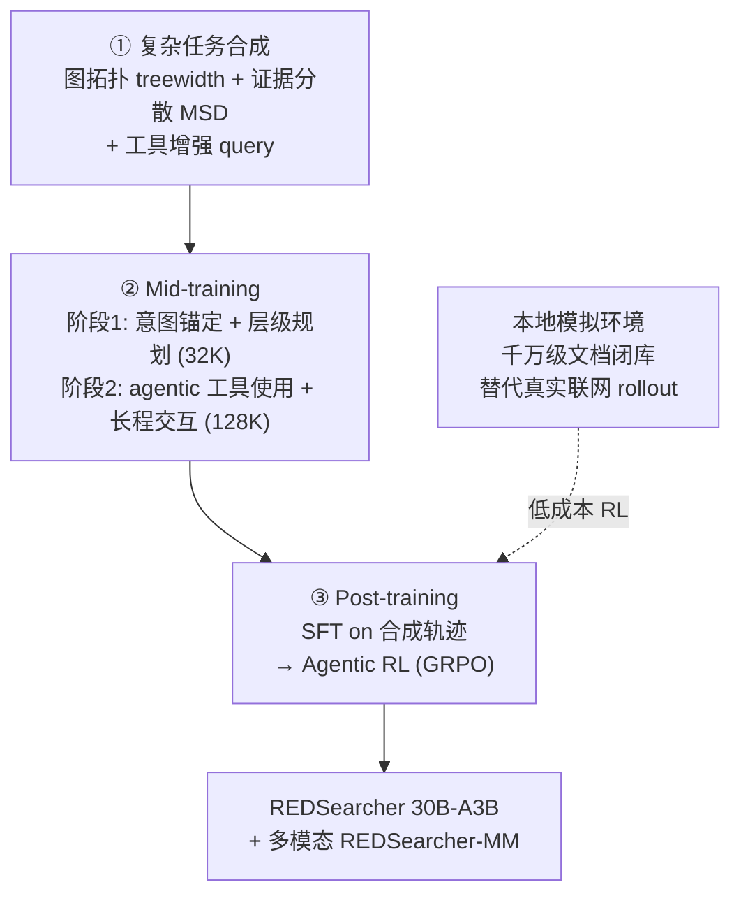

# REDSearcher：可规模化、低成本的长程搜索 agent

> **一句话**：REDSearcher（小红书 / RED + 哈工大 + 上海交大）直指长程深度搜索"高质量搜索轨迹与奖励信号极度稀疏、训练成本高"这一核心瓶颈，把**复杂任务合成（图拓扑 treewidth + 证据分散 + 工具增强 query）+ mid-training（核心能力 + agentic 能力）+ post-training（SFT + Agentic RL）**统一进一条低成本流水线，在 30B-A3B 规模上做出 SOTA 级长程搜索 agent，并扩展到多模态版本 REDSearcher-MM。
> 提出年份：2026（arXiv:2602.14234，2026-02）· 机构：小红书 Xiaohongshu（RED，作者多数与通讯来自小红书）+ 哈尔滨工业大学 + 上海交通大学 · 开源：RedSearchAgent/REDSearcher
> 前置阅读：[Deep Research 总览](/agent/deep-research/) · [Web 长程导航 RL](/agent/agentic-rl/web-agent-rl) · [Tongyi DeepResearch](/agent/deep-research/tongyi-deepresearch)

## 问题：长程搜索为什么难训

把 LLM 训成一个能"自己规划、反复搜、读、补检、再综合"的 deep search agent，难点不在某一步会不会调工具，而在**整条轨迹太长、太稀疏**：

- **高质量轨迹稀疏**。一条合格的长程搜索轨迹要跨十几到几十步、命中分散在不同来源里的证据、还要在中途纠错。这种数据网上几乎不存在，人工标注昂贵且难以规模化。
- **奖励信号稀疏**。Agentic RL 里通常只有"最终答案对不对"这一个 0/1 信号。轨迹越长，能爬到正确终点、拿到正奖励的 rollout 越少，梯度极度稀疏，RL 难以起步。
- **成本高、迭代慢**。RL rollout 要真实联网调搜索 API，慢、贵、还会被限流/超时打断，导致一轮实验动辄几天，无法快速调参。
- **任务难度不可控**。很多合成的"难题"其实存在"单页捷径"——一个网页就能答完，agent 学不到真正的多跳推理与跨源整合。

REDSearcher 的回答是：**不靠单点 trick，而是把任务合成、mid-training、post-training 三件事 codesign 成一条统一、可规模化、低成本的流水线**，让稀疏问题在每一个环节都被针对性缓解。

## 框架三件套

### ① 复杂任务合成：用图拓扑与证据分散精确控制难度

核心思路是把"造一道难题"形式化成一个**双约束优化（dual-constrained optimization）**问题，难度由两个可量化维度共同决定：

- **图拓扑复杂度（treewidth k）**：把任务建模成约束图，用树宽 \(k\) 刻画约束之间的耦合程度——链式任务 \(k=1\)，菱形/环形耦合 \(k=2\)，高维交叉耦合 \(k\ge3\)。论文把推理代价近似为 \(O(N\cdot d^{k+1})\)（\(N\) 为步数、\(d\) 为分支因子），\(k\) 越大越难。
- **最小来源分散度（Minimum Source Dispersion, MSD）**：度量答案证据被打散到多少个来源，定义为覆盖整张约束图所需的最少不同文档数 \(\mathcal{D}_{task}=\min_{\mathcal{S}\subseteq\mathcal{W}}|\mathcal{S}|\ \text{s.t.}\ \text{Cover}(\mathcal{S},G)=\text{True}\)。MSD 把"单页捷径"显式排除掉，逼着 agent 真正去跨源整合。

合成的 query 还会做**工具锚定（tool-grounding）**：把关键事实改写成"必须靠工具才能解出"的约束（tool-resolvable constraints），鼓励 agent 主动调工具，而不是凭参数记忆硬答。这样得到的题目既"结构上难"又"证据上散"，是优质长程轨迹的源头。

### ② Mid-training：先补核心能力，再补 agentic 能力

在做 task-specific 的 SFT/RL 之前，REDSearcher 插入一段 mid-training，分两阶段把基座能力垫高：

1. **阶段一（32K 上下文）**：意图锚定（intent-anchored grounding）与层级规划（hierarchical planning），强化"知识、规划、函数调用"这些核心原子能力。
2. **阶段二（128K 上下文）**：agentic 工具使用与长程交互，把上下文窗口拉满，专门练"多步、跨工具、长轨迹"下的稳定性。

这一步的意义在于：直接对一个没"见过"长程交互的基座做 RL，正样本太少根本学不动；先用 mid-training 把"会规划、会调工具、扛得住长上下文"垫好，后续 SFT/RL 的稀疏奖励才有可能被利用起来。

### ③ Post-training：SFT 冷启动 + Agentic RL（GRPO）

- **SFT**：用第①步合成的高质量轨迹做监督微调，作为冷启动，让模型先学会"长程搜索该长什么样"。
- **Agentic RL**：采用 **GRPO（Group Relative Policy Operation，组相对策略优化）**。奖励是**二值 {0,1}**（最终答案对/错），优势用组内相对归一化 \(\hat{A}_{q,k}=(r_{q,k}-\bar r_q)/(\sigma_q+\epsilon)\) 计算——这对稀疏二值奖励尤其友好，不需要单独训 value 网络。

**低成本的关键在 RL 环境**：REDSearcher 不直接联真实搜索 API 跑 rollout，而是构建了一个**本地模拟环境**——用 finewiki dump 加缓存的网络搜索结果搭出一个**千万级文档的闭库**，模拟真实 web 动态。它保证"所有必需证据都在闭库内，但被物理打散、埋在大量干扰文档中"，既复现了"证据分散"的真实难度，又**消除了真实 API 的延迟、费用与限流/超时**，让 RL 可以快速、廉价地迭代。这正是"scalable & cost-efficient"标题的工程落点。

## 多模态：REDSearcher-MM

REDSearcher-MM 把同一套合成流水线扩展到多模态：在任务合成时做**模态注入（modality injection）**并强制**跨模态依赖（cross-modal dependency）**——即让正确解答必须同时依赖图文等多模态证据，而非单看文本就能答完。多模态轨迹的生成用到了更强的 **Qwen3-VL-235B** 作为教师来产出训练数据，主 agent 仍是 30B 量级。多模态版本在 LiveVQA 等基准上取得领先（REDSearcher-MM-RL 在 LiveVQA 上约 79.3%，具体数字以原文为准）。

## "可规模化、低成本"的工程取舍

把全文串起来看，REDSearcher 的设计哲学是**用可控的合成数据 + 廉价的本地 RL 环境，换掉"人工标轨迹 + 真实联网 RL"的高成本路径**：

- **数据侧**：treewidth + MSD 让难度可调、可批量生成，不靠人标。
- **训练侧**：mid-training 先把基座垫到"学得动"的程度，缓解 RL 冷启动。
- **环境侧**：千万级文档闭库替代真实 API，rollout 又快又便宜，且天然内置"证据分散"难度。
- **推理侧的小技巧**：一个叫 **Discard-all** 的上下文管理策略——当上下文超阈值时，**清空历史工具调用 (τ, a, o) 三元组，只保留原始问题与最小任务说明**，把 token 预算腾给后续探索而非维护冗长历史。仅此一招就把 BrowseComp 从 42.1 拉到 57.4（约 +15.3 分）。

## Benchmark 表现（以原文为准）

论文在 30B-A3B 规模上报告了文本与多模态两条线的结果（下表为文本线主结果，带 Discard-all 上下文管理；数字以原文表格为准）：

| 基准 | REDSearcher-30B |
| --- | --- |
| BrowseComp | 42.1 → **57.4**（+ 上下文管理） |
| BrowseComp-ZH | 49.8 → **58.2**（+ 上下文管理） |
| GAIA | **80.1** |
| HLE | ~33–34 |
| Overall | ~51 |

对比方面，论文称 REDSearcher-30B 的总体表现**优于同规模的 Tongyi DeepResearch-30B（约 48.5）与 WebSailorV2-30B（约 46.0）**，在 BrowseComp 上甚至超过部分更大的闭源模型（如 Claude-4.5-Sonnet 约 41.1）。多模态线在 LiveVQA 等基准领先。**所有数字请以 arXiv 原文表格为准**——本页为学习注解，可能与最终版本有出入。

## 与 Tongyi DeepResearch / 同类工作的关系

- **vs Tongyi DeepResearch**：两者都走"专门训练一个长程搜索 agent + 合成数据 + Agentic RL"的路线，且都在 30B-A3B 这一档对标。区别在于 REDSearcher 把**任务难度形式化**（treewidth + MSD 双约束）并用**本地千万级文档闭库**做廉价 RL，更强调"可规模化、低成本"的训练系统设计；可对照阅读 [Tongyi DeepResearch](/agent/deep-research/tongyi-deepresearch)。
- **vs WebSailor / 各类 Web Agent RL**：同属"训练浏览/搜索 agent 的 RL"范式，REDSearcher 的差异点是用合成数据的难度控制与本地模拟环境来对抗奖励稀疏，相关范式见 [Web 长程导航 RL](/agent/agentic-rl/web-agent-rl)。
- **vs open-deep-research / STORM 等开源 DR**：那些工作更偏"用现成强模型 + agent 框架复现 deep research 循环"，不专门训练模型；REDSearcher 是**从训练侧**解决长程搜索能力，二者互补。整体定位见 [Deep Research 总览](/agent/deep-research/)。

## 参考文献

- Zheng Chu, Xiao Wang, Jack Hong, et al. *REDSearcher: A Scalable and Cost-Efficient Framework for Long-Horizon Search Agents.* arXiv:2602.14234, 2026-02. <https://arxiv.org/abs/2602.14234>
- 项目主页：<https://redsearchagent.github.io/index/>
- 代码：<https://github.com/RedSearchAgent/REDSearcher>
- 数据集：REDSearcher_SFT_10K（文本 SFT）、REDSearcher_RL_1K（RL query）、REDSearcher_MM_SFT_5K（多模态 SFT），见 HuggingFace `Zchu` / `honglyhly`
- 相关：DeepSeekMath, *GRPO*（Group Relative Policy Optimization）；GAIA / BrowseComp / HLE / LiveVQA 等基准原文
