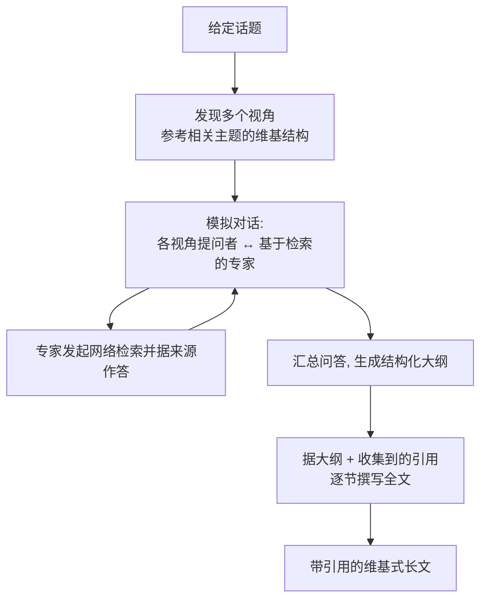

# STORM / Co-STORM（Stanford）

> **一句话**：STORM（2024，开源，Stanford OVAL）是一个**写"维基式长文"**的知识整理系统——它把"从零写一篇带引用的长文"拆成 pre-writing 研究阶段（联网检索、列大纲）与 writing 成稿阶段；其特色机制是**用多视角提问 + 模拟专家对话**来在动笔前把一个陌生话题问深问透。后续的 Co-STORM（2024-09，EMNLP 2024）把人也拉进这场"圆桌讨论"。
> 提出年份：2024（STORM arXiv:2402.14207，2024-02）· 机构/团队：Stanford OVAL · 会议/来源：NAACL 2024（Co-STORM：arXiv:2408.15232，EMNLP 2024）

> 上级页：[Deep Research 总览](/agent/deep-research/)。相关：[多智能体](/agent/multi-agent)、[Skills vs RAG/微调](/skills/vs-rag-finetune)。

## 定位

STORM 由斯坦福 OVAL 实验室提出，论文 *Assisting in Writing Wikipedia-like Articles From Scratch with Large Language Models*（arXiv:2402.14207）发表于 **NAACL 2024**。它和产品化的 Deep Research 同属"自主检索 + 综合成长文"这一家族，但**起点不同**：它的目标明确是"**从零写出一篇广度和深度接近维基百科页面的、有出处的长文**"，因此格外重视**动笔前的研究与大纲（pre-writing）**这一环——作者认为这正是从零写长文最难、最被忽视的阶段。

它是开源的（`stanford-oval/storm`），并配套了用于评测的 FreshWiki 数据集。

## 它怎么工作

STORM 把任务切成两段：**先研究、列大纲，再据大纲带引用成稿**。其最有辨识度的创新在 pre-writing：与其让单个模型直接对话式发问，不如**发现多个不同视角（perspective）**，再让模型**扮演这些视角下的"提问者"去和一个基于检索的"专家"对话**，从而问出比泛泛而谈更深、更具体的问题。

> 图源：Shao et al., *Assisting in Writing Wikipedia-like Articles From Scratch with Large Language Models*, arXiv:2402.14207（用于学习注解，版权归原作者）

**Co-STORM**（arXiv:2408.15232，2024-09，EMNLP 2024）在此之上加入**人机协作**：它组织一场"圆桌讨论"，包含若干 **LLM 专家**（基于外部知识作答并能追问）、一个 **Moderator**（根据检索到但还没用上的信息抛出有启发性的问题来拓展讨论），以及**人类用户**（可旁观、可插话引导方向、可贡献自己的知识）。这把 STORM 从"一键生成"变成了"可被人实时操舵"的协作式知识整理。

## 能力与局限

**能力**：

- **专长是长文组织**：相比"答一个问题"，STORM 更擅长把一个话题铺成有大纲、有层次、逐节带引用的长文，覆盖广度和深度接近维基页面。
- **多视角提问显著提升 pre-writing 质量**：通过视角发现 + 模拟专家对话，问出的问题更深，从而采到更全面的资料。
- **开源 + 配套评测集**（FreshWiki），便于研究复现。
- **Co-STORM 支持人在环**：适合需要人把关方向、注入领域知识的严肃整理任务。

**局限**（作者明确指出）：

- **达不到可直接发表的成稿**：作者称系统产出往往仍需大量人工编辑；有经验的维基编辑认为它在 **pre-writing 阶段**最有帮助，而非交付终稿。
- 与所有联网综合系统一样，**来源质量与中立性、引用准确性**仍需人工核查。

## 与同类对比

- 相比 **OpenAI / Perplexity 等产品**：STORM 不是终端聊天产品，而是一个**面向"写长文"的开源研究系统**，其 pre-writing 的"多视角 + 模拟对话"机制是它独有的;产品则更偏端到端自治与即时可用。
- 相比 **GPT Researcher / HF open-deep-research**：那两者更通用、更偏"回答研究问题/刷 GAIA"，STORM 更聚焦"生成维基式结构化长文"这一具体写作场景。
- **STORM vs Co-STORM**：前者一键生成长文，后者把人和 Moderator 拉进圆桌、支持实时协作与操舵，适合更严肃、需要人把关的整理工作。

## 参考链接

- Shao et al., *Assisting in Writing Wikipedia-like Articles From Scratch with Large Language Models*（STORM, arXiv:2402.14207, NAACL 2024）
- Jiang et al., *Into the Unknown Unknowns: Engaged Human Learning through Participation in Language Model Agent Conversations*（Co-STORM, arXiv:2408.15232, EMNLP 2024）
- 代码：<https://github.com/stanford-oval/storm>
- 项目主页：<https://storm-project.stanford.edu/research/storm/>
