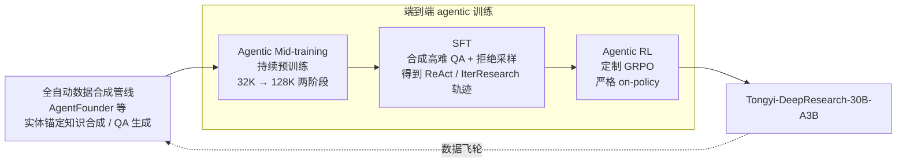

# Tongyi DeepResearch：开源深研 agent 的标杆

> **一句话**：Tongyi DeepResearch 是目前最具代表性的**开源**深度研究 agent——一个 30.5B 总参 / 每 token 仅激活 3.3B 的 MoE 模型（30B-A3B），用 agentic mid-training + agentic post-training 做端到端训练，配一条不依赖人工标注的全自动数据合成管线，在 BrowseComp / HLE / GAIA / xbench-DeepSearch 等多个深研榜单上刷出开源 SOTA，按技术报告所述达到"与 OpenAI Deep Research 相当"的水平。
> 提出年份：2025（arXiv:2510.24701，*Tongyi DeepResearch Technical Report*；2025-10 提交，v3 2026-05）· 机构：阿里巴巴 Tongyi Lab（Tongyi DeepResearch Team）· 开源：Alibaba-NLP/DeepResearch（HF: Alibaba-NLP/Tongyi-DeepResearch-30B-A3B）
> 前置阅读：[Deep Research 总览](/agent/deep-research/) · [Web 长程导航 Agent 的 RL](/agent/agentic-rl/web-agent-rl)

## 它是什么，为什么重要

2025-02 OpenAI Deep Research 发布后，"深度研究 agent"成了 agent 元年最受关注的能力形态之一，但第一梯队（OpenAI、Gemini）全是闭源产品：模型不开放、训练方法不公开，开源社区只能用"通用模型 + 搜索工具"的即插即用方案去逼近，效果与闭源拉开明显差距。

Tongyi DeepResearch 的意义就在这里：它是少数把**模型权重、训练框架、数据合成方案一并开源**的深研 agent，并且不是"挂搜索工具的通用模型"，而是一个**为长程信息检索（long-horizon, deep information-seeking）专门端到端训练**出来的模型。换句话说，它做的事情和 OpenAI Deep Research 同构——给一个开放式研究问题，自主完成"规划 → 多轮检索 → 阅读 → 反思补检 → 综合成稿"的长程轨迹——但把这套能力以可复现的方式放到了开源世界。

对算法工程师而言，它的价值不只是一个可下载的强模型，更是一份完整的"如何训练一个深研 agent"的公开配方。

## 模型与架构

- **MoE，30B-A3B**：总参数 30.5B，每个 token 仅激活约 3.3B。稀疏激活让它在保持小激活量（推理成本接近 3B 级稠密模型）的同时具备 30B 级模型的容量，这对需要跑几十轮工具调用、轨迹很长的深研任务尤其划算。
- **128K 上下文**：支持 128K 上下文窗口。技术报告也坦承，对最复杂的长程任务这仍然不够，因此在 agent 范式层面用 IterResearch 做上下文管理（见下）。
- **定位长程信息检索**：模型不是为单轮问答优化的，而是为"反复搜索—阅读—判断—补检"的多步轨迹优化的——评测榜单也都是这类长程检索/浏览任务。

## 训练方法

整条管线是**端到端的 agentic 训练**：从 agentic 中段训练（mid-training / 持续预训练）打底，到后训练（SFT + RL）做长程 agentic 优化，全程由一条全自动数据合成管线供血，不依赖人工标注。

- **全自动数据合成管线**：这是整套方法的地基。报告强调"完全自动、高度可扩展、消除人工标注"，通过实体锚定的知识合成、规划动作拆解、推理链生成、决策动作建模等组件，批量造出高难度的研究型 QA 与轨迹。它沿用并发展了团队此前一系列工作（WebWalker、WebSailor / WebSailor-V2、WebShaper），并由 **AgentFounder** 统一组织成一个"数据飞轮"——后训练产生的数据又反哺合成。
- **Agentic Mid-training（持续预训练）**：在通用模型之上做面向 agent 的持续预训练，分两阶段，先 32K 上下文、再扩到 128K，目的是先把"会做长程信息检索"的 agentic 基座打出来，再交给后训练精修。
- **SFT**：从合成的高难度 QA 出发，用**拒绝采样**筛出高质量轨迹做监督微调。轨迹覆盖两种 agent 范式：经典的 **ReAct**（Thought 与 Action 交错生成）和团队提出的 **IterResearch**。
- **IterResearch（应对上下文膨胀）**：长程任务的痛点是把所有检索结果一路堆进同一个不断膨胀的上下文，导致"认知过载"。IterResearch 的做法是**每一轮重建一个精简工作区**——分析当前问题、把发现整合进一份持续演进的报告、再决定继续检索还是给出答案，而不是无脑累积。它在 finite context 内用类马尔可夫的状态重构来支撑长 horizon。
- **Agentic RL（长程优化）**：后训练最后一步用**定制版 GRPO** 做强化学习，跑**严格 on-policy** 的训练机制——轨迹始终用最新策略采样。报告的一个明确经验是：在 agentic RL 里，**数据与环境的稳定性比算法本身的花活更关键**，为此他们定制了稳定的交互环境贯穿各训练阶段。
- **Heavy Mode（测试时扩展）**：推理侧还提供 Research-Synthesis 框架——并行跑多个 Research Agent（各自用 IterResearch），最后由一个 Synthesis Agent 整合各自精炼后的报告，从而在有限上下文窗口内覆盖更广的研究路径。这属于 test-time scaling，不改权重。

## Benchmark 表现

以下分数**均来自技术报告（arXiv:2510.24701）**，请以原文为准：

| 基准 | 分数 | 这个榜考什么 |
| --- | --- | --- |
| Humanity's Last Exam (HLE) | 32.9 | 跨学科、被刻意设计得对当前 AI 极难的专家级问答，考"推理 + 检索"综合能力 |
| BrowseComp | 43.4 | OpenAI 提出的浏览 agent 基准，问题答案难找但易验，考长程网页检索定位能力（英文） |
| BrowseComp-ZH | 46.7 | BrowseComp 的中文版，考中文网络环境下的长程检索 |
| WebWalkerQA | 72.2 | 考在网站内多跳"走"页面、跨页提取并整合信息的能力 |
| GAIA | 70.9 | 通用 AI 助手基准，需多步工具使用与多模态推理，深研 agent 的常用标尺 |
| xbench-DeepSearch | 75.0 | 面向深度搜索能力的评测，考多轮检索与信息综合 |
| FRAMES | 90.6 | 考多文档检索 + 多步推理的事实性问答 |

报告另给出 xbench-DeepSearch-2510（更新版）约 55.0 的成绩。综合来看，团队主张该模型"系统性地超越现有所有开源与闭源 Deep Research agent"，并在多数基准上与 OpenAI Deep Research 相当——值得注意的是，它是用 30.5B 总参 / 3.3B 激活这样**显著更小的激活量**达成的。这些是技术报告自报口径，具体数字与对照请以论文原文与各基准官方说明为准。

> 几个榜单速读：**BrowseComp / BrowseComp-ZH** 专测"在真实网络里把一个难找但好验的答案挖出来"的浏览检索能力，是深研 agent 的核心考点；**HLE** 偏专家级跨学科难题，考推理深度；**GAIA** 是通用助手的多步工具 + 多模态综合；**xbench-DeepSearch** 专门评深度搜索。它们合在一起覆盖了"检索深度 × 推理深度 × 工具使用"三个维度。

## 与闭源 DR 及其它开源方案的关系

- **对标闭源（OpenAI Deep Research / Gemini Deep Research）**：闭源方案模型不开放、训练方法不公开，只能当成产品用、当成榜单上的对照点。Tongyi DeepResearch 的差异化不在于"分数更高几个点"，而在于它把**与闭源同构的能力以完全开源、可复现的方式**交了出来——权重、训练框架、数据合成方案都开放，这是闭源给不了的。从能力对标看，报告主张其在 HLE / BrowseComp 等多个榜单上达到与 OpenAI Deep Research 相当甚至领先的水平。
- **相对其它开源深研 agent（如 MiroFlow、REDSearcher 等）**：这些方案更多停留在"框架编排 + 通用底座模型 + 工具"的层面（agent 工作流是开源的，但往往不带一个专门为深研端到端训练过的开源权重）。Tongyi DeepResearch 的核心区别是**它同时开源了一个专门训练的模型权重**，并公开了从 mid-training 到 RL 的整套训练配方与数据合成管线——把竞争点从"怎么把现成模型编排得更好"推进到了"怎么训出一个本身就会做深研的模型"。
- 一句话定位：在"开源 + 自带专训模型"这个象限里，它目前是标杆；与闭源 DR 的关系是"开源世界对其能力的可复现对标"。

## 参考文献

- Tongyi DeepResearch Team, *Tongyi DeepResearch Technical Report*（arXiv:2510.24701, 2025-10 提交, v3 2026-05）：<https://arxiv.org/abs/2510.24701>
- 官方博客 *Introducing Tongyi DeepResearch*（Tongyi Lab）：<https://tongyi-agent.github.io/blog/introducing-tongyi-deep-research/>
- 代码与方案开源：<https://github.com/Alibaba-NLP/DeepResearch>
- 模型权重（HuggingFace）：Alibaba-NLP/Tongyi-DeepResearch-30B-A3B；（ModelScope）iic/Tongyi-DeepResearch-30B-A3B
- 相关基准：Wei et al., *BrowseComp*（arXiv:2504.12516, 2025-04）；Mialon et al., *GAIA*（arXiv:2311.12983, 2023-11）
