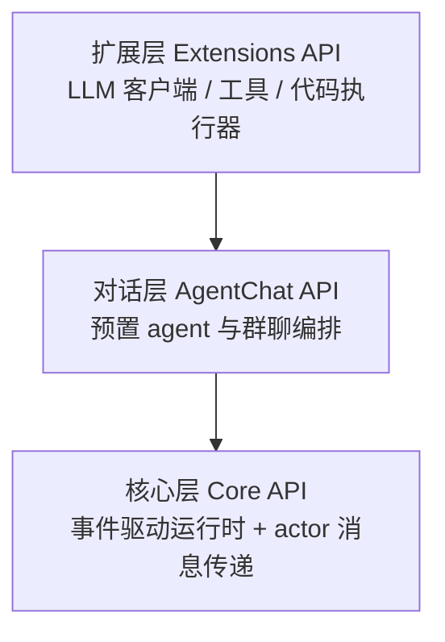

# AutoGen

> **一句话**：AutoGen 是微软推出的事件驱动多 agent 对话框架，以「可对话的 agent + 异步消息运行时」为核心抽象；2025-10 后已与 Semantic Kernel 合并入 Microsoft Agent Framework，自身转入维护模式。

- **机构**：Microsoft（Microsoft Research 发起，后由产品团队接管）
- **首发年份**：2023 年（v0.4 大重写于 2025 年 1 月发布）
- **约 star 数**：约 5.9 万（GitHub `microsoft/autogen`，近似值，2025 年内仍在增长）
- **主语言**：Python 为主，Core 层同时支持 .NET（跨语言运行时）
- **许可证**：代码 MIT，文档 CC-BY-4.0（双许可）

::: tip 现状（务必注意）
2025 年 10 月 1 日，微软发布 **Microsoft Agent Framework**，将 AutoGen 的多 agent 编排能力与 Semantic Kernel 的企业级特性合并为统一 SDK。官方在仓库 README 与公告中明确：**AutoGen 进入维护模式（maintenance mode）——不再新增功能，仅接收关键 bug 修复与安全补丁，并转为社区维护**；新项目应迁移到 Agent Framework。本文描述的设计仍然有效，但新开发不建议从 AutoGen 起步。
:::

## 定位与设计理念

AutoGen 解决的核心问题是：**如何让多个 LLM agent 通过自然语言对话协作完成复杂任务**。它最早提出并普及了「conversable agent（可对话 agent）」与「group chat（群聊式编排）」范式——把一个任务拆给多个角色化 agent（如 Planner、Coder、Critic、Executor），让它们以对话轮次互相提问、审查、修正，由一个编排器决定下一个发言者。这一范式后来被大量框架借鉴，可与本知识库 [多智能体](/agent/multi-agent) 一章中的协作模式对照阅读。

2025 年 1 月的 **v0.4** 是一次从零重写，奠定了今天的架构哲学：

- **事件驱动 + actor 模型**：底层是一个异步消息运行时，agent 是「对消息做出反应的 actor」。消息的投递方式与 agent 的处理逻辑解耦，从而获得更好的模块化、可观测性与可扩展性，天然适合分布式部署。
- **分层 API**：从底层运行时到高层易用接口分三层，开发者可按需选择抽象层级。
- **跨语言**：Core 运行时同时支持 Python 与 .NET，消息可在两种语言的 agent 间传递。
- **可观测与可控**：内置消息流追踪、人类介入（human-in-the-loop）与中断控制，针对早期版本「黑盒、难调试」的痛点。

## 核心抽象与用法

AutoGen v0.4 的三层 API：



官方仓库给出的整体示意图直观呈现了这套分层、可扩展的设计与各层职责：


> 图源：Microsoft, *AutoGen*, <https://github.com/microsoft/autogen>（用于学习注解，版权归原作者）

- **Core API**：实现消息传递、事件驱动 agent 与本地/分布式运行时，是 actor 模型的基础层，面向需要自定义协议与大规模编排的场景。
- **AgentChat API**：构建在 Core 之上的高层、有主见（opinionated）的接口，提供开箱即用的 `AssistantAgent`、`UserProxyAgent` 以及双 agent 对话、群聊等常见多 agent 模式，适合快速原型。
- **Extensions API**：第一方与第三方扩展，封装 OpenAI/AzureOpenAI 等 LLM 客户端、工具调用与代码执行能力（含容器化执行）。

一个最小群聊示例（AgentChat 层伪代码）：

```python
from autogen_agentchat.agents import AssistantAgent
from autogen_agentchat.teams import RoundRobinGroupChat
from autogen_agentchat.conditions import TextMentionTermination
from autogen_ext.models.openai import OpenAIChatCompletionClient

model = OpenAIChatCompletionClient(model="gpt-4o")

planner = AssistantAgent("planner", model_client=model,
                         system_message="拆解任务并分派给 coder。")
coder = AssistantAgent("coder", model_client=model,
                       system_message="实现方案；完成后回复 DONE。")

# 轮转发言，直到有人提到 DONE 即终止
team = RoundRobinGroupChat(
    [planner, coder],
    termination_condition=TextMentionTermination("DONE"),
)

await team.run(task="写一个计算斐波那契数列的函数并测试")
```

关键概念可归纳为：**Agent（角色 + 系统提示 + 工具）**、**Team / GroupChat（编排策略，如轮转、选择下一发言者）**、**Termination Condition（终止条件，组合式）**、**Tool（函数即工具，自动转 schema）**、**Code Executor（本地或沙箱执行 agent 产出的代码）**。其中「agent 写代码 → executor 执行 → 把结果喂回对话」的闭环是 AutoGen 区别于纯对话框架的标志性能力，可与 [agent loop](/harness/agent-loop) 与 [sandbox](/harness/sandbox) 章节互参。

## 适用场景与局限

**适合**：

- 需要多个角色化 agent 自然语言协作的研究与原型，尤其是「生成-执行-批判」迭代闭环（代码生成、数据分析、自动化研究）。
- 想要事件驱动、可分布式扩展的多 agent 运行时，且团队能接受较陡的抽象。

**局限**：

- **维护模式**：最大的现实约束。不再获得新功能，长期演进已转移到 Agent Framework，新项目从它起步意味着技术栈未来需迁移。
- **学习曲线与稳定性历史**：v0.2 → v0.4 是破坏性重写，社区代码与教程版本分裂明显；早期生态围绕 `autogen` 包名也产生过混乱。
- **编排表达力**：群聊/轮转范式对「显式、可控的有向流程」表达不如基于图的框架直接，这正是 Agent Framework 引入 graph-based workflow 的动机。
- **生态分叉**：原社区另起 **AG2**（`ag2ai/ag2`，前身即 AutoGen），与微软官方线并行演进，选型时需区分「microsoft/autogen」「ag2」「microsoft/agent-framework」三者。

## 与同类对比

| 维度 | AutoGen（v0.4） | LangGraph | CrewAI | MetaGPT |
| --- | --- | --- | --- | --- |
| 核心范式 | 可对话 agent + 事件驱动群聊 | 显式状态图（节点/边） | 角色 + 任务的团队编排 | SOP 驱动的软件公司隐喻 |
| 编排控制 | 群聊/轮转，隐式较多 | 图，最显式可控 | 中等，流程相对固定 | 强结构化（按角色流水线） |
| 代码执行闭环 | 一等公民（内置 executor） | 需自行集成 | 需工具集成 | 内置于开发流程 |
| 跨语言 | Python + .NET | Python（JS 版另立） | Python | Python |
| 现状 | **维护模式** | 活跃 | 活跃 | 活跃 |

定性看：若追求**显式可控的流程编排**，[LangGraph](/agent/frameworks/langgraph) 更合适；若追求**轻量的角色化团队协作**，[CrewAI](/agent/frameworks/crewai) 上手更快；若做**结构化软件工程自动化**，[MetaGPT](/agent/frameworks/metagpt) 的 SOP 范式更贴合。AutoGen 的历史价值在于率先把「多 agent 对话协作」做成可复用框架，其设计经验大多已被 Agent Framework 继承。更多框架横向对比见 [框架总览](/agent/frameworks/) 与 [多智能体](/agent/multi-agent)。

## 参考链接

- AutoGen 仓库（含维护模式声明）：<https://github.com/microsoft/autogen>
- AutoGen 转维护模式与合并公告：<https://github.com/microsoft/autogen/discussions/7066>
- AutoGen v0.4 重写（Microsoft Research Blog）：<https://www.microsoft.com/en-us/research/blog/autogen-v0-4-reimagining-the-foundation-of-agentic-ai-for-scale-extensibility-and-robustness/>
- Microsoft Agent Framework 官方文档：<https://learn.microsoft.com/en-us/agent-framework/overview/>
- Microsoft Agent Framework 仓库：<https://github.com/microsoft/agent-framework>
- 社区分叉 AG2：<https://github.com/ag2ai/ag2>
