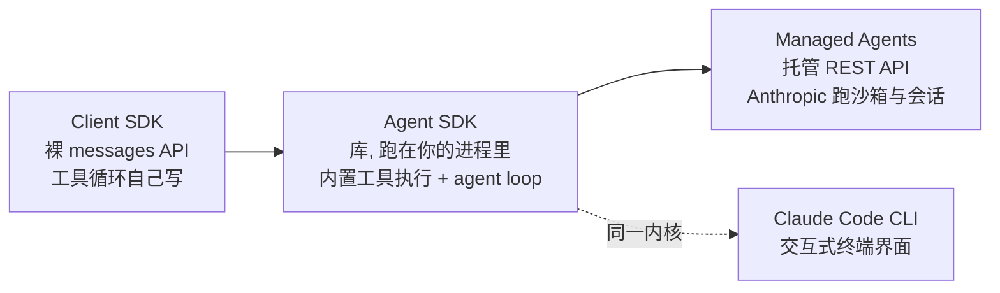

# Claude Agent SDK

> **一句话**：Anthropic 把 Claude Code 的 agent 内核（工具集 / agent loop / 上下文管理 / subagent / MCP / 权限）抽成可编程库的官方 SDK，让你用 Python / TypeScript 自建生产级 agent。

- **机构**：Anthropic
- **首发**：2025 年中以 "Claude Code SDK" 发布；2025-09-29 随 Claude Sonnet 4.5 / Claude Code 2.0 更名为 **Claude Agent SDK**（包名 `claude-agent-sdk` / `@anthropic-ai/claude-agent-sdk`）
- **约 star 数**：Python 仓库约 7k+、TypeScript 仓库约 1.5k+（截至 2026 年中，近似值，两库分开计数）
- **主语言**：Python（3.10+）与 TypeScript，两套对等实现
- **许可证**：Python 仓库代码为 MIT；但 SDK 的*使用*受 Anthropic 商业服务条款约束（运行时需调用 Claude API，并非纯本地开源软件）

## 定位与设计理念

绝大多数 agent 框架（[LangChain](/agent/frameworks/langchain)、[AutoGen](/agent/frameworks/autogen) 等）解决的是"如何编排 LLM 调用与工具"，但工具的具体执行（读文件、跑 bash、解析 diff、管理上下文窗口）要开发者自己实现。Claude Agent SDK 的取舍正相反：它把 [Claude Code](/agent/frameworks/claude-code) 这个已经在真实编码场景里打磨过的 [agent loop](/harness/agent-loop) 与工具执行层整体打包，开发者只需描述任务和约束，**工具循环由 Claude 自主驱动**。

官方将其设计哲学概括为一个反复执行的循环——*收集上下文 → 采取行动 → 验证结果*（gather context → take action → verify work）。SDK 的价值不在于某个聪明的 prompt，而在于把"长任务下如何不爆上下文、如何安全地碰文件系统、如何让模型自查"这些工程细节做成了默认能力。

它与 Anthropic 自家其它接入方式的边界很清晰：



- 与 **Client SDK**（`anthropic` 官方 SDK）相比：后者只给你 `messages.create`，`while stop_reason == "tool_use"` 的循环要自己写；Agent SDK 把这个循环和工具执行内置了。
- 与 **Claude Code CLI** 相比：同一内核、不同外壳。CLI 适合交互式开发与一次性任务，SDK 适合 CI/CD、定时任务与嵌入自有应用的生产自动化。
- 与 **Managed Agents** 相比：Agent SDK 跑在*你自己*的进程与基础设施上，直接操作你的文件系统与服务、会话以 JSONL 落在本地；Managed Agents 是托管沙箱。常见路径是本地用 SDK 原型化，再迁到 Managed Agents 上生产。

## 核心抽象与用法

入口极简：一个异步生成器 `query()` 流式吐出消息，配置全部塞进 `ClaudeAgentOptions`（TS 里是 `options` 对象，旧名 `ClaudeCodeOptions` 已废弃）。

```python
import asyncio
from claude_agent_sdk import query, ClaudeAgentOptions

async def main():
    async for message in query(
        prompt="找出并修复 auth.py 里的 bug",
        options=ClaudeAgentOptions(allowed_tools=["Read", "Edit", "Bash"]),
    ):
        print(message)   # Claude 自己读文件、定位、改代码

asyncio.run(main())
```

围绕这个入口，几组原语构成了完整能力：

**内置工具**：开箱即用，无需自己实现执行逻辑。文件类 `Read` / `Write` / `Edit`，命令类 `Bash` / `Monitor`（监听后台脚本输出流），检索类 `Glob` / `Grep`，联网类 `WebSearch` / `WebFetch`，以及 `AskUserQuestion`（向用户发起多选澄清）。`allowed_tools` 即是工具白名单兼"预批准"列表。

**权限（Permissions）**：通过 `allowed_tools` 与 `permission_mode`（如 `acceptEdits`）控制 agent 能动什么。只放 `Read` / `Glob` / `Grep` 就得到一个只读分析 agent；危险操作可要求逐次审批，与交互式 prompt 配合。

**Hooks**：在 agent 生命周期关键点插入回调函数，用于校验、审计、阻断或改写行为。可挂载点包括 `PreToolUse` / `PostToolUse` / `Stop` / `SessionStart` / `SessionEnd` / `UserPromptSubmit` 等。典型用法是 `PostToolUse` 匹配 `Edit|Write`，把每次文件改动写进审计日志。

**Subagents**：用 `AgentDefinition` 定义带专属 system prompt 与工具子集的子 agent，主 agent 通过 `Agent` 工具委派任务、子 agent 回报结果。子 agent 拥有独立上下文，是控制主上下文窗口膨胀的关键手段（见 [multi-agent](/agent/multi-agent)）。子 agent 内的消息带 `parent_tool_use_id`，便于追踪归属。

**MCP**：通过 [Model Context Protocol](/agent/tool-use) 接外部系统（数据库、浏览器、API）。既能挂外部 MCP server（如 Playwright），也能用 `@tool` 装饰器 + `create_sdk_mcp_server` 把本进程内的 Python / TS 函数注册为工具——无子进程、低开销。

```python
from claude_agent_sdk import tool, create_sdk_mcp_server, ClaudeAgentOptions

@tool("greet", "Greet a user", {"name": str})
async def greet(args):
    return {"content": [{"type": "text", "text": f"Hello, {args['name']}!"}]}

server = create_sdk_mcp_server(name="my-tools", version="1.0.0", tools=[greet])
options = ClaudeAgentOptions(
    mcp_servers={"tools": server},
    allowed_tools=["mcp__tools__greet"],
)
```

**Sessions**：跨多轮维持上下文。从初始化消息拿到 `session_id`，之后用 `resume=session_id` 续接，或 fork 出去探索不同方案。

**复用 Claude Code 的文件配置**：默认会加载工作目录与 `~/.claude/` 下的 [Skills](/skills/)（`.claude/skills/*/SKILL.md`）、`CLAUDE.md` 记忆、slash commands 与 plugins，可用 `setting_sources` 限制加载来源。需要交互式会话与自定义工具时改用 `ClaudeSDKClient`。

## 适用场景与局限

适合：CI/CD 中的自动修 bug / 代码审查、深度研究与报告生成、客服与运维自动化、把"会用电脑的 agent"嵌进自有产品——凡是需要可靠地读写文件系统、跑命令、并自主完成长链路任务的场景。

局限：

- **强绑定 Claude**：SDK 只跑 Claude 模型（可经 Bedrock / Vertex / Azure / AWS 接入），不是模型无关的编排框架；想多模型路由需另选框架或自己封装。
- **不是纯开源软件**：代码 MIT，但运行依赖 Claude API 且受商业条款约束；且默认会回传代码接受 / 拒绝等使用反馈，合规场景需关注数据政策。Anthropic 也不允许第三方用 claude.ai 登录态驱动自建 agent。
- **抽象偏"黑盒"**：agent loop 与上下文压缩策略由 SDK 内置，灵活但可观测性与可控性不如自己用 Client SDK 手写循环。
- **计费变化**：自 2026-06-15 起，订阅计划下 Agent SDK 与 `claude -p` 用量改走独立的月度 Agent SDK 额度。

## 与同类对比

| 维度 | Claude Agent SDK | LangChain / LangGraph | AutoGen / CrewAI |
| --- | --- | --- | --- |
| 模型 | 仅 Claude | 模型无关 | 模型无关 |
| 工具执行 | **内置**（文件 / bash / 检索 / 联网） | 自己实现或装社区工具 | 自己实现 |
| Agent loop | SDK 内置，自主驱动 | 自己用图 / 链编排 | 框架编排多 agent 对话 |
| 上下文管理 | 内置压缩 + session | 需自己管 | 需自己管 |
| 文件系统 / bash | 一等公民、生产级 | 需外接工具 | 需外接工具 |
| 定位 | 单 agent 落地（可派 subagent） | 通用编排骨架 | 多 agent 协作 |

一句话：要"模型无关 + 完全可控的编排"，选 [LangGraph](/agent/frameworks/langgraph)；要多 agent 对话范式，看 [AutoGen](/agent/frameworks/autogen) / [CrewAI](/agent/frameworks/crewai)；要把一个能可靠操作电脑、生产可用的 Claude agent 最快嵌进系统，Claude Agent SDK 是当前最省事的选择。

## 参考链接

- 官方文档 - Agent SDK overview：<https://code.claude.com/docs/en/agent-sdk/overview>
- 迁移指南（Claude Code SDK → Claude Agent SDK）：<https://code.claude.com/docs/en/agent-sdk/migration-guide>
- Python 仓库：<https://github.com/anthropics/claude-agent-sdk-python>
- TypeScript 仓库：<https://github.com/anthropics/claude-agent-sdk-typescript>
- 示例 agent 合集：<https://github.com/anthropics/claude-agent-sdk-demos>
- Anthropic 商业服务条款：<https://www.anthropic.com/legal/commercial-terms>
