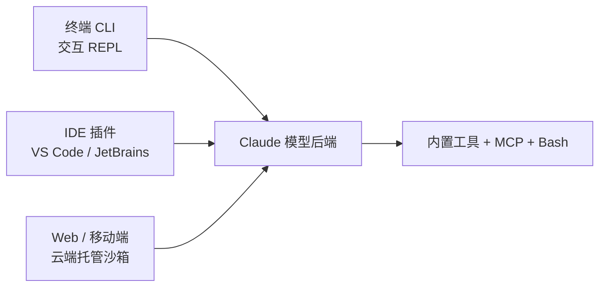

# Claude Code

> **一句话**：Anthropic 官方的终端编码 agent，2025-02 以研究预览首发、2025-05 随 Claude 4 正式可用；代码托管于 GitHub（anthropics/claude-code，约 13 万 star），但属"源码可见"而非 OSI 开源——使用受 Anthropic 商业条款约束、模型本身不开源。

Claude Code 是 Anthropic 第一方的命令行编码助手，定位与开源框架（LangChain、AutoGen 等）截然不同：它不是给你搭 agent 的库，而是一个**开箱即用、单循环、强安全默认**的成品工具。本页从"产品怎么用、生态如何"角度展开；harness 设计范式（单循环 vs 多 agent、上下文管理、沙箱机制）的横向对比见 [代表系统对比](/harness/systems) 与 [沙箱与工具执行](/harness/sandbox)，此处只点要点并互链，不重复。其编程化内核已抽出为独立 SDK，见 [Claude Agent SDK](/agent/frameworks/claude-agent-sdk)。

## 它是什么、能做什么

按官方 README 的说法，Claude Code 是"一个住在终端里、理解你代码库的 agentic 编码工具"。核心能力围绕日常工程任务展开：

- **代码库理解与改写**：跨文件检索、定位、解释复杂逻辑，按自然语言指令做多文件重构、改 bug、补测试。
- **Git/GitHub 工作流**：起草 commit、解决冲突、创建分支与 PR；可在 GitHub 上 `@claude` 触发自动化。
- **执行—观察循环**：自主调用 Read/Edit/Bash/Grep 等内置工具与外部 MCP server，运行测试与构建命令并据结果迭代，这正是典型的 [agent 循环](/harness/agent-loop)。
- **可扩展层**：Slash 命令、**Subagents**（隔离上下文的子任务，详见 [多智能体](/agent/multi-agent)）、**Skills**（任务级指令+脚本包，见 [Skills 设计](/skills/design)）、**Hooks**（PreToolUse/PostToolUse 等拦截点）、**Plugins**（把上述组件打包成可安装单元）、以及 **MCP** 工具接入（见 [工具使用](/agent/tool-use)）。

商业上 Claude Code 是 Anthropic 增长最快的产品之一，正式可用后约半年内年化营收据报达到十亿美元量级（媒体报道口径，非官方财报）。

## 工作形态与典型用法

Claude Code 有三种形态，共享同一套配置、Hooks 与权限规则：

- **终端 CLI（主形态）**：安装后运行 `claude` 进入交互式 REPL，用自然语言对话；也支持**无头模式**——`claude -p "..."` 一次性跑完，无需 TTY，适合接进 CI / 脚本，复用同一套权限与 Hooks。
- **IDE 集成**：VS Code、JetBrains 等编辑器内嵌使用，diff 直接呈现在编辑器里。
- **Web / 移动端（2025-10 起，研究预览）**："Claude Code on the web" 让你在浏览器里连上 GitHub 仓库、描述需求，任务跑在 **Anthropic 托管的云端沙箱**中，自动建分支、提 PR，并支持跨仓库**并行**多个会话。
- **权限粒度**：交互时对写文件、跑命令等动作逐次确认；可用 `--allowedTools` 预授权某些工具、用 settings 的 allow/ask/deny 规则固化策略；批处理场景可用 `--dangerously-skip-permissions`（自负其责）。

行为通过 `CLAUDE.md`（项目/用户级记忆）、`.claude/settings.json` 等文件声明式配置，团队可把约定纳入版本管理。

## 架构与安全要点

Claude Code 的设计取向是**单主循环 + 极简 + 安全默认**：一个主 agent 负责规划与整合，需要隔离上下文时再派生 Subagent，而非一上来就堆多 agent。这一范式与其他系统的横向比较，见 [代表系统对比](/harness/systems)。

安全上采取纵深防御，机制细节统一收敛在 [沙箱与工具执行](/harness/sandbox)，此处只列要点：

- **权限规则**：按 `deny → ask → allow` 严格顺序求值，先查全部 deny；覆盖 Bash/Edit/WebFetch/MCP 等所有工具。
- **OS 级沙箱**：限制 Bash 及其子进程的文件系统与网络访问——默认可读多数文件但不能写出工作树、不能外联、不能触碰 `~/.ssh`、`~/.aws` 等敏感目录；即便提示注入绕过了模型决策，沙箱边界仍在。
- **云端隔离**：Web 形态下每个会话独占托管沙箱，git 凭据/签名密钥等敏感信息**不放进**沙箱内。
- **上下文管理**：长任务靠 Subagent 隔离上下文、自动压缩与 `CLAUDE.md` 持久记忆来控制窗口占用。

## 适用场景与局限

适合：日常 SWE 任务（改 bug、补测试、重构、读陌生代码库）、Git/PR 自动化、把编码能力接进 CI 或内部平台（经 SDK / 无头模式）、以及偏好"少配置、强默认"的个人与团队。

局限与注意：

- **非 OSI 开源**：源码可读可审计、可 fork，但 LICENSE 为 Anthropic 商业条款（"All rights reserved"），不是 MIT/Apache 那类自由许可；模型权重不开放。需完全自托管/自由许可时，应看社区复刻或其他开源框架。
- **依赖在线模型后端**：默认走 Anthropic API；可改路由到 Amazon Bedrock、Google Vertex AI 或 LiteLLM 代理，但仍需一个可用的强模型后端，无法纯本地零依赖运行。
- **成本与放权权衡**：自主跑命令、长上下文会带来 token 开销；放宽权限提速的同时也放大风险，生产环境应配合 deny 规则与沙箱。
- **定位偏编码**：它是编码 agent 而非通用 agent 框架；要做复杂多 agent 编排或非编码业务流，更适合用 [Claude Agent SDK](/agent/frameworks/claude-agent-sdk) 或其他 [agent 框架](/agent/frameworks/)。

## 参考链接

- Claude Code GitHub 仓库：<https://github.com/anthropics/claude-code>
- 官方文档：<https://code.claude.com/docs/>
- 权限与沙箱文档：<https://code.claude.com/docs/en/permissions>
- Claude Code on the web 公告：<https://www.anthropic.com/news/claude-code-on-the-web>
- 站内：[代表系统对比](/harness/systems) · [沙箱与工具执行](/harness/sandbox) · [Claude Agent SDK](/agent/frameworks/claude-agent-sdk) · [Skills 设计](/skills/design)
