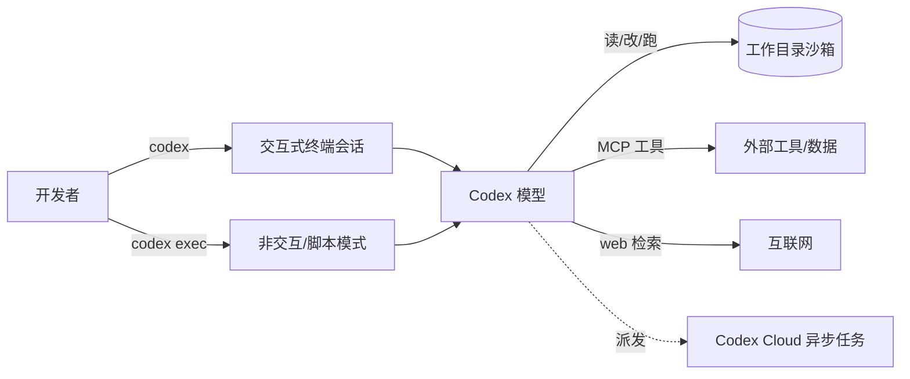

# Codex CLI

> **一句话**：OpenAI 于 2025-04 推出的开源（Apache-2.0）终端编码 agent，最初以 Node/TypeScript 实现、后核心重写为 Rust，以"沙箱 + 审批"工作流在本地读改运行代码，并支持 MCP、子 agent 与 Web 检索。

::: tip 先消歧
本页讲的是 **2025 年的 Codex coding agent 产品**（命令行工具 `codex` 及其云端版本），不是 2021 年那个名为 "OpenAI Codex" 的代码补全**模型**（GitHub Copilot 早期所用、已下线的 `code-davinci` 系列）。二者同名但是两回事：前者是 agent 工具/harness，后者是基础模型。
:::

## 它是什么、能做什么

Codex CLI 是 OpenAI 官方的命令行编码 agent，运行在你的终端里，对你指定的工作目录拥有**读文件、改文件、跑命令**三类基本能力，由背后的 Codex 系模型（`gpt-5-codex` 及后续 `gpt-5.x-codex` 系列）驱动完成自然语言到代码改动的端到端任务：写功能、修 bug、跑测试、重构、做代码审查。

它有几个关键定位：

- **本地优先、可离线于云**：默认在本机沙箱内执行；同时与 ChatGPT 账号（Plus/Pro 等）和 OpenAI API key 两种登录方式打通，可把任务派发到 **Codex Cloud** 异步执行。
- **开源**：仓库 [`openai/codex`](https://github.com/openai/codex) 采用 Apache-2.0 许可证。项目 2025 年中以 Node/TypeScript 起步，随后核心被重写为 Rust（`codex-rs` workspace），目前 Rust 约占代码库 95%，二进制启动快、依赖少。GitHub star 数已达**数万**（约 7 万量级，为近似值，以仓库实时显示为准）。
- **生态开放**：通过 **MCP（Model Context Protocol）** 接入第三方工具与上下文，支持子 agent 并行拆解任务、Web 检索、图像输入（截图/设计稿）等。
- **可脚本化**：除交互式 TUI 外提供 `codex exec` 非交互子命令，便于在 CI、脚本和自动化流水线中调用。

底层的 agent 循环、工具调用协议属于 harness 范畴，本页不展开；横向范式对比见 [代表系统对比](/harness/systems)，循环机制见 [Agent 循环](/harness/agent-loop)。

## 工作形态与典型用法

安装方式有三种：`npm i -g @openai/codex`、`brew install --cask codex`，或从 GitHub Releases 直接下载 macOS / Linux 二进制。支持 macOS、Linux 与 Windows（Windows 可原生 PowerShell 或经 WSL2）。

两种主要工作形态：

Codex CLI 在终端中的交互界面（官方仓库配图）：

> 图源：OpenAI, *Codex CLI*, <https://github.com/openai/codex>（用于学习注解，版权归原作者）

- **交互式**：直接运行 `codex` 进入终端 UI，自然语言下达任务，agent 边规划边读改文件、跑命令，遇到需要批准的动作会暂停征求确认。会话内可用 `/model` 切换模型与推理强度（reasoning level）等斜杠命令。
- **非交互/脚本**：`codex exec "<任务描述>"` 一次性执行，输出可被管道/脚本消费，适合自动化与无人值守场景。

项目约定与上下文方面，Codex 读取仓库内的 `AGENTS.md` 作为项目级指令（构建/测试命令、代码风格、约束等），相当于把"项目须知"喂给 agent；用户级配置则放在 `~/.codex/`（如 MCP server 列表、默认审批模式、模型 profile）。MCP server 在配置文件中声明后，其暴露的工具会作为可调用工具进入 agent 的工具集。

## 架构与安全要点

Codex 的安全模型围绕**两道闸**：沙箱（限制能做什么）+ 审批（什么时候停下来问你）。这两点是它与"裸跑 shell"agent 的核心差异，原理细节见 [沙箱与工具执行](/harness/sandbox)，此处只点要点：

**沙箱（按平台实现）**：

- macOS：Seatbelt 策略，经 `sandbox-exec` 按所选模式生效；
- Linux：默认 `bwrap`（bubblewrap）+ `seccomp` 做隔离；
- Windows：原生沙箱基于受限访问令牌（restricted token）+ 基于 ACL 的文件系统边界 + 防火墙规则（提权模式约束更强，另有非提权回退模式），WSL2 则继承 Linux 语义。

**默认网络关闭**：无论本地还是云端，沙箱内**默认禁网**，需显式配置（如 `network_access = true`）才放开——这是降低供应链/数据外泄风险的关键默认值。注意：沙箱只约束 Codex 自带的 shell 工具；**MCP server 暴露的工具不受 Codex 沙箱约束，须各自实现 guardrail**。

**三档审批模式**：

| 模式 | 能力 | 何时需批准 |
| --- | --- | --- |
| Read-only | 只读文件、答问 | 任何编辑/执行/联网都要批 |
| Auto（默认） | 工作区内可读、可改、可跑命令 | 越出工作区、需联网时才批 |
| Full access | 无沙箱、无审批 | 不停问（高风险，仅限可信环境） |

审批触发点包括：编辑工作区外文件、访问网络、运行被判为不可信的命令、有副作用的工具/连接器调用。把"自治程度"做成显式可调档位，是 Codex 在"放手让 agent 干"和"人类兜底"之间给出的工程折中。

更系统的"沙箱 + 审批 + 上下文管理"在不同 coding agent 间的取舍对比，见 [代表系统对比](/harness/systems)，本页不重复其内容。

## 适用场景与局限

**适合**：

- 终端原生工作流、重 CLI/服务端的工程团队；想要**开源、可自托管配置、可脚本化**的编码 agent。
- 需要细粒度权限控制（默认禁网 + 审批闸）的安全敏感环境。
- 已在 OpenAI 生态（ChatGPT 订阅 / API）内，希望本地与 Codex Cloud 异步任务联动的用户。
- 想通过 MCP 把内部工具、知识库接入 agent 的场景。

**局限与注意**：

- **模型生命周期快**：Codex 系模型迭代密集（每数周一个新版，旧版数月内退役），固定某一模型名做长期依赖需关注弃用节奏。
- **沙箱不覆盖 MCP 工具**：第三方 MCP 工具的安全边界须自行负责，不要因为开了沙箱就默认所有工具调用都安全。
- **Full access 风险**：为图省事长期开 Full access 等于放弃了它最大的安全卖点，仅建议在隔离环境/容器内使用。
- 与同类终端 agent（如 [Claude Code](/agent/frameworks/claude-code)）在生态、模型与交互细节上各有侧重，选型时应结合所在模型生态与权限需求评估。

关于框架全景与选型，见 [Agent 框架总览](/agent/frameworks/)；与之配套的 SDK 化能力可参考 [Claude Agent SDK](/agent/frameworks/claude-agent-sdk)。

## 参考链接

- GitHub 仓库（Apache-2.0）：<https://github.com/openai/codex>
- Codex CLI 官方文档：<https://developers.openai.com/codex/cli>
- 审批与安全（沙箱/审批模式）：<https://developers.openai.com/codex/agent-approvals-security>
- Codex 模型文档：<https://developers.openai.com/codex/models>
- Wikipedia: Codex (AI agent)：<https://en.wikipedia.org/wiki/Codex_(AI_agent)>
- OpenAI 博客《Introducing upgrades to Codex》：<https://openai.com/index/introducing-upgrades-to-codex/>
