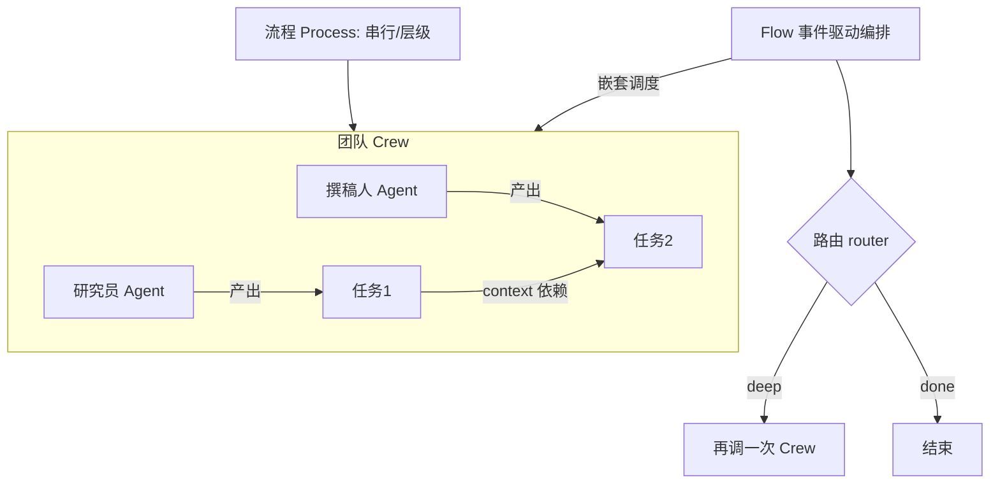

# CrewAI

> **一句话**：CrewAI 是 crewAI Inc. 于 2023 年底（约 2023 年 11-12 月）开源的多智能体编排框架，以"角色扮演 + 团队协作"为核心隐喻，用 Crew / Agent / Task / Process 四件套让开发者像组建一支团队那样描述任务分工；它从零自研、完全独立于 LangChain，主语言 Python，MIT 许可证，GitHub 约 5.3 万 star（2026-06 近似值，仍在快速增长）。

## 定位与设计理念

CrewAI 由 João (Joe) Moura 创立，2023 年底开源发布（PyPI v0.1.0 于 2023-11-14 发布，GitHub 初始发布约 2023-12-04），2024 年 10 月完成 1800 万美元融资（boldstart 领投种子轮、Insight Partners 领投 A 轮，Andrew Ng、Dharmesh Shah 等天使参投），并推出 CrewAI Enterprise 商业云。2025-10-20 OSS 版本进入 1.0 GA。它与 [LangChain](/agent/frameworks/langchain) 系最大的区别在于：**整个运行时从零自研，不依赖 LangChain 或任何其它 agent 库**，官方将其描述为"lean, lightning-fast"，主打更轻的依赖、更快的执行与更少的抽象包袱。

CrewAI 的核心隐喻来自人类组织：一个"团队"（Crew）由若干有明确**角色（role）、目标（goal）、背景故事（backstory）** 的 agent 组成，每个 agent 领取若干**任务（Task）**，团队按某种**流程（Process）** 推进直到产出。这是一种**声明式**的协作建模——你描述"有哪些角色、各自的目标、任务的先后顺序"，框架负责"怎么调度、怎么传状态、怎么调用工具"。相比手写消息循环和状态机，样板代码大幅减少，这也是 CrewAI 在新手友好度上常年被评为最易上手的原因：几十行代码即可跑通一个可用的多 agent 系统。

与 [多智能体](/agent/multi-agent) 一章讨论的范式对应，CrewAI 属于"角色专业化 + 编排式协作"的典型实现，介于纯对话式（AutoGen）与纯图式（LangGraph）之间，提供较高的抽象层级。

## 核心抽象与用法

CrewAI 提供两套互补的编排范式：**Crews**（面向自主协作）与 **Flows**（面向生产级、事件驱动的精确控制）。

Crews 的心智模型由四个原语构成：

- **Agent**：一个角色化执行单元，关键字段是 `role` / `goal` / `backstory`，可绑定 LLM、工具集与是否允许委派（`allow_delegation`）。
- **Task**：一个离散工作单元，含 `description`、`expected_output`，指派给某个 agent，可声明对其它 task 输出的依赖（`context`）。
- **Tool**：agent 可调用的能力，参见 [工具调用](/agent/tool-use)。
- **Crew**：把一组 agent 与 task 组装起来，并指定执行策略 `Process`。

`Process` 决定调度方式：`sequential`（任务按声明顺序串行，前序输出作为后序上下文）或 `hierarchical`（自动引入一个"经理"agent，由它拆解并把子任务派发给下属 agent，再汇总结果）。

```python
from crewai import Agent, Task, Crew, Process

researcher = Agent(
    role="资深行业研究员",
    goal="就 {topic} 找出最关键的事实与趋势",
    backstory="你擅长在海量资料中快速定位高价值信息。",
    tools=[search_tool],
    allow_delegation=False,
)
writer = Agent(
    role="技术撰稿人",
    goal="把研究结论写成结构清晰的简报",
    backstory="你能把复杂技术讲得通俗准确。",
)

research = Task(
    description="调研 {topic} 的现状",
    expected_output="一份带要点的研究纪要",
    agent=researcher,
)
report = Task(
    description="基于研究纪要撰写简报",
    expected_output="一篇 500 字简报",
    agent=writer,
    context=[research],          # 显式声明数据依赖
)

crew = Crew(
    agents=[researcher, writer],
    tasks=[research, report],
    process=Process.sequential,  # 或 Process.hierarchical
)
result = crew.kickoff(inputs={"topic": "Agentic RL"})
```

当任务的控制流不再是简单串行或层级，而需要分支、循环、条件路由、与普通 Python 代码混编时，使用 **Flows**。Flow 是一个 Python 类，用 `@start`、`@listen`、`@router` 等装饰器把"crew 调用、单次 agent 调用、纯函数"编排成事件驱动的状态机：

```python
from crewai.flow.flow import Flow, start, listen, router

class ResearchFlow(Flow):
    @start()
    def kickoff(self):
        return crew.kickoff(inputs=self.state)

    @router(kickoff)
    def decide(self, out):
        return "deep" if out.needs_more else "done"

    @listen("deep")
    def go_deeper(self):
        ...
```

Flow 自带状态（`self.state`）、持久化（结构化记忆与训练/测试钩子）以及"零配置可观测性"，是 CrewAI 推荐的生产架构；Crews 则更适合让 agent 自主协作、快速试验。两者可以互相嵌套——Flow 里可以调度多个 Crew。



CrewAI 官方对其多 agent 自动化定位的示意配图如下：


> 图源：crewAI Inc., *CrewAI*, <https://github.com/crewAIInc/crewAI>（用于学习注解，版权归原作者）

## 适用场景与局限

适用场景：

- **结构清晰、可分工的流水线任务**：内容生产、市场/行业调研、报告撰写、数据整理等"先研究后写作再审校"型工作流，角色隐喻天然贴合。
- **快速原型与团队上手**：抽象层级高、概念直观，适合算法工程师在不深入底层调度的情况下快速验证多 agent 想法。
- **企业落地**：Flows + 持久化 + 内置可观测性 + Enterprise 云，面向生产部署做了较多工程化。

局限：

- **细粒度控制弱于图式框架**：Crews 的串行/层级流程对"复杂条件分支、回环、精细状态管理"的表达力不如 [LangGraph](/agent/frameworks/langgraph) 的显式 graph；需要这类控制时要下沉到 Flows，学习成本上升。
- **层级（hierarchical）模式的可控性**：由经理 agent 自动派发任务，调度依赖 LLM 决策，确定性与可调试性不如显式编排，复杂场景下容易出现委派混乱或冗余调用。
- **高抽象的双刃剑**：上手快，但当需求超出"角色 + 任务"框架（如非协作型的复杂状态机）时，抽象反而成为约束。
- 与所有多 agent 框架一样，agent 数量增多会带来 **token 成本、延迟与错误累积**，参见 [多智能体](/agent/multi-agent) 中的可靠性讨论。

## 与同类对比

| 维度 | CrewAI | AutoGen | LangGraph |
| --- | --- | --- | --- |
| 核心隐喻 | 角色扮演 + 团队协作 | 对话式 agent 互相通信 | 有向图 / 状态机 |
| 抽象层级 | 高（Agent/Task/Crew） | 中（会话与消息） | 低（节点 + 边 + 状态） |
| 控制流 | 串行 / 层级 / Flows 事件驱动 | 多轮对话、群聊编排 | 显式图：分支、循环、条件路由 |
| 细粒度控制 | 中（需用 Flows 补强） | 中 | 强 |
| 上手难度 | 低 | 中 | 较高 |
| 典型场景 | 分工明确的流水线、内容/调研 | 头脑风暴、客服、人在回路 | 复杂状态管理、可控 agent 编排 |
| 与 LangChain 关系 | 完全独立、自研 | 独立（微软） | 同属 LangChain 生态 |

定性地说：**AutoGen** 长于自然语言对话式协作与原生的人在回路；**LangGraph**（详见 [LangGraph](/agent/frameworks/langgraph)）长于把 agent 交互建成可控的有向图，适合需要精细状态与分支的复杂工作流；**CrewAI** 则在"用最贴近人类组织直觉的方式、最少代码搭出一支协作团队"上最讨喜，是分工清晰的流水线任务和快速原型的优选。三者并非互斥，CrewAI 用 Flows 向"精确控制"靠拢，LangGraph 也能表达角色协作，选型应回到具体任务的控制流复杂度与可观测性诉求。

## 参考链接

- CrewAI GitHub 仓库：<https://github.com/crewAIInc/crewAI>
- CrewAI 官方文档：<https://docs.crewai.com/>
- CrewAI OSS 1.0 GA 公告：<https://crewai.com/blog/crewai-oss-1-0---we-are-going-ga>
- crewai PyPI：<https://pypi.org/project/crewai/>
- Wikipedia: CrewAI：<https://en.wikipedia.org/wiki/CrewAI>
- 融资报道（SiliconANGLE，2024-10）：<https://siliconangle.com/2024/10/22/agentic-ai-startup-crewai-closes-18m-funding-round/>
- DataCamp: CrewAI vs LangGraph vs AutoGen：<https://www.datacamp.com/tutorial/crewai-vs-langgraph-vs-autogen>
