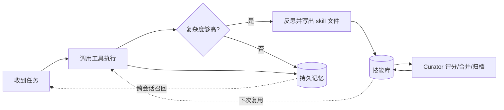

# Hermes Agent

> **一句话**：Nous Research 2026 年 2 月开源（MIT 许可证）的自托管自治 agent，核心卖点是「持久记忆 + 闭环学习」——完成任务后自己写出可复用 skill，越用越强。

Hermes Agent 是 [Nous Research](https://github.com/NousResearch) 推出的开源自治 agent 运行时，2026 年 2 月下旬正式发布。它跑在你自己的服务器上、把记忆和技能落盘，因而「用得越久越能干」。仓库托管在 [NousResearch/hermes-agent](https://github.com/NousResearch/hermes-agent)，采用 MIT 许可证；截至本页撰写时 GitHub star 约 19 万（近似值，热度增长极快），是 2026 年增长最快的开源 agent 项目之一。它与 [OpenClaw](/agent/frameworks/openclaw) 构成当前开源 agent 生态的两极。

## 它是什么、能做什么

Hermes 想解决的是「静态 skill 问题」：传统 agent 框架（如 [Claude Code](/agent/frameworks/claude-code)、[Codex](/agent/frameworks/codex)）的能力边界由人预先写好的工具与提示决定，跑完一次任务什么都不沉淀。Hermes 把 agent 设计成一个长期驻留的运行时，围绕三件事建立「闭环」：

- **持久记忆**：记忆跨会话、跨重启保留。底层用 SQLite FTS5 全文检索 + LLM 摘要做跨会话召回，再叠加 Honcho 风格的「用户建模」逐步刻画使用者画像。agent 会定期收到「nudge」提醒自己把重要信息写入记忆。
- **自写 skill（闭环学习的核心）**：每完成一个有一定复杂度的任务（社区资料中常见的触发条件是「单任务调用 ≥5 次工具」），agent 会跑一个反思（reflection）步骤，把这次解题的过程固化成一个可复用的 skill 文件，下次遇到相似任务直接调用，并在使用中按 rubric 自我改写、持续打磨。Nous Research 在 2026 年 4 月公布的内部基准称：使用自生成 skill 的实例在复杂研究 / 代码执行任务上比「全新、不学习」的实例快约 40%（厂商口径，谨慎看待）。
- **技能库自治维护（Curator）**：v0.12.0 引入了一个后台的 Curator（用辅助模型驱动），按周期评分、合并重叠、归档过时的 agent 自建 skill；内置 skill 和从 hub 安装的 skill 不会被它动。可用 `hermes curator status / run / pin <skill>` 查看状态、手动触发、保护指定 skill。

Hermes 的 skill 采用与 [agentskills.io](https://agentskills.io) 兼容的开放 SKILL.md 标准，因此可移植、可分享——这套「skill 即可执行文档」的设计思路，本知识库在 [Skills 设计](/skills/design) 与 [AutoSkill 技能自迭代](/skills/autoskill/) 有系统拆解，自写 skill 的「生成—评估—改写—淘汰」循环正是 AutoSkill 范式的一个落地实现。



## 工作形态与典型用法

Hermes 主打「装上即跑、随处可达」。一条命令完成安装（自动装好 uv、Python、克隆仓库，无需 sudo）：

```bash
curl -fsSL https://hermes-agent.nousresearch.com/install.sh | bash
hermes setup --portal   # OAuth 配置模型访问与工具网关
```

支持 Linux / macOS / WSL2，并提供 Windows 与 macOS 的桌面客户端。它的特点不是「一个 IDE 内编程助手」，而是一个常驻服务，可通过多种渠道接入：

- **消息平台**：Telegram、Discord、Slack、WhatsApp、Signal、Email，以及飞书 / 企业微信 / QQ 等近 20 个平台（不同版本数量有差异），让 agent 像一个能被随时 @ 的「数字同事」。
- **CLI 与定时任务**：本地命令行直接对话，配合 cron 调度做无人值守的周期任务。
- **MCP 接入**：通过 MCP（Model Context Protocol）挂载外部工具与数据源，扩展可调用的能力。
- **多实例 profile**：用 profile 管理多套独立配置（不同用户 / 不同项目各自一份记忆与技能库）。

模型侧是 provider 可插拔的：可接入多家 API，并配置 fallback provider 兜底；也常被通过 OpenRouter 等聚合层使用。

## 架构与安全要点

Hermes 是「自治运行时」形态——它会主动写文件、执行命令、长期占用一个执行环境，因此隔离与权限边界尤为关键。这里只点要点，与其它 agent 的横向范式对比见 [代表系统对比](/harness/systems)，沙箱与工具执行的通用原理见 [沙箱与工具执行](/harness/sandbox)。

- **多执行后端**：提供 local、Docker、SSH、Singularity、Modal、Daytona 等多种 terminal backend，可从「$5 VPS」一路覆盖到 GPU 集群与按需 serverless（空闲近零成本）。容器后端带命名空间隔离与加固，是把 agent 自由执行命令的风险关进笼子的主要手段。
- **本地优先、无遥测**：自托管、数据留在本机，官方强调无 telemetry、无追踪、无云端锁定——这是它相对托管型 agent 的核心信任卖点。
- **上下文与记忆边界**：记忆系统是双刃剑，长期落盘的画像与历史既提升能力也扩大数据面，自托管让这部分完全由使用者掌控。

关于 agent 主循环（感知—决策—执行—反馈）的通用结构，参见 [Agent Loop](/harness/agent-loop)。

## 适用场景与局限

**适合**：

- 需要长期记住项目上下文、偏好、历史的「私人 / 团队助理」场景，记忆跨会话不丢。
- 重复性、可沉淀为 SOP 的任务流——自写 skill 让 agent 真正「越用越熟」。
- 对数据主权敏感、要求完全自托管、不接受云端锁定的团队。
- 想把 agent 接进既有 IM/邮件工作流、做无人值守周期任务的场景。

**局限与权衡**：

- 与 [OpenClaw](/agent/frameworks/openclaw) 的路线分歧本质是「广度 vs 深度」：OpenClaw 以 WebSocket Gateway 连接更多渠道、社区 skill 生态更大、累计用量更高；Hermes 押注「学习深度」。OpenClaw 仍是生态成熟、求稳团队的更安全选择。
- 自写 skill 与自治维护会引入不可控性：生成的 skill 质量参差、可能固化错误解法，需要 Curator 与人工 pin/审查兜底；厂商「快 40%」一类数字应在自己场景上复测。
- 项目年轻、迭代快，版本间接口（平台数量、后端、CLI）变动较大，生产部署需锁定版本。
- 自治执行 + 持久记忆放大了安全面，必须配合容器隔离与最小权限，不宜直接给宽泛的本机执行权。

## 参考链接

- Hermes Agent GitHub 仓库：<https://github.com/NousResearch/hermes-agent>
- 官方文档：<https://hermes-agent.nousresearch.com/docs/>
- CLI 命令参考：<https://hermes-agent.nousresearch.com/docs/reference/cli-commands>
- Skills 系统文档：<https://hermes-agent.nousresearch.com/docs/user-guide/features/skills>
- 开放 skill 标准：<https://agentskills.io>
- Hermes vs OpenClaw 对比（MarkTechPost）：<https://www.marktechpost.com/2026/05/10/openclaw-vs-hermes-agent-why-nous-researchs-self-improving-agent-now-leads-openrouters-global-rankings/>
- 本站相关：[AutoSkill 技能自迭代](/skills/autoskill/) · [Skills 设计](/skills/design) · [OpenClaw](/agent/frameworks/openclaw) · [代表系统对比](/harness/systems) · [沙箱与工具执行](/harness/sandbox)
