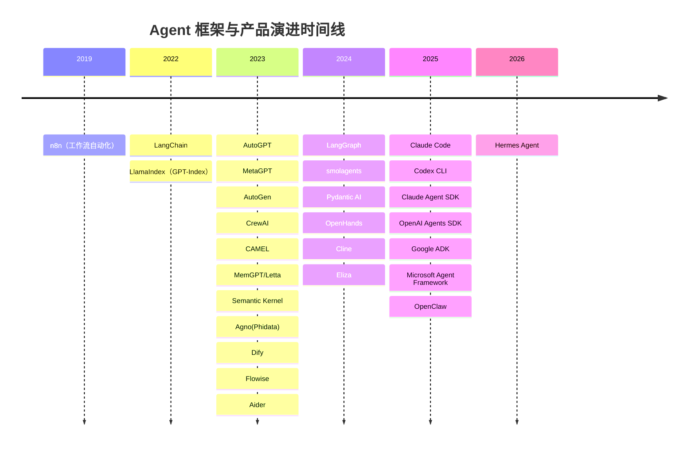
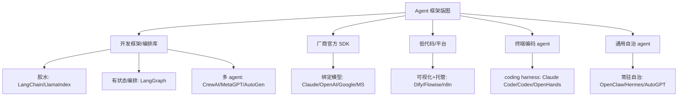

# 代表性 Agent 框架总览

> **一句话**：本章为「访客了解 agent 框架版图」的入口——按类别盘点讨论度高、开源 star 量级大的 agent 框架与产品，给出选型方向；设计范式（loop、sandbox、memory）请看 [Harness 代表系统对比](/harness/systems)，多 agent 协作机理请看 [多智能体](/agent/multi-agent)。

> **收录口径**：开源项目给 GitHub 链接与 star 量级，闭源 / 第一方产品给官方页面。star 数为某一时间点的近似快照（多数核实于 2026 年中），**随时间快速变化**，仅用于判断量级与热度，不应作为精确指标或唯一选型依据。已开本站详情页的项目，名称链接到详情页。

agent 框架这两年迅速分化：早期是「LLM 应用胶水库」（LangChain 式），随后裂变出**有状态编排**（图 / 状态机）、**多 agent 协作**（角色 / 对话 / 事件）、**厂商官方 SDK**（绑定自家模型与服务）、**低代码平台**（可视化 + 托管）、**终端编码 agent**（CLI coding harness）、**通用自治 agent**（常驻 daemon / 持久记忆）六大方向。下面按类别给出主流 10k+ star 项目的对照表。

## 演进时间线

下图按**首次发布年份**排出代表性框架 / 产品的出现顺序（年份为开源首发 / 官方发布时间，详见各表「首发」列与详情页）：

## 通用 Agent 开发框架 / 编排库

面向开发者，以代码方式组装 LLM 调用、工具、记忆与多步流程。这是 star 最密集、竞争最激烈的赛道。

| 名称 | 首发 | 类型 | 约 star | 语言 | 许可证 | 一句话 | 链接 |
|---|---|---|---|---|---|---|---|
| [LangChain](/agent/frameworks/langchain) | 2022 | 应用 / agent 开发框架 | 约 13.9 万 | Python（+JS/TS） | MIT | 最流行的 LLM 应用胶水框架，可组合标准组件库 | [详情页](/agent/frameworks/langchain) |
| [LlamaIndex](/agent/frameworks/llamaindex) | 2022 | Agent / 数据框架（RAG） | 约 5 万 | Python（+TS） | MIT | 数据 / 检索为中心，强在把私有数据接进 LLM | [详情页](/agent/frameworks/llamaindex) |
| [AutoGen](/agent/frameworks/autogen) | 2023 | 多 agent 框架（事件驱动） | 约 5.9 万 | Python（+.NET） | MIT | 微软事件驱动多 agent 对话框架，已并入 MAF、转维护模式 | [详情页](/agent/frameworks/autogen) |
| [MetaGPT](/agent/frameworks/metagpt) | 2023 | 多 agent 框架（SOP） | 约 6.9 万 | Python | MIT | 把软件公司 SOP 编码进角色流水线，一句话生成代码仓库 | [详情页](/agent/frameworks/metagpt) |
| [CrewAI](/agent/frameworks/crewai) | 2023 | 多 agent 编排框架 | 约 5.3 万 | Python | MIT | 以角色扮演 / 团队协作为卖点，独立于 LangChain | [详情页](/agent/frameworks/crewai) |
| Agno | 2023 | 生产级 agent 框架 | 约 4 万 | Python | Apache-2.0 | 主打高性能、低延迟实例化的全栈 agent 框架（前身 Phidata） | [GitHub](https://github.com/agno-agi/agno) |
| Semantic Kernel | 2023 | LLM 编排 SDK | 约 2.8 万 | C# / Python / Java | MIT | 微软多语言 LLM 编排 SDK，企业 .NET 生态首选 | [GitHub](https://github.com/microsoft/semantic-kernel) |
| Letta（MemGPT） | 2023 | 有状态 agent 平台 | 约 2 万+ | Python | Apache-2.0 | 以持久长期记忆为核心的 stateful agent 框架 | [GitHub](https://github.com/letta-ai/letta) |
| CAMEL | 2023 | 多 agent 研究框架 | 约 1.7 万 | Python | Apache-2.0 | 主打多 agent 社会模拟与 agent scaling law 研究 | [GitHub](https://github.com/camel-ai/camel) |
| [LangGraph](/agent/frameworks/langgraph) | 2024 | 有状态编排框架 | 约 3.4 万 | Python | MIT（Server 运行时 Elastic 2.0） | 用图建模可循环、可持久化、可人工介入的工作流 | [详情页](/agent/frameworks/langgraph) |
| smolagents | 2024 | 极简 agent 库 | 约 2.6 万 | Python | Apache-2.0 | Hugging Face 千行级代码、code-act 思路的极简 agent | [GitHub](https://github.com/huggingface/smolagents) |
| Pydantic AI | 2024 | 类型安全 agent 框架 | 约 1.7 万 | Python | MIT | Pydantic 团队出品，强类型 / 结构化输出优先 | [GitHub](https://github.com/pydantic/pydantic-ai) |

## 厂商官方 SDK

由模型厂商发布、强绑定自家模型 / 云服务的 agent 编程库。优点是与模型能力（工具调用、计算机使用、缓存）协同好，代价是可移植性弱。

| 名称 | 首发 | 类型 | 约 star | 语言 | 许可证 | 一句话 | 链接 |
|---|---|---|---|---|---|---|---|
| OpenAI Agents SDK | 2025 | 官方多 agent SDK | 约 2.5 万+ | Python（+JS） | MIT | OpenAI 轻量多 agent / 语音 agent 框架，含 handoff、guardrail | [GitHub](https://github.com/openai/openai-agents-python) |
| Google ADK | 2025 | 官方 agent 开发套件 | 约 2 万 | Python（+TS / Java） | Apache-2.0 | Google code-first agent 套件，深度集成 Gemini / Vertex AI | [GitHub](https://github.com/google/adk-python) |
| [Claude Agent SDK](/agent/frameworks/claude-agent-sdk) | 2025 | 官方 agent SDK | Python 约 7k+ / TS 约 1.5k+ | Python + TS | 代码 MIT（用 SDK 受 Anthropic 条款约束） | 把 Claude Code 内核打包为可编程库，自建生产 agent | [详情页](/agent/frameworks/claude-agent-sdk) |
| Microsoft Agent Framework | 2025 | 官方 agent SDK / 运行时 | 万级（快速增长） | Python / .NET | MIT | 合并 AutoGen + Semantic Kernel 的新一代统一框架，2026 GA | [GitHub](https://github.com/microsoft/agent-framework) |

## 低代码 / 平台

可视化拖拽 + 托管运行，面向非纯工程团队快速搭建 agent / workflow / RAG 应用。

| 名称 | 首发 | 类型 | 约 star | 语言 | 许可证 | 一句话 | 链接 |
|---|---|---|---|---|---|---|---|
| n8n | 2019 | 工作流自动化平台 | 约 19 万 | TypeScript | Fair-code（Sustainable Use） | 400+ 集成的可视化自动化平台，原生支持 AI / agent 节点 | [GitHub](https://github.com/n8n-io/n8n) |
| Dify | 2023 | LLM 应用 / agentic 平台 | 约 13 万 | Python / TS | Apache-2.0（含附加条款） | 可视化 agentic workflow + RAG + 多 agent 编排平台 | [GitHub](https://github.com/langgenius/dify) |
| Flowise | 2023 | 可视化 agent 构建器 | 约 5.3 万 | TypeScript | Apache-2.0（企业版另计） | 拖拽式 LLM / agent flow 构建器，LangChain 生态可视化 | [GitHub](https://github.com/FlowiseAI/Flowise) |

## 终端编码 agent

CLI / IDE 形态的 coding agent（coding harness），读改运行代码、跑测试、提交 PR。设计上多为单循环 + 沙箱 + 工具集，范式细节见 [Harness 代表系统对比](/harness/systems)。

| 名称 | 首发 | 类型 | 约 star | 语言 | 许可证 | 一句话 | 链接 |
|---|---|---|---|---|---|---|---|
| Aider | 2023 | 终端配对编程 agent | 约 4.6 万 | Python | Apache-2.0 | 终端里的 AI 配对编程，git 集成 + repo map 著称 | [GitHub](https://github.com/Aider-AI/aider) |
| OpenHands | 2024 | 开源软件工程 agent | 约 7 万+ | Python | MIT（enterprise 目录除外） | 开源「AI 软件工程师」，可在沙箱中端到端开发（前身 OpenDevin） | [GitHub](https://github.com/All-Hands-AI/OpenHands) |
| Cline | 2024 | IDE 编码 agent | 约 6 万 | TypeScript | Apache-2.0 | VS Code 内自治编码 agent，亦提供 SDK / CLI（前身 Claude Dev） | [GitHub](https://github.com/cline/cline) |
| [Claude Code](/agent/frameworks/claude-code) | 2025 | 终端编码 agent（第一方产品） | 约 13 万 | TypeScript | 源码可见 / Anthropic 商业条款（非 OSI） | 单循环 + 极简 + 安全默认的官方编码 agent | [详情页](/agent/frameworks/claude-code) |
| [Codex CLI](/agent/frameworks/codex) | 2025 | 终端编码 agent / harness | 数万（约 7 万量级） | Rust | Apache-2.0 | OpenAI 沙箱 + 审批工作流的开源 Rust 编码 agent | [详情页](/agent/frameworks/codex) |

## 通用自治 agent

非编码场景的常驻 / 自治 agent：长期运行、自设目标、持久记忆，部分对接 IM 网关或链上场景。

| 名称 | 首发 | 类型 | 约 star | 语言 | 许可证 | 一句话 | 链接 |
|---|---|---|---|---|---|---|---|
| AutoGPT | 2023 | 自治 agent 平台 | 约 18 万 | Python / TS | 多许可（含 Polyform 等，按模块） | 自治 agent 早期标杆，现转向可视化 agent 构建平台 | [GitHub](https://github.com/Significant-Gravitas/AutoGPT) |
| Eliza（elizaOS） | 2024 | 自治 agent OS | 约 1.8 万 | TypeScript | MIT | 多平台 character / 社交 agent 框架，Web3 场景活跃 | [GitHub](https://github.com/elizaOS/eliza) |
| [OpenClaw](/agent/frameworks/openclaw) | 2025 | 通用自治个人 agent | 约 37 万（波动大） | TypeScript | MIT | 常驻 daemon + 多 IM 网关 + 心跳调度的个人 agent | [详情页](/agent/frameworks/openclaw) |
| [Hermes Agent](/agent/frameworks/hermes) | 2026 | 自托管自治 agent 运行时 | 约 19 万（增长极快） | Python | MIT | Nous Research 出品，持久记忆 + 自写 skill 闭环学习 | [详情页](/agent/frameworks/hermes) |

## 版图速览

## 选型指引

框架选择**不应只看 star**。star 反映的是话题热度与传播，而非工程契合度——它受发布时机、营销、是否含「平台 / 教程」属性影响极大（例如低代码平台与「awesome list」式仓库天然吸 star）。真正决定成败的是：抽象层级是否匹配团队、可控性 / 可观测性、与现有模型 / 基础设施的耦合、许可证是否允许商用、社区活跃度与维护承诺。下面按场景给方向：

- **快速原型 / 验证想法**：`smolagents`、`Pydantic AI`、`OpenAI Agents SDK` 或直接用 `Claude Agent SDK`。代码量小、抽象浅、上手快；先跑通再谈编排。
- **生产级编排（需持久化 / 重试 / 人工介入）**：`LangGraph` 是当前的事实首选——显式状态图 + checkpoint + human-in-the-loop。企业 .NET 生态可用 `Semantic Kernel` / `Microsoft Agent Framework`，深度绑定 Gemini / Vertex 选 `Google ADK`。
- **多 agent 协作**：`CrewAI`（角色 / 团队直观）、`MetaGPT`（SOP / 流水线，软件生成场景）、`AutoGen`（事件驱动，注意已转维护模式）。机理对比见 [多智能体](/agent/multi-agent)。
- **数据密集 / RAG**：`LlamaIndex` 在连接器、索引、检索抽象上最成熟；`Dify` 适合需要可视化与托管的团队。
- **终端编码（coding agent）**：第一方产品用 `Claude Code` / `Codex CLI`；要自建、可改、要本地 / 多模型用 `OpenHands`、`Cline`、`Aider`。设计范式与对比见 [Harness 代表系统对比](/harness/systems)。
- **自治常驻 / 个人 agent**：`OpenClaw`、`Hermes`（自托管 + 持久记忆 + 自演化 skill）；偏社交 / Web3 场景看 `Eliza`。

一条经验：先确定**抽象层级**（要底层可控还是高层省事），再在该层级里挑维护活跃、许可证合规、与你模型栈契合的那个，最后才参考 star 做横向佐证。

## 与其他章节的关系

- **要理解「为什么这样设计」**——agent loop、sandbox、记忆、规划等范式机理，去 [Harness 代表系统对比](/harness/systems) 与 [Harness 总览](/harness/)。
- **要理解多 agent 协作机理**——角色分工、通信协议、协作拓扑，去 [多智能体](/agent/multi-agent)。
- **本章定位**——给框架 / 产品的版图与用法选型，是「选哪个、怎么定位」的导航，不展开内部算法。

## 参考链接

- LangChain：<https://github.com/langchain-ai/langchain>
- LangGraph：<https://github.com/langchain-ai/langgraph>
- LlamaIndex：<https://github.com/run-llama/llama_index>
- AutoGen：<https://github.com/microsoft/autogen>
- CrewAI：<https://github.com/crewAIInc/crewAI>
- MetaGPT：<https://github.com/FoundationAgents/MetaGPT>
- Agno：<https://github.com/agno-agi/agno>
- Semantic Kernel：<https://github.com/microsoft/semantic-kernel>
- Letta（MemGPT）：<https://github.com/letta-ai/letta>
- smolagents：<https://github.com/huggingface/smolagents>
- Pydantic AI：<https://github.com/pydantic/pydantic-ai>
- CAMEL：<https://github.com/camel-ai/camel>
- OpenAI Agents SDK：<https://github.com/openai/openai-agents-python>
- Google ADK：<https://github.com/google/adk-python>
- Microsoft Agent Framework：<https://github.com/microsoft/agent-framework>
- n8n：<https://github.com/n8n-io/n8n>
- Dify：<https://github.com/langgenius/dify>
- Flowise：<https://github.com/FlowiseAI/Flowise>
- OpenHands：<https://github.com/All-Hands-AI/OpenHands>
- Cline：<https://github.com/cline/cline>
- Aider：<https://github.com/Aider-AI/aider>
- AutoGPT：<https://github.com/Significant-Gravitas/AutoGPT>
- Eliza（elizaOS）：<https://github.com/elizaOS/eliza>
