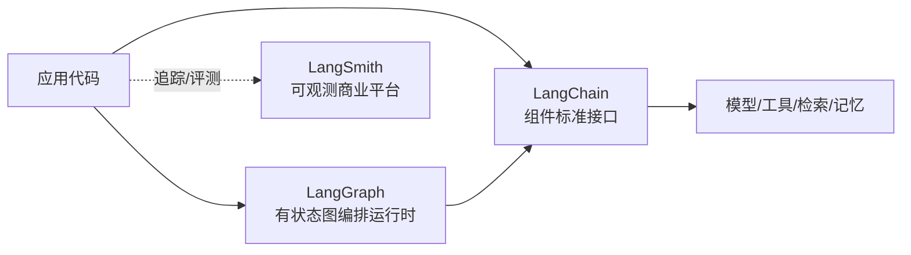

# LangChain

> **一句话**：LangChain 是由 LangChain AI（Harrison Chase 等）于 2022 年 10 月开源的 LLM 应用/agent 开发框架，约 13.9 万 star（GitHub，近似值，2026-06），主语言 Python（另有完整的 JS/TS 版本），MIT 许可证，定位是把模型调用、提示、工具、检索、记忆"胶水"成可组合管线的标准库。

LangChain 是 LLM 应用工程领域被引用和复刻最多的框架。它几乎以一己之力推动了 RAG（检索增强生成）和 ReAct 风格 agent 在工程界的普及，也因为"抽象过重"长期处于争议中心。2025 年 10 月的 **v1.0** 是一次重大重构：核心收窄、agent 运行时统一交给 [LangGraph](/agent/frameworks/langgraph)，老的 `LLMChain`/`AgentExecutor` 体系被废弃。理解今天的 LangChain，需要把它放在 LangChain / LangGraph / LangSmith 三件套里看。

## 定位与设计理念

LangChain 解决的核心痛点是：**LLM 应用的代码里有大量重复的、与业务无关的胶水逻辑**——切换模型供应商、拼提示词、解析结构化输出、调用工具、做向量检索、管理多轮记忆、流式输出与重试。LangChain 把这些都抽象成统一接口，让你在 `gpt`、`claude`、`qwen`、本地模型之间切换时只改一行配置而非重写调用代码。其官方口号已从早期的"composability（可组合）"演进为 2026 年的"the agent engineering platform"。

设计理念可概括为三层：

- **标准接口（standard interface）**：对 1000+ 模型供应商、向量库、工具、文档加载器提供统一抽象，可插拔替换。
- **可组合（composable）**：用 LCEL（LangChain Expression Language）把组件用管道符 `|` 串成可运行对象，自动获得批处理、流式、异步、重试等能力。
- **生态分工**：基础组件留在 LangChain；有状态、带分支与循环的复杂编排交给 LangGraph；线上可观测/追踪/评测交给商业产品 LangSmith。



三者关系常被误解为"一个大框架的三个部分"，实则是分工不同的独立工具：LangChain 提供积木与简单 agent，LangGraph 是真正的图状态机运行时（v1.0 后 LangChain 的 agent 底层就跑在 LangGraph 上），LangSmith 是可选的付费观测层。

## 核心抽象与用法

**1）Chat model 与统一调用。** 所有聊天模型实现同一接口，通过 `init_chat_model` 按字符串选型，业务代码与供应商解耦：

```python
from langchain.chat_models import init_chat_model
model = init_chat_model("claude-sonnet", model_provider="anthropic")
model.invoke("用一句话解释 KV cache")
```

**2）LCEL 与 Runnable。** v1.0 把链条统一到 `Runnable` 组合：用 `|` 连接 prompt、model、输出解析器，得到一个同时支持 `invoke / batch / stream / ainvoke` 的可运行对象。老的 `LLMChain`、`SequentialChain` 已废弃。

```python
from langchain_core.prompts import ChatPromptTemplate
from langchain_core.output_parsers import StrOutputParser

prompt = ChatPromptTemplate.from_template("把下面内容翻译成英文：{text}")
chain = prompt | model | StrOutputParser()
chain.invoke({"text": "检索增强生成"})
```

**3）`create_agent` —— 新的 agent 入口。** v1.0 用 `create_agent`（TS 为 `createAgent`）取代了 `AgentExecutor` 和 `create_react_agent` 旧捷径。它构建在 LangGraph 运行时之上，自动获得持久化与状态管理；行为定制从"继承子类"改为传入 **middleware（中间件）数组**，可在调用前后插入摘要、护栏、人审等逻辑。一个 agent 本质是 [agent loop](/harness/agent-loop)：模型决定调用哪个工具 → 执行工具 → 把结果回灌上下文 → 直到给出最终答复。

```python
from langchain.agents import create_agent

def get_weather(city: str) -> str:
    """查询某城市天气。"""
    return f"{city}：晴，26°C"

agent = create_agent(model="claude-sonnet", tools=[get_weather])
agent.invoke({"messages": [{"role": "user", "content": "北京天气怎样？"}]})
```

**4）检索与记忆。** Document loader、text splitter、embedding、vector store、retriever 组成标准 RAG 管线；记忆则通过消息历史与（v1.0 起）LangGraph 的状态/checkpoint 持久化承载。关于工具调用机制本身，见 [工具使用](/agent/tool-use)；多 agent 协作见 [多智能体](/agent/multi-agent)。

## 适用场景与局限

**适合：**

- 快速搭原型、做 PoC：要在多家模型/向量库之间比较或切换时，统一接口省去大量适配代码。
- 标准 RAG 与单 agent 应用：文档加载、切分、检索、工具调用这套"管线活"现成。
- 需要广泛集成：1000+ 现成 integration 是其最大护城河，省去自己写各种 SDK 封装。

**局限与被批评点：**

- **抽象过重、调试困难**：层层包装让真实发给模型的提示词、参数和控制流变得不透明，出错时难定位；这是社区最集中的批评。
- **依赖臃肿、版本动荡**：历史上 API 频繁 breaking change，文档与代码脱节，升级成本高。v1.0 的重构正是对此的回应——但也意味着大量 v0.x 教程已过时。
- **复杂控制流力不从心**：需要循环、分支、人审、长期状态时，高层抽象反而碍事，官方因此另起 LangGraph。
- **隐性商业引导**：观测/评测能力倾向引导到付费的 LangSmith，而非纯 Pythonic 的本地方案。

一个务实的判断：**做简单管线和原型用 LangChain 很省事；做生产级、控制流复杂的 agent，直接用 LangGraph 或更轻的自研 loop 往往更可控。** 不少团队也选择"只借 LangChain 的 integration，编排自己写"。

## 与同类对比

| 框架 | 定位 | 抽象层次 | 适合场景 |
| --- | --- | --- | --- |
| **LangChain** | 组件胶水层 + 简单 agent | 高（被批过重） | 原型、RAG、广集成 |
| [LangGraph](/agent/frameworks/langgraph) | 有状态图编排运行时 | 中（显式控制流） | 复杂、可控的生产 agent |
| [LlamaIndex](/agent/frameworks/llamaindex) | 数据/检索为中心 | 中 | RAG、知识库、文档问答 |
| [AutoGen](/agent/frameworks/autogen) | 多 agent 会话编排 | 中 | 多角色协作、对话式工作流 |
| [CrewAI](/agent/frameworks/crewai) | 角色化多 agent | 中高 | role/task 风格团队编排 |
| [Claude Agent SDK](/agent/frameworks/claude-agent-sdk) | 厂商原生 agent 框架 | 低-中 | 贴合 Claude 的工具/文件/代码 agent |

定性地说：LangChain 是"全家桶起点"，胜在生态广度；要控制流就上 LangGraph；偏数据检索可选 LlamaIndex；多 agent 协作看 AutoGen/CrewAI；想绑定特定厂商能力则用各家原生 SDK。更宏观的 agent 落地框架全景见 [agent 框架总览](/agent/frameworks/)。

## 参考链接

- LangChain GitHub：<https://github.com/langchain-ai/langchain>
- LangChain 官方文档：<https://python.langchain.com/>
- LangChain v1.0 公告 / 变更日志：<https://changelog.langchain.com/>
- LangChain 产品页：<https://www.langchain.com/langchain>
- Wikipedia: LangChain：<https://en.wikipedia.org/wiki/LangChain>
