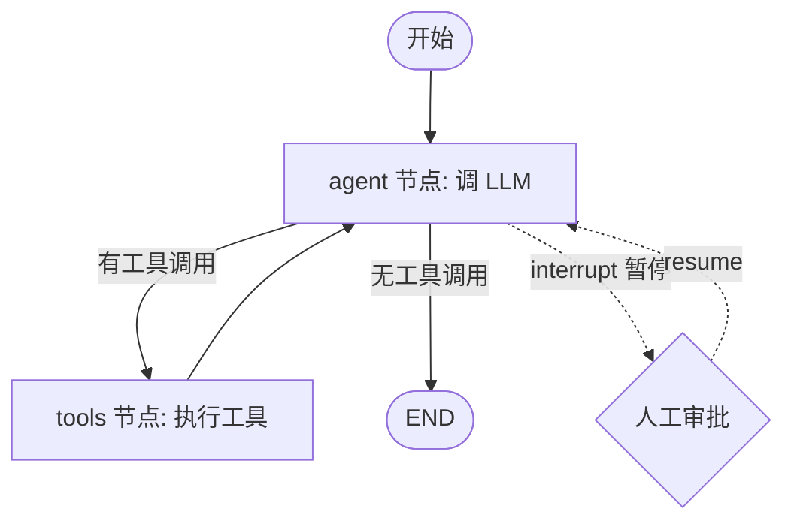

# LangGraph

> **一句话**：LangGraph 是 LangChain 团队 2024 年 1 月推出的低层有状态 agent 编排框架，用「图（节点 / 边 / 共享状态）」建模可循环、可持久化、可 human-in-the-loop 的工作流，约 3.4 万 star（GitHub 近似值），主语言 Python，核心库 MIT 许可证。

机构 LangChain（langchain-ai）/ 首发 2024 年 1 月 22 日 / 约 3.4 万 star（近似）/ 主语言 Python / 许可证 MIT（核心库 `langgraph`、`langchain-core`；但部署用的 `langgraph-api` Server 运行时为 Elastic License 2.0，生产部署需商业 key）。

## 定位与设计理念

LangChain 早期的 `Chain` / `AgentExecutor` 抽象本质是「线性流水线」，难以表达三类真实 agent 需求：在「思考—调用工具—观察」之间循环、把执行过程暂停下来等人审批、以及崩溃后从断点恢复。LangGraph 的核心判断是：把 agent 工作流建模为**有向图**而非链——允许带环、显式管理「应用状态」、并能在任意节点暂停 / 恢复。

它刻意定位为**低层（low-level）、可控**框架，而非「一行代码出 agent」的高层封装。LangGraph 不替你决定 prompt 怎么写、agent 该有几步，而是提供一套确定性的运行时原语，让你精确控制控制流与状态流转。这与 CrewAI / AutoGen 这类「角色协作」抽象形成对比：后者关心「谁和谁对话」，LangGraph 关心「状态如何在图上演化」。

与 LangChain 的关系在 2025 年进一步明确：**LangChain（高层 agent 接口）如今运行在 LangGraph 的持久化运行时之上**，借此获得 checkpointing、rewind、human-in-the-loop 等能力。LangGraph 1.0 于 2025 年 10 月正式 GA，原先的 `langgraph.prebuilt`（如 ReAct agent）迁移到 `langchain.agents`——可以理解为：LangGraph 是底盘，LangChain 是上层易用 API。二者可独立使用，也可叠加。

## 核心抽象与用法

LangGraph 的全部能力建立在四个概念上：**State（共享状态）、Node（节点）、Edge（边）、Checkpointer（检查点）**。

- **State**：一个贯穿全图的共享数据结构（通常是 `TypedDict` 或 Pydantic 模型）。每个节点读取当前 state、返回一个「增量更新」。通过 `Annotated` + reducer 函数（如 `add_messages`、`operator.add`）定义字段如何合并——这是处理并发分支与消息追加的关键。
- **Node**：一个普通函数 `(state) -> partial_state`，承载实际计算（调 LLM、调工具、写库）。
- **Edge**：决定下一步走向。普通边是固定跳转；**条件边（conditional edge）** 接收 state 返回下一个节点名，从而实现分支与循环——agent 的「再想一轮还是结束」就是一条指向自身或 `END` 的条件边。
- **Checkpointer**：在 `.compile(checkpointer=...)` 时注入。每执行完一个 super-step，运行时把 state 快照写入存储（`InMemorySaver` / `SqliteSaver` / `PostgresSaver` 等）。配合 `thread_id`，同一会话可多轮续接、可回溯到任意历史检查点（time-travel），也是崩溃恢复与 human-in-the-loop 的基础。

一段最小可循环 agent 的伪代码：

```python
from langgraph.graph import StateGraph, START, END
from langgraph.checkpoint.memory import InMemorySaver
from typing import Annotated, TypedDict
from langgraph.graph.message import add_messages

class State(TypedDict):
    messages: Annotated[list, add_messages]  # reducer：自动追加而非覆盖

def call_model(state: State):
    return {"messages": [llm.invoke(state["messages"])]}

def route(state: State):                      # 条件边：要不要继续调工具
    return "tools" if has_tool_call(state["messages"][-1]) else END

g = StateGraph(State)
g.add_node("agent", call_model)
g.add_node("tools", tool_node)
g.add_edge(START, "agent")
g.add_conditional_edges("agent", route)       # agent -> tools 或 END
g.add_edge("tools", "agent")                  # 回到 agent，形成环

app = g.compile(checkpointer=InMemorySaver())
app.invoke({"messages": [...]}, config={"configurable": {"thread_id": "u1"}})
```

**Human-in-the-loop** 通过 `interrupt()` 实现：节点内调用 `interrupt(payload)` 会暂停图、把状态落盘并把 payload 抛回调用方；人工审批后用 `Command(resume=...)` 恢复，运行时凭 checkpoint 从断点继续，无需重跑前序节点。LangGraph 0.4 起还支持中断的自动浮现，让长流程更安全。

控制流上的图结构：



除图（Graph API）外，LangGraph 还提供 **Functional API**（`@entrypoint` / `@task` 装饰器），让你用近乎普通函数的写法获得同样的持久化与 HITL 能力，适合不想显式画图的场景。

## 适用场景与局限

**适合**：需要长时运行、跨多轮 / 多天保持状态的 agent；需要确定性控制流与人工审批关卡的高风险流程（金融、运维、代码改写）；需要崩溃恢复、可观测、可回溯调试的生产级 agent。Uber、LinkedIn、Klarna、Replit 等已在生产中使用。它天然适合做 [multi-agent](/agent/multi-agent) 编排（supervisor / swarm 等模式有官方封装），也常作为 [agentic RL](/agent/agentic-rl/) 中 rollout 环境的工程载体。

**局限**：学习曲线偏陡——state / reducer / 条件边 / checkpointer 的心智模型需要时间，简单单轮任务用它属于过度工程。其「低层」定位意味着 prompt、记忆策略、错误处理都要自己设计。生产托管（LangGraph Platform / Server 运行时）走 Elastic License 2.0 且需付费 key，自建持久化与部署则完全免费但需自己运维。版本演进较快，0.x 期间 API 有过调整（升级前需留意迁移说明）。

## 与同类对比

| 框架 | 核心抽象 | 控制流 | 持久化 / HITL | 定位 |
| --- | --- | --- | --- | --- |
| **LangGraph** | 图（状态 / 节点 / 边）| 显式、可循环、可分支 | 内置 checkpointer + interrupt | 低层、可控、有状态运行时 |
| [LangChain](/agent/frameworks/langchain) | Chain / Runnable / Agent | 高层封装，链式为主 | 依托 LangGraph 运行时 | 上层易用 API + 集成生态 |
| [AutoGen](/agent/frameworks/autogen) | 可对话 agent | 多 agent 自由对话 | 较弱 | 对话式多 agent |
| [CrewAI](/agent/frameworks/crewai) | 角色 / 任务 / Crew | 角色协作、流程编排 | 有限 | 角色化协作，上手快 |

定性地说：要「快速搭一个会聊天的多 agent」选 CrewAI / AutoGen；要「对控制流与状态有外科手术级掌控、并要上生产」选 LangGraph；LangChain 则是它之上更友好的封装层与组件库。

## 参考链接

- LangGraph GitHub：<https://github.com/langchain-ai/langgraph>
- LangGraph 官方文档：<https://langchain-ai.github.io/langgraph/>
- LangGraph 产品页（含定位与企业案例）：<https://www.langchain.com/langgraph>
- LangGraph 1.0 GA 公告（2025-10）：<https://changelog.langchain.com/announcements/langgraph-1-0-is-now-generally-available>
- 「Introducing LangGraph」首发公告（2024-01）：<https://changelog.langchain.com/announcements/week-of-1-22-24-langchain-release-notes>
