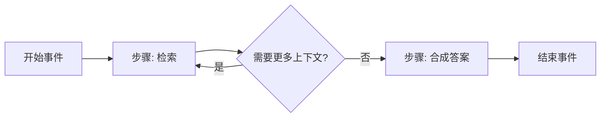

# LlamaIndex

> **一句话**：LlamaIndex（前身 GPT-Index）是 run-llama 团队 2022 年底开源的「数据框架」，以把 LLM 连接到私有数据为核心（索引 / 检索 / query engine），近年沿着 RAG 向 agent 与事件驱动 workflow 扩展；Python 主语言、MIT 许可证、GitHub 约 5 万 star（截至 2026 年）。

LlamaIndex 与 [LangChain](/agent/frameworks/langchain) 几乎同期诞生，但起点完全不同：LangChain 从「链式编排 LLM 调用」出发，LlamaIndex 从「如何让 LLM 读懂你的数据」出发。它最早叫 GPT-Index，由 Jerry Liu 于 2022 年 11 月创建，2023 年初成立公司（Greylock 领投种子轮）。今天它仍是 RAG / 检索增强场景里最常被提及的两个框架之一。要判断 RAG 之外还该不该上检索，可对照 [Skills vs RAG vs 微调](/skills/vs-rag-finetune)。

## 定位与设计理念

LlamaIndex 的核心命题：通用 LLM 的知识被训练数据冻结，而企业价值往往在私有、实时、非结构化的数据里（PDF、数据库、Notion、邮件、代码仓）。把这些数据「接进」LLM 的标准范式是 RAG——先索引，再按 query 检索相关片段，拼进 prompt 让 LLM 作答。LlamaIndex 把这条链路上的每个环节都抽象成可替换组件，并提供从「五行代码跑通」到「逐层定制」的渐进式 API。

设计上有几条主线：

- **数据优先**：大量精力投在数据接入（社区 LlamaHub 提供数百个 data loader / reader）和文档解析上。其商业产品 LlamaParse / LlamaCloud 专攻复杂 PDF、表格、扫描件的高保真解析，这也是官方近年把自己重新定位为「文档 agent 与 OCR 平台」的原因——解析质量直接决定 RAG 上限。
- **检索是一等公民**：索引结构、检索策略、重排序、响应合成都是显式可配的对象，而非埋在黑盒里。
- **从 RAG 走向 agent**：当单轮检索不够用（需要多步推理、调用工具、多数据源路由）时，框架提供 agent 与 workflow 抽象，把检索器封装成工具交给 agent 调度。

## 核心抽象与用法

自底向上理解几个关键概念：

- **Document / Node**：`Document` 是原始数据单元；经分块（chunking）切成 `Node`，是索引与检索的最小粒度，携带文本、元数据与关系。
- **Index（索引）**：把 Node 组织成可查询结构。最常用的是 `VectorStoreIndex`（向量索引），另有 `SummaryIndex`、`KeywordTableIndex`、`PropertyGraphIndex`（知识图谱）等。索引可持久化到 Pinecone、Qdrant、Weaviate 等向量库。
- **Retriever（检索器）**：给定 query 返回相关 Node，封装 top-k、混合检索、metadata 过滤等策略。
- **Query Engine（查询引擎）**：端到端的「问→答」接口，内部串起检索器 + 响应合成器（response synthesizer），是 RAG 的高层封装。
- **Agent / Tool**：`FunctionAgent`（基于函数调用）、`ReActAgent`（ReAct 范式）等，把 query engine、外部 API 等封装成 `Tool` 供其自主调用。
- **Workflow**：事件驱动的编排原语，详见下文。

最短的 RAG 示例只需几行：

```python
from llama_index.core import VectorStoreIndex, SimpleDirectoryReader

# 读取目录下文档 → 分块 → 嵌入 → 建向量索引
documents = SimpleDirectoryReader("./data").load_data()
index = VectorStoreIndex.from_documents(documents)

# 构建查询引擎并提问（内部完成检索 + 合成）
query_engine = index.as_query_engine()
print(query_engine.query("这份合同的违约责任怎么约定？"))
```

需要多步推理时，把检索器升级为 agent 工具：

```python
from llama_index.core.tools import QueryEngineTool
from llama_index.core.agent.workflow import FunctionAgent
from llama_index.llms.openai import OpenAI

tool = QueryEngineTool.from_defaults(query_engine, name="contract_kb",
                                     description="查询合同知识库")
agent = FunctionAgent(tools=[tool], llm=OpenAI(model="gpt-4o"))
response = await agent.run("对比两份合同的赔偿上限，给出风险更高的一方")
```

**Workflows 1.0**（2025 年 6 月 30 日发布）是近两年最重要的演进。它把 agent 编排抽象成事件驱动图：用 `@step` 装饰器声明步骤，每个步骤消费一种 `Event`、发出新 `Event`，由框架按事件流异步调度，支持分支、循环、并行、跨步骤共享的 `Context` 状态。它已从核心库拆为独立包（`pip install llama-index-workflows`，TS 端 `@llamaindex/workflow-core`），1.0 还带来类型化状态、资源注入与 OpenTelemetry 可观测。其设计哲学与 [LangGraph](/agent/frameworks/langgraph) 的「图 + 状态」一脉相承，但用事件而非显式边来表达控制流：



在 Workflow 之上，`AgentWorkflow` 进一步封装多 agent 协作与任务交接（handoff），让一组专精 agent 互相移交控制权。

## 适用场景与局限

**适合**：

- 知识库问答、文档检索、企业内部 RAG，尤其当数据是大量复杂 PDF / 扫描件、解析质量是瓶颈时（叠加 LlamaParse）。
- 需要快速从原型到生产、又希望在检索策略上深度调优的团队——它在「检索这一段」的可配置性强于多数通用 agent 框架。

**局限**：

- **抽象层偏厚**：索引 / 检索器 / 合成器 / engine 多层封装在简单场景下显得啰嗦，调试时要穿透多层默认值。
- **复杂 agent 编排的成熟度**：纯 agent / 多 agent 控制流的生态与心智份额上，LangGraph、[AutoGen](/agent/frameworks/autogen) 等更聚焦；LlamaIndex 的优势始终在「数据接进来」这一侧。
- **版本碎片化**：早期 `llama-index` 拆成 core + 大量集成子包，导入路径与版本管理需留意；Workflow 又独立成包，升级时易踩兼容坑。
- **检索≠万能**：RAG 解决的是「知识注入」，对模型本身能力短板（推理、特定风格）无能为力，这类需求应走微调，见 [Skills vs RAG vs 微调](/skills/vs-rag-finetune)。

## 与同类对比

| 维度 | LlamaIndex | LangChain / LangGraph | AutoGen / CrewAI |
| --- | --- | --- | --- |
| 出发点 | 数据 / 检索 | 通用编排 / 状态图 | 多 agent 对话协作 |
| RAG 能力 | 强（一等公民，含解析） | 中（组件齐但偏胶水） | 弱（需自接） |
| Agent 编排 | 中（Workflow / AgentWorkflow） | 强（LangGraph 图） | 强（角色 / 群聊） |
| 文档解析 | 强（LlamaParse / LlamaCloud） | 弱 | 弱 |
| 上手成本 | 低（几行跑 RAG），深度定制偏厚 | 中高 | 中 |

定性地说：**先选 LlamaIndex 当你的核心难点是「把复杂私有数据高质量接进 LLM」**；当核心难点变成「复杂多步 / 多 agent 控制流」，再评估是否引入 [LangGraph](/agent/frameworks/langgraph) 或专门的多 agent 框架，两者也可组合使用（用 LlamaIndex 做检索层、外层框架做编排）。更广的框架全景见 [Agent 框架总览](/agent/frameworks/)，工具调用机制见 [工具调用](/agent/tool-use)。

## 参考链接

- LlamaIndex GitHub 仓库：<https://github.com/run-llama/llama_index>
- 官方文档：<https://docs.llamaindex.ai/>
- Workflows 1.0 发布公告（2025-06-30）：<https://www.llamaindex.ai/blog/announcing-workflows-1-0-a-lightweight-framework-for-agentic-systems>
- llama-index-workflows（PyPI）：<https://pypi.org/project/llama-index-workflows/>
- LlamaIndex 官网与 LlamaCloud / LlamaParse：<https://www.llamaindex.ai/>
