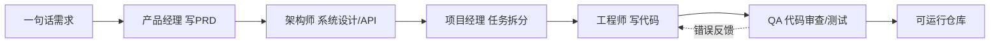

# MetaGPT

> **一句话**：MetaGPT 把人类软件公司的标准作业流程（SOP）编码进多 agent 协作，用 PM / 架构师 / 工程师等角色分工把"一句话需求"流水线式地展开成可运行代码，是"角色分工 + 标准流程"路线的代表作。
> 提出年份：2023（arXiv:2308.00352，2023 年 8 月首发） · 机构/团队：DeepWisdom（深度赋智） · 会议/来源：ICLR 2024 Oral

MetaGPT 由 DeepWisdom（深度赋智）团队牵头开源，论文《MetaGPT: Meta Programming for A Multi-Agent Collaborative Framework》于 2023 年 8 月首发（arXiv:2308.00352），并入选 ICLR 2024 Oral。GitHub 仓库（现归属 FoundationAgents 组织，旧地址 geekan/MetaGPT）截至 2026 年中约 6.9 万 star，是开源 agent 框架里 star 最高的项目之一；主语言 Python，MIT 许可证。其衍生工作 Data Interpreter（arXiv:2402.18679）把同一套思路推向数据科学领域。

## 定位与设计理念

MetaGPT 解决的核心痛点是：把多个 LLM **朴素地串成对话**（chat-based multi-agent）时，错误会沿对话链级联放大，产生"级联幻觉"（cascading hallucination），复杂任务很快失控。它的答案是引入人类组织里被反复验证的协作机制——**标准作业流程（SOP）**。

设计理念可以浓缩成框架自己的口号：

$$\text{Code} = \text{SOP}(\text{Team})$$

也就是说，软件不是某个全能 agent"凭空想出来"的，而是一支被 SOP 规约的团队按流水线产出的结果。MetaGPT 模拟一家软件公司：产品经理写 PRD、架构师设计系统与 API、项目经理拆任务、工程师写代码、QA 审查。每个角色：

- 只关注自己职责内的**结构化产出**（PRD、设计文档、API spec、代码文件），而非自由对话；
- 通过**标准化的中间产物（artifacts）**而非纯自然语言彼此交接，下游可以校验上游的结构化输出，从而在流程中拦截错误；
- 遵循固定的工序顺序，把"复杂软件开发"分解为一条可预测的装配线。

这条路线与 [AutoGen](/agent/frameworks/autogen)、[CrewAI](/agent/frameworks/crewai) 等"通用多 agent 编排"形成对比：MetaGPT 的多 agent 不是开放式自由协商，而是**强约束、面向特定领域（软件开发）的角色流水线**。

## 核心抽象与用法

MetaGPT 的代码模型由四个基本概念组成：

- **Action（动作）**：最小执行单元，封装一次有明确输入输出的 LLM 调用或工具调用，例如 `WritePRD`、`WriteDesign`、`WriteCode`、`WriteCodeReview`。
- **Role（角色）**：一个 agent。它持有若干 Action、一段 `profile`（人设/职责描述），并通过 `_observe → _think → _act` 循环从环境里读取消息、决定执行哪个 Action。内置角色包括 `ProductManager`、`Architect`、`ProjectManager`、`Engineer`、`QaEngineer`。
- **Environment（环境）**：共享的消息总线。角色把产出作为消息发布到环境，并按"订阅关系"（`watch`）拉取自己关心的上游消息，实现解耦的发布-订阅式协作。
- **Team（团队）**：把多个 Role 装进同一个 Environment，注入预算与初始需求后驱动整体运行。

最小用法——一行需求生成整个仓库：

```python
from metagpt.software_company import generate_repo

repo = generate_repo("写一个带计分的 2048 网页小游戏")
print(repo)  # 产出 PRD、系统设计、API、代码文件的完整仓库
```

或用命令行：

```bash
metagpt "写一个带计分的 2048 网页小游戏"
```

要自定义角色与流水线，可以组合 Action 和 Role：

```python
from metagpt.roles import Role
from metagpt.actions import Action

class WriteSpec(Action):
    PROMPT = "根据需求写出技术规格：{requirement}"
    async def run(self, requirement: str):
        return await self._aask(self.PROMPT.format(requirement=requirement))

class Analyst(Role):
    def __init__(self):
        super().__init__()
        self.set_actions([WriteSpec])
        self._watch([UserRequirement])  # 订阅需求消息
```

整体的协作流可以表示为：



论文中的「软件公司多 agent 示意图」更完整地展示了各角色（产品经理、架构师、项目经理、工程师、QA）如何按 SOP 分工、并以结构化中间产物（PRD、设计、API、代码）逐级交接：


> 图源：Hong et al., *MetaGPT: Meta Programming for A Multi-Agent Collaborative Framework*, arXiv:2308.00352（用于学习注解，版权归原作者）

**Data Interpreter** 是同一框架内面向数据科学的角色与流程：它用层次化图结构做**动态规划**（边执行边根据数据反馈调整计划）、运行期动态接入工具、并通过执行反馈识别逻辑不一致、记录经验以提效——本质上是把 SOP 思想从"软件公司"迁移到"数据分析任务"。

## 适用场景与局限

适用场景：

- **端到端原型/脚手架生成**：从需求一步到 PRD、设计、代码的快速 demo，省去从零搭项目的样板工作；
- **教学与研究**：作为"SOP 驱动多 agent"的标准范式，便于复现和对比；
- **结构化产物明确的领域**：流程越像装配线（输入输出可结构化、工序固定），MetaGPT 的优势越明显，Data Interpreter 在数据科学任务上的增益就是例证。

局限：

- **流程僵硬**：SOP 是优点也是枷锁。当任务不匹配"软件公司"模板，或需要灵活探索时，固定工序反而成为约束；
- **生成质量天花板**：一句话生成完整仓库适合中小规模 demo，面对大型真实代码库、复杂依赖与长期维护，产出往往需要大量人工修补，难以直接投产；
- **缺乏强交互式编辑闭环**：相比 [Claude Code](/agent/frameworks/claude-code)、[Codex](/agent/frameworks/codex) 这类深度集成仓库读写、命令执行与人类介入的 [agent loop](/harness/agent-loop)，MetaGPT 更偏"一次性生成"而非"在真实代码库里持续迭代"；
- **成本与可控性**：多角色多轮 LLM 调用累积 token 开销不低，且角色越多越难调试单步行为。

## 与同类对比

| 框架 | 协作范式 | 领域取向 | 编排灵活度 | 典型用法 |
| --- | --- | --- | --- | --- |
| **MetaGPT** | SOP + 固定角色流水线 | 软件开发 / 数据科学（DI） | 低（强约束） | 一句话生成仓库 |
| [AutoGen](/agent/frameworks/autogen) | 可编程对话 + 群聊 | 通用 | 高 | 自定义会话式多 agent |
| [CrewAI](/agent/frameworks/crewai) | 角色 + 任务（process） | 通用业务流程 | 中 | 轻量角色协作 |
| [LangGraph](/agent/frameworks/langgraph) | 显式状态图 | 通用 | 很高 | 精细控制有环工作流 |

定性地说：若你要的是**开箱即用、面向软件开发的角色流水线**，MetaGPT 最对口；若你要**自由编排任意领域的多 agent 协作**，AutoGen / CrewAI / LangGraph 给的自由度更高，但需要自己设计协作协议。更上层的多 agent 概念与权衡可参考 [多 agent 协作](/agent/multi-agent)。

## 参考链接

- MetaGPT 论文（ICLR 2024 Oral）：<https://arxiv.org/abs/2308.00352>
- Data Interpreter 论文：<https://arxiv.org/abs/2402.18679>
- GitHub 仓库：<https://github.com/FoundationAgents/MetaGPT>
- 官方文档：<https://docs.deepwisdom.ai/>
- OpenReview 评审页：<https://openreview.net/forum?id=VtmBAGCN7o>
