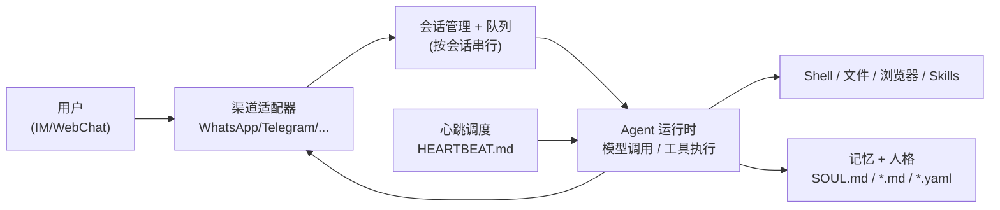

# OpenClaw

> **一句话**：OpenClaw（前身 Clawdbot / Moltbot）是 Peter Steinberger 于 2025 年底发起的开源**通用自治个人 agent**，以常驻 Gateway daemon 长期运行、接管你的各类聊天 App、靠定时心跳主动干活——它不是 coding agent，而是"住在你机器上、住在你 IM 里"的私人助理。

OpenClaw 是社区项目，发起者为 Austrian 开发者 Peter Steinberger（PSPDFKit 创始人）。代码托管在 GitHub `openclaw/openclaw`，采用 **MIT 许可证**，主体用 TypeScript / Node.js 编写。项目首发于 **2025 年 11 月**，最初名为 **Clawdbot**，2026 年 1 月因商标问题改名 **Moltbot**，并于 **2026 年 1 月 29 日**正式定名 **OpenClaw**。它在 2026 年初成为现象级开源项目，star 数在数周内增长极快——不同时间点的快照差异很大（从十几万到三十多万都有报道），本文撰写时（2026-06）GitHub 显示约 **37 万 star**；由于增长仍在持续，请以仓库实时数字为准，"几周冲到 N 万 star""某大佬背书"之类营销话术不必当真。

## 它是什么、能做什么

理解 OpenClaw 的关键，是把它和 Claude Code / Codex 这类 **coding agent** 区分开。后者围绕"在仓库里写代码、跑测试、提 PR"这一回路设计；OpenClaw 的定位是**通用个人/自治 agent**——一个长期在线、有身份和记忆、能主动联系你的数字管家。仓库自我描述为"Personal AI assistant you run on your own devices"。

它把 LLM 推理接到一组真实执行面（execution surfaces）上：

- **Shell 命令执行**与**文件系统读写**——本机层面的全权操作；
- **浏览器自动化**（headless Chrome），可登录网站、抓取、填表；
- **多 IM 平台网关**：原生对接 WhatsApp、Telegram、Slack、Discord、Signal、iMessage、Microsoft Teams、Matrix、Feishu、LINE、WeChat、QQ 等 20+ 渠道，外加内置 WebChat；
- **Skills（技能）**：以 Markdown 描述的可插拔能力包，覆盖 Gmail、Google Workspace、GitHub、智能家居、Spotify、网页搜索等，社区注册表 **ClawHub** 已收录上万个（早期统计 1 万+，仍在快速增长）。

注意 Skill 的形态与 [Skills（技能）章节](/skills/) 描述的"渐进披露 + Markdown 指令"范式一脉相承：一个 skill 就是一个含 `SKILL.md` 的文件夹，可附带脚本与模板。

## 工作形态与典型用法

OpenClaw 的核心是一个**长生命周期的 Node.js 进程**——Gateway。常见上手路径：

```bash
# 引导配置，并把 Gateway 安装成 launchd/systemd 用户级守护进程
openclaw onboard --install-daemon

# 查看守护进程状态
openclaw gateway status

# 前台调试模式运行（控制面默认监听 18789 端口）
openclaw gateway --port 18789 --verbose
```

装好后，你**主要通过聊天来用它**：在 Telegram / WhatsApp / iMessage 里直接发消息,它在后台执行任务并把结果回报给你——不需要守在终端前。`@BotFather` 拿 token 配 Telegram、扫码配 WhatsApp 都是典型流程。

与一次性 coding agent 最不同的一点是**主动性来自定时心跳（heartbeat）**：Gateway 默认每 30 分钟触发一次心跳（用 Anthropic OAuth 时约每小时一次）。每次心跳，agent 读取工作区里的 `HEARTBEAT.md` 检查清单，判断有无待办需要行动，若有就主动给你发消息，否则回 `HEARTBEAT_OK`。这让它能做"盯着某个网页有变化就通知我""每天早上汇总日程"这类**无人值守的周期任务**。

agent 的"人格"和记忆也都是工作区里的纯文本：`~/.openclaw/workspace` 下的 `SOUL.md`（身份、性格、行为准则）、`AGENTS.md`、`TOOLS.md` 等会被注入提示词，对话历史与长期记忆以 Markdown / YAML 落盘在本机——可读、可 diff、可版本管理。



## 架构与安全要点

Gateway 在单个 Node.js 进程内整合若干子系统：**渠道适配器** → **会话管理器** → **队列**（同一会话内串行执行，避免并发踩踏）→ **Agent 运行时**（模型调用、工具执行、记忆持久化），外加一个 WebSocket 控制面（默认 18789 端口）。它**model-agnostic**：可走 Anthropic / OpenAI / Google 等云端 API，也可经 Ollama 接本地模型，官方建议优先选用你信任的 provider 的当前旗舰模型。

安全是这套形态的核心矛盾：一个能执行任意 shell、读写文件、还从公网 IM 接收消息的常驻进程，攻击面天然很大。OpenClaw 的官方原则是**把所有 inbound DM 当作不可信输入**（防 prompt injection），并为非主会话提供 **sandbox 配置（默认 Docker 后端）**做隔离；社区也普遍建议以非 root 运行、最小权限、严格管控配对（pairing）审批。这些隔离与权限的通用原理见 [沙箱与工具执行](/harness/sandbox)，OpenClaw 与其它 harness/agent 系统在设计范式上的横向对比见 [代表系统对比](/harness/systems)，此处不重复展开。需要强调的是：把它指向生产机器或敏感账号前，务必想清楚"一条恶意 DM 能让它做什么"。

## 适用场景与局限

适合：

- 想要一个**长期在线、主动汇报**的私人助理（监控、提醒、日报、信息聚合）；
- 重度 IM 用户，希望在 WhatsApp/Telegram 里直接"指挥"一台机器干活；
- 愿意自托管、看重数据留在本机、喜欢"配置即 Markdown"的可控玩法。

局限与注意：

- **安全风险显著**：能力越通用，被滥用/被注入的后果越大，不建议裸跑在重要环境；
- **生态新、变动快**：名字换过三次、架构频繁重构，star 与 skill 数量都在剧烈波动，文档与第三方教程时效性参差；
- **不是 coding agent**：写仓库代码、跑 CI、提 PR 这类工作，[Claude Code](/agent/frameworks/claude-code)、[Codex](/agent/frameworks/codex) 更对口；OpenClaw 的强项是"跨平台、长期、自治"的个人自动化；
- **可靠性依赖底层模型与 skill 质量**，无人值守的心跳任务需要保守的权限边界与人工兜底。

## 参考链接

- OpenClaw GitHub 仓库：<https://github.com/openclaw/openclaw>
- ClawHub 技能注册表 / awesome 列表：<https://github.com/VoltAgent/awesome-openclaw-skills>
- All Things Open《Getting started with OpenClaw》：<https://allthingsopen.org/articles/getting-started-openclaw-autonomous-agent>
- Milvus《OpenClaw (formerly Clawdbot, Moltbot) Explained》：<https://milvus.io/blog/openclaw-formerly-clawdbot-moltbot-explained-a-complete-guide-to-the-autonomous-ai-agent.md>
- Turing Post《AI 101: OpenClaw Explained》：<https://www.turingpost.com/p/openclaw>
