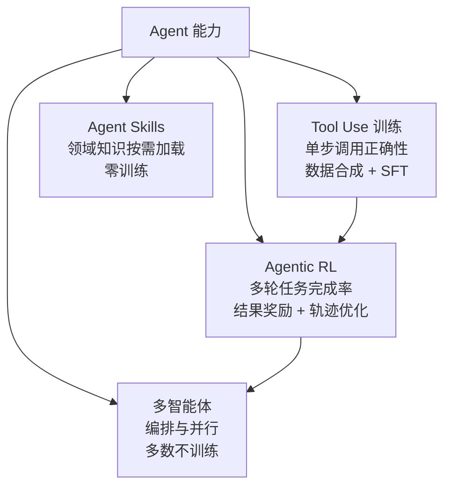

# Agent 与 Skill 总览

> **一句话**：让模型不只是"回答"，而是"行动"：发起工具调用、消化环境反馈、完成多步任务。本版块讲数据怎么造、模型怎么训、多个 agent 怎么组织。

## 从"生成"到"行动"

一次 agent 任务的最小循环：模型读入任务与工具定义 → 生成工具调用 → 执行层运行工具并把结果拼回上下文 → 模型继续生成，直到给出最终答案。与普通对话相比有两个结构性差异：

1. **序列里混入了非模型生成的 token**（工具返回、环境观测），训练时必须 mask；
2. **任务成败要等整条轨迹结束才能判定**，奖励稀疏且延迟。

这两点分别决定了 agent 的 SFT 数据格式（见 [Tool Use 训练](/agent/tool-use)）和 RL 算法适配（见 [Agentic RL](/agent/agentic-rl/)）。执行循环、沙箱等工程基础设施在 [Harness 版块](/harness/)（[agent loop](/harness/agent-loop)、[沙箱](/harness/sandbox)），本版块聚焦算法与训练。

## 版块地图

四个子方向构成一条能力阶梯：先让模型**单步调用正确**（schema 遵循、参数抽取、该拒绝时拒绝），再用 RL 优化**多轮任务成功率**，最后在系统层组织**多个 agent 并行协作**；[Skills](/skills/) 则是与训练正交的路线——把领域知识打包成可按需加载的文件，不动权重。

## 与 SFT / RL 版块的关系

Agent 训练没有发明新的优化算法，而是把既有算法用在新的数据与环境上：

| Agent 训练阶段 | 复用的算法 | 不同之处 |
| --- | --- | --- |
| Tool Use SFT | [SFT](/sft/) + [Loss Masking](/sft/loss-masking) | 数据是结构化调用轨迹，正确性可执行验证 |
| 调用偏好优化 | [DPO](/dpo/dpo) | 正确调用 vs 幻觉调用构造偏好对 |
| Agentic RL | [PPO](/rlhf/ppo) / [GRPO](/rlhf/grpo) | episode 含环境步，reward 来自结果验证而非 RM |

换句话说：**算法相同，episode 定义、loss 范围和奖励来源不同**。读本版块前建议先具备 [SFT 总览](/sft/) 与 [RLHF 总览](/rlhf/) 的背景。

## 评测基准盘点

| 基准 | 年份 | 考察什么 | 判定方式 | 特点 |
| --- | --- | --- | --- | --- |
| BFCL | 2024 | 函数调用（单轮到多轮） | AST 匹配 + 可执行验证 | V3 起多轮多步，V4 转向 agentic（搜索、记忆、格式敏感性） |
| τ-bench / τ²-bench | 2024 / 2025 | 工具-Agent-用户三方交互 | 比对数据库终态 | 模拟用户对话；pass^k 衡量多次试验的行为稳定性 |
| SWE-bench Verified | 2024 | 真实软件工程 | 单测通过 | GitHub issue 修复，agentic RL 的主战场之一 |
| WebArena-Lite | 2024 | Web 操作 | 任务结果验证 | 浏览器环境多步任务，WebRL 等工作的训练/评测环境 |

一个共同趋势：评测从"格式对不对"（AST 匹配）演进到"任务成没成"（终态验证），再到"每次都成吗"（τ-bench 的 pass^k——SOTA 模型单次成功率不足 50%，多次全对的比例更低）。这条演进线也正是训练方法从 SFT 走向 RL 的原因。

## 发展脉络

这个方向的演进大致三个阶段。**2023 年解决"会不会调用"**：Toolformer 证明模型可以自监督地学会插入 API 调用，ToolLLM 把训练数据扩到上万个真实 API，AutoGen / MetaGPT 同期开启多 agent 编排。**2024 年解决"数据与评测的可信度"**：APIGen 用"格式 → 执行 → 语义"三级验证把合成数据做成可验证流水线，BFCL / τ-bench 把评测从格式匹配推进到终态验证与稳定性度量。**2025 年起重心转向 RL**：SWE-RL、Search-R1、ReTool 等工作证明以任务结果为奖励的多轮 RL 能大幅超越纯 SFT 路线，agent 能力从"模仿轨迹"走向"环境中习得"。

选型上的粗略结论：单步调用能力靠高质量 SFT 数据就能解决；多轮长程任务的成功率提升主要靠 RL；而当任务规模超过单个上下文的探索容量时，才需要在系统层引入多 agent——它用约一个数量级的 token 成本换并行吞吐，并不总是划算。

## 子主题

| 页面 | 回答的问题 |
| --- | --- |
| [Tool Use 训练](/agent/tool-use) | 怎么教模型正确发起函数调用：数据三条路线 + SFT 细节 |
| [Agentic RL](/agent/agentic-rl/) | 多轮交互任务怎么用 RL 训练：掩码、奖励、课程 |
| [多智能体](/agent/multi-agent) | 多个 agent 怎么分工协作：编排拓扑与 token 经济学 |
| [Agent Skills](/skills/) | 怎么把领域知识打包成可复用、按需加载的技能 |

## 建议阅读顺序

按依赖关系：[Tool Use 训练](/agent/tool-use)（一切的基础）→ [Agentic RL](/agent/agentic-rl/)（需要 [GRPO](/rlhf/grpo) 背景）→ [多智能体](/agent/multi-agent)（系统层，几乎不涉及训练）。如果你关心的是"不训练怎么增强 agent"，直接看 [Skills](/skills/) 与 [Skills vs RAG vs 微调](/skills/vs-rag-finetune)。
