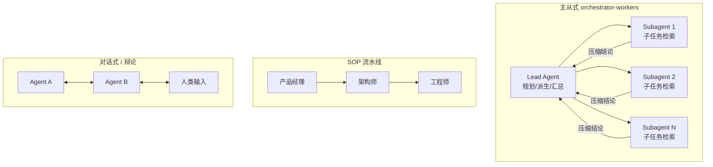

# 多智能体（Multi-Agent）

> **一句话**：用多个分工不同的 agent 协作完成超出单 agent 上下文与吞吐边界的任务；核心设计维度是编排拓扑、上下文隔离与 token 预算。代表系统：*AutoGen*（2023）、*MetaGPT*（2023）、Anthropic Research（2025）。
>
> 前置阅读：[Agent 总览](/agent/)、[Tool Use 训练](/agent/tool-use)

## 直觉与动机

单 agent 的瓶颈往往不是"智力"而是**上下文经济学**。Anthropic 对其多 agent 研究系统的分析给出一个关键观察：在内部研究评测上，**token 用量是解释性能方差的主导因素**——agent 任务约消耗普通 chat 的 4 倍 token，多 agent 系统约 15 倍。多 agent 的本质是：当单个上下文窗口装不下任务所需的探索量时，用多个并行上下文换取总信息吞吐。

具体收益有三：

1. **上下文隔离**：每个 subagent 自带干净窗口，探索过程的大量中间 token（搜索结果、试错记录）不挤占主线上下文，只把压缩后的结论回传。
2. **并行加速**：广度型任务（多方向检索、多模块排查）同时展开；Anthropic 报告并行工具调用使复杂查询的研究时间最多缩短 90%。
3. **角色专业化**：每个 agent 的 system prompt 只描述单一职责，比一个巨型 prompt 承载所有职责更可控；MetaGPT 更进一步，把人类标准作业流程（SOP）直接编码为角色流水线。

代价同样明确：token 成本数倍到十几倍、错误跨 agent 传播导致调试困难、协调本身有开销。**只有任务可并行分解、且任务价值能覆盖 token 成本时，多 agent 才划算**——Anthropic 的多 agent 系统在内部研究评测上超过单 agent（Claude Opus 4）达 90.2%，正是建立在"开放式研究"这种典型广度型任务上。

> 图源：Wu et al., *AutoGen: Enabling Next-Gen LLM Applications via Multi-Agent Conversation*, arXiv:2308.08155（用于学习注解，版权归原作者）

## 方法与公式

多智能体没有统一的损失函数，方法层面是编排拓扑、通信协议与（少数情况下的）训练方案的组合。

### 三类主要编排拓扑

**主从式（orchestrator-workers）**。lead agent 负责分析任务、拆解子问题、并行派生 subagent、最后汇总合成。Anthropic Research 功能即此架构：lead（Claude Opus 4）用扩展思考做规划，并行派生多个 subagent（Claude Sonnet 4）分头检索。适合广度型、可分解、子任务间弱耦合的任务。

**对话式 / group chat（AutoGen, Microsoft, 2023）**。所有 agent 都是可对话（conversable）的对等实体，可由 LLM、人类输入、工具的任意组合驱动，用自然语言加代码定义灵活的对话模式。适合需要人在环、流程不固定的场景（论文展示了数学、编程、运筹、在线决策等应用）。

**SOP 流水线（MetaGPT, 2023）**。把人类 SOP 编码为 prompt 序列，按装配线分配角色：产品经理 → 架构师 → 工程师，每个角色产出结构化中间产物（需求文档、设计、代码）供下游校验。要点在于**结构化交接**：朴素地串联多个 LLM 传自然语言会级联放大幻觉，而用类人领域专长校验中间产物能截断错误传播。

> 图源：Hong et al., *MetaGPT: Meta Programming for A Multi-Agent Collaborative Framework*, arXiv:2308.00352（用于学习注解，版权归原作者）

**辩论 / 评审（debate）**可视作第四种变体：多个 agent 独立作答后互相批评修订，或由专职 reviewer 审查 producer 的产出，用对抗验证过滤事实性与推理错误。

### 通信与上下文管理

- **消息 vs 工件**：短结论走消息传递；大产物（代码、长文档）落盘为 artifact，传引用而非全文，避免上下文爆炸。
- **任务描述即接口契约**：subagent 看不到 lead 的完整上下文，任务描述必须自包含——目标、期望输出格式、可用工具、边界。Anthropic 的经验是模糊的任务描述会导致 subagent 重复劳动或漏掉关键方向。
- **汇总即压缩**：lead 的核心能力是把 N 份 subagent 报告蒸馏为一致结论，且事实与引用可追溯。

### 训练视角

绝大多数生产系统停留在 prompt 编排层，**不训练**。研究上的开放问题是联合训练时的 credit assignment：任务级奖励 $R(\tau)$ 如何归因到具体 agent 的具体决策。当前更可行的路径是共享同一基座模型、按角色条件化，对单个角色用 [Agentic RL](/agent/agentic-rl/) 的方法独立优化，而不是端到端联合训练整个系统。

## 与 baseline 对比

| 维度 | 单 agent + 长上下文 | Multi-agent |
| --- | --- | --- |
| Token 成本 | 约 chat 的 4 倍 | 约 chat 的 15 倍（Anthropic 实测量级） |
| 并行度 | 串行探索 | 子任务并行，时延可大幅缩短 |
| 上下文压力 | 中间过程挤占窗口 | 各 subagent 隔离，仅回传压缩结论 |
| 全局一致性 | 单一视角，天然一致 | 需汇总对齐，结论可能互相矛盾 |
| 调试 | 单轨迹可回放 | 错误跨 agent 传播，需全链路 trace |
| 适用任务 | 深度型、强耦合（如改紧耦合代码库） | 广度型、可分解（开放式研究、并行检索） |

| 框架 | 拓扑 | 协作机制 | 典型场景 |
| --- | --- | --- | --- |
| AutoGen（2023） | 对话图 | conversable agent，LLM/人/工具混合驱动 | 人在环、流程灵活的应用 |
| MetaGPT（2023） | SOP 流水线 | 角色化 + 结构化中间产物校验 | 协作软件工程 |
| Anthropic Research（2025） | orchestrator-workers | lead 规划 + 并行 subagent + 汇总 | 开放式研究检索 |

## 实现要点

- **lead prompt 内置"派生预算"规则**：简单事实查询一个 subagent 即可，复杂任务才多路并行；不写明 effort 分配规则的 lead 容易对小问题过度派生，token 成本失控。
- **subagent 任务描述模板化**：objective / 输出格式 / 工具白名单 / 禁止事项，四要素缺一不可。
- **错误处理是有状态系统问题**：多 agent 任务动辄长时间运行，中途报错不能简单从头重跑，需要支持从断点恢复；部署新版本也不能打断在跑的 agent——这两点被 Anthropic 列为主要生产挑战。
- **同步汇总是吞吐瓶颈**：lead 等待所有 subagent 返回才能继续，最慢的 subagent 决定整体时延；异步执行是工程演进方向。
- **评测从小集合起步**：约 20 条代表性查询即可暴露大部分编排问题；结合 LLM-as-judge 评分规则（事实性、引用、完整性）与人工抽测。
- 执行层基础设施（agent loop、沙箱、并发系统）见 [Harness 版块](/harness/)与[系统设计](/harness/systems)。

## 调参与实践经验

- **先问是否真的需要多 agent**：所有 agent 需要共享同一份完整上下文的强耦合任务（多数编码任务即是）上，多 agent 引入的不一致往往得不偿失；单 agent + 更长上下文是更稳的默认选项。
- **prompt 改动会被放大**：lead 的措辞微调会通过任务派生传导到所有 subagent，小改动引发行为大变；prompt 迭代必须配回归评测。
- **emergent 行为难以穷举**：agent 间交互会出现单 agent 测试中不存在的模式（重复搜索、互相等待），全链路 trace 观测比事前预防更现实。
- **模型分级降本**：lead 用最强模型做规划与汇总，subagent 用性价比模型执行（Anthropic 的 Opus 4 + Sonnet 4 配置即是此思路）。
- **与 [Skills](/skills/) 正交**：skills 解决"领域知识如何按需进入上下文"，multi-agent 解决"探索如何并行展开"，两者可叠加使用。

## 参考文献

- Wu et al., 2023. *AutoGen: Enabling Next-Gen LLM Applications via Multi-Agent Conversation.* arXiv:2308.08155
- Hong et al., 2023. *MetaGPT: Meta Programming for A Multi-Agent Collaborative Framework.* arXiv:2308.00352
- Anthropic, 2025. *How we built our multi-agent research system.*（工程博客，2025-06）
- Du et al., 2023. *Improving Factuality and Reasoning in Language Models through Multiagent Debate.* arXiv:2305.14325
