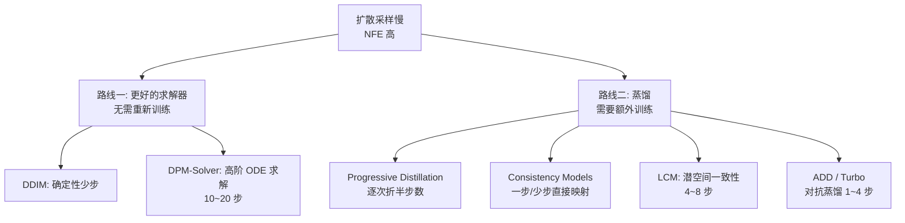

# 采样加速与蒸馏

> **一句话**：扩散模型最大的工程痛点是反向采样要跑几十到上千步网络，加速的两条主线是「把反向过程当 ODE 用高阶求解器少步求解」和「把多步教师蒸馏成一步/少步学生」。
> 关键年份：DDIM (2020, arXiv:2010.02502)、DPM-Solver (2022, arXiv:2206.00927)、Progressive Distillation (2022, arXiv:2202.00512)、Consistency Models (2023, arXiv:2303.01469)、LCM (2023, arXiv:2310.04378)、ADD / SDXL-Turbo (2023, arXiv:2311.17042)。
> 前置阅读：[扩散模型基础](/aigc/diffusion-basics)、[架构演进与 Flow Matching](/aigc/dit-flow)、[蒸馏](/distillation/)

## 为什么慢，慢在哪里

标准 DDPM 的采样是一条马尔可夫链：从纯噪声 $x_T$ 出发，逐步去噪到 $x_0$，每一步都要做一次网络前向（NFE，Number of Function Evaluations）。原始 DDPM 常用 $T=1000$ 步，意味着一张图要跑一千次 U-Net/DiT，这在生产环境里完全无法接受。

加速的核心观察是：**反向过程本质上是在解一个常微分方程（probability flow ODE）**。一旦把它看成数值积分问题，离散步数就不再需要等于训练时的噪声层数，可以用更聪明的积分格式大幅减少 NFE。沿着这个思路，业界形成了两条互补的技术路线：

两条路线的本质区别：求解器是**训练无关（training-free）**的，拿现成模型直接换采样器即可，质量接近原模型但步数有下限；蒸馏需要**额外训练一个学生模型**，能把步数压到个位数甚至 1 步，但要付出训练成本，且极少步时画质相对教师有所损失。

## 路线一：更快的求解器

### DDIM —— 把采样确定化

DDIM（Denoising Diffusion Implicit Models）把 DDPM 的随机马尔可夫链重写为一个**非马尔可夫的确定性过程**。它引入参数 $\eta$ 控制随机性，当 $\eta=0$ 时采样完全确定，给定初始噪声就唯一对应一张图。确定化带来两个好处：一是可以**跳步**采样（从 1000 步的子序列里取 50、20 步），二是同一噪声种子可复现、可做潜空间插值。DDIM 通常能在 20~50 步给出与 DDPM 千步接近的质量，是后续所有 ODE 求解器的起点。

### DPM-Solver —— 高阶 ODE 求解，10~20 步

[DPM-Solver](https://arxiv.org/abs/2206.00927)（Lu et al., 2022）把扩散 ODE 写成精确解的形式：**解析地算出其中的线性部分**，只把非线性的神经网络项留给数值积分。通过换元，反向 ODE 的解被化简成一个对网络输出的指数加权积分：

$$
x_t = \frac{\alpha_t}{\alpha_s} x_s - \alpha_t \int_{\lambda_s}^{\lambda_t} e^{-\lambda}\, \hat{\epsilon}_\theta(\hat{x}_\lambda, \lambda)\, \mathrm{d}\lambda
$$

其中 $\lambda_t = \log(\alpha_t/\sigma_t)$ 是对数信噪比。在这个形式上再用一阶、二阶、三阶 Taylor 展开，就得到带收敛阶保证的高阶求解器。结果是：**在大约 10~20 次网络评估内就能出高质量图**，是无需任何重新训练的纯采样器替换。其改进版 **DPM-Solver++** 针对引导（classifier-free guidance）强度大的场景做了稳定性优化，是目前 Stable Diffusion 等工具链的默认采样器之一。

求解器路线的边界很清楚：它逼近的是教师模型本身的 ODE 轨迹，**质量上限就是原模型**，但步数压到 4 步以下时离散误差会迅速放大、画质明显下降。要继续往极少步走，就得换到蒸馏路线。

## 路线二：蒸馏到极少步

### Progressive Distillation —— 逐次折半

[Progressive Distillation](https://arxiv.org/abs/2202.00512)（Salimans & Ho, 2022）的思路很直接：训练一个学生网络，让它**用一步复现教师两步的结果**。把 $N$ 步教师蒸馏成 $N/2$ 步学生后，再把这个学生当作新教师继续折半，迭代下去：$1024 \to 512 \to \dots \to 4 \to 2 \to 1$。每一轮只折半，学生学起来相对容易，最终可以把采样压到 4 步甚至 1~2 步。代价是要做多轮蒸馏训练。

### Consistency Models —— 一步直接映射

[Consistency Models](https://arxiv.org/abs/2303.01469)（Song et al., 2023）提出了一个更优雅的目标：学一个**一致性函数** $f_\theta(x_t, t)$，要求 ODE 轨迹上的**任意一点都直接映射到轨迹起点** $x_0$：

$$
f_\theta(x_t, t) \approx x_0,\quad \forall t \in [\epsilon, T]
$$

训练时强制同一条轨迹上不同时刻的输出保持「自一致」（self-consistency）。一旦学成，从纯噪声 $x_T$ 一次前向就能出图，因此**天然支持一步生成**；也可以做少步采样，用多次「加噪—去噪」迭代来拿计算换质量。它既能从预训练扩散模型蒸馏（Consistency Distillation），也能作为独立生成模型从头训练（Consistency Training）。论文在 CIFAR-10 上单步 FID 达到 3.55、ImageNet 64×64 达到 6.20，刷新了当时的少步生成 SOTA。此外它还原生支持图像修复、上色、超分等零样本编辑。

### LCM —— 把一致性搬到潜空间，4~8 步

[Latent Consistency Models](https://arxiv.org/abs/2310.04378)（Luo et al., 2023）把一致性模型的思想搬到了 **Latent Diffusion / Stable Diffusion 的潜空间**（参见 [Latent Diffusion 与 SD](/aigc/latent-diffusion)）。它直接预测增广 PF-ODE 的解，并把 classifier-free guidance 一并蒸馏进模型，因此推理时**不再需要额外跑一遍无条件分支**。一个 768×768 的 2~4 步 LCM，论文称仅需约 32 个 A100 GPU 小时即可从预训练模型蒸馏出来。LCM 通常在 **4~8 步**给出可用质量，是落地最广的少步方案之一。其衍生的 **LCM-LoRA** 把加速能力打包成一个 [LoRA](/lora/lora) 模块，可即插即用地挂到不同 SD 底模上，极大降低了使用门槛。

### ADD / SDXL-Turbo —— 对抗蒸馏，1~4 步

纯蒸馏在 1~2 步时容易出现模糊、细节丢失。[Adversarial Diffusion Distillation](https://arxiv.org/abs/2311.17042)（ADD，Sauer et al., 2023，即 **SDXL-Turbo** 背后的方法）把两种信号组合起来：一边用预训练大扩散模型作为教师提供**分数蒸馏（score distillation）**信号保住语义对齐，一边用 **GAN 式对抗损失**逼真度，让极少步输出也保持锐利。结果是 ADD 单步即超过此前的 GAN 和 LCM，**4 步就能逼近 SDXL 的画质**，并首次实现了基础模型上的单步实时图像合成。后续的 **LADD（Latent Adversarial Diffusion Distillation，arXiv:2403.12015）** 进一步把对抗蒸馏整体放到潜空间，是 SD3-Turbo 等的基础。

> 产品形态的 Turbo / Lightning / Hyper-SD 等少步模型在权重、许可与具体步数上各有差异，**以官方发布为准**。

## 步数—质量权衡与方法对比

少步采样的核心是**用质量换速度**：步数越少越快，但保真度、多样性、提示词遵从度都可能下降。求解器路线在 10~20 步几乎无损，再往下需要蒸馏；蒸馏路线能到 1~4 步，但极少步时多样性收窄、细节偶有牺牲。实践中常见组合是「蒸馏模型 + 高阶求解器」，把两条路线叠加。

| 方法 | 步数量级 | 是否需蒸馏/训练 | 质量是否无损 | 备注 |
| --- | --- | --- | --- | --- |
| DDIM | 20~50 | 否 | 接近无损 | 确定性、可复现、可插值 |
| DPM-Solver(++) | 10~20 | 否 | 接近无损 | 高阶 ODE 求解，工具链默认 |
| Progressive Distillation | 1~8（折半迭代） | 是（多轮） | 极少步略损 | 逐次折半，训练成本高 |
| Consistency Models | 1~4 | 是（蒸馏或从头训练） | 1 步有损，多步可补 | 直接映射到轨迹起点 |
| LCM / LCM-LoRA | 4~8 | 是（蒸馏） | 轻度损失 | 潜空间、内置 CFG、可做 LoRA |
| ADD / SDXL-Turbo | 1~4 | 是（对抗蒸馏） | 1~2 步可见损失 | 分数蒸馏 + GAN，1 步实时 |

选型直觉：

- 想**零成本提速且保质**：直接换 DPM-Solver++，10~20 步。
- 想做**实时/交互式生成**：用 LCM / Turbo 类少步模型，4 步内出图。
- 想在**自有底模上加速**：优先 LCM-LoRA，挂载即用、迁移成本低。
- 极少步加速本质是推理侧优化，与 [推理与部署](/inference/) 中的量化、批处理等手段可叠加。

## 参考文献

- Song et al. *Denoising Diffusion Implicit Models* (DDIM). arXiv:2010.02502, 2020.
- Lu et al. *DPM-Solver: A Fast ODE Solver for Diffusion Probabilistic Model Sampling in Around 10 Steps*. arXiv:2206.00927, 2022.
- Salimans & Ho. *Progressive Distillation for Fast Sampling of Diffusion Models*. arXiv:2202.00512, 2022.
- Song et al. *Consistency Models*. arXiv:2303.01469, 2023.
- Luo et al. *Latent Consistency Models: Synthesizing High-Resolution Images with Few-Step Inference*. arXiv:2310.04378, 2023.
- Sauer et al. *Adversarial Diffusion Distillation* (ADD / SDXL-Turbo). arXiv:2311.17042, 2023.
- Sauer et al. *Fast High-Resolution Image Synthesis with Latent Adversarial Diffusion Distillation* (LADD). arXiv:2403.12015, 2024.
