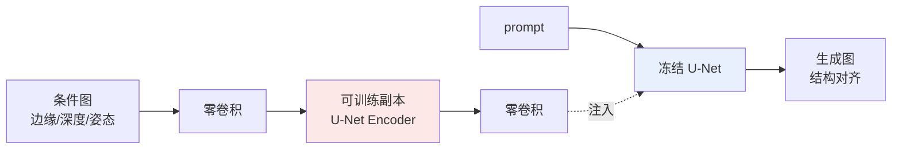

# 条件控制与定制

> **一句话**：文本提示只能给"语义"，结构与主体的精确控制要靠 ControlNet/T2I-Adapter（空间条件）、DreamBooth/Textual Inversion/LoRA（主体与风格定制）和 IP-Adapter（图像提示）这套外挂方法来补齐。
>
> 关键年份：Textual Inversion (Gal et al. 2022, arXiv:2208.01618)、DreamBooth (Ruiz et al. 2022, arXiv:2208.12242)、ControlNet (Zhang et al. 2023, arXiv:2302.05543, ICCV 2023)、T2I-Adapter (Mou et al. 2023, arXiv:2302.08453)、IP-Adapter (Ye et al. 2023, arXiv:2308.06721)；LoRA 原始 (Hu et al. 2021, arXiv:2106.09685)。
>
> 前置阅读：[Latent Diffusion 与 Stable Diffusion](/aigc/latent-diffusion)、[LoRA](/lora/lora)、[扩散模型基础](/aigc/diffusion-basics)

文本到图像（T2I）扩散模型用一句 prompt 就能产出高质量图像，但仅靠文本你无法控制"这条边缘线在哪""人物是什么姿态""画里这只猫就是我家这只"。文本是低带宽的全局语义信号，对像素级结构和特定身份几乎无能为力。本页梳理三类补齐手段，核心区分维度只有三个：**控什么**（空间结构 / 主体身份 / 风格 / 图像语义）、**改不改基座权重**、**需要多少数据与算力**。

## 一、空间结构控制：给条件，不动基座

### ControlNet

ControlNet 解决的是"按一张结构图生成"的问题——输入 Canny 边缘图、深度图、人体姿态（OpenPose）、语义分割、涂鸦草图等，让生成结果在空间布局上严格对齐该条件。

它的做法是**复制基座 U-Net 编码器的可训练分支**：冻结原始 Stable Diffusion 的全部权重，把编码器各 block 复制一份做成可训练副本，条件图经这个副本编码后，通过**零卷积**（zero convolution，零初始化的 $1\times1$ 卷积）注入回原网络。零卷积是关键设计：训练初始时它输出为 0，意味着初始状态下注入分支对基座**毫无扰动**，等价于原模型，训练再让它从零逐渐"长出"控制能力，从而避免微调初期的噪声破坏预训练知识。

$$y_c = \mathcal{F}(x;\Theta) + \mathcal{Z}\big(\mathcal{F}(x + \mathcal{Z}(c;\Theta_{z1});\Theta_c);\Theta_{z2}\big)$$

其中 $\mathcal{F}(\cdot;\Theta)$ 是冻结的原 block，$\Theta_c$ 是可训练副本，$\mathcal{Z}$ 是零卷积。论文指出训练对数据规模相当鲁棒，小数据集（<50k）和大数据集（>1M）都能学好。代价是参数量较大（约等于复制了半个 U-Net），训练与推理都比纯 T2I 重一些。

### T2I-Adapter

T2I-Adapter（同期工作）目标相同，但走"更轻"的路线：训练一个**小型外挂适配器**（几个卷积下采样块），把条件图编码成多尺度特征，加到冻结 U-Net 编码器的对应层上。它同样不动基座权重，但适配器参数量远小于 ControlNet（约几千万级别），训练与推理开销更低，且具备一定的可组合性（多个 adapter 叠加）。代价是控制精度通常略弱于 ControlNet，二者本质是精度与成本的权衡。

## 二、主体 / 风格定制：让模型"记住"它

这一类回答的是"画里那个特定对象就是它"的问题，按是否改基座权重分两条路。

### Textual Inversion：只学一个新 token，不动模型

Textual Inversion 用 3~5 张图，**只优化一个新"词"的嵌入向量** $v_*$，冻结整个 T2I 模型。它在文本嵌入空间里找一个伪词 $S_*$，使得 prompt 里写 "a photo of $S_*$" 时模型能复现该概念：

$$v_* = \arg\min_{v}\; \mathbb{E}_{z,\,\epsilon,\,t}\Big[\,\big\|\epsilon - \epsilon_\theta(z_t, t, c_\theta(y, v))\big\|_2^2\,\Big]$$

产物只有一个（或几个）向量，体积几 KB，极轻；但因为基座一字未改，对复杂主体的还原保真度有限，更适合捕捉"风格/概念"而非精确身份。

### DreamBooth：微调基座，绑定专属标识符

DreamBooth 反过来——用少量（典型 3~5 张）图**微调整个 T2I 模型权重**，把一个稀有标识符 token（如 `[V]`）与该主体绑定。为防止微调把整个类别都带偏、丢失泛化（语言漂移 / 过拟合），它引入**类别先验保留损失**（prior preservation loss），用模型自己生成的同类图做正则：

$$\mathcal{L} = \mathbb{E}\big[\|\hat{x}_\theta - x\|^2\big] + \lambda\,\mathbb{E}\big[\|\hat{x}_\theta(\text{class prior}) - x_{pr}\|^2\big]$$

它的身份保真度通常优于 Textual Inversion，但要改全部权重，产物是一份完整模型（数 GB），训练成本与存储都更高。

### LoRA：定制的工程化主力

实践中最常用的定制方式是 [LoRA](/lora/lora)（Low-Rank Adaptation，原始论文 arXiv:2106.09685）。它给 U-Net（常含交叉注意力的 $W_q,W_k,W_v$ 等）的权重加一个低秩增量 $\Delta W = BA$，冻结原权重只训 $A,B$：

$$W' = W + \Delta W = W + BA,\quad B\in\mathbb{R}^{d\times r},\ A\in\mathbb{R}^{r\times k},\ r\ll \min(d,k)$$

LoRA 本是大语言模型的高效微调技术，迁到扩散模型后成为社区定制（人物、画风、IP）的事实标准：产物通常仅几 MB ~ 百 MB，训练快，可热插拔、可叠加多个、可调权重。它常与 DreamBooth 式数据流程结合（即 "DreamBooth + LoRA"），在保真与成本间取得很好的折中。

## 三、图像提示：用一张图当 prompt

### IP-Adapter

前两类要么给结构、要么要微调记住主体，IP-Adapter 提供第三条路：**把一张参考图当作图像 prompt**，零样本地把它的语义/风格注入生成，不微调基座。

核心是**解耦交叉注意力**（decoupled cross-attention）：参考图先过冻结的图像编码器（CLIP）得到图像特征，然后在 U-Net **每个交叉注意力层旁新增一条只处理图像特征的交叉注意力**，与原有文本交叉注意力并行，结果相加。训练时只更新这些新增的交叉注意力参数。论文里一个仅约 **22M 参数**的 IP-Adapter 即可媲美全量微调的图像提示模型，且天然与文本 prompt 共存、可与 ControlNet 等结构控制叠加使用。

$$\mathbf{Z}^{new} = \underbrace{\text{Attn}(Q, K_t, V_t)}_{\text{文本}} + \lambda\,\underbrace{\text{Attn}(Q, K_i, V_i)}_{\text{图像（新增）}}$$

## 横向对比

| 方法 | 控什么 | 是否改基座权重 | 典型数据量 | 产物体积 / 成本 |
| --- | --- | --- | --- | --- |
| ControlNet | 空间结构（边缘/深度/姿态/分割） | 否（外挂可训练副本 + 零卷积） | 数万 ~ 百万级条件对 | 大（≈半个 U-Net），训练/推理偏重 |
| T2I-Adapter | 空间结构（同上，更轻） | 否（小适配器） | 数万级 | 小（约几千万参数） |
| Textual Inversion | 概念 / 风格 / 主体（弱保真） | 否（只学 token 嵌入） | 3~5 张 | 极小（几 KB） |
| DreamBooth | 特定主体身份（强保真） | 是（全量微调） | 3~5 张 | 大（整份模型，数 GB） |
| LoRA | 主体 / 风格 / IP（可叠加） | 否（加低秩增量） | 数张 ~ 数百张 | 小（几 MB ~ 百 MB） |
| IP-Adapter | 图像语义 / 风格（零样本） | 否（新增交叉注意力，约 22M） | 一张参考图即可用 | 小，可与 ControlNet 叠加 |

实践中这些方法常组合使用：例如 **ControlNet（控姿态）+ 角色 LoRA（控身份）+ IP-Adapter（控风格参考）** 同时挂载，分别管住结构、主体和质感。其设计哲学与 SDXL/Flux 等基座的演进（参见 [Latent Diffusion 与 Stable Diffusion](/aigc/latent-diffusion)、[架构演进：U-Net→DiT 与 Flow Matching](/aigc/dit-flow)）相互独立：基座越强，外挂控制方法越值钱。具体到 Flux、SDXL 等不同基座上的适配器实现细节，以官方为准。

## 参考文献

- Gal et al. *An Image is Worth One Word: Personalizing Text-to-Image Generation using Textual Inversion.* 2022. arXiv:2208.01618
- Ruiz et al. *DreamBooth: Fine Tuning Text-to-Image Diffusion Models for Subject-Driven Generation.* 2022. arXiv:2208.12242
- Zhang, Rao, Agrawala. *Adding Conditional Control to Text-to-Image Diffusion Models.* 2023. arXiv:2302.05543 (ICCV 2023)
- Mou et al. *T2I-Adapter: Learning Adapters to Dig out More Controllable Ability for Text-to-Image Diffusion Models.* 2023. arXiv:2302.08453
- Ye et al. *IP-Adapter: Text Compatible Image Prompt Adapter for Text-to-Image Diffusion Models.* 2023. arXiv:2308.06721
- Hu et al. *LoRA: Low-Rank Adaptation of Large Language Models.* 2021. arXiv:2106.09685
