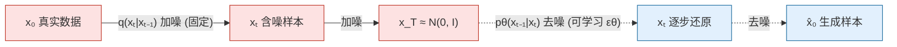
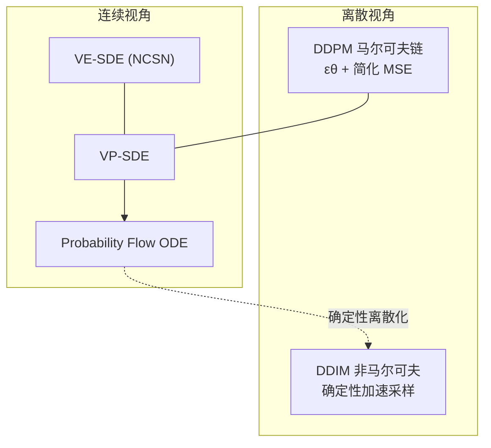

# 扩散模型基础：DDPM / DDIM / Score-based

> **一句话**：扩散模型把"生成"建模成一个逐步加噪再逐步去噪的过程——前向把数据搅成纯高斯噪声，反向学一个去噪网络把噪声还原成样本；DDIM 与 score-based SDE 则给了它"更快采样"和"统一连续视角"两条腿。
> 关键年份：NCSN（Song & Ermon, 2019, arXiv:1907.05600）、DDPM（Ho et al., 2020, arXiv:2006.11239）、DDIM（Song et al., 2020, arXiv:2010.02502）、Score-based SDE（Song et al., 2021, arXiv:2011.13456）
> 前置阅读：[生成式模型总览](/aigc/)、[Latent Diffusion 与 Stable Diffusion](/aigc/latent-diffusion)、[Transformer 架构](/architecture/transformer)

扩散模型（Diffusion Models）已经是图像、视频、音频乃至分子生成的事实标准生成范式。它的核心直觉非常朴素：**往数据里逐步加噪声直到变成纯高斯噪声是容易的，那么只要学会反过来"一步步去噪"，就能从噪声里采样出新数据**。本页从离散的 DDPM 出发，讲清前向/反向过程、噪声预测与训练目标，再过渡到 DDIM 的确定性加速采样，最后用 score-based / SDE 的连续视角把它们统一起来。

## 前向加噪：固定的马尔可夫链

前向过程（forward / diffusion process）是一条**预先固定、不含可学习参数**的马尔可夫链。给定真实数据 $x_0 \sim q(x_0)$，按方差表（variance schedule）$\{\beta_t\}_{t=1}^{T}$ 逐步注入高斯噪声：

$$
q(x_t \mid x_{t-1}) = \mathcal{N}\!\big(x_t;\, \sqrt{1-\beta_t}\, x_{t-1},\, \beta_t \mathbf{I}\big)
$$

其中 $\beta_t \in (0,1)$ 通常从很小的值（如 $10^{-4}$）线性或余弦地增大到接近 1。整条链的联合分布为 $q(x_{1:T}\mid x_0)=\prod_{t=1}^{T} q(x_t\mid x_{t-1})$。

高斯链的一个关键便利是：**任意时刻 $t$ 的边际分布有闭式解**，不必逐步采样。令 $\alpha_t = 1-\beta_t$、$\bar\alpha_t = \prod_{s=1}^{t}\alpha_s$，则

$$
q(x_t \mid x_0) = \mathcal{N}\!\big(x_t;\, \sqrt{\bar\alpha_t}\, x_0,\, (1-\bar\alpha_t)\mathbf{I}\big)
\;\Longrightarrow\;
\boxed{\,x_t = \sqrt{\bar\alpha_t}\, x_0 + \sqrt{1-\bar\alpha_t}\,\epsilon,\quad \epsilon\sim\mathcal{N}(0,\mathbf{I})\,}
$$

这个**重参数化闭式**是训练高效的根基：训练时直接采一个 $t$ 和一个 $\epsilon$，一步算出 $x_t$，无需模拟整条链。当 $T$ 足够大、$\bar\alpha_T \to 0$ 时，$x_T$ 近似为标准高斯噪声 $\mathcal{N}(0,\mathbf{I})$。

## 反向去噪：可学习的生成过程

生成时我们走反方向：从 $x_T\sim\mathcal{N}(0,\mathbf{I})$ 出发，逐步去噪到 $x_0$。真实反向 $q(x_{t-1}\mid x_t)$ 难以处理，于是用神经网络 $p_\theta$ 近似，且在 $\beta_t$ 足够小时它仍近似为高斯：

$$
p_\theta(x_{t-1}\mid x_t) = \mathcal{N}\!\big(x_{t-1};\, \mu_\theta(x_t, t),\, \Sigma_\theta(x_t, t)\big)
$$

DDPM 的一个核心发现是：与其让网络直接预测均值 $\mu_\theta$，不如让它**预测加在 $x_0$ 上的噪声 $\epsilon$**，记作 $\epsilon_\theta(x_t,t)$。给定后验 $q(x_{t-1}\mid x_t, x_0)$ 的解析形式，均值可由噪声预测反推：

$$
\mu_\theta(x_t,t) = \frac{1}{\sqrt{\alpha_t}}\left(x_t - \frac{\beta_t}{\sqrt{1-\bar\alpha_t}}\,\epsilon_\theta(x_t,t)\right)
$$

方差 $\Sigma_\theta$ 在原始 DDPM 中常被固定为 $\sigma_t^2 \mathbf{I}$（取 $\beta_t$ 或后验方差），不参与学习。

## 训练目标：从 ELBO 到简化 MSE

形式上扩散模型是一个层级隐变量模型，训练目标是负对数似然的变分上界（ELBO / VLB），可拆成一组 KL 项之和：

$$
\mathcal{L}_{\text{vlb}} = \mathbb{E}_q\Big[\underbrace{D_{\mathrm{KL}}\!\big(q(x_T\mid x_0)\,\|\,p(x_T)\big)}_{L_T}
+ \sum_{t>1}\underbrace{D_{\mathrm{KL}}\!\big(q(x_{t-1}\mid x_t,x_0)\,\|\,p_\theta(x_{t-1}\mid x_t)\big)}_{L_{t-1}}
- \underbrace{\log p_\theta(x_0\mid x_1)}_{L_0}\Big]
$$

DDPM 的关键工程贡献，是证明在噪声预测的参数化下，每个 $L_{t-1}$ 项都化简为预测噪声与真实噪声之间的加权 MSE；并且**直接丢掉权重系数**（设为 1）反而能提升样本质量。于是得到极其简洁的训练损失：

$$
\boxed{\;\mathcal{L}_{\text{simple}} = \mathbb{E}_{t,\,x_0,\,\epsilon}\Big[\,\big\|\,\epsilon - \epsilon_\theta\big(\sqrt{\bar\alpha_t}\,x_0 + \sqrt{1-\bar\alpha_t}\,\epsilon,\; t\big)\big\|^2\,\Big]\;}
$$

训练循环只需四步：采样 $x_0$、均匀采样时间步 $t$、采样噪声 $\epsilon$、回归 $\epsilon_\theta$。网络主干通常是带时间步嵌入的 U-Net（条件信息通过交叉注意力注入），这部分演进见 [架构演进：U-Net → DiT](/aigc/dit-flow)。

## DDIM：确定性、非马尔可夫的加速采样

DDPM 采样需要逐步走完 $T$（常为 1000）步，推理极慢。**DDIM** 指出：训练目标 $\mathcal{L}_{\text{simple}}$ 只依赖边际 $q(x_t\mid x_0)$，并不绑定那条具体的马尔可夫链。因此可以构造一族**共享相同边际、但非马尔可夫**的前向过程，它们对应的网络无需重训即可复用。

DDIM 的采样更新可写为（$\sigma_t$ 控制随机性）：

$$
x_{t-1} = \sqrt{\bar\alpha_{t-1}}\,\underbrace{\left(\frac{x_t - \sqrt{1-\bar\alpha_t}\,\epsilon_\theta(x_t,t)}{\sqrt{\bar\alpha_t}}\right)}_{\text{预测的 } \hat{x}_0}
+ \underbrace{\sqrt{1-\bar\alpha_{t-1}-\sigma_t^2}\;\epsilon_\theta(x_t,t)}_{\text{指向 }x_t\text{ 的方向}}
+ \sigma_t\,\epsilon
$$

当 $\sigma_t = 0$ 时整个生成过程**完全确定性**（给定 $x_T$ 即唯一确定 $x_0$），这正是 DDIM 命名中"implicit"的由来。确定性还带来两个好处：可在样本间做有意义的**潜空间插值**，以及可做近似可逆的"反演"（inversion）用于图像编辑。更重要的是，DDIM 允许在子序列时间步上采样，把步数从 1000 压到 **20~100 步**仍保持高质量，按论文实测可比 DDPM 快约 10×~50×（以官方报告为准）。更激进的加速器（DPM-Solver、Consistency、LCM、Turbo）见 [采样加速与蒸馏](/aigc/acceleration)。

## Score-based / SDE：统一的连续视角

另一条独立发展的脉络是**基于分数（score）的生成模型**。分数指对数密度的梯度 $\nabla_x \log p(x)$。NCSN（Noise Conditional Score Networks）用去噪分数匹配（denoising score matching）在多个噪声尺度上学习分数 $s_\theta(x,\sigma)\approx\nabla_x\log p_\sigma(x)$，再用**退火 Langevin 动力学**采样：

$$
x_{i+1} = x_i + \frac{\delta}{2}\,s_\theta(x_i,\sigma) + \sqrt{\delta}\;z_i,\qquad z_i\sim\mathcal{N}(0,\mathbf{I})
$$

Song et al. (2021) 进一步把离散扩散与 NCSN 统一为**连续时间随机微分方程（SDE）**。前向加噪是一条 SDE：

$$
\mathrm{d}x = f(x,t)\,\mathrm{d}t + g(t)\,\mathrm{d}w
$$

它存在对应的**逆时 SDE**，且只依赖分数函数 $\nabla_x\log p_t(x)$：

$$
\mathrm{d}x = \big[f(x,t) - g(t)^2 \nabla_x\log p_t(x)\big]\mathrm{d}t + g(t)\,\mathrm{d}\bar w
$$

两类经典 SDE 对应两类离散模型：

| SDE 类型 | 前向行为 | 对应离散模型 | 边际尺度 |
| --- | --- | --- | --- |
| **VE-SDE**（Variance Exploding） | 只加噪、方差爆炸式增大 | NCSN / SMLD | $x_t = x_0 + \sigma_t\epsilon$ |
| **VP-SDE**（Variance Preserving） | 加噪同时收缩信号、保持方差 | DDPM | $x_t = \sqrt{\bar\alpha_t}\,x_0+\sqrt{1-\bar\alpha_t}\,\epsilon$ |

这套框架还揭示了一个重要事实：每条扩散 SDE 都存在一个**共享相同边际分布的确定性常微分方程（probability flow ODE）**。DDIM 正可看作 VP-SDE 对应 probability flow ODE 的一种离散化——这就把"DDPM 的概率视角"和"score-based 的微分方程视角"完全打通了。ODE 视角也是后续 Flow Matching / Rectified Flow 的思想源头，详见 [架构演进与 Flow Matching](/aigc/dit-flow)。

## 小结

- 前向是固定高斯马尔可夫链，闭式 $x_t=\sqrt{\bar\alpha_t}x_0+\sqrt{1-\bar\alpha_t}\epsilon$ 让训练高效。
- 反向用网络预测噪声 $\epsilon_\theta$，训练目标从 ELBO 简化成无权重的 MSE。
- DDIM 通过非马尔可夫 + 确定性 ODE 离散化，把采样步数大幅压缩。
- Score-based SDE（VE/VP）提供统一的连续框架，probability flow ODE 把概率视角与分数视角连成一体。

接下来推荐阅读 [Latent Diffusion 与 Stable Diffusion](/aigc/latent-diffusion)，看扩散如何搬到压缩的潜空间从而真正可规模化。

## 参考文献

- Song, Y., Ermon, S. *Generative Modeling by Estimating Gradients of the Data Distribution* (NCSN). 2019. [arXiv:1907.05600](https://arxiv.org/abs/1907.05600)
- Ho, J., Jain, A., Abbeel, P. *Denoising Diffusion Probabilistic Models* (DDPM). 2020. [arXiv:2006.11239](https://arxiv.org/abs/2006.11239)
- Song, J., Meng, C., Ermon, S. *Denoising Diffusion Implicit Models* (DDIM). 2020. [arXiv:2010.02502](https://arxiv.org/abs/2010.02502)
- Song, Y., Sohl-Dickstein, J., Kingma, D. P., Kumar, A., Ermon, S., Poole, B. *Score-Based Generative Modeling through Stochastic Differential Equations*. 2021. [arXiv:2011.13456](https://arxiv.org/abs/2011.13456)
- Sohl-Dickstein, J., Weiss, E. A., Maheswaranathan, N., Ganguli, S. *Deep Unsupervised Learning using Nonequilibrium Thermodynamics*. 2015. [arXiv:1503.03585](https://arxiv.org/abs/1503.03585)
