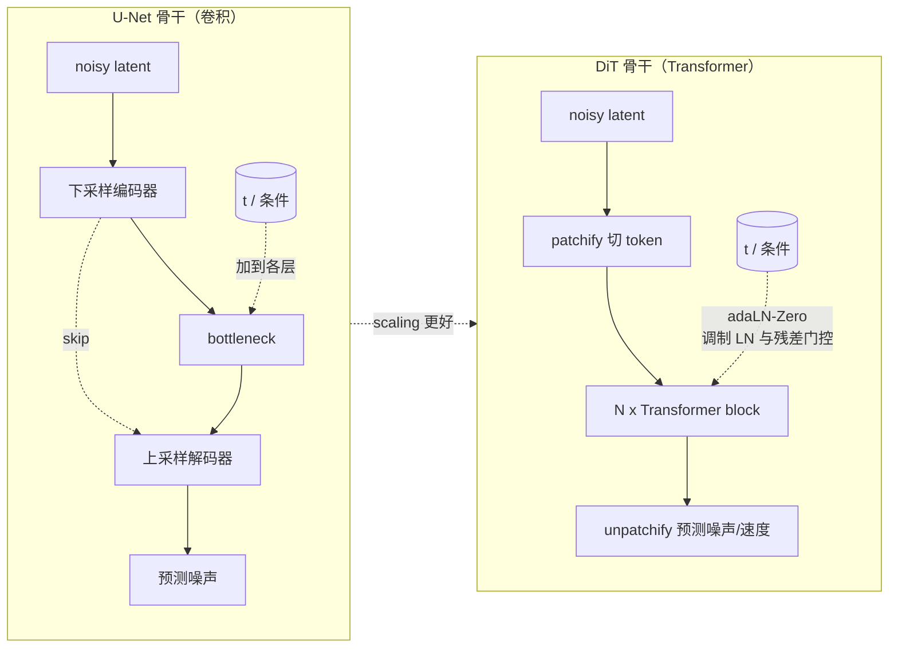
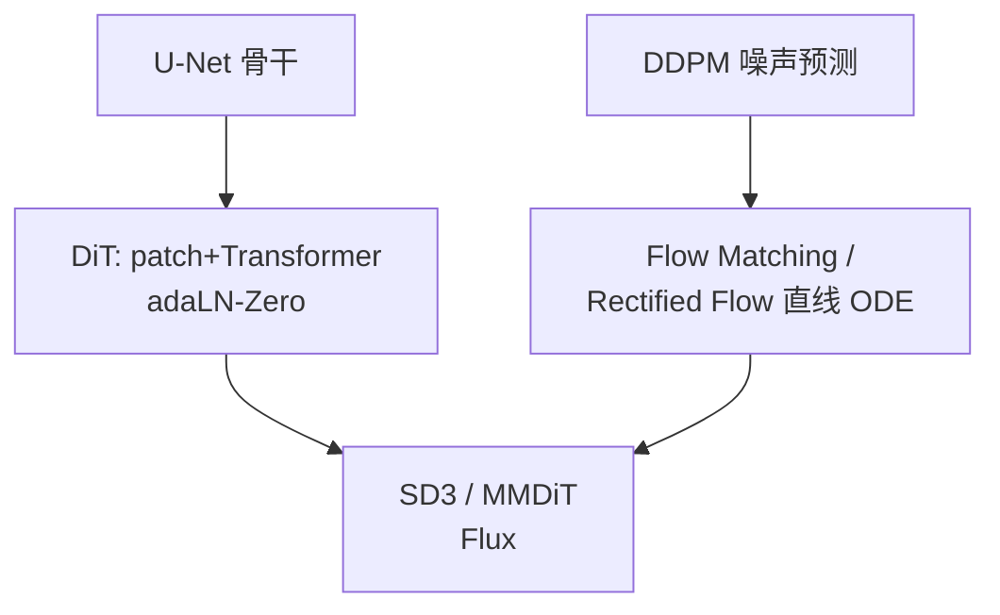

> **一句话**：扩散模型的演进沿两条线展开——去噪骨干从卷积 **U-Net** 走向纯 Transformer 的 **DiT**（scaling 更好），训练范式从 DDPM 的噪声预测走向 **flow matching / rectified flow** 的直线 ODE 路径（采样更省步），二者在 SD3 的 **MMDiT** 和 Flux 上汇合。
> 关键年份：Rectified Flow（Liu et al. 2022, arXiv:2209.03003）、Flow Matching（Lipman et al. 2022, arXiv:2210.02747）、DiT（Peebles & Xie 2022/2023, arXiv:2212.09748, ICCV 2023）、SD3 / MMDiT（Esser et al. 2024, arXiv:2403.03206）。
> 前置阅读：[Latent Diffusion 与 Stable Diffusion](/aigc/latent-diffusion)、[扩散模型基础](/aigc/diffusion-basics)、[Transformer](/architecture/transformer)

## 为什么要换骨干、换范式

早期扩散模型（DDPM、Stable Diffusion）几乎都用 **U-Net** 当去噪网络：编码器逐级下采样、解码器逐级上采样、对称层之间拉 skip connection。它带有强烈的图像归纳偏置（局部卷积、多尺度），在中小规模上很好用。但当我们想把模型继续放大、想统一图像/视频/多模态的建模方式时，U-Net 暴露出两个问题：一是它的结构是为 2D 图像定制的，迁移到视频或任意 token 序列并不自然；二是它的 scaling 行为不如 Transformer 干净。

与此同时，DDPM 的训练目标（预测每一步加入的噪声 $\epsilon$）虽然有效，但其概率路径是由前向加噪过程隐式决定的"弯曲"轨迹，采样时往往需要几十到上百步。**flow matching / rectified flow** 则直接去学一条尽量"直"的从噪声到数据的路径，理论更简洁，采样步数可以大幅压缩。

这两条线分别回答"骨干用什么"和"目标怎么学"，下面分开讲，再看它们如何在 SD3 / Flux 上合流。

## 一、去噪骨干：U-Net → DiT

**DiT（Diffusion Transformer，Peebles & Xie, arXiv:2212.09748）** 的核心主张是：去噪网络里的 U-Net 其实不是必需的，把潜空间（latent）切成 patch 当作 token，用一个标准 Transformer 处理，就能得到更好的可扩展性。

流程很直白：在 [LDM](/aigc/latent-diffusion) 的潜空间里拿到一张 $H/8 \times W/8$ 的 latent，按 patch size $p$（论文里 $p\in\{2,4,8\}$，记作 DiT-XL/2 等）切成不重叠 patch，每个 patch 线性投影成一个 token，加上位置编码后送进 $N$ 层 Transformer block，最后再线性映射回 latent 形状预测噪声/速度。

条件（扩散时间步 $t$、类别标签或文本）如何注入是关键。DiT 比较了几种方案，最终主推 **adaLN-Zero**——自适应 LayerNorm 的零初始化变体：把条件向量经 MLP 回归出每个 block 里 LayerNorm 的缩放/平移参数 $(\gamma,\beta)$ 以及残差分支前的门控缩放 $\alpha$，并把 $\alpha$ 初始化为 0，使每个 block 在训练初期等价于恒等映射。这种"零初始化"让深层 Transformer 训练更稳定，效果优于把条件当额外 token 拼接（in-context）或用 cross-attention。

DiT 的实证结论是其影响力所在：**模型的 Gflops 越高（更深/更宽，或 patch 更小、token 更多），FID 越低**，呈现干净的 scaling 趋势；最大的 DiT-XL/2 在 class-conditional ImageNet 256×256 上取得了当时的 SOTA FID。这条 scaling 曲线正是后续大家纷纷把骨干换成 Transformer 的直接动因。

| 对比维度 | U-Net | DiT |
| --- | --- | --- |
| 基本算子 | 卷积 + 多尺度采样 | self-attention + MLP |
| 序列建模 | 隐式（空间网格） | 显式（latent patch 当 token） |
| 条件注入 | 拼接 / cross-attn / FiLM | **adaLN-Zero**（主推） |
| 归纳偏置 | 强（为 2D 图像定制） | 弱（更通用，易迁视频/多模态） |
| Scaling | 一般 | 随 Gflops 平滑提升 |
| 典型代表 | SD1.x / SD2.x | DiT、PixArt-α、SD3、Sora 式骨干 |

弱归纳偏置看似缺点，却让 DiT 容易把 3D 视频块（spacetime patch）一并 token 化，成为 [视频与多模态生成](/aigc/video) 中 Sora 式架构的基础。

## 二、生成范式：DDPM → Flow Matching / Rectified Flow

换骨干解决"算力放在哪"，换范式解决"轨迹长什么样"。

**Rectified Flow（Liu, Gong & Liu, arXiv:2209.03003，原题 *Flow Straight and Fast*）** 的想法极简：在数据样本 $x_1$ 与噪声样本 $x_0$ 之间取**线性插值** $x_t = (1-t)\,x_0 + t\,x_1$，让网络回归这条直线的速度场——而直线的速度恒为常数 $x_1 - x_0$：

$$
\min_{v}\ \mathbb{E}_{t,x_0,x_1}\ \big\|\,v_\theta(x_t,t) - (x_1 - x_0)\,\big\|^2 .
$$

采样时只需从 $x_0$ 沿 $v_\theta$ 解一个 ODE。路径越接近直线，欧拉法用很少步数（极端情况单步）就能逼近。论文还提出 **reflow**：用训练好的流重新配对噪声与数据，再训一遍，使轨迹越来越直、耦合的传输代价单调不增。

**Flow Matching（Lipman et al., arXiv:2210.02747）** 从连续归一化流（CNF）的角度给出更一般的框架：不去模拟 ODE，而是直接回归一条预先指定的**条件概率路径**的向量场（simulation-free）。它涵盖一族高斯概率路径——把 DDPM 的扩散路径作为特例包含进来；当采用**最优传输（OT）位移插值**时，得到的正是上面那种近似直线的路径，训练更稳、采样更快、泛化更好。两篇工作殊途同归：**用一个简单的回归目标，学一条尽量直的噪声→数据轨迹。**

和 DDPM 对照：

| | DDPM（$\epsilon$-prediction） | Flow Matching / Rectified Flow |
| --- | --- | --- |
| 学习目标 | 预测加入的噪声 $\epsilon$ | 回归速度场 $v$（如 $x_1-x_0$） |
| 路径形状 | 由前向加噪隐式决定，偏弯曲 | 显式指定，可取近似直线（OT / 线性插值） |
| 采样过程 | 反向 SDE/ODE，步数多 | 解 ODE，步数少（直则更少） |
| 与扩散关系 | — | FM 把扩散路径作为特例包含 |

> 提示：flow matching 减少的是"达到同等质量所需的求解步数"，它和[采样加速与蒸馏](/aigc/acceleration)（DPM-Solver、Consistency、LCM/Turbo）是互补的——前者改训练目标让轨迹更友好，后者在推理侧进一步压步。

## 三、两条线合流：SD3 的 MMDiT 与 Flux

**Stable Diffusion 3 / MMDiT（Esser et al., arXiv:2403.03206，原题 *Scaling Rectified Flow Transformers for High-Resolution Image Synthesis*）** 把两条演进线拧到一起：骨干用 Transformer（DiT 路线），范式用 rectified flow（直线路径路线），并做了两点关键改进。

- **MMDiT（Multimodal Diffusion Transformer）**：文本 token 与图像 token 各自拥有**独立的一套权重**（独立的 LN / projection / MLP），但在 attention 里**双向交互**，让两种模态信息充分互通——比单向 cross-attention 更对称、更利于 scaling。
- **改进的噪声采样**：训练 rectified flow 时不再均匀采样时间步 $t$，而是把分布**偏向"感知上更关键"的中间噪声尺度**（如 logit-normal 加权），论文报告这比已有的扩散表述在高分辨率文生图上更优。

**Flux（Black Forest Labs, 2024，产品）** 由原 SD 团队成员创立，延续 rectified-flow Transformer 路线，是当前开源/商用文生图的主力骨干之一，提供不同档位（如蒸馏的快速版与完整版）。其具体架构与参数细节**以官方为准**，此处只作定性定位：它代表"DiT × rectified flow"路线在产品级文生图上的成熟形态。

## 小结

- **骨干**：U-Net → DiT，把 latent patch 当 token 走 Transformer，adaLN-Zero 注入条件，scaling 随 Gflops 平滑提升，也更易扩展到视频/多模态。
- **范式**：DDPM → flow matching / rectified flow，学习近似直线的噪声→数据 ODE 路径，采样步数更少；FM 在理论上把扩散作为特例统一进来。
- **合流**：SD3 的 MMDiT（双模态独立权重 + 联合 attention + 改进噪声采样）与 Flux 代表"DiT × rectified flow"的新一代文生图骨干。

延伸阅读：[扩散模型基础](/aigc/diffusion-basics)、[Latent Diffusion 与 Stable Diffusion](/aigc/latent-diffusion)、[采样加速与蒸馏](/aigc/acceleration)、[视频与多模态生成](/aigc/video)、[Transformer](/architecture/transformer)、[多模态大模型 VLM](/architecture/vlm)。

## 参考文献

- Liu, Gong & Liu. *Flow Straight and Fast: Learning to Generate and Transfer Data with Rectified Flow*. arXiv:2209.03003, 2022.
- Lipman, Chen, Ben-Hamu, Nickel & Le. *Flow Matching for Generative Modeling*. arXiv:2210.02747, 2022（ICLR 2023）.
- Peebles & Xie. *Scalable Diffusion Models with Transformers*（DiT）. arXiv:2212.09748, 2022（ICCV 2023）.
- Esser et al. *Scaling Rectified Flow Transformers for High-Resolution Image Synthesis*（SD3 / MMDiT）. arXiv:2403.03206, 2024.
- Black Forest Labs. *FLUX*. 2024（产品，细节以官方为准）.
