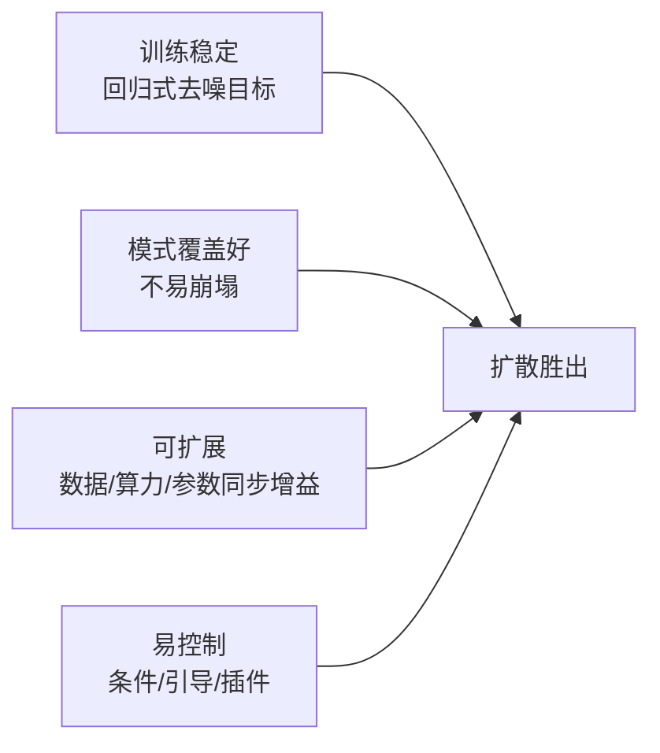
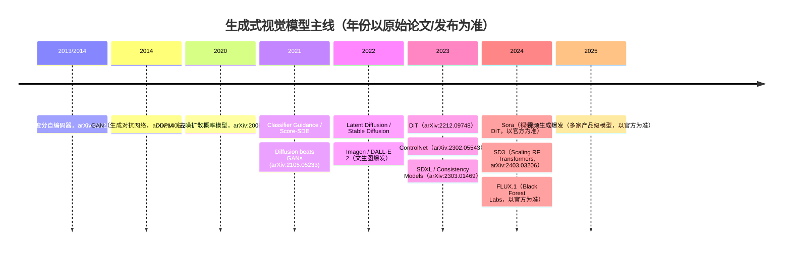

# 生成式模型与 AIGC 总览

> **一句话**：生成式建模的本质是学习一个从简单噪声分布到复杂数据分布的映射；过去十年里 GAN / VAE / 流模型 / 自回归 / 扩散五条路线轮番登场，而扩散（及其 Flow Matching 变体）凭借训练稳定、模式覆盖好、易扩展、易控制，成为图像与视频生成的事实主线。
> 关键年份：GAN 2014（arXiv:1406.2661）、VAE 2013（arXiv:1312.6114）、DDPM 2020（arXiv:2006.11239）、Latent Diffusion 2021（arXiv:2112.10752）、DiT 2022（arXiv:2212.09748）。
> 前置阅读：[Transformer 架构](/architecture/transformer)、[扩散模型基础](/aigc/diffusion-basics)、[Latent Diffusion 与 Stable Diffusion](/aigc/latent-diffusion)

本页是「生成式模型 / AIGC」篇的总览，目标是给你一张**地图 + 一条主线**：先把生成范式版图理清，说明扩散为何在视觉生成上胜出，再用导航表和时间线把后续 6 页串起来。具体推导和工程细节留给子页。

## 一、生成范式版图

所有生成模型都要回答同一个问题：如何从数据 $x$ 中学到分布 $p_\theta(x)$，并能高效采样。区别在于它们如何刻画这个分布、用什么目标训练、采样要几步。

| 范式 | 一句话 | 优势 | 劣势 |
| --- | --- | --- | --- |
| **GAN**（生成对抗网络） | 生成器与判别器博弈，直接学采样器，不显式建概率 | 单步采样快、图像锐利 | 训练不稳定、易模式崩塌、难覆盖全部模式 |
| **VAE**（变分自编码器） | 编码到隐空间再重建，优化证据下界（ELBO） | 训练稳定、隐空间结构好、单步采样 | 样本偏糊（高斯先验 + 重建损失的妥协） |
| **归一化流**（Normalizing Flow） | 用可逆变换把噪声映射到数据，精确计算似然 | 精确似然、可逆 | 架构受可逆约束限制、表达力/算力性价比一般 |
| **自回归**（Autoregressive） | 把数据拆成序列逐元素预测，$p(x)=\prod_i p(x_i\mid x_{<i})$ | 似然精确、与 LLM 范式统一、可扩展 | 采样需逐步串行、长序列慢 |
| **扩散 / Score-based** | 前向逐步加噪、反向逐步去噪，学噪声/分数 | 训练稳定、模式覆盖好、可扩展、易条件控制 | 采样需多步迭代（可蒸馏加速） |

这五条路线并非互斥：Latent Diffusion 把 VAE 的隐空间和扩散结合；DiT 把扩散的去噪网络换成 Transformer；Flow Matching 在连续归一化流框架下统一了扩散与最优传输路径。下面几页会反复看到这种"杂交"。

## 二、为什么扩散在图像/视频上胜出

把视觉生成的主线交给扩散，并非偶然，而是四个性质同时成立：

- **训练稳定**：扩散的训练目标是一个**回归式的去噪损失**（预测被加入的噪声 $\epsilon$），等价于去噪分数匹配，没有 GAN 的对抗动力学，调参鲁棒、几乎不会崩。
- **模式覆盖好**：最大似然式的目标天然倾向覆盖整个数据分布，缓解了 GAN 常见的模式崩塌，生成多样性更好。
- **可扩展**：把去噪网络从 U-Net 换成 Transformer（DiT）后，性能随**深度/宽度/token 数**单调提升，FLOPs 越大 FID 越低——这条 scaling 曲线正是 Sora、SD3、Flux 等大模型的底气。
- **可控**：扩散的迭代采样过程给了大量"插入控制"的机会——无分类器引导（CFG）、ControlNet 的空间条件、LoRA 风格定制、IP-Adapter 的图像提示，都能挂在同一个骨干上。详见 [条件控制与定制](/aigc/control)。

代价是**采样要多步迭代**，比 GAN/VAE 的单步慢。这一短板由 DPM-Solver、Consistency Models、LCM、Turbo 等加速/蒸馏方法逐步补齐，详见 [采样加速与蒸馏](/aigc/acceleration)。

## 三、本章页面导航

| 页面 | 主题 | 你会学到 |
| --- | --- | --- |
| [扩散模型基础](/aigc/diffusion-basics) | DDPM / DDIM / score-based | 前向/反向过程、去噪目标、确定性采样、SDE/ODE 统一视角 |
| [Latent Diffusion 与 Stable Diffusion](/aigc/latent-diffusion) | 隐空间扩散 | VAE 压缩 + 隐空间扩散 + 交叉注意力条件，为何能跑在消费级显卡上 |
| [架构演进](/aigc/dit-flow) | U-Net→DiT、Flow Matching / Rectified Flow | 去噪骨干的 Transformer 化与"拉直"概率路径的新范式 |
| [条件控制与定制](/aigc/control) | ControlNet / LoRA / IP-Adapter | 空间条件、轻量风格定制、图像提示如何挂到同一骨干 |
| [采样加速与蒸馏](/aigc/acceleration) | DPM-Solver / Consistency / LCM / Turbo | 把几十步压到个位数甚至一步的求解器与蒸馏技巧 |
| [视频与多模态生成](/aigc/video) | Sora 式 DiT | 时空 patch、时序一致性，从图像扩散到视频生成的跨越 |

> 如果你是第一次进入这一篇，建议路线：**基础 → Latent Diffusion → 架构演进**打地基，再按需求分别看**控制 / 加速 / 视频**。

## 四、主线时间线

下图按时间梳理关键工作的脉络。GAN / VAE 是扩散之前的两大主力，2020 年 DDPM 点燃扩散，2021–2022 引导与隐空间把它推向实用，2022 起 DiT/Flow 重塑骨干，2024 进入视频与统一 RF-Transformer 时代。

::: tip 关于年份的小注
- VAE 与 GAN 的奠基论文分别在 2013、2014 年挂出（VAE arXiv:1312.6114，GAN arXiv:1406.2661）。
- DiT 论文 2022 年 12 月挂出（arXiv:2212.09748），社区影响在 2023 年放大。
- Sora、FLUX.1、以及 2025 年大量视频产品的具体能力与参数**以各家官方发布为准**，本图只表脉络不背书数字。
:::

## 五、和其它篇的连接

- 扩散的去噪骨干越来越像 LLM 的 Transformer，理解 [Transformer 架构](/architecture/transformer) 有助于读懂 DiT。
- 文生图/文生视频的"文本理解"部分与多模态模型相通，可参考 [视觉语言模型 VLM](/architecture/vlm)。
- 风格/角色定制大量复用参数高效微调，[LoRA](/lora/lora) 一节给出底层原理。
- 采样加速涉及的求解器与吞吐优化，与 [推理优化](/inference/) 篇的思路一脉相承。

## 参考文献

- Kingma & Welling. *Auto-Encoding Variational Bayes (VAE)*. arXiv:1312.6114, 2013.
- Goodfellow et al. *Generative Adversarial Networks (GAN)*. arXiv:1406.2661, 2014.
- Ho, Jain & Abbeel. *Denoising Diffusion Probabilistic Models (DDPM)*. arXiv:2006.11239, 2020.
- Dhariwal & Nichol. *Diffusion Models Beat GANs on Image Synthesis (Classifier Guidance)*. arXiv:2105.05233, 2021.
- Rombach et al. *High-Resolution Image Synthesis with Latent Diffusion Models*. arXiv:2112.10752, 2021（CVPR 2022）。
- Peebles & Xie. *Scalable Diffusion Models with Transformers (DiT)*. arXiv:2212.09748, 2022.
- Lipman et al. *Flow Matching for Generative Modeling*. arXiv:2210.02747, 2022.
- Liu et al. *Flow Straight and Fast: Learning to Generate and Transfer Data with Rectified Flow*. arXiv:2209.03003, 2022.
- Zhang et al. *Adding Conditional Control to Text-to-Image Diffusion Models (ControlNet)*. arXiv:2302.05543, 2023（ICCV 2023）。
- Song et al. *Consistency Models*. arXiv:2303.01469, 2023.
- Esser et al. *Scaling Rectified Flow Transformers for High-Resolution Image Synthesis (SD3)*. arXiv:2403.03206, 2024.
