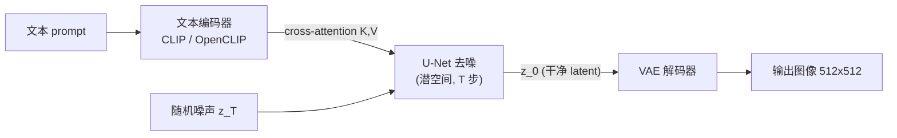

# Latent Diffusion 与 Stable Diffusion

> **一句话**：把扩散过程从高分辨率像素空间搬到 VAE 压缩后的潜空间，再用文本条件 + 交叉注意力 + CFG 驱动 U-Net 去噪，这就是 Stable Diffusion 能在消费级显卡上跑文生图的核心配方。
> 关键年份：LDM/Stable Diffusion（Rombach et al. 2021/2022，arXiv:2112.10752）；Classifier Guidance（Dhariwal & Nichol 2021，arXiv:2105.05233）；Classifier-Free Guidance（Ho & Salimans 2022，arXiv:2207.12598）；SDXL（Podell et al. 2023，arXiv:2307.01952）。
> 前置阅读：[扩散模型基础](/aigc/diffusion-basics)、[AIGC 总览](/aigc/)、[VLM 与多模态](/architecture/vlm)

## 为什么要在潜空间做扩散

[扩散模型基础](/aigc/diffusion-basics) 介绍的 DDPM/score-based 模型直接在像素上加噪去噪。问题在于算力：一张 $512\times512\times3$ 的图有约 78 万维，U-Net 要在这个分辨率上反复跑几十上百步，训练和采样成本都极高。Dhariwal & Nichol 的 ADM（arXiv:2105.05233）虽然在 ImageNet 上击败了 GAN，但其像素空间模型对算力的要求让大规模文生图难以普及。

Latent Diffusion Models（LDM，arXiv:2112.10752）的洞察是：图像里大量信息是**感知上冗余的高频细节**，可以先用一个自编码器把图压缩到低维潜空间，再在潜空间里做扩散。具体做法是训练一个 VAE（更准确说是带 KL 正则或 VQ 正则的自编码器），把图压到下采样因子 $f=8$ 的潜表示：$512\times512$ 的图变成 $64\times64\times4$ 的 latent，空间维度降到 $1/64$。

这样划分职责非常清晰：

- **自编码器负责"感知压缩"**：去掉肉眼几乎无感的高频冗余，但保留语义结构；
- **扩散模型负责"语义生成"**：只在紧凑的潜空间里建模数据分布。

算力收益是数量级的——同样质量下，潜空间扩散的训练与采样开销远低于像素空间，这正是 Stable Diffusion 能在单张消费级 GPU 上跑起来的根本原因。

## 三件套：VAE + U-Net + 文本条件

Stable Diffusion 推理流程可以拆成三个模块协作：

**1）VAE 编码器 / 解码器**。训练时编码器 $\mathcal{E}$ 把图像 $x$ 压到 latent $z=\mathcal{E}(x)$，扩散全程在 $z$ 上进行；推理时只用解码器 $\mathcal{D}$ 把去噪得到的 $z_0$ 还原为像素图 $\tilde{x}=\mathcal{D}(z_0)$。VAE 是独立预训练并冻结的，扩散训练时不更新它。

**2）U-Net 去噪网络**。这是真正学习去噪的主体，参数集中在这里。它在每个时间步 $t$ 预测噪声 $\epsilon_\theta(z_t, t, c)$，其中 $c$ 是条件。U-Net 的下采样/上采样块之间穿插了**交叉注意力（cross-attention）**层，用来注入条件。

**3）文本条件注入**。文本经文本编码器变成一串 token 嵌入序列，作为交叉注意力的 Key/Value，而 U-Net 的图像特征作为 Query：

$$\text{Attention}(Q,K,V)=\text{softmax}\!\left(\frac{QK^\top}{\sqrt{d}}\right)V,\quad Q=W_Q\,\varphi(z_t),\ \ K=W_K\,\tau(c),\ \ V=W_V\,\tau(c)$$

这里 $\tau(\cdot)$ 是文本编码器，$\varphi(z_t)$ 是 U-Net 中间特征。交叉注意力的好处是天然支持变长条件序列，且不局限于文本——LDM 原文也用它接入布局、语义图等条件（参见 [条件控制与定制](/aigc/control)）。文本编码器在 SD1.x 用 OpenAI CLIP 的 ViT-L/14 text encoder，SD2.x 换成 OpenCLIP ViT-H/14，相关原理见 [VLM 与多模态](/architecture/vlm)。

## Classifier Guidance vs Classifier-Free Guidance

条件生成的一个核心问题是：纯按条件采样往往多样性够但与条件的契合度不够。Guidance 就是用来调节"忠实度 vs 多样性"权衡的旋钮。

**Classifier Guidance（Dhariwal & Nichol 2021）**。额外训练一个在**带噪图像**上工作的分类器 $p_\phi(c\mid z_t)$，采样时用它的梯度去推动生成朝条件方向走：

$$\tilde{\epsilon}=\epsilon_\theta(z_t,t)-s\,\sqrt{1-\bar\alpha_t}\;\nabla_{z_t}\log p_\phi(c\mid z_t)$$

缺点很明显：要额外训一个噪声鲁棒的分类器，且只能引导到分类器认识的类别，难以扩展到开放文本。

**Classifier-Free Guidance（CFG，Ho & Salimans 2022）**。不需要分类器，而是训练时以一定概率（通常 10%~20%）把条件 $c$ 随机置空，让**同一个网络**同时学会条件预测 $\epsilon_c$ 与无条件预测 $\epsilon_\varnothing$。采样时把两者外推：

$$\tilde{\epsilon}=\epsilon_\varnothing+s\,(\epsilon_c-\epsilon_\varnothing)$$

其中 $s$ 即 **guidance scale**（CFG scale）。$s=1$ 退化为普通条件采样；$s>1$ 放大"条件方向"，画面更贴合 prompt、对比度更高，但过大会过饱和、丢细节、降多样性。SD 推理常用 $s\in[5,12]$ 左右。CFG 几乎是当今所有文生图模型的标配。

| 维度 | Classifier Guidance | Classifier-Free Guidance |
| --- | --- | --- |
| 额外模型 | 需训练带噪分类器 | 无 |
| 条件类型 | 受限于分类器类别 | 任意条件（文本等） |
| 训练改动 | 不改扩散模型 | 训练时随机丢弃条件 |
| 推理成本 | 1 次去噪 + 分类器梯度 | 每步 2 次去噪（条件 + 无条件） |
| 现状 | 已少用 | 事实标准 |

注意 CFG 的推理代价：每个时间步要分别算条件和无条件两次前向，因此实际去噪计算量约为不带 guidance 的两倍——这也是 [采样加速与蒸馏](/aigc/acceleration) 里很多蒸馏方法要专门把 CFG "烧进"模型的原因。

## Stable Diffusion 版本线

| 版本 | 文本编码器 | 原生分辨率 | 关键变化 |
| --- | --- | --- | --- |
| SD 1.4 / 1.5 | CLIP ViT-L/14 | 512×512 | LDM 配方落地，社区生态起点 |
| SD 2.0 / 2.1 | OpenCLIP ViT-H/14 | 768×768 | 换开源文本编码器，重训数据 |
| SDXL | CLIP ViT-L/14 + OpenCLIP ViT-bigG/14 | 1024×1024 | 更大 U-Net、双文本编码器、多分辨率训练、可选 refiner |

**SDXL（arXiv:2307.01952）** 是这条线的一次显著放大。论文要点（以官方为准）：U-Net backbone 约为前代的三倍大，参数增长主要来自更多注意力块；用**两个文本编码器**（CLIP ViT-L 与 OpenCLIP ViT-bigG）拼出更宽的交叉注意力上下文；采用**多宽高比（multi-aspect）训练**以更好支持非正方形构图；并额外提供一个 **refiner** 模型，用 image-to-image 的方式在后处理阶段提升细节保真度。

值得一提的是后续生态走向了两个方向：一是架构从 U-Net 迁往 Transformer（DiT）、训练目标从 DDPM 走向 Flow Matching / Rectified Flow（如 SD3、FLUX 系列，细节以官方为准），参见 [架构演进](/aigc/dit-flow)；二是围绕 SD/SDXL 衍生出庞大的可控生成与定制生态（ControlNet、LoRA、IP-Adapter），参见 [条件控制与定制](/aigc/control) 与 [LoRA](/lora/lora)。

## 小结

LDM/Stable Diffusion 的工程价值在于一组可组合的设计：用 VAE 把扩散搬进低维潜空间换来数量级的算力节省；用交叉注意力把文本（乃至任意模态）条件优雅地注入 U-Net；用 CFG 在无需额外分类器的前提下精确调节生成的忠实度。理解这三点，再去看 [架构演进](/aigc/dit-flow)、[采样加速](/aigc/acceleration) 和 [视频生成](/aigc/video) 就会顺畅很多。

## 参考文献

- Rombach, Blattmann, Lorenz, Esser, Ommer. *High-Resolution Image Synthesis with Latent Diffusion Models*. 2021/2022. arXiv:2112.10752（CVPR 2022）
- Dhariwal, Nichol. *Diffusion Models Beat GANs on Image Synthesis*. 2021. arXiv:2105.05233（提出 classifier guidance / ADM）
- Ho, Salimans. *Classifier-Free Diffusion Guidance*. 2022. arXiv:2207.12598
- Podell, English, Lacey, Blattmann, Dockhorn, Müller, Penna, Rombach. *SDXL: Improving Latent Diffusion Models for High-Resolution Image Synthesis*. 2023. arXiv:2307.01952
