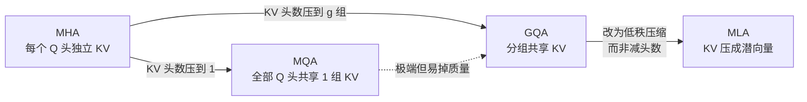

> **一句话**：从 MHA 到 MQA、GQA、MLA，这条演进主线本质上只做一件事——在尽量不掉质量的前提下，把自回归 decode 阶段的 **KV cache** 压下去。
> 关键年份：MQA（Shazeer 2019, arXiv:1911.02150）、GQA（Ainslie et al. 2023, arXiv:2305.13245）、MLA / DeepSeek-V2（2024, arXiv:2405.04434）。
> 前置阅读：[Transformer 基础架构](/architecture/transformer)、[KV cache 原理](/inference/kv-cache)、[DeepSeek 系列基座](/base-models/deepseek)。

## 为什么 decode 阶段 KV cache 是瓶颈

标准自注意力中，每个 token 的查询 $q$ 要和此前所有 token 的键值 $K, V$ 做交互。在自回归生成（decode）时，为了避免每生成一个 token 都重算整段历史的 $K, V$，实现上会把历史 $K, V$ 缓存下来，这就是 [KV cache](/inference/kv-cache)。

它带来两个直接后果：

- **显存占用随上下文长度线性增长**。KV cache 大小 $\propto$ 层数 $\times$ KV 头数 $\times$ 头维度 $\times$ 序列长度 $\times$ batch。长上下文、大并发场景下，KV cache 往往比模型权重还吃显存。
- **decode 是访存受限（memory-bound）**。生成每个 token 只算一个新 query，但要把整份 KV cache 从显存搬到计算单元。瓶颈在带宽而非算力，因此 **缩小 KV cache 几乎等价于提升 decode 吞吐**。

由此，"如何在保证质量的同时减小 KV cache" 成了注意力结构演进的核心动机。下面这条主线，区别基本可以归结为一句话：**到底保留多少个 KV 头**。

## MHA：基线

多头注意力（Multi-Head Attention）把 $d_{model}$ 切成 $n_h$ 个头，每个头有 **各自独立** 的 $W^Q, W^K, W^V$。缓存的 KV 头数等于 query 头数 $n_h$。

设头维度为 $d_h$、层数为 $l$，每个 token 的 KV cache 大小（元素数，不含 batch）：

$$\text{MHA: } 2 \cdot n_h \cdot d_h \cdot l$$

其中因子 2 来自 K 和 V 各一份。质量最好，但 KV cache 最大。

## MQA：KV 头压到 1

Shazeer 在 *Fast Transformer Decoding: One Write-Head is All You Need*（2019, arXiv:1911.02150）提出 **多查询注意力**（Multi-Query Attention）：保留 $n_h$ 个 query 头，但让 **所有 query 头共享同一组 K、V**（KV 头数 = 1）。

$$\text{MQA: } 2 \cdot d_h \cdot l$$

相比 MHA，KV cache 缩小到 $1/n_h$。decode 访存压力骤降，吞吐大幅提升。代价是表达能力受限——所有头共用一组 KV，原文指出会带来 **轻微的质量下降**，且对训练稳定性有一定影响。

## GQA：在 1 和 $n_h$ 之间取中

Ainslie 等人在 *GQA: Training Generalized Multi-Query Transformer Models from Multi-Head Checkpoints*（2023, arXiv:2305.13245，EMNLP 2023）提出 **分组查询注意力**：把 MQA 与 MHA 统一成一个可调谱系。

把 $n_h$ 个 query 头分成 $n_g$ 组（$1 \le n_g \le n_h$），**同组内的 query 头共享一组 K、V**：

$$\text{每组 query 头数} = \frac{n_h}{n_g}, \qquad \text{KV cache: } 2 \cdot n_g \cdot d_h \cdot l$$

两个端点正是已知结构：

- $n_g = n_h$ → 退化为 **MHA**；
- $n_g = 1$ → 退化为 **MQA**。

GQA 的另一贡献是 **uptraining**：可以从已有的 MHA checkpoint 出发，用约 5% 的原始预训练算力把它转换成 GQA 模型（KV 头按组做均值合并后继续训练），无需从头训。结论是：适中的 $n_g$（如 8）能 **质量逼近 MHA、速度接近 MQA**。这一折中使 GQA 成为当下开源大模型（如 Llama 2/3 70B、Mistral 等）的事实标准。详见 [Transformer 基础架构](/architecture/transformer) 与各 [基座模型](/base-models/) 页面。

## MLA：换条思路——低秩压缩而非减头数

MQA/GQA 都在 "减少 KV 头数" 这一维度上做文章。DeepSeek-V2（2024, arXiv:2405.04434）提出的 **多头潜在注意力**（Multi-head Latent Attention, MLA）换了思路：**保留多头的表达，但把 KV 联合压缩成一个低维潜向量再缓存**。

核心是 **低秩 KV 联合压缩**。对输入 $h_t$，先投影到一个维度远小于 $n_h d_h$ 的潜向量 $c_t^{KV}$，缓存时只存这个潜向量；推理时再用上投影矩阵把它 "解压" 回每个头的 K、V：

$$
c_t^{KV} = W^{DKV}\, h_t \in \mathbb{R}^{d_c}, \qquad
k_t^{C} = W^{UK}\, c_t^{KV}, \qquad
v_t^{C} = W^{UV}\, c_t^{KV}
$$

其中 $d_c \ll n_h d_h$ 是压缩维度，$W^{DKV}$ 为下投影（down-projection），$W^{UK}, W^{UV}$ 为上投影（up-projection）。**只有 $c_t^{KV}$ 进入 KV cache**，K、V 在用时现解压。Query 侧也做了类似的低秩压缩以省训练显存。

一个工程关键点：标准 RoPE 与这种 "缓存潜向量、用时再解压" 不兼容（位置旋转无法被吸收进上投影矩阵）。MLA 因此采用 **解耦 RoPE（decoupled RoPE）**：额外引入一组承载位置信息的 query 分量和一个 **所有头共享的带 RoPE 的 key**，与压缩部分拼接。于是 MLA 每 token 缓存的是 $c_t^{KV}$（维度 $d_c$）加上共享的 RoPE key（每头维度 $d_h^R$）：

$$\text{MLA: } (d_c + d_h^R)\cdot l$$

按原文 DeepSeek-V2 的配置（$d_c = 4 d_h$、$d_h^R = d_h/2$），这约等于 $\tfrac{9}{2} d_h \cdot l$，相当于一个 KV 头数约为 2.25 的 GQA，**但质量上 DeepSeek-V2 报告可超过 MHA**（以原文为准）。原文给出的整体收益：相比 DeepSeek 67B，**KV cache 减少约 93.3%、最大生成吞吐提升约 5.76 倍**（以原文为准）。

> 注：MLA 与 MoE 共同构成 DeepSeek-V2 的两大效率支柱，详见 [MoE 混合专家](/architecture/moe) 与 [DeepSeek 基座](/base-models/deepseek)；MLA 也被 DeepSeek-V3 / R1 沿用，相关训练算法见 [GRPO](/rlhf/grpo)。

## KV cache 大小对比

下表为 **每个 token、每层** 缓存的元素数（不含 batch；$n_h$ 为 query 头数，$n_g$ 为 KV 组数，$d_h$ 为头维度，$d_c$/$d_h^R$ 为 MLA 压缩维与解耦 RoPE 维）。

| 方法 | KV 头数 | 每 token KV cache（每层元素数） | 相对 MHA | 质量 |
| --- | --- | --- | --- | --- |
| MHA | $n_h$ | $2\, n_h\, d_h$ | $1\times$ | 基线（最好） |
| GQA | $n_g$（$1\!<\!n_g\!<\!n_h$） | $2\, n_g\, d_h$ | $n_g/n_h$ | 接近 MHA |
| MQA | $1$ | $2\, d_h$ | $1/n_h$ | 轻微下降 |
| MLA | —（低秩） | $(d_c + d_h^R) \approx \tfrac{9}{2} d_h$ | $\approx 2.25/n_h$ | 报告可 $\ge$ MHA |

> 表中 MHA/GQA/MQA/MLA 的表达式与 MLA 的 $\tfrac{9}{2}d_h$ 估算均来自 DeepSeek-V2 论文 Table 1（arXiv:2405.04434），具体数值以原文为准。直观结论：**MQA 最省但易掉质量，GQA 是省显存与保质量的稳健折中，MLA 用低秩压缩在小 KV cache 下逼近甚至超过 MHA**。

## 选型小结

- 想最大化兼容性与稳健质量：**GQA**（开源主流，$n_g$ 常取 8）。
- 极致省显存、可接受轻微质量损失：**MQA**。
- 追求长上下文 + 高吞吐、愿意采用更复杂结构：**MLA**。

注意：本页只覆盖 "标准点积注意力的 KV 高效化变体"。改变注意力 **计算复杂度** 的稀疏注意力、线性注意力（如 Linear Attention、Sliding Window、Mamba 类）归 [稀疏与线性注意力](/architecture/sparse-attention)；位置编码（RoPE 等）的细节见 [位置编码与归一化](/architecture/positional-norm)。

## 参考文献

- Shazeer, N. *Fast Transformer Decoding: One Write-Head is All You Need.* 2019. arXiv:1911.02150
- Ainslie, J. et al. *GQA: Training Generalized Multi-Query Transformer Models from Multi-Head Checkpoints.* EMNLP 2023. arXiv:2305.13245
- DeepSeek-AI. *DeepSeek-V2: A Strong, Economical, and Efficient Mixture-of-Experts Language Model.* 2024. arXiv:2405.04434
- Vaswani, A. et al. *Attention Is All You Need.* 2017. arXiv:1706.03762
