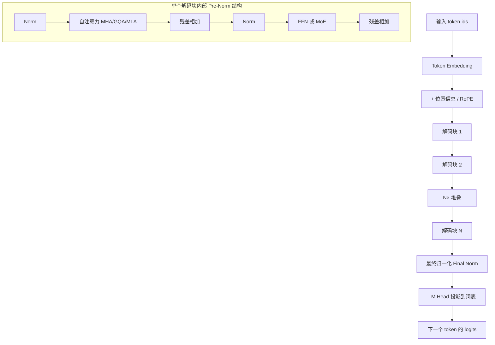
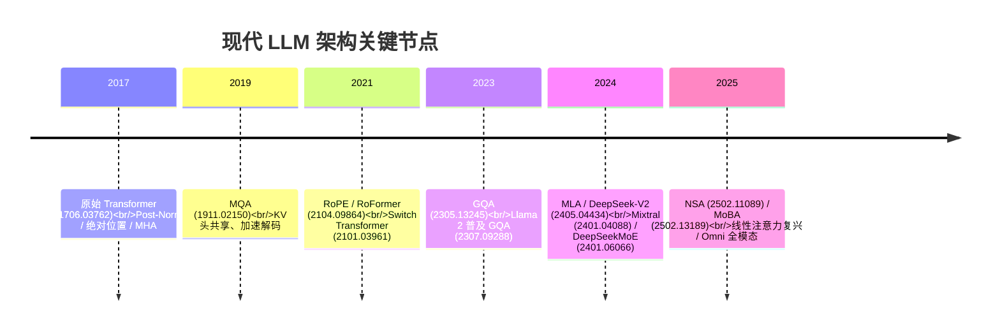

# 模型架构总览

> **一句话**：现代主流 LLM 是「token embedding → N 个堆叠的解码块（注意力 + FFN/MoE，配残差与归一化）→ 最终归一化 → LM head」这一 decoder-only 骨架的不断改良，本篇是这张架构地图与其演进主线的索引。
> 关键年份：Transformer 2017（arXiv 1706.03762），MQA 2019（arXiv 1911.02150），Switch/RoPE 2021（arXiv 2101.03961、2104.09864），GQA/Llama 2 2023（arXiv 2305.13245、2307.09288），MLA/Mixtral/DeepSeekMoE 2024（arXiv 2405.04434、2401.04088、2401.06066），NSA/MoBA 2025（arXiv 2502.11089、2502.13189）。
> 前置阅读：[Transformer 基础架构](/architecture/transformer)、[基座模型](/base-models/)、[KV Cache](/inference/kv-cache)

本页不展开任何单一技术的推导（那是各子页的职责），目标是给出两样东西：一张**现代 decoder-only LLM 的解剖图**，以及一条从 2017 年原始 Transformer 走到今天的**演进主线**。读完本页，你应当知道每个改进点解决了什么瓶颈，以及到哪一页深入。

## 一、现代 decoder-only LLM 的解剖结构

今天绝大多数对话/推理大模型（GPT、Llama、Qwen、DeepSeek 等）共享同一套 decoder-only 骨架：输入 token 经过嵌入层后，进入 $N$ 个结构相同的**解码块**串行堆叠；每个解码块由「注意力子层」和「前馈子层（FFN 或 MoE）」两部分组成，二者都包在「残差连接 + 归一化」之中；最后一个解码块的输出经一次最终归一化，再由 LM head（通常与嵌入矩阵权重共享）投影回词表维度，得到下一个 token 的 logits。

形式上，第 $\ell$ 个 Pre-Norm 解码块对隐状态 $h$ 的更新可写作：

$$
h' = h + \mathrm{Attn}\big(\mathrm{Norm}(h)\big), \qquad
h'' = h' + \mathrm{FFN}\big(\mathrm{Norm}(h')\big)
$$

整张图里的每一个组件都对应一条独立的演进线索：注意力子层从 MHA 演化到 GQA/MLA；FFN 子层从 Dense 演化到 MoE；位置信息从绝对位置编码演化到 RoPE；归一化从 Post-Norm 演化到 Pre-Norm + RMSNorm；全注意力在长序列下又分化出稀疏/线性变体。下面逐条梳理。

## 二、从 2017 Transformer 到现代 LLM 的演进主线

原始 Transformer（arXiv 1706.03762）是 encoder-decoder 结构，用于机器翻译，采用 Post-Norm、正弦绝对位置编码、标准多头注意力（MHA）和 Dense FFN。现代 LLM 在保留「注意力 + FFN」核心的同时，几乎把每个外围组件都换了一遍：

| 维度 | 原始 Transformer (2017) | 现代主流做法 | 主要动机 | 深入页面 |
| --- | --- | --- | --- | --- |
| 归一化位置 | Post-Norm | Pre-Norm | 深层训练更稳定、可去 warmup | [位置编码与归一化](/architecture/positional-norm) |
| 归一化算子 | LayerNorm | RMSNorm | 去掉均值中心化，更省算力 | [位置编码与归一化](/architecture/positional-norm) |
| 位置信息 | 正弦绝对位置 | RoPE（旋转位置编码） | 相对位置、易外推到长上下文 | [位置编码与归一化](/architecture/positional-norm) |
| 注意力 | MHA | GQA / MLA | 压缩 KV Cache、降解码带宽 | [注意力变体](/architecture/attention) |
| 长序列注意力 | 全注意力 $O(L^2)$ | 稀疏 / 线性注意力 | 长上下文下的算力与显存 | [稀疏与线性注意力](/architecture/sparse-attention) |
| 前馈层 | Dense FFN | MoE（稀疏激活） | 扩参数量而不等比扩算力 | [MoE 混合专家](/architecture/moe) |
| 模态 | 单模态文本 | VLM / Omni | 接入图像、音视频等模态 | [VLM](/architecture/vlm)、[Omni](/architecture/omni) |
| 整体结构 | encoder-decoder | decoder-only | 自回归生成的统一范式 | [Transformer 基础架构](/architecture/transformer) |

几点要点：

- **Post-Norm → Pre-Norm / RMSNorm**：把归一化挪到子层之前，残差通路上始终保留一条「干净」的恒等路径，让几十上百层的网络训练得起来；RMSNorm 进一步省掉减均值，是当下事实标准。
- **绝对位置 → RoPE**：用旋转矩阵把位置信息注入 Q/K，自然表达相对位置，并为长上下文外推（如 NTK、YaRN 等缩放方法）提供了基础。
- **MHA → GQA / MLA**：自回归解码的瓶颈在 KV Cache 的显存与带宽。GQA（Llama 2 起广泛采用）让多个 query 头共享一组 KV 头；MLA（DeepSeek-V2）则把 KV 联合压缩进低秩潜空间，DeepSeek-V2 报告 KV Cache 降约 93%（以原文 arXiv 2405.04434 为准）。详见 [KV Cache](/inference/kv-cache)。
- **Dense FFN → MoE**：用路由器为每个 token 仅激活少数专家，使总参数量大幅扩张而每 token 算力近似不变。Mixtral 8x7B 总参约 47B、每 token 仅激活约 13B（以原文 arXiv 2401.04088 为准）。
- **全注意力 → 稀疏 / 线性**：当上下文涨到数十万 token，$O(L^2)$ 注意力成为主要开销，催生了 NSA、MoBA 等可原生训练的稀疏注意力，以及线性注意力路线。
- **单模态 → VLM / Omni**：在文本骨架外接入视觉编码器（VLM），再进一步统一图像、音频、视频乃至语音输出（Omni）。

值得强调：这些改进大多**正交且可叠加**。一个 2024–2025 的代表性模型，往往同时是「Pre-Norm + RMSNorm + RoPE + GQA/MLA + MoE」的组合，而非单点替换。

## 三、本章页面导航

| 页面 | 一句话定位 |
| --- | --- |
| [Transformer 基础架构](/architecture/transformer) | decoder-only 骨架的逐层拆解：嵌入、解码块、残差、LM head。 |
| [注意力变体（MHA/MQA/GQA/MLA）](/architecture/attention) | 围绕 KV Cache 的注意力压缩谱系，从 MHA 到 MLA。 |
| [稀疏与线性注意力](/architecture/sparse-attention) | 长上下文下打破 $O(L^2)$：滑窗、块稀疏（NSA/MoBA）与线性注意力。 |
| [位置编码与归一化](/architecture/positional-norm) | RoPE 与外推、Pre/Post-Norm、LayerNorm/RMSNorm。 |
| [MoE 混合专家](/architecture/moe) | 稀疏激活的 FFN：路由、负载均衡、细粒度专家与共享专家。 |
| [VLM 多模态结构](/architecture/vlm) | 视觉编码器 + 投影 + LLM 的图文理解结构。 |
| [Omni 全模态架构](/architecture/omni) | 统一文本/图像/音视频输入与多模态输出的全模态范式。 |

## 四、架构演进时间线

时间线背后是一条清晰的主线：**早期（2017–2021）确立骨架并解决「训得稳、编码好位置」；中期（2023–2024）围绕推理效率压缩 KV、用 MoE 扩容量；近期（2025）转向超长上下文的稀疏/线性注意力与跨模态统一。** 不同年份的工作对应解剖图上的不同部件，互不冲突，共同构成今天的主流配置。

## 参考文献

- Vaswani et al. *Attention Is All You Need.* arXiv:1706.03762
- Shazeer. *Fast Transformer Decoding: One Write-Head is All You Need (MQA).* arXiv:1911.02150
- Fedus et al. *Switch Transformers.* arXiv:2101.03961
- Su et al. *RoFormer: Enhanced Transformer with Rotary Position Embedding (RoPE).* arXiv:2104.09864
- Ainslie et al. *GQA: Training Generalized Multi-Query Transformer Models from Multi-Head Checkpoints.* arXiv:2305.13245
- Touvron et al. *Llama 2: Open Foundation and Fine-Tuned Chat Models.* arXiv:2307.09288
- Jiang et al. *Mixtral of Experts.* arXiv:2401.04088
- Dai et al. *DeepSeekMoE: Towards Ultimate Expert Specialization in Mixture-of-Experts Language Models.* arXiv:2401.06066
- DeepSeek-AI. *DeepSeek-V2: A Strong, Economical, and Efficient Mixture-of-Experts Language Model (MLA).* arXiv:2405.04434
- Yuan et al. *Native Sparse Attention: Hardware-Aligned and Natively Trainable Sparse Attention (NSA).* arXiv:2502.11089
- MoonshotAI. *MoBA: Mixture of Block Attention for Long-Context LLMs.* arXiv:2502.13189
