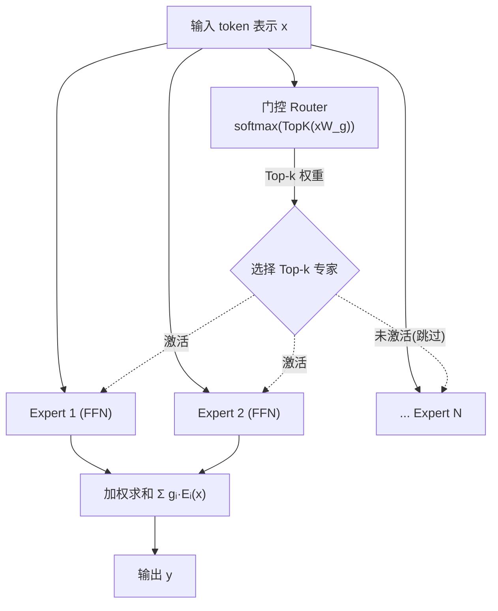

> **一句话**：MoE（Mixture-of-Experts）用稀疏门控把 FFN 拆成多个专家，每个 token 只激活其中少数几个，从而在参数量大幅增长的同时把单 token 计算量控制在接近 dense 小模型的水平。
> 关键年份：Sparsely-Gated MoE 2017（arXiv:1701.06538）、GShard 2020（arXiv:2006.16668）、Switch Transformer 2021（arXiv:2101.03961）、Mixtral 与 DeepSeekMoE 2024（arXiv:2401.04088 / arXiv:2401.06066）、DeepSeek-V3 aux-loss-free 2024（arXiv:2412.19437）。
> 前置阅读：[Transformer 基础架构](/architecture/transformer)、[注意力变体](/architecture/attention)、[KV Cache](/inference/kv-cache)

## 为什么要 MoE：解耦参数量与计算量

Dense Transformer 里，每一层的 FFN（前馈网络）对每个 token 都要全量参与计算——参数量和单 token FLOPs 是绑死的。要想更聪明就得更大，更大就意味着每个 token 都更贵。

MoE 的核心思想是**条件计算（conditional computation）**：把一个大 FFN 替换成 $N$ 个并列的小 FFN（称为「专家」），再加一个门控网络（router/gate），让它为每个 token **只挑选 Top-$k$ 个专家**来计算。于是：

- **总参数量** 随专家数 $N$ 线性增长（容纳更多知识）；
- **激活参数量 / 单 token 计算量** 只随 $k$ 增长，与 $N$ 解耦。

Mixtral 8x7B 是个直观例子：8 个专家、每 token 激活 2 个，总参数约 47B，但每 token 仅用约 13B 激活参数（数字以原文 arXiv:2401.04088 为准）。这就是 MoE 的卖点——「用 47B 的知识量，付 13B 的计算价」。

## 稀疏门控与 Top-k 路由

门控的标准形式：对 token 表示 $x$ 先算它与每个专家的亲和度（affinity）$x W_g$，取 Top-$k$，再 softmax 归一化得到权重：

$$
g = \mathrm{softmax}\big(\mathrm{TopK}(x W_g,\, k)\big)
$$

其中 $\mathrm{TopK}$ 把非 Top-$k$ 的 logit 置为 $-\infty$，使其 softmax 后权重为 0。MoE 层的输出是被选中专家的加权和：

$$
y = \sum_{i \in \mathcal{T}} g_i \cdot E_i(x), \qquad \mathcal{T} = \text{Top-}k\ \text{专家集合}
$$

不同工作对 $k$ 的取舍：

| 工作 | 路由 $k$ | 特点 |
| --- | --- | --- |
| GShard (2020) | Top-2 | 大规模多语言 MT，>600B 参数，引入容量与 aux loss |
| Switch Transformer (2021) | Top-1 | 把 Top-2 简化为单专家，省通信，规模到 1.6T |
| Mixtral (2024) | Top-2 | 8 专家开源 SMoE，每 token 激活 2 个 |
| DeepSeekMoE / V3 (2024) | 细粒度 Top-k + 共享专家 | 见下文 |

> Shazeer 等人 2017（arXiv:1701.06538）首次在 LSTM 语言模型上落地稀疏门控 MoE，规模达到上千专家、数十亿参数，是这条线的起点。

## MoE 层结构

在 Transformer 里，通常**每隔若干层**或每一层把 FFN 子层替换为 MoE 层，注意力子层保持 dense。

## 负载均衡：从 aux loss 到 aux-loss-free

稀疏门控有个老大难问题：门控容易**塌缩**——只爱用少数几个专家，其余专家训练不足、利用率低，且把 token 挤在少数专家上会撑爆其[容量](#容量因子与专家并行)、造成 token 被丢弃（drop）。

**辅助损失（auxiliary loss / load-balancing loss）** 是经典解法（GShard、Switch 都用）。其思路是鼓励 token 在专家间均匀分布，常见形式是「每个专家被分到的 token 比例 $f_i$」与「平均门控概率 $P_i$」的乘积之和：

$$
\mathcal{L}_{\text{aux}} = \alpha \cdot N \sum_{i=1}^{N} f_i \, P_i
$$

它逼近负载方差，惩罚不均衡。但代价是：这个梯度与语言建模主目标**无关甚至冲突**，$\alpha$ 调大则均衡但伤性能，调小则失衡。

**DeepSeek-V3 的 aux-loss-free 策略（arXiv:2412.19437）** 换了思路：给每个专家引入一个**可学习/动态调整的偏置项** $b_i$，只在 Top-k **选择** 时加到亲和度上，但**不参与门控权重**的计算：

$$
\mathcal{T} = \text{Top-}k\big(\{\, s_i + b_i \,\}\big), \qquad g_i \propto s_i \ (\text{权重仍用原始 } s_i)
$$

训练中按 batch 监控各专家负载：**过载的专家调低 $b_i$，空闲的调高 $b_i$**，靠改变「谁被选中」而非给主损失加项来纠偏。这样既保持均衡，又避免辅助损失污染主梯度（细节以原文为准）。DeepSeek 系列模型见 [base-models/deepseek](/base-models/deepseek)。

## 细粒度专家 + 共享专家：DeepSeekMoE

DeepSeekMoE（arXiv:2401.06066）的目标是「极致专家专业化」，两个关键设计：

1. **细粒度专家切分（Fine-Grained Expert Segmentation）**：在保持总参数与激活计算不变的前提下，把每个专家的 FFN 中间维度切小、专家数变多，同时激活更多个细粒度专家。更细的粒度让知识被更精细地分解、每个专家更专一，激活专家的组合也更灵活。
2. **共享专家隔离（Shared Expert Isolation）**：保留 $K_s$ 个**共享专家**，**每个 token 都恒定经过它们**（不经路由），专门承载跨上下文的公共知识，从而减少被路由专家之间的冗余。

> DeepSeekMoE 报告：2B 版本可媲美 GShard 2.9B（后者专家参数与计算约为其 1.5 倍）；16B 版本以约 40% 的计算量逼近 LLaMA2 7B（数字以原文为准）。Qwen 等团队也采用了类似的细粒度 + 共享专家方案，见 [base-models/qwen](/base-models/qwen)。

## 容量因子与专家并行（工程视角）

把 MoE 真正训起来、跑起来，绕不开两个工程概念：

- **容量因子（capacity factor）**：每个专家在一个 batch 里能处理的 token 数有上限：
  $$
  \text{capacity} = \text{capacity\_factor} \times \frac{\text{tokens}}{N}
  $$
  超过上限的 token 被**丢弃（dropped）** 或溢出到残差。容量因子越大越不丢 token，但显存/计算浪费越多（很多专家槽位空着）；越小越省，但丢 token 多。这是均衡问题之外的另一个张力。GShard 即用容量上限配合 Top-2 路由控制每 token 计算预算。

- **专家并行（Expert Parallelism, EP）**：专家数量多、单卡放不下，于是把不同专家分散到不同 GPU/节点上。路由后需要用 **All-to-All** 通信把 token 发到对应专家所在的卡、算完再收回来。EP 通常与张量并行（TP）、数据并行（DP）、流水并行（PP）组合使用。All-to-All 通信量大，是 MoE 训练/推理的主要瓶颈之一——Switch 选 Top-1 的一大动机正是减少这部分通信。

## 与 Dense 的取舍

| 维度 | Dense | MoE |
| --- | --- | --- |
| 总参数量 | 与计算绑定 | 可远大于激活参数 |
| 单 token 计算（FLOPs） | 全量 | 仅 Top-k 专家，更省 |
| 训练显存 | 较低 | **高**——所有专家权重都要存、还有优化器状态 |
| 推理显存 | 较低 | **高**——全部专家常驻，但激活算力小 |
| 通信 | 常规 TP/DP | 额外 All-to-All（EP），易成瓶颈 |
| 工程复杂度 | 低 | 高（负载均衡、容量、路由稳定性） |
| 同等激活算力下的效果 | 基准 | 通常更强（更多知识容量） |

一句话总结取舍：**MoE 用「显存换效果」、用「工程复杂度换计算效率」**。当你受限于单 token 推理算力、但显存/带宽充裕时，MoE 往往是更划算的扩容方式；反之在小显存、强延迟约束的边缘场景，dense 仍更省心。MoE 训练同样可以接 RLHF 流程，见 [/rlhf/grpo](/rlhf/grpo)。

## 参考文献

- Shazeer et al. *Outrageously Large Neural Networks: The Sparsely-Gated Mixture-of-Experts Layer.* 2017. arXiv:1701.06538
- Lepikhin et al. *GShard: Scaling Giant Models with Conditional Computation and Automatic Sharding.* 2020. arXiv:2006.16668
- Fedus et al. *Switch Transformers: Scaling to Trillion Parameter Models with Simple and Efficient Sparsity.* 2021. arXiv:2101.03961
- Jiang et al. *Mixtral of Experts.* 2024. arXiv:2401.04088
- Dai et al. *DeepSeekMoE: Towards Ultimate Expert Specialization in Mixture-of-Experts Language Models.* 2024. arXiv:2401.06066
- DeepSeek-AI. *DeepSeek-V3 Technical Report.* 2024. arXiv:2412.19437
