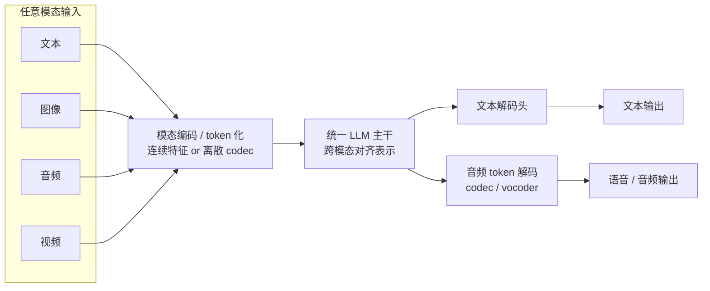
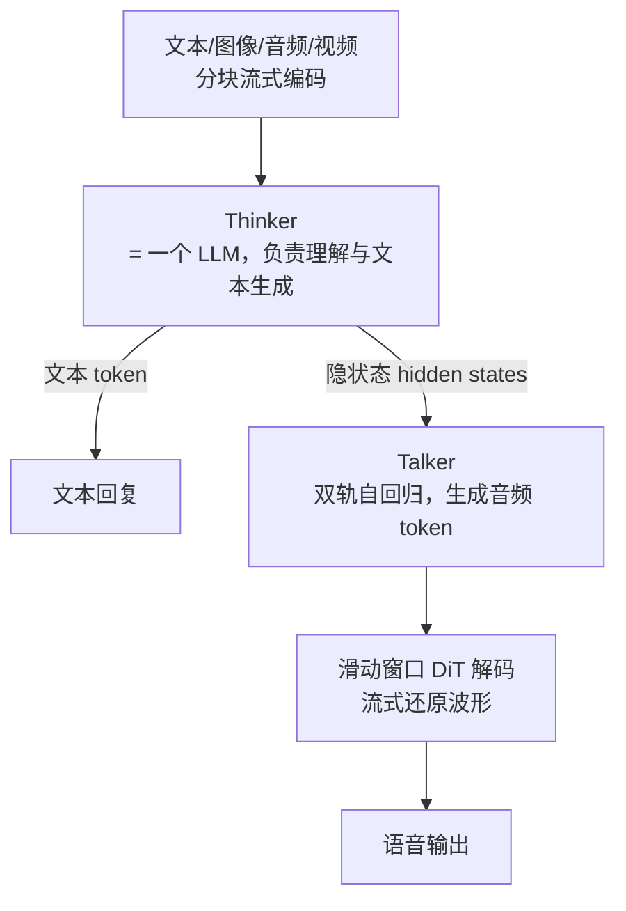

> **一句话**：Omni 模型在 VLM「图像 + 文本」的基础上把**音频/语音、视频、实时流**也纳入同一个网络，目标是用一个模型完成 any-to-any 的理解与生成，并支撑低延迟的语音交互。
> 关键年份：AnyGPT 2024 (arXiv:2402.12226)，GPT-4o 2024（OpenAI，定性），MiniCPM-o 2.6 2025，Qwen2.5-Omni 2025 (arXiv:2503.20215)，Step-Audio-AQAA 2025 (arXiv:2506.08967)。
> 前置阅读：[VLM 多模态结构](/architecture/vlm)、[注意力变体](/architecture/attention)、[位置编码与归一化](/architecture/positional-norm)

## 从 VLM 到 Omni：多了哪两件事

[VLM](/architecture/vlm) 已经解决了「视觉编码器 → 投影 → LLM 文本输出」的范式。Omni 在此之上要补两件本质不同的事：

1. **音频/语音的输入与输出**。语音不是「另一张图」：它是时间序列、信息密度低、且对话场景里既要**听懂**（ASR 类理解）又要**说出来**（TTS 类生成）。这要求模型同时具备音频理解和音频生成两条链路。
2. **实时流式（streaming）与低延迟**。人类对话的轮次间隔在数百毫秒级；GPT-4o 报告其音频响应可低至约 232ms、平均约 320ms（OpenAI 官方，定性数字以原文为准）。要达到这种体验，编码、推理、解码都不能等整段输入/输出齐了再处理，必须**边收边算、边算边吐**。

可以把 Omni 概括为：**VLM 的视觉栈 + 音频理解栈 + 音频生成栈 + 流式调度**，并尽量收敛到一个端到端可训练的网络里。

## 统一多模态 token 化：离散 codec vs 连续特征

让一个 LLM 主干吞下异构模态，关键是「把所有模态变成主干能消费的序列」。主要有两条路线：

| 路线 | 做法 | 代表 | 特点 |
| --- | --- | --- | --- |
| 离散 token（codec / VQ） | 用神经音频 codec（如 RVQ 类）把波形量化成离散 token，和文本 token 拼在同一词表里自回归建模 | AnyGPT | 改动小，「像加一门新语言」一样接入；可统一理解与生成；但量化有信息损失 |
| 连续特征（encoder 投影） | 用 Whisper 类音频编码器、ViT/SigLIP 类视觉编码器输出连续向量，经投影喂给 LLM | Qwen2.5-Omni、MiniCPM-o | 理解侧保真度高；但生成侧仍需另配解码器把 LLM 隐状态还原成波形 |

AnyGPT (arXiv:2402.12226) 是离散路线的典型：它把语音、文本、图像、音乐都转成离散 token，**不改 LLM 架构、只在数据层做预处理**，从而把 any-to-any 多模态对话统一成一个自回归序列建模问题；并配套了 AnyInstruct-108k 指令数据用于多轮交错多模态对话训练。

实践中两条路线常**混用**：理解侧用连续特征保真，生成侧用离散音频 token 配 codec/vocoder 还原波形。关于离散音频 token 的核心作用，可类比文本里的 BPE——它把连续信号压成可被自回归预测的符号序列，是「用 LLM 生成语音」的桥梁。

## 理解 + 生成统一：any-to-any

「any-to-any」指输入可以是文本/图像/音频/视频的任意组合，输出也可以是其中任意组合。实现上的难点是：**同一个主干既要做判别式理解，又要做生成式输出**，而文本生成和音频生成的分布差异很大，直接混在一个解码头里容易互相干扰。

GPT-4o 把「o = omni」做成了**单一网络端到端横跨文本/视觉/音频**的输入输出（OpenAI 官方描述，内部细节未公开，此处定性）。开源侧则给出了更可解剖的设计。

## Thinker-Talker：边理解边说

Qwen2.5-Omni (arXiv:2503.20215) 提出 **Thinker-Talker** 架构来缓解「文本与语音互相干扰」的问题：

要点：

- **Thinker** 是 LLM，专注理解多模态输入并生成文本；**Talker** 是一个双轨自回归模型，**直接复用 Thinker 的隐状态**来产出音频 token——这样语音生成天然以语义为条件，又不挤占文本生成的容量。
- **流式编码**：音视频编码器采用分块（block-wise）处理，使输入侧也能流式。
- **音视频时间对齐**：提出 TMRoPE（Time-aligned Multimodal RoPE），把音频与视频按时间戳交错排布并对齐位置编码（位置编码背景见 [位置编码与归一化](/architecture/positional-norm)）。
- **流式解码**：音频 token 用滑动窗口 DiT（Diffusion Transformer）限制感受野，降低首包延迟。

MiniCPM-o 2.6（2025）走的是另一种工程化路线：基于 SigLIP（视觉）+ Whisper（音频理解）+ ChatTTS（语音生成）+ Qwen2.5-7B 主干拼成约 8B 的端到端模型，把离线编/解码器改为在线版本，并在 LLM 主干里用**时分复用（TDM）**把并行的多模态流切成周期性小时间片顺序送入，从而支持持续视频/音频流与实时语音交互（数字与组件以原文为准）。

国内 [StepFun](/base-models/stepfun) 的 Step-Audio 系列则强调**纯语音到语音**（AQAA，Audio Query–Audio Answer）：Step-Audio-AQAA (arXiv:2506.08967) 用双码本 tokenizer + Step-Omni 多模态主干 + flow-matching vocoder，直接「听到→说出」而不经中间文本（细节以原文为准）。

## 与纯 VLM 的关键差异

| 维度 | 纯 VLM | Omni |
| --- | --- | --- |
| 输入模态 | 图像 + 文本（部分含视频帧） | 文本/图像/音频/视频任意组合 |
| 输出模态 | 文本 | 文本 + 语音（乃至更多模态）|
| 时间维度 | 弱（静态图为主） | 强（音频/视频是时序流，需时间对齐如 TMRoPE）|
| 延迟要求 | 批式即可 | 流式低延迟，首包毫秒级 |
| 生成栈 | 复用 LLM 文本头 | 额外的音频 token 解码 + codec/vocoder/DiT |
| 典型挑战 | 视觉-文本对齐 | 多流调度、文本-语音解耦、流式 [KV Cache](/inference/kv-cache) 与首包延迟 |

流式与低延迟也对推理基础设施提出新要求：增量编码、增量解码、以及在长音视频上下文下的 [KV Cache](/inference/kv-cache) 管理都成为系统瓶颈。而把语音/视频引入 RL 反馈（如对话偏好、语音自然度）也是 [RLHF/GRPO](/rlhf/grpo) 类方法在 Omni 场景的延伸方向。

更多主干与多模态产品族可参见 [Qwen](/base-models/qwen)、[StepFun](/base-models/stepfun)，以及上一页 [VLM 多模态结构](/architecture/vlm)。

## 参考文献

- AnyGPT: Unified Multimodal LLM with Discrete Sequence Modeling. arXiv:2402.12226
- Qwen2.5-Omni Technical Report. arXiv:2503.20215
- Step-Audio-AQAA: a Fully End-to-End Expressive Large Audio Language Model. arXiv:2506.08967
- MiniCPM-o 2.6（OpenBMB，2025，技术博客/模型卡）
- Hello GPT-4o（OpenAI，2024，官方介绍，原生全模态、音频低延迟为定性描述）
