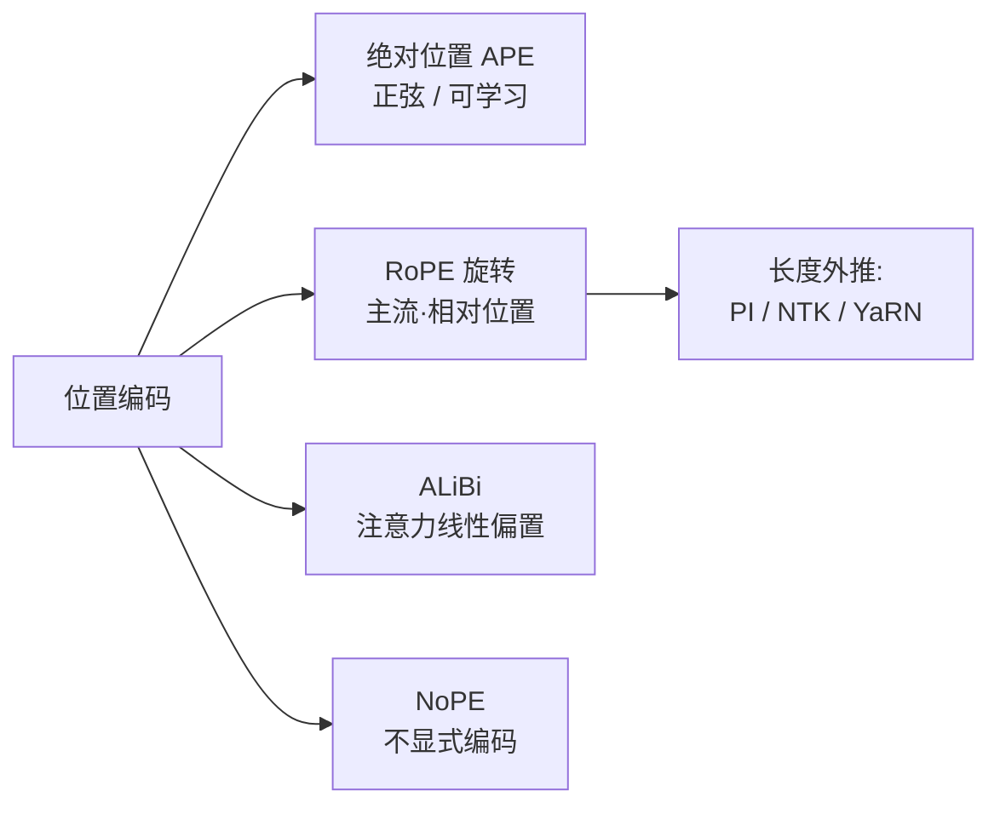
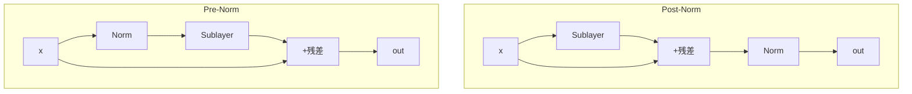

# 位置编码与归一化

> **一句话**：位置编码决定 Transformer 如何"感知顺序"，归一化决定它能否"稳定地训深"——二者是把注意力机制变成可用大模型的两条工程支柱。
> 关键年份：LayerNorm 2016（arXiv:1607.06450），RMSNorm 2019（arXiv:1910.07467），RoPE/RoFormer 2021（arXiv:2104.09864），ALiBi 2021（arXiv:2108.12409），YaRN 2023（arXiv:2309.00071）。
> 前置阅读：[Transformer 基础架构](/architecture/transformer)、[注意力变体（MHA/MQA/GQA/MLA）](/architecture/attention)、[KV Cache](/inference/kv-cache)

自注意力本身是**置换不变**（permutation-invariant）的：把输入 token 的顺序打乱，注意力的输出只会跟着排列，而不会改变彼此的关系。语言显然依赖顺序，因此必须**显式注入位置信息**。与此同时，把网络堆到几十上百层时，激活值的尺度漂移会让训练发散，**归一化**就是控制这种漂移、保证梯度可流动的关键。本页把这两件事一并讲清楚。

## 一、位置编码

### 1.1 绝对位置编码（APE）

原始 Transformer 用**正弦绝对位置编码**：对位置 $p$、维度 $i$，

$$
\mathrm{PE}(p, 2i) = \sin\!\left(\frac{p}{10000^{2i/d}}\right),\quad
\mathrm{PE}(p, 2i+1) = \cos\!\left(\frac{p}{10000^{2i/d}}\right),
$$

然后把 $\mathrm{PE}$ 直接**加到词向量**上。BERT/GPT-2 则改用**可学习的绝对位置嵌入**（learned APE）：每个位置一个可训练向量。

绝对位置编码的局限很直接：

- **外推差**：可学习版本对训练时未见过的位置（更长序列）几乎无法泛化。
- **加性注入**：位置信息和语义信息在同一向量里相加，注意力点积里位置项与内容项纠缠，表达不够"干净"。
- **关注的是绝对位置，但语言更在意相对距离**。

### 1.2 RoPE：旋转位置编码（当前主流）

RoPE（Rotary Position Embedding，Su et al., 2021，arXiv:2104.09864）是当前主流方案，LLaMA、Qwen、Mistral、DeepSeek 等几乎都用它。核心想法：**不把位置加到向量上，而是按位置把 query/key 向量"旋转"一个角度**，从而让注意力点积天然只依赖**相对位置**。

把 $d$ 维向量两两配对成 $d/2$ 个二维子空间。对位置 $m$ 的查询向量 $\mathbf{q}$，在第 $i$ 个子空间上施加旋转角 $m\theta_i$：

$$
\begin{pmatrix} q'_{2i} \\ q'_{2i+1} \end{pmatrix}
=
\begin{pmatrix} \cos m\theta_i & -\sin m\theta_i \\ \sin m\theta_i & \cos m\theta_i \end{pmatrix}
\begin{pmatrix} q_{2i} \\ q_{2i+1} \end{pmatrix},
\qquad
\theta_i = 10000^{-2i/d}.
$$

记旋转矩阵为 $R_m$，则 $\tilde{\mathbf q}_m = R_m \mathbf q$、$\tilde{\mathbf k}_n = R_n \mathbf k$。关键性质来自旋转矩阵的正交性：

$$
\langle R_m \mathbf q,\; R_n \mathbf k\rangle
= \mathbf q^\top R_m^\top R_n \mathbf k
= \mathbf q^\top R_{n-m}\, \mathbf k,
$$

即点积**只依赖相对位置 $n-m$**，绝对位置自动消去。RoPE 的优点：

- 把位置信息编进 Q/K，**不增加额外参数**，对长程依赖有自然的衰减性质；
- 是**相对位置**编码，但实现上像绝对编码一样作用于每个 token，与 [KV Cache](/inference/kv-cache) 兼容良好——缓存里存的是旋转后的 K，增量解码直接复用。

#### RoPE 的长度外推：插值、NTK 与 YaRN

RoPE 在训练长度内表现好，但**直接推到更长上下文会迅速崩溃**（高频维度旋转超出训练见过的角度范围）。常见扩展手段：

| 方法 | 做法 | 直觉 |
| --- | --- | --- |
| **位置插值（PI）** | 把位置 $m$ 缩放为 $m/s$（$s$=扩展倍数） | 所有频率"等比压缩"，把长序列塞回训练范围，需少量微调 |
| **NTK-aware** | 改 base（如 $10000\to 10000\cdot s^{d/(d-2)}$），高频少缩、低频多缩 | 把"插值压力"分摊到各维度，常可免微调用一段 |
| **Dynamic NTK** | 推理时随序列长度动态调 base | 短序列不损精度，长序列再放大 |
| **YaRN** | NTK-by-parts 分段插值 + 注意力温度缩放 | 高频维不插值、低频维插值，并配合 attention scaling |

YaRN（Peng et al., 2023，arXiv:2309.00071）综合了"按部分插值（NTK-by-parts）"与注意力温度缩放，是目前长上下文扩展中效果与训练成本较优的代表，已被 Qwen 等模型采用（具体数字以原文为准）。NTK-aware / Dynamic NTK 也已在 Code Llama、Qwen 等开源模型中落地（以各模型技术报告为准）。

### 1.3 ALiBi：注意力线性偏置

ALiBi（Attention with Linear Biases，Press et al., 2021，arXiv:2108.12409）走了另一条路：**完全不加位置嵌入**，而是在注意力 logits 上按相对距离加一个线性惩罚：

$$
\text{score}(i, j) = \mathbf q_i^\top \mathbf k_j \;-\; m \cdot (i - j),
$$

其中斜率 $m$ 是每个注意力头固定的常数（不同头取不同斜率）。距离越远惩罚越大。ALiBi 的卖点是**强外推能力**：在短序列上训练、推理时直接用到更长序列，几乎不掉点。它结构简单、无需位置参数，但在某些任务上的细粒度位置区分能力不如 RoPE，整体生态采用度也不及 RoPE。

### 1.4 NoPE：不显式编码位置

NoPE（No Positional Encoding）指**解码器（causal）模型不加任何显式位置编码**。直觉上这似乎不可行，但因果掩码本身打破了置换不变性——模型可以通过"能看到多少个前文 token"隐式地恢复位置信息。研究表明小规模 decoder-only 模型在 NoPE 下仍能学到位置感，甚至外推不错；但在大模型主流实践中，RoPE 仍是默认选择，NoPE 更多作为理解性研究与个别架构尝试出现。

## 二、归一化

### 2.1 LayerNorm vs RMSNorm

**LayerNorm**（Ba et al., 2016，arXiv:1607.06450）对单个样本在特征维做标准化：

$$
\mathrm{LN}(\mathbf x) = \gamma \odot \frac{\mathbf x - \mu}{\sqrt{\sigma^2 + \epsilon}} + \beta,
\qquad
\mu = \frac{1}{d}\sum_i x_i,\quad \sigma^2 = \frac{1}{d}\sum_i (x_i - \mu)^2.
$$

**RMSNorm**（Zhang & Sennrich, 2019，arXiv:1910.07467）猜想 LayerNorm 真正起作用的是**缩放不变性**而非"减均值"的中心化，于是去掉均值与偏置项，只用均方根重标定：

$$
\mathrm{RMSNorm}(\mathbf x) = \gamma \odot \frac{\mathbf x}{\sqrt{\frac{1}{d}\sum_i x_i^2 + \epsilon}}.
$$

RMSNorm 少算一次均值、少一组偏置参数，**更省算力、训练更稳**，在大模型上几乎不掉精度。LLaMA、Qwen、Mistral、Gemma 等几乎全线采用 RMSNorm，它已成为现代 LLM 的事实标准。

| 维度 | LayerNorm | RMSNorm |
| --- | --- | --- |
| 中心化（减均值） | 有 | 无 |
| 重缩放 | 除以标准差 | 除以均方根（RMS） |
| 可学习参数 | $\gamma, \beta$ | 仅 $\gamma$ |
| 计算量 | 较高 | 较低 |
| 现代 LLM 采用 | 早期（GPT-2 等） | 主流（LLaMA 系等） |

### 2.2 Pre-Norm vs Post-Norm

归一化放在残差块的哪个位置，深刻影响训练稳定性。

- **Post-Norm**（原始 Transformer）：$\mathbf x_{l+1} = \mathrm{Norm}(\mathbf x_l + \mathrm{Sublayer}(\mathbf x_l))$。归一化在残差**之后**。表达能力强，但深层时梯度容易爆/消失，**需要 warmup**，深网难训。
- **Pre-Norm**：$\mathbf x_{l+1} = \mathbf x_l + \mathrm{Sublayer}(\mathrm{Norm}(\mathbf x_l))$。归一化在子层**之前**。残差路径是"干净"的恒等通道，梯度可直接回传，**训练显著更稳**，是当前几乎所有大模型的默认（GPT-2 之后、LLaMA 系等）。代价是非常深时存在"表示坍缩/有效深度下降"的隐忧。

工程上还有折中方案：如部分模型用 **DeepNorm**（缩放残差以兼顾稳定与表达），或在子层**前后都加** Norm（"sandwich"式，如 Gemma2），以在超深网络中兼得稳定性与性能。

### 2.3 QK-Norm 等近期做法

随着模型变大，**注意力 logits 在训练中容易变得极大**，导致 softmax 饱和、训练发散（尤其大 batch / 大模型 / 长训练）。**QK-Norm** 是一个简单有效的对策：在计算注意力分数前，对 query 和 key 分别做归一化（常用 RMSNorm/L2 归一化），把它们的范数控制住，从而稳定 logits 量级。该思路在 ViT-22B 等工作中被提出验证，并被多个近期大模型（如部分 Gemma、DeepSeek-V 系列变体等）采用以提升训练稳定性（具体配置以各模型报告为准）。

相关的稳定化手段还包括 logit soft-capping（对注意力或输出 logit 做 $\tanh$ 软截断）、对 embedding 做归一化缩放等，整体目标一致：**在不牺牲表达的前提下把各处激活/分数的量级关进可控区间**。

## 小结

- **位置编码**：绝对位置 → RoPE（相对、旋转、主流，配 PI/NTK/YaRN 做长度外推）→ ALiBi（线性偏置、强外推）→ NoPE（不显式编码，研究向）。
- **归一化**：RMSNorm 取代 LayerNorm 成主流；Pre-Norm 取代 Post-Norm 成默认；QK-Norm 等是为超大模型训练稳定性新增的"安全带"。

继续阅读：[注意力变体](/architecture/attention)、[稀疏与线性注意力](/architecture/sparse-attention)、[MoE 混合专家](/architecture/moe)、[KV Cache](/inference/kv-cache)。

## 参考文献

- Vaswani et al. *Attention Is All You Need*. arXiv:1706.03762
- Ba, Kiros, Hinton. *Layer Normalization*. arXiv:1607.06450
- Zhang, Sennrich. *Root Mean Square Layer Normalization (RMSNorm)*. arXiv:1910.07467
- Su et al. *RoFormer: Enhanced Transformer with Rotary Position Embedding (RoPE)*. arXiv:2104.09864
- Press, Smith, Lewis. *Train Short, Test Long: Attention with Linear Biases Enables Input Length Extrapolation (ALiBi)*. arXiv:2108.12409
- Peng et al. *YaRN: Efficient Context Window Extension of Large Language Models*. arXiv:2309.00071
- Wang et al. *DeepNet: Scaling Transformers to 1,000 Layers (DeepNorm)*. arXiv:2203.00555
- Dehghani et al. *Scaling Vision Transformers to 22 Billion Parameters (QK-Norm)*. arXiv:2302.05442
