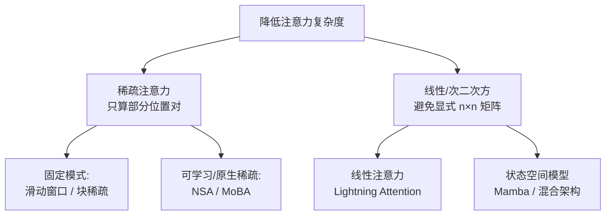

# 稀疏与线性注意力

> **一句话**：标准注意力的 $O(n^2)$ 复杂度是长上下文的根本瓶颈，稀疏注意力（只算重要的位置）与线性/次二次方注意力（把序列压成定长状态）是两条把它降下来的主线。
> 关键年份：Longformer 2020（arXiv:2004.05150），Mamba 2023（arXiv:2312.00752），Jamba 2024（arXiv:2403.19887），MiniMax-01 / Lightning Attention 2025（arXiv:2501.08313），NSA 2025（arXiv:2502.11089），MoBA 2025（arXiv:2502.13189）。
> 前置阅读：[注意力变体（MHA/MQA/GQA/MLA）](/architecture/attention)、[KV Cache](/inference/kv-cache)、[Transformer 基础架构](/architecture/transformer)

## 为什么要动注意力

标准自注意力对长度为 $n$ 的序列要计算 $n \times n$ 的注意力矩阵，时间和显存都是 $O(n^2)$。当上下文从 4K 推到 128K、1M 时，这个二次项会同时压垮两件事：

- **训练/Prefill 算力**：注意力 FLOPs 随 $n^2$ 增长，长文档预填充阶段成为主要开销。
- **解码 KV Cache**：自回归解码时每个新 token 都要读取此前全部 token 的 K/V，KV Cache 大小随 $n$ 线性增长、显存带宽随之吃紧（详见 [KV Cache](/inference/kv-cache)）。[注意力变体](/architecture/attention) 里的 MQA/GQA/MLA 主要压的是 KV Cache 的"宽度"（每 token 多大），而本页讨论的方法压的是注意力本身随"长度"增长的复杂度。

两类思路：

## 一、稀疏与局部注意力

核心假设：注意力矩阵里大部分权重很小，只需保留"重要"的少数位置对，就能把 $O(n^2)$ 降到接近 $O(n)$ 或 $O(n\sqrt{n})$。

### 滑动窗口（局部注意力）

每个 token 只看自己附近一个固定宽度 $w$ 的窗口，复杂度降到 $O(n \cdot w)$。

- **Longformer**（arXiv:2004.05150）把滑动窗口注意力与少量"全局 token"结合：局部窗口负责线性扩展，全局 token（如 `[CLS]`、问句 token）保留对全序列的关注，使复杂度随序列长度线性增长。
- **Mistral 7B** 在解码器里用滑动窗口（window $W=4096$）。关键观察是窗口注意力可以**层层叠加**：第 $k$ 层位置 $i$ 看到第 $k-1$ 层 $[i-W, i]$ 的信息，堆叠后理论感受野约为 $W \times \text{层数}$，原文给出在该配置下约可触达 131K token 的理论跨度（具体数字以原文为准）。这是用"深度换感受野"的典型做法。

滑动窗口的代价是**远距离直连被切断**：超出窗口的依赖只能靠多层间接传递，对需要精确长程检索（如大海捞针）的任务可能掉点。

### 块稀疏（Block-sparse）

把序列切成块，注意力只在选定的块对之间计算（如局部块 + 跨步块 + 随机块）。块粒度对 GPU 更友好（连续访存、便于用矩阵乘 kernel），是后续"原生稀疏"方法的工程基础。

### 可学习 / 原生稀疏：NSA 与 MoBA

固定模式的稀疏是"人工先验"。2025 年两项工作的共同点是让稀疏**原生可训练**——稀疏结构参与端到端预训练，而不是只在推理时硬剪枝。

**NSA（Native Sparse Attention，DeepSeek，arXiv:2502.11089）**

- 采用**动态分层稀疏**策略，对每个 query 并行融合三条分支：
  1. **压缩（compression）**：把历史 token 按块聚合成粗粒度表示，提供全局上下文。
  2. **选择（selection）**：细粒度地挑出最相关的少数块做精确注意力。
  3. **滑动窗口（sliding window）**：保留局部近邻信息。
- 强调**硬件对齐**：以 Triton 实现、平衡算术强度（arithmetic intensity），在 64K 长序列上对前向、反向、解码三个阶段都相对全注意力有明显加速；原文报告在通用基准、长上下文与推理任务上达到或超过全注意力基线（具体数字以原文为准）。
- 因为原生可训练，避免了"训练用全注意力、推理才改稀疏"造成的分布错配。详见 [DeepSeek 模型](/base-models/deepseek)。

**MoBA（Mixture of Block Attention，Moonshot / Kimi，arXiv:2502.13189）**

- 把 **MoE 的"专家路由"思想搬到注意力**（与 [MoE](/architecture/moe) 同源）：将上下文切成块，对每个 query 用门控只路由到 Top-K 个最相关的块去算注意力。
- 遵循"less structure"原则——不预设固定稀疏模式，让模型自己学习关注哪里。
- 一个工程优点是可在**全注意力与稀疏注意力之间无缝切换**（同一套权重），已部署支撑 Kimi 的长上下文请求、代码开源。详见 [Kimi 模型](/base-models/kimi)。

> NSA 与 MoBA 都把"块"作为稀疏单元、都引入可学习/路由式选择，差别主要在 NSA 的三分支（压缩+选择+窗口）显式建模多粒度，MoBA 更接近纯 MoE 式块路由。

## 二、线性注意力与次二次方架构

另一条路不是"少算几个位置"，而是从根本上**绕开 $n \times n$ 矩阵**。

### 线性注意力 / Lightning Attention

标准注意力是 $\text{softmax}(QK^\top)V$，必须先得到 $QK^\top$（$n\times n$）。线性注意力用一个特征映射 $\phi(\cdot)$ 去掉 softmax，把计算重排为：

$$
\text{Attn}(Q,K,V) \approx \phi(Q)\big(\phi(K)^\top V\big)
$$

先算 $\phi(K)^\top V$（$d\times d$，与 $n$ 无关）再左乘 $\phi(Q)$，复杂度从 $O(n^2 d)$ 降到 $O(n d^2)$，对长序列即线性。其本质等价于维护一个**定长的状态矩阵**，逐 token 递推更新——这意味着解码时 KV Cache 可被替换成固定大小的状态，显存不再随长度增长。

**MiniMax-01 / Lightning Attention**（arXiv:2501.08313）是把线性注意力**规模化到商用级**的代表：

- Lightning Attention 是线性注意力的 IO 感知/分块实现（解决朴素线性注意力的实现效率问题）。
- 采用**混合架构**：每 7 个线性注意力块后插入 1 个 softmax 注意力块，用少量全注意力补回线性注意力在精确检索上的短板。
- 与 MoE 结合（32 专家、约 456B 总参数 / 单 token 约 45.9B 激活），训练上下文达 1M、推理可外推至约 4M token（数字以原文为准）。详见 [MiniMax 模型](/base-models/minimax)。

纯线性注意力的弱点是把历史压成定长状态会**丢失精确的逐 token 检索能力**，因此实践中几乎都走"线性为主、少量全注意力兜底"的混合路线。

### 状态空间模型（SSM）与 Mamba

SSM 用一个连续/离散状态方程建模序列，可写成卷积形式（训练时并行）或递推形式（推理时 $O(1)$ 每步），天然线性复杂度。

**Mamba**（arXiv:2312.00752）的关键创新是 **selective（输入相关）SSM**：让状态空间参数随输入变化，从而能选择性地记住或遗忘信息（弥补了早期 SSM 内容无关、难做联想检索的缺点）。原文报告 Mamba 推理吞吐约为同规模 Transformer 的 5×、随长度线性扩展，且 Mamba-3B 在语言建模上可对标约 2× 规模的 Transformer（数字以原文为准）。

### 混合架构（Hybrid）

纯 SSM/线性模型在需要"精确回看某个 token"的任务上仍弱于全注意力，于是把两者交错堆叠成主流方案：

- **Jamba**（arXiv:2403.19887）：Transformer 层与 Mamba 层交错、并叠加 MoE，兼顾 SSM 的长序列效率与注意力的检索精度。
- MiniMax-01 的"线性 + 周期性 softmax"本质上也是同一思路的混合架构。

## 三、长上下文视角的取舍

| 方法族 | 复杂度 | KV / 状态随长度 | 精确长程检索 | 代表 |
| --- | --- | --- | --- | --- |
| 全注意力 | $O(n^2)$ | 线性增长（KV Cache） | 最强 | 标准 Transformer |
| 滑动窗口 | $O(n\cdot w)$ | 仅保留窗口内 KV | 弱（靠多层间接） | Longformer / Mistral |
| 原生稀疏（块路由） | 近 $O(n)$ | 仍存 KV，但只读部分 | 较强（可学习选块） | NSA / MoBA |
| 线性注意力 | $O(n d^2)$ | 定长状态 | 弱 | Lightning / MiniMax-01 |
| SSM | $O(n)$ | 定长状态 | 弱（selective 缓解） | Mamba |
| 混合 | 介于两者 | 部分定长 + 部分 KV | 较强 | Jamba / MiniMax-01 |

几条工程经验：

- **精度 vs 复杂度是连续谱**。稀疏注意力保留了真实的 KV（只是少读），更易保住检索精度；线性/SSM 把历史压成定长状态，省得最彻底但最伤精确回看——所以它们几乎总以混合形式出现。
- **稀疏方法主要省"读 KV 的带宽与算力"，但 KV Cache 仍要存**；线性/SSM 才真正把 KV Cache 换成定长状态、从根本上解掉解码显存随长度增长的问题。这正是它和 [KV Cache](/inference/kv-cache) 优化（MQA/GQA/MLA、量化、PagedAttention）互补的地方。
- **是否原生可训练很关键**：训练用全注意力、推理才剪稀疏会带来分布错配；NSA / MoBA / Mamba 这类把稀疏或递推结构放进预训练的方法，长上下文表现更稳。

## 参考文献

- Longformer: The Long-Document Transformer. arXiv:2004.05150
- Mistral 7B. arXiv:2310.06825
- Mamba: Linear-Time Sequence Modeling with Selective State Spaces. arXiv:2312.00752
- Jamba: A Hybrid Transformer-Mamba Language Model. arXiv:2403.19887
- MiniMax-01: Scaling Foundation Models with Lightning Attention. arXiv:2501.08313
- Native Sparse Attention: Hardware-Aligned and Natively Trainable Sparse Attention. arXiv:2502.11089
- MoBA: Mixture of Block Attention for Long-Context LLMs. arXiv:2502.13189
