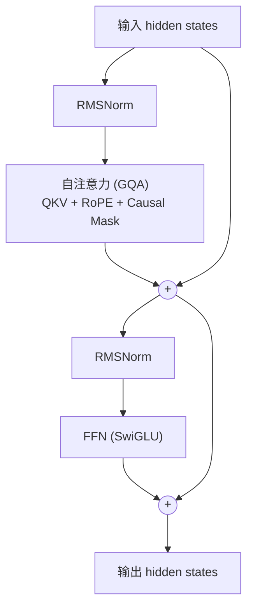

> **一句话**：Transformer 用「自注意力 + 前馈网络 + 残差 + 归一化」堆叠出可大规模并行训练的序列建模骨架，而现代 LLM 几乎清一色地走向了「decoder-only」这一分支。
> 关键年份：Attention Is All You Need（Vaswani et al., 2017, arXiv:1706.03762），GLU Variants Improve Transformer / SwiGLU（Shazeer, 2020, arXiv:2002.05202）。
> 前置阅读：[模型架构总览](/architecture/)、[注意力变体（MHA/MQA/GQA/MLA）](/architecture/attention)、[位置编码与归一化](/architecture/positional-norm)

## 为什么是 Transformer

在 Transformer 之前，序列建模主要靠 RNN/LSTM（沿时间步串行）与 CNN（局部感受野）。它们的共同痛点是：长程依赖建模困难、且时间维度上无法并行。2017 年 Vaswani 等人提出的 Transformer 把建模主体彻底换成注意力机制，"dispensing with recurrence and convolutions entirely"，让整条序列在一层内一次性两两交互，从而既捕获全局依赖、又能在序列维度充分并行。这一可并行性正是后续大模型 Scaling 的工程前提。

原始论文是一个 **encoder-decoder** 结构（面向机器翻译）。但本页与现代 LLM 的主线是 **decoder-only**，下文会先讲清通用组件，再收敛到 Llama 式解码块。

## 自注意力：QKV 与缩放点积

自注意力的核心是：对序列中每个 token，用它的 **Query** 去和所有 token 的 **Key** 做相似度匹配，再据此对所有 token 的 **Value** 加权求和。设输入为 $X \in \mathbb{R}^{n \times d}$，通过三组投影矩阵得到：

$$
Q = XW_Q,\quad K = XW_K,\quad V = XW_V
$$

随后用**缩放点积注意力（Scaled Dot-Product Attention）**计算输出：

$$
\text{Attention}(Q,K,V) = \text{softmax}\!\left(\frac{QK^\top}{\sqrt{d_k}}\right)V
$$

其中 $d_k$ 是 Key 的维度。除以 $\sqrt{d_k}$ 这一步是关键：当 $d_k$ 较大时，$QK^\top$ 的内积量级会随维度线性增长，未缩放会把 softmax 推入梯度极小的饱和区；除以 $\sqrt{d_k}$ 把方差拉回 $O(1)$，稳住训练。

注意力矩阵 $\text{softmax}(QK^\top/\sqrt{d_k}) \in \mathbb{R}^{n \times n}$ 的规模随序列长度 $n$ **平方增长**，这是 Transformer 显存与算力的主要瓶颈，也是 [稀疏与线性注意力](/architecture/sparse-attention) 和 [KV Cache](/inference/kv-cache) 优化的出发点。

## 多头注意力

单一注意力只能学到一种"关注模式"。多头注意力（Multi-Head Attention, MHA）把 $d$ 维空间切成 $h$ 个子空间，各自独立做注意力，再拼接并经一层线性投影：

$$
\text{MHA}(X) = \text{Concat}(\text{head}_1,\dots,\text{head}_h)W_O,\quad \text{head}_i = \text{Attention}(XW_Q^i, XW_K^i, XW_V^i)
$$

每个头通常取 $d_k = d/h$，使总计算量与单头大致相当，却能在不同子空间并行捕捉语法、指代、位置等不同关系。

如何在推理时压缩 KV 的存储（MQA / GQA / MLA）是工程上的重头戏，详见 [注意力变体](/architecture/attention)。本页只需记住：现代解码块默认用 **GQA**（分组共享 KV）来平衡质量与 KV Cache 体积。

## 前馈网络（FFN）与 SwiGLU

注意力负责 token 间的信息混合，**逐位置前馈网络（Position-wise FFN）**则负责对每个 token 单独做非线性变换、扩充表达容量。原始 FFN 是两层线性夹一个 ReLU：

$$
\text{FFN}(x) = \max(0,\, xW_1 + b_1)\,W_2 + b_2
$$

中间维度 $d_{ff}$ 通常取隐藏维度的 4 倍。FFN 的参数往往占整个模型参数量的大头。

Shazeer 在 2020 年的 *GLU Variants Improve Transformer*（arXiv:2002.05202）中，用**门控线性单元（GLU）**族替换 FFN 的激活。GLU 的基本形式是两路线性投影做逐元素相乘，其中一路过激活函数充当"门"。其中 **SwiGLU** 用 Swish/SiLU 作为门控激活：

$$
\text{SwiGLU}(x) = \big(\text{Swish}_\beta(xW_1)\big) \otimes (xW_3)\;,\qquad \text{Swish}_\beta(z) = z\cdot\sigma(\beta z)
$$

随后再过一层 $W_2$ 输出。论文实验中 GEGLU 与 SwiGLU 给出了最优的困惑度（以原文为准）。由于 GLU 多了一路投影矩阵（$W_1, W_2, W_3$ 三个而非两个），实践中常把中间维度按 $\tfrac{2}{3}$ 缩放，使总参数量与原始两层 FFN 持平。SwiGLU 已成为 Llama、PaLM、Qwen、DeepSeek 等主流模型的默认 FFN。

| FFN 变体 | 激活/门控 | 矩阵数 | 代表模型 |
|---|---|---|---|
| 原始 FFN | ReLU | 2（$W_1,W_2$） | 原版 Transformer、BERT |
| GeLU-FFN | GeLU | 2 | GPT-2/3 |
| GeGLU | GeLU 门控 | 3 | T5 v1.1 |
| **SwiGLU** | **Swish/SiLU 门控** | **3** | **Llama / PaLM / Qwen / DeepSeek** |

## 残差连接、归一化与 Pre-Norm

每个子层（注意力、FFN）都包裹在**残差连接**里：$\text{output} = x + \text{Sublayer}(\text{Norm}(x))$。残差让梯度可直接回传，是深层堆叠不退化的前提。

归一化的位置有两种范式：

- **Post-Norm**（原版）：$x + \text{Sublayer}(x)$ 后再做 LayerNorm。深层时训练不稳，常需 warmup 调参。
- **Pre-Norm**（现代主流）：先 Norm 再进子层，残差路径是"干净"的恒等映射，深层训练显著更稳定。

现代模型普遍用 **Pre-Norm + RMSNorm**。RMSNorm 去掉了 LayerNorm 的去均值与偏置项，只做均方根缩放，更省算力。归一化与位置编码（RoPE 等）的细节见 [位置编码与归一化](/architecture/positional-norm)。

## Causal Mask 与 decoder-only 范式

语言模型做的是自回归预测：第 $t$ 个位置只能看到 $\le t$ 的 token。实现方式是在注意力分数上加一个**因果掩码（causal mask）**——把 $j > i$ 的位置（未来 token）置为 $-\infty$，softmax 后权重归零：

$$
\text{score}_{ij} = \frac{Q_i K_j^\top}{\sqrt{d_k}} + M_{ij},\quad M_{ij} = \begin{cases} 0 & j \le i \\ -\infty & j > i \end{cases}
$$

这个三角掩码是 decoder-only 模型一切自回归生成的基础，也使得训练时一条序列的所有位置可以并行计算 loss（teacher forcing），推理时配合 [KV Cache](/inference/kv-cache) 逐 token 生成。

**为何 decoder-only（GPT 路线）成为主流？**

- **训练目标统一**：纯自回归 next-token prediction 是一个简单、可无限扩展的自监督目标，天然吃下海量无标注文本，无需 encoder-decoder 那样的对齐设计。
- **能力随规模涌现**：GPT 路线证明了"一个 decoder + 大数据 + 大算力"即可在不改架构的前提下泛化到几乎所有 NLP 任务，对 Scaling Law 友好。
- **架构与部署简洁**：单塔结构、KV Cache 友好、便于做长上下文与流式生成；下游对齐（SFT、[RLHF](/rlhf/grpo)）也都建立在这个统一的生成接口之上。

encoder-only（BERT 路线）擅长理解类判别任务，encoder-decoder（T5 路线）在条件生成上仍有一席之地，但通用大模型的主线已是 decoder-only。各家具体选型见 [基础模型](/base-models/)。

## 现代 Llama 式解码块长什么样

把上面的组件按当下最佳实践组合，就是一个典型的现代解码块：**Pre-Norm + RMSNorm + RoPE + GQA + SwiGLU**。

逐项对照：

- **Pre-Norm**：两个子层入口各放一个 RMSNorm，残差路径保持恒等。
- **RMSNorm**：替代 LayerNorm，无偏置、只做 RMS 缩放 → [详见](/architecture/positional-norm)。
- **RoPE**：旋转位置编码，注入到 Q/K 上而非加在输入嵌入，外推友好 → [详见](/architecture/positional-norm)。
- **GQA**：分组共享 KV 头，压缩 [KV Cache](/inference/kv-cache) → [详见](/architecture/attention)。
- **SwiGLU**：门控前馈，按 $\tfrac{2}{3}$ 缩放中间维度保持参数量。

把若干个这样的解码块堆叠（如 Llama-3-8B 为 32 层），前接 token 嵌入、后接最终 RMSNorm 与输出投影（LM head，常与嵌入权重 tie），就构成了今天绝大多数开源/闭源 LLM 的主体。当参数继续放大时，再把稠密 FFN 换成 [MoE](/architecture/moe) 即可在不成比例增加推理算力的前提下扩容。

## 参考文献

- Vaswani, A., Shazeer, N., Parmar, N., et al. *Attention Is All You Need*. 2017. arXiv:1706.03762
- Shazeer, N. *GLU Variants Improve Transformer*. 2020. arXiv:2002.05202
