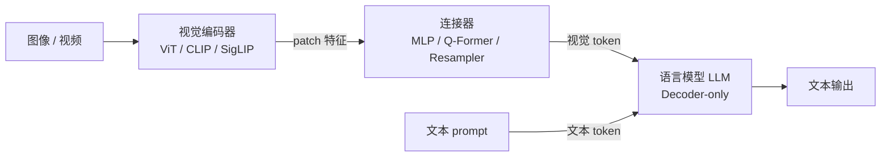

# VLM 视觉-语言模型结构

> **一句话**：主流 VLM 是「视觉编码器 + 连接器 + LLM」三件套，核心设计取舍落在**怎么把图像变成 LLM 能消费的 token**，以及**怎么把视觉信息注入语言序列**。
> 关键年份：CLIP 2021（arXiv:2103.00020）、Flamingo 2022.04（arXiv:2204.14198）、BLIP-2 2023.01（arXiv:2301.12597）、SigLIP 2023.03（arXiv:2303.15343）、LLaVA 2023.04（arXiv:2304.08485）、InternVL 2023.12（arXiv:2312.14238）、Qwen2-VL 2024.09（arXiv:2409.12191）。
> 前置阅读：[Transformer 基础架构](/architecture/transformer)、[注意力变体](/architecture/attention)、[基座模型 / Qwen](/base-models/qwen)

## 总览：三件套

绝大多数现代 VLM 都可以拆成三个互相解耦的部件：

- **视觉编码器**：把像素压成一串语义特征向量（patch token）。
- **连接器（connector / projector）**：把视觉特征对齐到 LLM 的词嵌入空间，并控制视觉 token 的数量。
- **LLM**：复用现成的 decoder-only 语言模型（如 [Qwen](/base-models/qwen)、Vicuna、LLaMA），负责跨模态推理与生成。

这种解耦让 VLM 能「站在巨人肩膀上」：视觉端复用对比预训练的强编码器，语言端复用已对齐好的 LLM，训练成本主要花在连接器和少量微调上。

## 视觉编码器：ViT / CLIP / SigLIP

骨干几乎统一是 **ViT**：图像切成 $14\times14$ 或 $16\times16$ 的 patch，线性投影后加位置编码，过 Transformer。$H\times W$ 图像得到约 $\frac{H}{p}\times\frac{W}{p}$ 个 patch token。

差异主要在**预训练目标**，决定了特征的语义对齐质量：

| 编码器 | 预训练目标 | 特点 |
| --- | --- | --- |
| **CLIP**（2103.00020） | 图文对比（softmax InfoNCE） | 图文共享语义空间，大批量内做对比，VLM 视觉端事实标准 |
| **SigLIP**（2303.15343） | 图文对比（pairwise **sigmoid** loss） | 不需要全局归一化，小 batch 也好用、可继续放大 batch；常作为 CLIP 的升级替换 |
| **InternViT-6B**（2312.14238） | 对比 → 生成 → SFT 渐进对齐 | 把视觉骨干放大到约 60 亿参数，强调与 LLM 的渐进对齐（以原文为准） |

经验上，CLIP/SigLIP 这类图文对比编码器比纯 ImageNet 监督的 ViT 更适合接 LLM，因为它们的特征本身已经带语言语义。

## 连接器：三类做法

连接器是 VLM 设计分歧最大的地方，决定了视觉 token 的数量、信息瓶颈与训练成本。

### 1. MLP projector（最简单也最主流）

代表是 **LLaVA**（2304.08485）。最初版本就是一个**线性投影矩阵**把 CLIP ViT-L/14 的 patch 特征映射到 Vicuna 的词嵌入维度，LLaVA-1.5 起换成两层 MLP。

- 视觉 token 数 = patch 数，**不做压缩**，一张图常占数百个 token。
- 实现极简、信息几乎无损，对高分辨率细节友好；代价是序列变长、[KV cache](/inference/kv-cache) 压力大。

### 2. Cross-attention / Q-Former（带可学习 query 的压缩）

**BLIP-2 的 Q-Former**（2301.12597）用一组**可学习 query 向量（论文中 32 个）**，通过 cross-attention 从冻结视觉编码器抽取特征，把任意分辨率图像压成**固定长度（32）**的视觉 token，充当信息瓶颈。

$$\text{Q-Former}:\;\; Q\in\mathbb{R}^{32\times d}\;\xrightarrow{\text{cross-attn}(Q,\,V_{\text{img}})}\;Z\in\mathbb{R}^{32\times d}$$

优点是视觉 token 数固定且很少，LLM 侧开销小；缺点是固定瓶颈对密集 OCR / 高分辨率细节有损，且 Q-Former 本身需要专门预训练。

### 3. Perceiver Resampler（固定数量 latent）

**Flamingo**（2204.14198）的 Perceiver Resampler 思路类似 Q-Former：用一组 latent query，把变长的图像/视频特征重采样成**固定数量（64）**的视觉输出，再喂给 LLM。它与下文的 cross-attention 融合范式天然配套。

> 直觉对比：MLP projector「按需扩张」（token 数随分辨率变），Q-Former / Resampler「固定压缩」（token 数恒定）。前者保细节、后者省算力。

## 两大融合范式：prefix vs cross-attention

视觉信息进入 LLM 有两条路线。

### Prefix（拼接进序列）

把视觉 token 当成「特殊的文本 token」直接拼进输入序列，与文本 token 一起走 LLM 的 self-attention。LLaVA、BLIP-2、Qwen-VL、InternVL 等绝大多数现代 VLM 走这条路。

- 优点：**几乎不改 LLM 结构**，视觉/文本在每一层都充分交互，训练实现简单。
- 缺点：视觉 token 直接撑大序列长度，token 数失控会显著推高显存与延迟。

### Cross-attention（注入而非拼接）

代表是 **Flamingo**：冻结 LLM 主干，在若干层之间**插入 gated cross-attention 层**，让文本 token 去 cross-attend 视觉特征。门控用 $\tanh$ 配一个初始化为 $0$ 的可学习标量，保证训练初期模型行为与原 LLM 完全一致，再逐步放开视觉信息流。

- 优点：视觉**不占用文本序列长度**，可冻结 LLM、加少量参数即可适配；天然支持多图 / 交错图文。
- 缺点：要改 LLM 结构、插新层，工程复杂度更高，近年新模型反而更偏好简单的 prefix 路线。

| 维度 | Prefix 拼接 | Cross-attention 注入 |
| --- | --- | --- |
| 代表 | LLaVA / Qwen2-VL / InternVL | Flamingo |
| 改 LLM 结构 | 否 | 是（插入 cross-attn 层） |
| 占用文本序列长度 | 是 | 否 |
| 视觉-文本交互 | 每层 self-attn | 指定层 cross-attn |
| 多图 / 长视频 | 序列易爆长 | 更省、更易扩展 |

## 原生动态分辨率、视觉 token 数与 M-RoPE

早期 VLM 多把图像强制 resize 到固定边长（如 $224^2$ / $336^2$），高分辨率与极端长宽比图像信息损失严重。近期趋势是**原生处理任意分辨率**：

- **Naive Dynamic Resolution（Qwen2-VL，2409.12191）**：按图像实际分辨率动态生成**不同数量**的视觉 token，避免无脑缩放，更贴近人类感知。视觉 token 数随图像大小变化，实践中常对相邻 patch 做合并以控制总量。
- **动态切图 / tiling（InternVL 等）**：把高分辨率大图切成多块缩略图分别编码，兼顾全局与局部细节。

视觉 token 数是 VLM 的核心成本旋钮：token 越多细节越足，但序列越长、[推理](/inference/kv-cache) 越贵。MLP 派靠切图 / token 合并控量，Q-Former / Resampler 派靠固定 latent 控量。

**位置编码**也随之进化。Qwen2-VL 提出 **M-RoPE（Multimodal Rotary Position Embedding）**：把 [RoPE](/architecture/positional-norm) 的位置拆成**时间 / 高度 / 宽度**多个维度，从而统一编码文本（一维）、图像（二维 H/W）、视频（三维 T/H/W）的位置信息，让同一套机制覆盖图、文、视频。

## 训练：分阶段对齐 → 指令微调

VLM 训练普遍是**多阶段**的，思路是先对齐模态、再教会对话。以 LLaVA 为代表的两阶段范式：

1. **特征对齐预训练**：冻结视觉编码器与 LLM，**只训连接器**，用图文 caption 数据让视觉特征落进 LLM 的词嵌入空间。成本低、目标单一。
2. **指令微调（visual instruction tuning）**：在多模态指令-跟随数据上**端到端微调**连接器 + LLM（视觉编码器常仍冻结或小学习率），赋予模型问答、推理、对话能力。

更大的模型（如 InternVL）会用**更多阶段的渐进对齐**：先大规模图文对比 / 生成预训练打牢视觉-语言基础，再做 SFT（以原文为准）。这一指令微调阶段与纯文本 LLM 的 [SFT](/sft/) 思路一致，区别只在数据带图。后续也常接 RLHF / 偏好优化（参见 [GRPO](/rlhf/grpo)）。

## 与 Omni 的关系

VLM 处理「图像/视频 + 文本」两模态。当再加入音频输入、乃至语音/图像输出，把多种模态统一进同一骨干时，就进入 [Omni 全模态架构](/architecture/omni) 的范畴——其连接器与位置编码（如 M-RoPE 的多维推广）思路正是 VLM 设计的自然延伸。

## 参考文献

- CLIP: *Learning Transferable Visual Models From Natural Language Supervision*, arXiv:2103.00020
- Flamingo: *a Visual Language Model for Few-Shot Learning*, arXiv:2204.14198
- BLIP-2: *Bootstrapping Language-Image Pre-training with Frozen Image Encoders and Large Language Models*, arXiv:2301.12597
- SigLIP: *Sigmoid Loss for Language Image Pre-Training*, arXiv:2303.15343
- LLaVA: *Visual Instruction Tuning*, arXiv:2304.08485
- InternVL: *Scaling up Vision Foundation Models and Aligning for Generic Visual-Linguistic Tasks*, arXiv:2312.14238
- Qwen2-VL: *Enhancing Vision-Language Model's Perception of the World at Any Resolution*, arXiv:2409.12191
