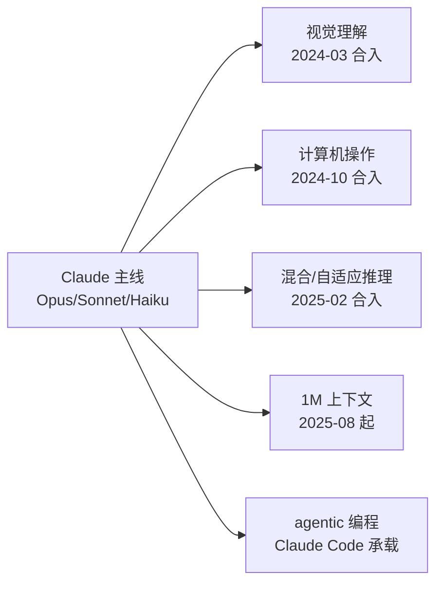

# Claude（Anthropic）

> **一句话定位**：Anthropic 以 Constitutional AI（宪法式 AI / RLAIF，2022）为训练哲学根基，坚持"单一同构模型家族"——视觉理解、混合/自适应推理、计算机操作、1M 超长上下文与 agentic 编程能力全部融进一条 Opus/Sonnet/Haiku 主线，全系闭源、仅 API，不做生成式多模态、不做 embedding，把赌注押在"长程自主 agent + 企业知识工作"上。
>
> 首发年份：2023（Claude 1 / Claude Instant，2023-03；Anthropic 2021 年成立）· 机构：Anthropic · 代表版本：Claude Opus 4.8（2026-05）
>
> 前置阅读：[基础模型总览](/base-models/)；对比阅读：[OpenAI](/base-models/openai)、[Gemini](/base-models/gemini)

## 模型系列总览

与国内厂商"一厂多线"（基座/VL/推理/Omni/Coder 各开一条产品线）的版图截然不同，Anthropic 只有一条 Claude 主线，按规格分 **Opus（旗舰）/ Sonnet（主力）/ Haiku（轻量）** 三档。新能力一律以"能力开关"形式合入主线模型，而非另起系列。

### 语言模型主线

| 模型 | 发布时间 | 开源 | 要点 | 链接 |
|---|---|---|---|---|
| Claude 1 / Claude Instant | 2023-03 | 闭源 | 首代，约 9K 上下文；同年 5 月扩到 100K，确立长上下文卖点 | [博客](https://www.anthropic.com/news/introducing-claude) |
| Claude 2 / 2.1 | 2023-07 / 2023-11 | 闭源 | 首个公开版本（claude.ai 上线）；2.1 上下文 200K，引入 tool use beta | [博客](https://www.anthropic.com/news/claude-2-1) |
| Claude 3 家族 | 2024-03 | 闭源 | Opus/Sonnet/Haiku 三档命名确立；200K 上下文；首次内建视觉理解 | [博客](https://www.anthropic.com/news/claude-3-family) |
| Claude 3.5 Sonnet / Haiku | 2024-06 / 2024-10 | 闭源 | 中端首次超上代旗舰，确立"Sonnet 打主力"策略；10 月以 beta 推出 computer use | [博客](https://www.anthropic.com/news/3-5-models-and-computer-use) |
| Claude 3.7 Sonnet | 2025-02 | 闭源 | 市场首个混合推理模型（详见下文思考小节）；同场发布 Claude Code 研究预览 | [博客](https://www.anthropic.com/news/claude-3-7-sonnet) |
| Claude Opus 4 / Sonnet 4 | 2025-05 | 闭源 | thinking 中穿插工具调用（边想边搜）、并行工具调用、文件记忆；Sonnet 4 于 2025-08 率先开放 1M 上下文 beta | [博客](https://www.anthropic.com/news/claude-4) |
| Claude Opus 4.1 / Sonnet 4.5 | 2025-08 / 2025-09 | 闭源 | Sonnet 4.5 发布时为 SWE-bench Verified SOTA，可持续专注 30+ 小时 | [博客](https://www.anthropic.com/news/claude-sonnet-4-5) |
| Claude Haiku 4.5 | 2025-10 | 闭源 | 以 Sonnet 4 约 1/3 成本、2 倍以上速度逼近其编程性能；200K 上下文 | [博客](https://www.anthropic.com/news/claude-haiku-4-5) |
| Claude Opus 4.5 | 2025-11 | 闭源 | Opus 档大降价（$15/$75 → $5/$25），引入 effort 参数 | [博客](https://www.anthropic.com/news/claude-opus-4-5) |
| Claude Opus 4.6 / Sonnet 4.6 | 2026-02 | 闭源 | Opus 档首次 1M 上下文；adaptive thinking、agent teams；Sonnet 4.6 SWE-bench Verified 79.6%、OSWorld 72.5% | [博客](https://www.anthropic.com/news/claude-opus-4-6) |
| Claude Opus 4.7 | 2026-04 | 闭源 | 仅保留 adaptive thinking，彻底移除 budget_tokens 与 temperature/top_p/top_k 采样参数；新增 xhigh effort 档位；高分辨率视觉（长边 2576px，~3.75MP，坐标 1:1 像素映射） | [博客](https://www.anthropic.com/news/claude-opus-4-7) |
| Claude Opus 4.8 | 2026-05 | 闭源 | 当前旗舰；强化长程自主 agentic 执行与代码评审/调试；API 表面与 4.7 兼容 | [博客](https://www.anthropic.com/news/claude-opus-4-8) |

### 思考 / 推理（融合式，无独立 R 系列）

Anthropic 没有 OpenAI o 系列、DeepSeek-R1 那样的独立推理模型线，推理始终是主线模型内的能力开关，演进分三阶段：

| 阶段 | 时间 | 机制 | 要点 |
|---|---|---|---|
| 混合推理 | 2025-02（Claude 3.7） | extended thinking + `budget_tokens` | 同一模型既可即时回答也可逐步思考，手动精确控制思考预算（最高 128K 输出） |
| effort 档位 | 2025-11 起（Opus 4.5） | `effort`（4.5 为 low/medium/high；4.6 增加 max；4.7 起再增 xhigh） | 从"给 token 数"变为"给档位"，模型自行分配 |
| 自适应思考 | 2026-02 起（Opus/Sonnet 4.6） | adaptive thinking | 模型自主决定何时想、想多少，自动穿插思考与工具调用；4.6 起 budget_tokens 弃用，4.7 起彻底移除 budget_tokens 与温度等采样参数 | 

文档：[adaptive thinking](https://platform.claude.com/docs/en/build-with-claude/adaptive-thinking)。这条"思考逐渐黑盒化、参数面逐渐收窄"的路线，与训练侧 RL 的演进（参见 [RLHF 总览](/rlhf/)）一脉相承：把"想多久"也交给模型策略 $\pi_\theta$ 自己学。

### VL / 多模态理解（内建于主线）

无独立 VL 系列。视觉理解自 Claude 3（2024-03）起内建于所有主线模型（图片、图表、PDF 理解）；Opus 4.7（2026-04）将最大图像分辨率提至长边 2576px 并实现像素级坐标定位——主要服务 computer use 与文档/截图理解，而非通用图像生成。

| 能力节点 | 时间 | 要点 | 链接 |
|---|---|---|---|
| 视觉理解上线 | 2024-03（Claude 3） | 全系内建图片/图表/技术图纸理解 | [博客](https://www.anthropic.com/news/claude-3-family) |
| computer use | 2024-10（3.5 Sonnet v2） | 业界首个公开 beta 的"截图 + 鼠标键盘"操控能力 | [博客](https://www.anthropic.com/news/3-5-models-and-computer-use) |
| 高分辨率视觉 | 2026-04（Opus 4.7） | 长边 2576px、坐标 1:1 像素映射 | [博客](https://www.anthropic.com/news/claude-opus-4-7) |

### Omni / 生成式多模态：不存在

Claude 不原生接受音频/视频输入，也没有任何图像/视频/音频生成模型——与 OpenAI（DALL·E/Sora）、Google（Imagen/Veo）形成鲜明对比。产品层的"语音模式"（2025-05 移动端 beta）由 ASR + TTS 管线包装文本模型实现，并非端到端语音模型。

### 其他：Coder、Embedding 与 Agent 基础设施

| 项目 | 时间 | 开源 | 要点 | 链接 |
|---|---|---|---|---|
| Claude Code | 2025-02 预览 / 2025-05 GA | 工具仓库开源（模型闭源） | 终端 agentic 编程工具，Anthropic 第二增长曲线；2026 年起演进出 dynamic workflows 等企业化能力 | [GitHub](https://github.com/anthropics/claude-code) |
| MCP 协议 | 2024-11 | 开源协议 | Model Context Protocol，已成行业事实标准的工具连接协议（参见 [工具调用](/agent/tool-use)） | [博客](https://www.anthropic.com/news/model-context-protocol) |
| Embedding | — | 不提供 | 官方文档明确推荐第三方 Voyage AI，头部厂商中独树一帜 | [文档](https://docs.anthropic.com/en/docs/build-with-claude/embeddings) |

无独立 Coder 模型：编程就是主线卖点，历代发布均以 SWE-bench 为头条指标。Claude Code 的 agent loop 设计可参考 [Agent Loop](/harness/agent-loop)。

## 架构与训练亮点

**架构完全不披露**。Anthropic 从不公开参数量、是否 MoE、注意力机制等细节；技术文档以 Model Card / System Card 形式发布，内容侧重能力评测与安全评估。因此讨论 Claude 时只能谈"训练哲学与产品形态"，无法谈架构。

**Constitutional AI / RLAIF 是根基**（Bai et al., 2022, arXiv:2212.08073）。核心思想：用一部"宪法"（明文原则集合）替代部分人工偏好标注——先让模型依据宪法自我批评、修订有害回答（SL 阶段），再用 AI 依宪法生成的偏好对 $(y_w, y_l)$ 训练偏好模型并做 RL（RLAIF 阶段），替代经典 [RLHF](/rlhf/) 中昂贵且噪声大的人工偏好。这条路线让"安全对齐"从外挂过滤器变成训练目标本身，也是 Claude 拒答风格与"性格"（persona）一致性的来源。

> 图源：Bai et al., *Constitutional AI: Harmlessness from AI Feedback*, [arXiv:2212.08073](https://arxiv.org/abs/2212.08073)（用于学习注解，版权归原作者）

**能力融合而非系列分裂**。下图概括其与多数厂商相反的演进方式：

**长上下文是持续主线**：9K（2023-03）→ 100K（2023-05，当时大幅领先 GPT-4 的 32K）→ 200K（2023-11）→ 1M（Sonnet 4 2025-08 beta，2026-03 起 Opus/Sonnet 4.6+ 转 GA 且无长上下文溢价）。配套服务端 compaction 与 context editing 应对超长 agent 会话；推理侧成本则靠 prompt caching（读取约 0.1 倍输入价，原理见 [KV Cache](/inference/kv-cache)）摊薄。

**汰换节奏极快**：模型生命周期约 12–18 个月，Claude 3 代际已基本退役，Opus 4 / Sonnet 4 也已进入退役计划。据媒体报道，Opus 4.8 发布时 Anthropic 已在为下一代 "Mythos 级" 模型做安全护栏准备。

## 许可证与选型建议

**许可证**：全系闭源、仅 API/产品提供（商业服务条款），从未发布开放权重，不存在许可证选型问题；需要私有化部署或可微调权重时应转向 [Llama](/base-models/llama)、[Qwen](/base-models/qwen)、[DeepSeek](/base-models/deepseek) 等开放权重系。开源贡献集中在协议与工具层（MCP、Claude Code CLI），而非模型。

**在役模型选型**（截至 2026 年中，价格为每百万 tokens 输入/输出）：

| 场景 | 推荐 | 上下文 / 最大输出 | 价格 |
|---|---|---|---|
| 长程自主 agent、复杂代码评审、最高质量 | Opus 4.8 | 1M / 128K | $5 / $25 |
| 日常编程与通用主力（性价比最优） | Sonnet 4.6 | 1M beta / 64K | $3 / $15 |
| 高吞吐、低延迟、子 agent 工人 | Haiku 4.5 | 200K / 64K | $1 / $5 |

实践提示：批处理 API 半价；多 agent 编排（参见 [Multi-Agent](/agent/multi-agent)）常用 "Opus 做 orchestrator + Haiku 做 worker" 的档位组合；Opus 4.7 起不再暴露 temperature/top_p 等采样参数，依赖采样多样性的流程（如 best-of-n、合成数据多样化）迁移时需注意。

## 参考链接

- Bai et al., 2022. Constitutional AI: Harmlessness from AI Feedback. arXiv:2212.08073
- [Anthropic News（全部发布公告）](https://www.anthropic.com/news)
- [模型总览与定价文档](https://platform.claude.com/docs/en/about-claude/models/overview)
- [Adaptive Thinking 文档](https://platform.claude.com/docs/en/build-with-claude/adaptive-thinking)
- [Claude 3 Model Card](https://www-cdn.anthropic.com/de8ba9b01c9ab7cbabf5c33b80b7bbc618857627/Model_Card_Claude_3.pdf)
- [模型退役/迁移指南](https://platform.claude.com/docs/en/about-claude/models/migration-guide)
