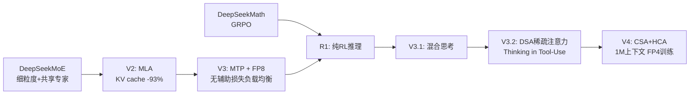

# DeepSeek

> **一句话定位**：DeepSeek（深度求索）的路线可以概括为「极致效率的稀疏化架构自研 + 纯强化学习激发推理 + 全栈开放权重」——自创 MLA（KV cache 降 93%）、细粒度共享专家 MoE（激活参数仅占总参约 3%~5%）、GRPO 算法、DSA→CSA/HCA 稀疏注意力，用远低于西方实验室的成本（V3 全程仅 278.8 万 H800 GPU 时，约 558 万美元）做出前沿模型并以 MIT 许可开放权重，倒逼全行业降价。
>
> 首发年份：2023（DeepSeek LLM 7B/67B，2023-11）· 机构：深度求索（DeepSeek）· 代表版本：DeepSeek-V4-Pro 1.6T（2026-04）
>
> 前置阅读：[基础模型总览](/base-models/)；对比阅读：[Qwen](/base-models/qwen)、[Kimi](/base-models/kimi)、[OpenAI](/base-models/openai)

## 模型系列总览

### 语言模型主线

| 模型 | 发布时间 | 开源 | 要点 | 链接 |
| --- | --- | --- | --- | --- |
| DeepSeek LLM 7B/67B | 2023.11（论文 2024.01） | ✅ | Dense 架构，2T 中英 token，67B 采用 GQA，公司首个 LLM 系列 | [arXiv:2401.02954](https://arxiv.org/abs/2401.02954) |
| DeepSeekMoE 16B | 2024.01 | ✅ | 首提「细粒度专家切分 + 共享专家隔离」，约 40% 计算量达 LLaMA2-7B，奠定 V 系列 MoE 基础 | [arXiv:2401.06066](https://arxiv.org/abs/2401.06066) |
| DeepSeek-V2 | 2024.05 | ✅ | 236B 总参 / 21B 激活，首创 MLA（KV cache 压缩 93.3%，吞吐 +5.76x），128K 上下文；低价 API 引发 2024 年国内大模型价格战 | [arXiv:2405.04434](https://arxiv.org/abs/2405.04434) |
| DeepSeek-V3 | 2024.12 | ✅ | 671B / 37B 激活，MLA + 无辅助损失负载均衡 + MTP + FP8 训练，14.8T token，仅 278.8 万 H800 GPU 时 | [arXiv:2412.19437](https://arxiv.org/abs/2412.19437) |
| DeepSeek-V3-0324 | 2025.03 | ✅ MIT | 685B（含 MTP 模块），能力增强，许可证从自定义 License 改为 MIT | [发布公告](https://api-docs.deepseek.com/news/news250325) |
| DeepSeek-V3.1 / V3.1-Terminus | 2025.08 / 2025.09 | ✅ MIT | 首个混合思考模型：同一权重经模板切换 thinking / non-thinking 两模式，主打 agent；Terminus 修复中英混杂、增强 Code/Search Agent | [发布公告](https://api-docs.deepseek.com/news/news250821) |
| DeepSeek-V3.2-Exp / V3.2 | 2025.09 / 2025.12 | ✅ MIT | 引入 DSA 稀疏注意力（Lightning Indexer 检索 top-K KV），长上下文复杂度近线性、API 大降价；正式版首创 Thinking in Tool-Use，1800+ 环境做 agent 训练 | [arXiv:2512.02556](https://arxiv.org/abs/2512.02556) |
| DeepSeek-V4-Pro / V4-Flash | 2026.04 | ✅ MIT | Pro 1.6T / 49B 激活（当前最大开放权重模型），Flash 284B / 13B 激活；1M 上下文、384K 输出，CSA+HCA 混合稀疏注意力，32T+ token FP4/FP8 预训练，Muon 优化器 | [发布公告](https://api-docs.deepseek.com/news/news260424) |

### 推理 / 思考系列

| 模型 | 发布时间 | 开源 | 要点 | 链接 |
| --- | --- | --- | --- | --- |
| R1-Lite-Preview | 2024.11 | ❌ 仅网页 | R1 前身，对标 o1-preview，未开放权重 | [发布公告](https://api-docs.deepseek.com/news/news1120) |
| DeepSeek-R1 / R1-Zero | 2025.01 | ✅ MIT | 基于 V3-Base，R1-Zero 证明纯 RL（[GRPO](/rlhf/grpo) + 规则奖励）无需 SFT 即可涌现自我反思与验证；同时开源 6 个 1.5B~70B 蒸馏 dense 模型；论文后登 Nature 正刊（首个经同行评审的前沿 LLM） | [arXiv:2501.12948](https://arxiv.org/abs/2501.12948) |
| DeepSeek-R1-0528 | 2025.05 | ✅ MIT | 推理深度增强、幻觉显著下降，支持 JSON 输出与函数调用，对标 o3；最后一个独立 R 系列 | [发布公告](https://api-docs.deepseek.com/news/news250528) |
| DeepSeek-V3.2-Speciale | 2025.12 | ✅ MIT | 「推理拉满」变体：IMO/CMO/ICPC WF/IOI 2025 金牌水平，不支持工具调用 | [发布公告](https://api-docs.deepseek.com/news/news251201) |

注意：**官方从未发布过「R2」**。R1-0528 之后推理能力并入 V3.1/V3.2/V4 的混合 thinking mode；API 旧模型名 `deepseek-chat` / `deepseek-reasoner` 将于 2026 年 7 月 24 日弃用，目前分别指向 `deepseek-v4-flash` 的 non-thinking / thinking 模式。网传「R2 为 32B dense」等说法来自内容农场，与官方模型列表矛盾。

### 多模态理解与图像生成（VL / OCR / Janus）

| 模型 | 发布时间 | 开源 | 要点 | 链接 |
| --- | --- | --- | --- | --- |
| DeepSeek-VL 1.3B/7B | 2024.03 | ✅ | SigLIP+SAM 混合视觉编码器，面向网页截图 / PDF / 图表等真实场景 | [arXiv:2403.05525](https://arxiv.org/abs/2403.05525) |
| DeepSeek-VL2 | 2024.12 | ✅ | MoE VLM 三档（激活 1.0B/2.8B/4.5B），动态切片处理任意分辨率，语言侧复用 DeepSeekMoE+MLA | [arXiv:2412.10302](https://arxiv.org/abs/2412.10302) |
| Janus / JanusFlow / Janus-Pro | 2024.10~2025.01 | ✅ | 统一理解 + 图像生成，首创理解/生成视觉编码解耦；Janus-Pro 7B 文生图指标超 DALL-E 3 与 SD3-Medium；定位研究性模型 | [arXiv:2501.17811](https://arxiv.org/abs/2501.17811) |
| DeepSeek-OCR | 2025.10 | ✅ MIT | 3B，「光学压缩」：长文本渲染成图像，10x 压缩比 OCR 精度 97%、20x 仍约 60%，为长上下文压缩开新路 | [arXiv:2510.18234](https://arxiv.org/abs/2510.18234) |
| DeepSeek-OCR-2 | 2026.01 | ✅ | DeepEncoder V2「视觉因果流」：按语义动态重排图像 token，OmniDocBench v1.5 达 91.09% | [arXiv:2601.20552](https://arxiv.org/abs/2601.20552) |

### Omni / 视频 / 音频

**没有**。截至 2026 年中，DeepSeek 没有 Omni 全模态模型，也没有任何视频、音频/语音生成模型，官方 API 亦未提供 embedding 端点。多模态布局止步于视觉理解（VL/OCR）与研究性图像生成（Janus），公司战略明确聚焦文本智能与训练/推理效率。

### 其他专项：数学、定理证明与代码

| 模型 | 发布时间 | 开源 | 要点 | 链接 |
| --- | --- | --- | --- | --- |
| DeepSeek-Coder 1.3B~33B | 2023.11（论文 2024.01） | ✅ | 从零训练 2T 代码 token，16K 窗口 + FIM，当时开源代码模型 SOTA | [arXiv:2401.14196](https://arxiv.org/abs/2401.14196) |
| DeepSeek-Coder-V2 | 2024.06 | ✅ | 16B/2.4B 与 236B/21B 激活两档 MoE，128K、338 种语言；2024.09 起并入 V2.5 主线 | [arXiv:2406.11931](https://arxiv.org/abs/2406.11931) |
| DeepSeekMath 7B | 2024.02 | ✅ | 120B 数学 token 继续预训练；**首次提出 GRPO**，后成为行业推理 RL 标准方法之一 | [arXiv:2402.03300](https://arxiv.org/abs/2402.03300) |
| DeepSeek-Prover-V2 | 2025.04 | ✅ | 7B 与 671B，Lean 4 形式化证明，子目标分解合成冷启动数据再 RL，MiniF2F-test 88.9% | [arXiv:2504.21801](https://arxiv.org/abs/2504.21801) |
| DeepSeekMath-V2 | 2025.11 | ✅ | 685B，训练 LLM 验证器作奖励模型实现「自我可验证」证明，IMO 2025 金牌水平、Putnam 2024 118/120 | [arXiv:2511.22570](https://arxiv.org/abs/2511.22570) |

## 架构与训练亮点

> 图源：DeepSeek-AI, *DeepSeek-V3 Technical Report*, [arXiv:2412.19437](https://arxiv.org/abs/2412.19437)（用于学习注解，版权归原作者）

DeepSeek 几乎每一代都贡献了被行业广泛复用的「原创组件」，可按三条线索理解：

**1. 注意力与显存效率。** MLA（V2）把多头注意力的 K/V 投影到低秩潜在向量再缓存，将 [KV cache](/inference/kv-cache) 压缩 93.3%，是其低价 API 的根本来源；V3.2 的 DSA 用轻量 Lightning Indexer 先检索 top-K 相关 KV 再做注意力，把长上下文复杂度从 $O(L^2)$ 降到近线性；V4 进一步组合 CSA（4x KV 压缩 + FP4 indexer）与 HCA（128 个 token 压成 1 个 KV），1M 上下文下单 token 推理 FLOPs 仅为 V3.2 的 27%、KV cache 仅 10%。

**2. 稀疏 MoE 与训练系统。** 从 DeepSeekMoE 的细粒度专家切分 + 共享专家隔离开始，V3 又加上无辅助损失的负载均衡（用可学习 bias 调路由而非辅助 loss，避免均衡项干扰主目标）和多 token 预测 MTP（训练时增强表征，推理时可当 [投机解码](/inference/speculative-decoding) 草稿头），配合 FP8 混合精度（V4 升至 FP4+FP8，另引入 Muon 优化器），实现了 671B 模型 14.8T token 仅 278.8 万 GPU 时的训练效率。激活参数占总参约 3%~5%（V4-Pro 49B/1.6T）是其「大而便宜」的核心。

**3. 推理 RL 与 agent。** DeepSeekMath 提出的 [GRPO](/rlhf/grpo) 用组内相对优势替代 critic；R1-Zero 证明在可验证任务上「纯 RL + 规则奖励」即可涌现自我反思、验证等长链推理行为，无需 SFT 冷启动——这一范式被全行业复现，并催生了 [DAPO](/rlhf/dapo) 等改进。R1 同时示范了把推理能力 [蒸馏](/distillation/) 到 1.5B~70B dense 小模型的标准做法。之后推理并入主线：V3.1 用同一权重 + chat template 切换思考模式（参见 [chat template](/sft/chat-template)），V3.2 的 Thinking in Tool-Use 允许在推理链中直接发起 [工具调用](/agent/tool-use)，并用 1800+ 环境、8.5 万条复杂指令做 [agentic RL](/agent/agentic-rl/) 训练。

## 许可证与选型建议

许可证演变分三个阶段：

1. **2023~2024**（LLM/Coder/V2/V3 初版/VL/VL2/Janus）：代码 MIT + 权重 DeepSeek Model License（允许商用但带使用限制条款）；
2. **2025.01 起**：R1 改用纯 MIT，2025.03 的 V3-0324 跟进，此后所有主线模型（V3.1、V3.2、Speciale、V4、OCR 等）均为 MIT，可自由商用与蒸馏；
3. **没有「仅 API」的闭源模型**——旗舰、基座（含 V4-Pro-Base 1.6T）与技术报告全部公开，是头部厂商中开源最彻底的。仅有的例外是早期 R1-Lite-Preview（只上线网页）和 Speciale 的临时 API 端点（权重仍同步开源）。

选型参考（2026 年中）：

- **通用 / agent 主力**：V4-Flash（284B/13B 激活，1M 上下文，API 约 $0.14/$0.28 每百万输入/输出 token）；追求上限用 V4-Pro。两者同一权重切 thinking/non-thinking。
- **本地小模型 / 端侧**：DeepSeek 自身无新发小 dense 模型，常用做法是取 R1 蒸馏系列（1.5B~70B，基于 Qwen/Llama），或以 MIT 权重自行蒸馏（参见 [黑盒蒸馏](/distillation/black-box)）。
- **竞赛级数学 / 形式化证明**：V3.2-Speciale、DeepSeekMath-V2（自然语言证明）、Prover-V2（Lean 4）。
- **文档解析 / 长文本压缩研究**：DeepSeek-OCR-2。
- **复现推理 RL**：从 DeepSeekMath（GRPO 原始论文）与 R1 报告入手，配合本站 [GRPO](/rlhf/grpo)、[reward model](/rlhf/reward-model) 两页。

同类厂商对比可参考 [Qwen](/base-models/qwen)（开源谱系最全）、[Kimi](/base-models/kimi)（同走稀疏注意力路线）、[GLM](/base-models/glm)。

## 参考链接

- DeepSeek-AI, 2024. DeepSeek LLM: Scaling Open-Source Language Models with Longtermism. arXiv:2401.02954
- Dai et al., 2024. DeepSeekMoE: Towards Ultimate Expert Specialization in Mixture-of-Experts Language Models. arXiv:2401.06066
- Shao et al., 2024. DeepSeekMath: Pushing the Limits of Mathematical Reasoning in Open Language Models. arXiv:2402.03300
- DeepSeek-AI, 2024. DeepSeek-V2: A Strong, Economical, and Efficient Mixture-of-Experts Language Model. arXiv:2405.04434
- DeepSeek-AI, 2024. DeepSeek-V3 Technical Report. arXiv:2412.19437
- DeepSeek-AI, 2025. DeepSeek-R1: Incentivizing Reasoning Capability in LLMs via Reinforcement Learning. arXiv:2501.12948（Nature 645, 633-638, 2025）
- DeepSeek-AI, 2025. DeepSeek-V3.2: Pushing the Frontier of Open Large Language Models. arXiv:2512.02556
- 官方发布页索引：[api-docs.deepseek.com/news](https://api-docs.deepseek.com/news/news260424)；模型权重：[huggingface.co/deepseek-ai](https://huggingface.co/deepseek-ai)
