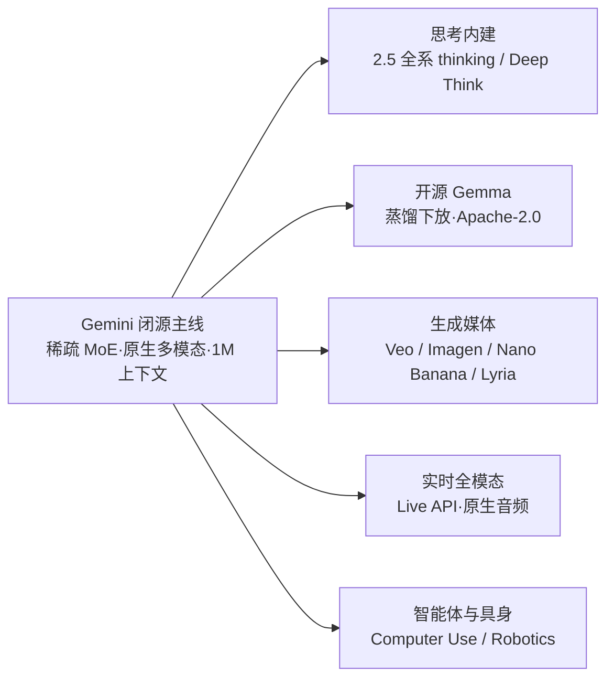

# Gemini（Google DeepMind）

> **一句话定位**：Google DeepMind 从第一天起就押注"原生多模态 + 超长上下文"的单一主线——稀疏 MoE Transformer 原生消化文本/图像/音频/视频（因此没有独立 VL 系列），1M token 上下文业界最长（研究版到 10M），自 2.5 起思考能力全系内建（Deep Think 拿下首个 IMO 官方金牌），依托自研 TPU + JAX + Pathways 全栈垂直整合，并以同源技术向开源 Gemma 与 Veo/Imagen/Lyria 生成媒体全家桶辐射。
>
> 首发年份：2023（Gemini 1.0，2023-12）· 机构：Google DeepMind · 代表版本：Gemini 3.5 Flash / 3.1 Pro（2026）、开源 Gemma 4（2026-04）
>
> 前置阅读：[基础模型总览](/base-models/)；对比阅读：[OpenAI](/base-models/openai)、[Claude](/base-models/claude)

## 模型系列总览

Google 的版图是"一核多辐"：闭源 Gemini 主线承载全部理解侧能力，开源 Gemma、生成媒体、Embedding、机器人均由主线技术下放。

### 语言旗舰主线（全系闭源、仅 API）

| 模型 | 发布时间 | 开源 | 要点 | 链接 |
|---|---|---|---|---|
| Gemini 1.0（Ultra/Pro/Nano） | 2023-12 | 闭源 | 首个原生多模态大模型（文/图/音/视频联合预训练而非拼接编码器），32K 上下文；Ultra 首次在 MMLU 达人类专家水平 | [博客](https://blog.google/technology/ai/google-gemini-ai/) |
| Gemini 1.5 Pro / Flash | 2024-02 / 2024-05 | 闭源 | 改用稀疏 MoE；生产环境 1M 上下文（研究演示 10M，>99% 大海捞针召回），一次处理 1 小时视频/11 小时音频；Flash 为[蒸馏](/distillation/)轻量版 | [博客](https://blog.google/innovation-and-ai/products/google-gemini-next-generation-model-february-2024/) |
| Gemini 2.0 Flash | 2024-12 | 闭源 | 定位 agentic era：原生[工具调用](/agent/tool-use)、原生图像+音频输出，性能超 1.5 Pro 且快 2 倍 | [博客](https://blog.google/technology/google-deepmind/google-gemini-ai-update-december-2024/) |
| Gemini 2.5 Pro / Flash / Flash-Lite | 2025-03（GA 2025-06） | 闭源 | 全系 thinking model（推理内建而非独立分支）；SWE-bench Verified 63.8%，可处理 3 小时视频 | [博客](https://blog.google/innovation-and-ai/models-and-research/google-deepmind/gemini-model-thinking-updates-march-2025/) |
| Gemini 3 Pro / Flash | 2025-11 / 2025-12 | 闭源 | Pro：LMArena 1501、SWE-bench 76.2%；Flash 在 SWE-bench 反超 Pro（78%），$0.50/$3 成为 App 默认 | [博客](https://blog.google/products/gemini/gemini-3/) |
| Gemini 3.1 Pro | 2026-02 | 闭源 | 推理性能较 3 Pro 翻倍以上，价格不变（$2/$12）；同代有 3.1 Flash-Lite / Flash Image / Flash Live | [博客](https://blog.google/innovation-and-ai/models-and-research/gemini-models/gemini-3-1-pro/) |
| Gemini 3.5 Flash | 2026-05 | 闭源 | 当前最新：主打 frontier intelligence with action，编码与 agentic 基准超 3.1 Pro、输出速度约为其他前沿模型 4 倍；3.5 Pro 官方标注 coming soon | [博客](https://blog.google/innovation-and-ai/models-and-research/gemini-models/gemini-3-5/) |

### 思考 / 推理：从独立实验到全系内建

| 节点 | 时间 | 要点 | 链接 |
|---|---|---|---|
| 2.0 Flash Thinking | 2024-12 | Google 首个显式展示思维链的推理模型；此后推理并入 2.5 主线，不再维持独立产品线 | [报道](https://techcrunch.com/2024/12/19/google-releases-its-own-reasoning-ai-model/) |
| Deep Think（IMO 金牌） | 2025-07 / 2025-08 | 高级版获 IMO 2025 官方认证金牌（35/42，首个 AI）；日用版 2.5 Deep Think 用并行思考（parallel thinking），面向 Ultra 订阅 | [博客](https://deepmind.google/blog/advanced-version-of-gemini-with-deep-think-officially-achieves-gold-medal-standard-at-the-international-mathematical-olympiad/) |
| Gemini 3 / 3.1 Deep Think | 2025-12 / 约 2026-03 | 3 代：HLE 41.0%（无工具）、ARC-AGI-2 45.1%、GPQA Diamond 93.8%；3.1 版进一步提升，定位科学/工程难题，仅 Ultra（$249.99/月） | [博客](https://blog.google/products/gemini/gemini-3-deep-think/) |

与 [DeepSeek](/base-models/deepseek) R1 式独立推理线不同，Gemini 的路线是"实验一代、全系内建、超额算力上探"三段式：thinking 是主线默认能力，Deep Think 只是同一模型的并行思考增强档。

### VL / 多模态理解：内建于主线，无独立系列

原生多模态是 Gemini 的出厂设定：视觉/音频/视频理解从 1.0 起就在联合预训练里，从未有过"外挂视觉编码器的 VL 分支"。开源侧的对应物是 [PaliGemma](https://arxiv.org/abs/2407.07726)（2024-07，SigLIP-So400m + Gemma-2B 的 3B 开放 VLM 基座），以及 Gemma 3 起的多模态化（见下）。

### Omni / 实时全模态（源自 Project Astra）

| 能力 | 时间 | 要点 | 链接 |
|---|---|---|---|
| 原生图像/音频输出 | 2024-12（2.0 Flash） | 首个内建全模态输出的旗舰 | [博客](https://blog.google/technology/google-deepmind/google-gemini-ai-update-december-2024/) |
| Live API 原生音频对话 | 2025-05/06（2.5 Flash Native Audio） | 30+ 音色/24+ 语言、情感感知对话、主动音频（分辨背景对话决定何时应答）、对话中调工具；2026 年延续为 3.1 Flash Live | [博客](https://blog.google/innovation-and-ai/models-and-research/google-deepmind/gemini-2-5-native-audio/) |
| 原生 TTS | 2025-05（2.5 Pro/Flash TTS） | 单/多说话人可控合成，全部音频输出嵌 SynthID 水印 | 同上 |

### 开源 Gemma 系列

| 模型 | 发布时间 | 开源 | 要点 | 链接 |
|---|---|---|---|---|
| Gemma 1（2B/7B） | 2024-02 | 开放权重（Gemma 条款） | Gemini 同源技术下放，预训练+IT checkpoint | [论文](https://arxiv.org/abs/2403.08295) |
| Gemma 2（2.6B/9B/27B） | 2024-06 | 开放权重（Gemma 条款） | 知识蒸馏训练、局部-全局注意力交错、logit soft-capping；27B Arena 超 Llama 3 70B | [论文](https://arxiv.org/abs/2408.00118) |
| Gemma 3（1B~27B） | 2025-03 | 开放权重（Gemma 条款） | 首次多模态（SigLIP）、128K 上下文、140+ 语言；5:1 局部/全局注意力大幅压 [KV-cache](/inference/kv-cache) | [论文](https://arxiv.org/abs/2503.19786) |
| Gemma 3n（E2B/E4B）/ 270M | 2025-06 / 2025-08 | 开放权重（Gemma 条款） | 端侧全模态：MatFormer 嵌套子模型 + Per-Layer Embeddings（总参 5B/8B、加速器只载 2B/4B）；270M 超小模型主打微调底座 | [博客](https://developers.googleblog.com/en/introducing-gemma-3n-developer-guide/) |
| Gemma 4（E2B/E4B/26B MoE/31B） | 2026-04 | 开放权重（**Apache-2.0**） | 26B MoE 仅激活 3.8B；31B Dense 256K 上下文；全系原生图像+视频理解；许可证转标准 Apache-2.0 是最大转折 | [博客](https://blog.google/innovation-and-ai/technology/developers-tools/gemma-4/) |
| 衍生家族 | 2024-04 起 | 开放权重（Gemma 条款） | [CodeGemma](https://arxiv.org/abs/2406.11409)（代码/FIM）、[RecurrentGemma](https://arxiv.org/abs/2404.07839)（Griffin 线性循环架构）、[ShieldGemma](https://arxiv.org/abs/2407.21772)（安全审核）、[MedGemma](https://arxiv.org/abs/2507.05201)（医疗多模态） | 见各论文 |

### 其他：生成媒体、Embedding、智能体/具身

| 系列 | 代表与时间 | 开源 | 要点 | 链接 |
|---|---|---|---|---|
| 视频 Veo | Veo 3（2025-05）/ 3.1（2025-10） | 闭源 | Veo 3 首个原生同步音频的视频模型；3.1 加 1080p、多参考图控制，2026 年扩展 Lite/Fast/Quality 三档 | [博客](https://blog.google/innovation-and-ai/products/veo-updates-flow/) |
| 图像 Imagen / Nano Banana | Imagen 4（2025-05，GA 2025-08）；Nano Banana（2025-08）/ Pro（2025-11） | 闭源 | Nano Banana = Gemini 原生图像生成/编辑（角色一致性、世界知识编辑，$0.039/图）；Pro 基于 Gemini 3 推理生图、4K 输出 | [博客](https://developers.googleblog.com/en/introducing-gemini-2-5-flash-image/) |
| 音乐 Lyria | Lyria 2 / RealTime（2025-04/05） | 闭源 | 48kHz 专业立体声；RealTime 支持实时 prompt 操控的持续音乐流 | [页面](https://deepmind.google/models/lyria/) |
| Embedding | gemini-embedding-001（2025-07 GA）→ Gemini Embedding 2（2026-03） | 闭源 | 前者 Matryoshka 可变维度（3072/1536/768）、长期 MTEB 多语言榜首；后者为 Google 首个原生多模态 embedding（文/图/视频/音频/PDF 统一 3072 维）；开源侧 EmbeddingGemma 308M 端侧可跑 | [博客](https://blog.google/innovation-and-ai/models-and-research/gemini-models/gemini-embedding-2/) |
| Computer Use | 2025-10（基于 2.5 Pro） | 闭源 | 截图→视觉推理→点击/输入的浏览器/UI 操控专用模型；配套 Project Mariner、Jules、Antigravity IDE（参见 [Agent Loop](/harness/agent-loop)） | [文档](https://ai.google.dev/gemini-api/docs/models/gemini-2.5-computer-use-preview-10-2025) |
| 具身 Gemini Robotics | 2025-03 / 1.5（2025-09） | 闭源（ER 1.5 仅 API） | VLA 视觉-语言-动作模型 + ER 具身推理编排器；1.5 动作前先"思考"、跨形态 motion transfer | [论文](https://arxiv.org/abs/2510.03342) |
| 实验 Gemini Diffusion | 2025-05 | 闭源（邀请制） | 文本扩散模型：并行去噪生成而非自回归逐 token，实测 1479 tokens/秒（约 2.0 Flash-Lite 的 5 倍） | [博客](https://blog.google/technology/google-deepmind/gemini-diffusion/) |

## 架构与训练亮点

**原生多模态联合预训练**是与所有"基座 + 外挂视觉编码器"路线（如 [Qwen](/base-models/qwen) VL 分支）最根本的差异：单一模型从预训练阶段就在交错的文/图/音/视频 token 上学习，输出侧也逐步原生化（2.0 起图像/音频输出内建）。代价是闭源主线完全黑盒——Google 从不披露参数量。

**稀疏 MoE 自 1.5 起为主线架构**。Gemini 3 Pro 模型卡明文确认 sparse MoE Transformer（引用 GShard/Switch 谱系），但总参/激活参数从未公开；唯一公开 MoE 配比的是开源 Gemma 4 26B（总参 26B/激活 3.8B）。Gemma 2/3 用 GQA + 局部-全局注意力交错（Gemma 3 为 5:1，短跨度局部注意力大幅压缩 KV-cache 显存），未采用 DeepSeek 式 MLA。

> 图源：Gemma Team, Google DeepMind, *Gemma 3 Technical Report*, [arXiv:2503.19786](https://arxiv.org/abs/2503.19786)（用于学习注解，版权归原作者）

**超长上下文是立身之本**：主线 1M token（1.5 研究版 10M、>99% 大海捞针召回）长期业界最长，Gemma 3 为 128K、Gemma 4 大模型 256K。这背后是 **TPU + JAX + ML Pathways 全栈垂直整合**——Google 是唯一不依赖 NVIDIA 生态训练旗舰的厂商，硬件-编译器-框架协同是其长上下文与成本优势的来源。

**蒸馏是家族化的核心手段**：1.5 Flash、Gemma 2/3 均以大模型蒸馏训练（参见[白盒蒸馏](/distillation/white-box)），使 Gemma 3 27B-IT 逼近 Gemini 1.5 Pro，形成"旗舰探索 → 蒸馏下放 → 开源辐射"的流水线。

## 许可证与选型建议

**许可证三层格局**：(1) Gemini 主线及 Veo/Imagen/Lyria/Embedding 全部专有、仅 API/订阅，无开放权重；(2) Gemma 1~3n 及衍生家族为开放权重但用自定义 Gemma Terms of Use——允许商用，附 Prohibited Use Policy、下游条款传导义务、Google 可单方面更新条款，非 OSI 认证，商业合规需法务评估；(3) **2026-04 起 Gemma 4 改用标准 Apache-2.0**，与 [Qwen](/base-models/qwen) 看齐，是开源策略最重大的转折。

**选型建议**（截至 2026 年中，价格为每百万 tokens 输入/输出）：

| 场景 | 推荐 | 说明 |
|---|---|---|
| 最高质量复杂推理 | Gemini 3.1 Pro | 1M/65K，$2/$12（>200K 上下文 $4/$18）；3.5 Pro 待发布 |
| agentic 编码 / 主力性价比 | Gemini 3.5 Flash | 编码与智能体基准超 3.1 Pro，输出速度约 4 倍 |
| 高吞吐低成本 | Gemini 3 Flash | $0.50/$3，SWE-bench Verified 78% |
| 科学/数学难题 | Gemini 3.1 Deep Think | 仅 Ultra 订阅（$249.99/月） |
| 超长视频/音频/海量文档理解 | 主线任意档 | 1M 上下文 + 原生多模态是独占能力 |
| 私有化部署 / 可微调 | Gemma 4 31B（Apache-2.0） | 256K 上下文、原生图像+视频理解；MoE 26B 适合推理成本敏感场景 |
| 端侧 | Gemma 4 E2B/E4B、Gemma 3n、270M | MatFormer + PLE 专为端侧设计 |

实践提示：Gemini 主线的 thinking 默认开启且计费按思考 token 计，延迟敏感场景注意 thinking budget 控制；需要可复现微调或权重级定制时只能走 Gemma，主线不提供任何权重访问。

## 参考链接

- Gemini Team, 2023. Gemini: A Family of Highly Capable Multimodal Models. arXiv:2312.11805
- Gemini Team, 2024. Gemini 1.5: Unlocking Multimodal Understanding Across Millions of Tokens of Context. arXiv:2403.05530
- Gemini Team, 2025. Gemini 2.5: Pushing the Frontier with Advanced Reasoning, Multimodality, Long Context, and Next Generation Agentic Capabilities. arXiv:2507.06261
- Gemma Team, 2024. Gemma: Open Models Based on Gemini Research and Technology. arXiv:2403.08295
- Gemma Team, 2024. Gemma 2: Improving Open Language Models at a Practical Size. arXiv:2408.00118
- Gemma Team, 2025. Gemma 3 Technical Report. arXiv:2503.19786
- [Gemini 3 Pro Model Card](https://deepmind.google/models/model-cards/gemini-3-pro/)
- [DeepMind 模型总览页](https://deepmind.google/models/gemini/)
- [Gemma Terms of Use](https://ai.google.dev/gemma/terms)
