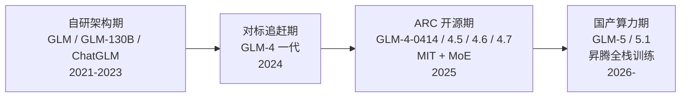

# GLM（智谱 AI / Z.ai）

> **一句话定位**：智谱 AI（2019 年从清华 KEG 实验室孵化，2025 年国际品牌更名 Z.ai，2026 年 1 月港交所上市，是中国首家上市的大模型创业公司）以 GLM 预训练目标（autoregressive blank infilling, 2021）起家，主线押注 **ARC（Agentic + Reasoning + Coding）一体化**，是目前唯一同时做到"7 千亿级前沿 MoE 旗舰 + 全系 MIT 开源 + 完全国产昇腾算力训练"三件事的厂商（GLM-5/5.1）。
>
> 首发年份：2021（GLM 模型，2021-03；智谱 AI 2019 年成立）· 机构：智谱 AI / Z.ai（清华 KEG 孵化）· 代表版本：GLM-5.1 754B-A40B（2026-04）
>
> 前置阅读：[基础模型总览](/base-models/)；对比阅读：[DeepSeek](/base-models/deepseek)、[Qwen](/base-models/qwen)、[Kimi](/base-models/kimi)

## 模型系列总览

智谱的产品版图经历了清晰的四个阶段：自研架构期（GLM/GLM-130B/ChatGLM）→ 对标追赶期（GLM-4 一代，API 为主）→ ARC 开源期（2025-04 起全面转 MIT、MoE 化）→ 国产算力期（GLM-5 起完全在华为昇腾上训练）。

### 语言模型主线

| 模型 | 发布时间 | 开源 | 要点 | 链接 |
|---|---|---|---|---|
| GLM | 2021-03 | 是（10B/2B） | 自回归填空 + 2D 位置编码的统一预训练目标，家族命名来源（ACL 2022） | [论文](https://arxiv.org/abs/2103.10360) |
| GLM-130B | 2022-08 | 是（自定义许可） | 130B 稠密中英双语；INT4 量化无损推理、4×RTX3090 可跑，当时极少数开放的百亿级以上模型（ICLR 2023） | [论文](https://arxiv.org/abs/2210.02414) |
| ChatGLM-6B | 2023-03 | 是（自定义许可） | 6.2B 双语对话，6GB 显存可跑；GitHub 50K+ stars，中文开源对话模型的早期引爆点 | [GitHub](https://github.com/zai-org/ChatGLM-6B) |
| ChatGLM2 / ChatGLM3 | 2023-06 / 2023-10 | 是（自定义许可） | MQA + FlashAttention、32K 上下文；ChatGLM3 原生支持 Function Call / Code Interpreter / Agent 任务 | [GitHub](https://github.com/zai-org/ChatGLM3) |
| GLM-4 一代 | 2024-01（API）/ 2024-06 开源 9B | GLM-4-9B 开源（glm-4 许可） | 预训练约 10T token；闭源 API（GLM-4 / Air / All Tools）+ 开源 GLM-4-9B（128K 上下文、多语言） | [论文](https://arxiv.org/abs/2406.12793) |
| GLM-4-Plus | 2024-08 | 否（API） | 当时闭源旗舰，同场发布 GLM-4V-Plus 与清言视频通话 | [产品页](https://bigmodel.cn/dev/howuse/llm/glm-4-plus) |
| GLM-4-32B/9B-0414 | 2025-04 | 是（**MIT，转折点**） | 32B 稠密对标更大规模主流模型；全系首次改用 MIT，此后主线开源全部沿用 | [发布稿](https://www.prnewswire.com/news-releases/zai-unveils-new-glm-open-source-models-with-world-class-reasoning-performance-302429306.html) |
| GLM-4.5 / 4.5-Air | 2025-07 | 是（MIT） | MoE 355B/A32B 与 106B/A12B；ARC 定位确立，单模型混合思考；预训练 23T token；SWE-bench Verified 64.2% | [论文](https://arxiv.org/abs/2508.06471) |
| GLM-4.6 | 2025-09 | 是（MIT） | 上下文 128K→200K、输出 128K，比 4.5 省 15% token；SWE-bench Verified 68%，公开对 Claude Sonnet 4 的全部 74 条 CC-Bench 实测轨迹（胜率 48.6%） | [模型卡](https://huggingface.co/zai-org/GLM-4.6) |
| GLM-4.7 / 4.7-Flash | 2025-12 / 2026-01 | 是（MIT） | 358B/A32B；Interleaved/Preserved Thinking（每次工具调用前思考、多轮保留思考），τ²-Bench 87.4 当时开源最高；Flash 为轻量免费版 | [发布稿](https://www.businesswire.com/news/home/20251223393714/en/Z.ai-Open-Sources-GLM-4.7-a-New-Generation-Large-Language-Model-Built-for-Real-Development-Workflows) |
| GLM-5 | 2026-02 | 是（MIT） | MoE 744B/A40B（256 专家）；DSA 稀疏注意力；200K 上下文/128K 输出；**完全在华为昇腾 + MindSpore 上训练** | [论文](https://arxiv.org/abs/2602.15763) |
| GLM-5-Turbo | 2026-03 | 否（API） | 面向高吞吐 Agent 工作流的 API 版本 | [发布记录](https://docs.z.ai/release-notes/new-released) |
| GLM-5.1 | 2026-04 | 是（MIT） | 现旗舰，754B/A40B；主打长程自治：单任务连续自主工作 8 小时、数百轮规划-执行-迭代；SWE-bench Pro 58.4 | [模型卡](https://huggingface.co/zai-org/GLM-5.1) |

### 思考 / 推理系列

独立推理线只存在了约半年，随后并入主线——这与 [DeepSeek](/base-models/deepseek)（R 系列独立）不同，与 [Qwen](/base-models/qwen) 的混合思考收敛路线相似：

| 模型 | 发布时间 | 开源 | 要点 | 链接 |
|---|---|---|---|---|
| GLM-Zero-Preview | 2024-12 | 否（API） | 智谱首个 o1 式深度推理模型（扩展 RL 训练），数学/代码对标 o1-preview | [报道](https://www.ctol.digital/news/zhipu-ai-glm-zero-preview-vs-openai-o1-ai-race/) |
| GLM-Z1-32B/9B-0414 | 2025-04 | 是（MIT） | 在 GLM-4-0414 上冷启动 + 扩展 RL 深度优化数学/代码/逻辑 | [发布稿](https://www.prnewswire.com/news-releases/zai-unveils-new-glm-open-source-models-with-world-class-reasoning-performance-302429306.html) |
| GLM-Z1-Rumination-32B | 2025-04 | 是（MIT） | "沉思"模型：结合搜索工具做长程开放式深度研究（deep research 风格） | [模型卡](https://huggingface.co/zai-org/GLM-Z1-Rumination-32B-0414) |
| 混合思考（并入主线） | 2025-07 起 | — | GLM-4.5 起单模型 thinking/non-thinking 双模式（`enable_thinking` 切换）；GLM-4.7 演化出 Interleaved/Preserved/Turn-level 三种细粒度思考控制 | [论文](https://arxiv.org/abs/2508.06471) |

### VL / 多模态理解系列

Cog 系（清华 KEG 学术血统）与 GLM-V 系两条线在 2025 年合流。CogAgent 是业界最早面向 GUI 智能体的 VLM 之一，奠定了后来 AutoGLM 的技术基础：

| 模型 | 发布时间 | 开源 | 要点 | 链接 |
|---|---|---|---|---|
| VisualGLM-6B | 2023-05 | 是 | 基于 ChatGLM-6B 的中英多模态对话模型 | [GitHub](https://github.com/zai-org/VisualGLM-6B) |
| CogVLM-17B | 2023-11 | 是 | "视觉专家模块"插入 LLM 注意力/FFN 层做深度融合，10 项跨模态基准 SOTA | [论文](https://arxiv.org/abs/2311.03079) |
| CogAgent | 2023-12 | 是 | 首批面向 GUI 智能体的 VLM，纯截图输入超过吃 HTML 的方法（CVPR 2024） | [论文](https://arxiv.org/abs/2312.08914) |
| GLM-4V-9B / 4V-Plus | 2024-06 / 2024-08 | 9B 开源 / Plus 仅 API | 随 GLM-4 一代发布的视觉理解线；Plus 支持视频理解 | [论文](https://arxiv.org/abs/2406.12793) |
| GLM-4.1V-9B-Thinking | 2025-07 | 是（MIT） | 首个把思考模式 + RLCS（课程采样强化学习）引入小尺寸 VLM，29 项基准超 72B 的 Qwen2.5-VL | [论文](https://arxiv.org/abs/2507.01006) |
| GLM-4.5V | 2025-08 | 是（MIT） | 基于 GLM-4.5-Air（106B/A12B）的 MoE VLM，42 项基准同规模开源 SOTA，覆盖 GUI agent 操作 | [模型卡](https://huggingface.co/zai-org/GLM-4.5V) |
| GLM-4.6V / Flash | 2025-12 | 是（MIT） | VLM 原生 function calling：视觉输入直接调用搜索/裁剪/图表识别工具；106B 基座 + 9B 端侧两档 | [报道](https://venturebeat.com/ai/z-ai-debuts-open-source-glm-4-6v-a-native-tool-calling-vision-model-for) |
| GLM-5V-Turbo | 2026-04 | 否（API） | 基于 GLM-5 的多模态模型，设计稿/截图直接生成可执行前端代码 | [发布记录](https://docs.z.ai/release-notes/new-released) |

### Omni / 语音：模型矩阵而非统一全模态

截至 2026 年中，智谱没有 Qwen-Omni 那种统一全模态模型，全模态能力由独立模型矩阵承担：

| 模型 | 发布时间 | 开源 | 要点 | 链接 |
|---|---|---|---|---|
| GLM-4-Voice | 2024-10 | 是 | 端到端中英语音对话三件套：Whisper+VQ tokenizer（12.5 token/秒）、Voice-9B、CosyVoice 流式解码（10 token 起播）；可控情感/语速/方言 | [论文](https://arxiv.org/abs/2412.02612) |
| GLM-Realtime | 2025-01 前后 | 否（API） | 实时音视频通话（低延迟、可打断），前身为 GLM-4-Plus-VideoCall | [文档](https://open.bigmodel.cn/dev/api/rtav/GLM-Realtime) |
| GLM-ASR-2512 | 2025-12 | 否（API） | 新一代语音识别，中文 CER 0.0717，面向会议纪要/专业术语场景 | [文档](https://docs.z.ai/guides/audio/glm-asr-2512) |

### 其他：生成式多模态、Coder、Embedding、GUI Agent

| 项目 | 发布时间 | 开源 | 要点 | 链接 |
|---|---|---|---|---|
| CogVideoX 系列 | 2024-08 | 是（2B Apache-2.0 / 5B 自定义） | DiT 文生视频：3D Causal VAE + Expert Transformer；源头 CogVideo（2022）是最早的开源大规模文生视频模型之一；CogVideoX-3（2025-07）转 API | [论文](https://arxiv.org/abs/2408.06072) |
| CogView4 | 2025-03 | 是（Apache-2.0） | 6B DiT，首个支持汉字生成的开源文生图模型（双语 GLM-4 文本编码器） | [GitHub](https://github.com/zai-org/CogView4) |
| GLM-Image | 2026-01 | 是（MIT） | 16B 混合架构 = 9B 自回归生成器 + 7B DiT 扩散解码器（Glyph Encoder 强化文字渲染）；首个完全在昇腾 910C 上从零训练的旗舰图像模型 | [模型卡](https://huggingface.co/zai-org/GLM-Image) |
| CodeGeeX → CodeGeeX4 | 2022 / 2024-07 | 是 | 13B 多语言代码模型起家（KDD 2023）；CodeGeeX4-ALL-9B 当时 10B 以下最强；GLM-4.5 后 Coding 并入主线 | [GitHub](https://github.com/zai-org/CodeGeeX4) |
| Embedding-3 | — | 否（API） | 最大输入 8K，向量维度 256–2048 可选；开源 embedding 领域智谱无知名权重发布 | [文档](https://docs.bigmodel.cn/cn/guide/models/embedding/embedding-3) |
| AutoGLM | 2024-10 | 论文公开 | GUI 自主操作基础智能体（手机 + 浏览器），"Phone Use"方向早期代表；2025-03 推出免费 AutoGLM 沉思深度研究智能体 | [论文](https://arxiv.org/abs/2411.00820) |
| GLM-OCR | 2026-02 | 否（API） | 光学字符识别模型 | [发布记录](https://docs.z.ai/release-notes/new-released) |

## 架构与训练亮点

**从异构预训练目标回归 decoder-only**。GLM 最初的差异化是自回归填空目标（一套目标统一 NLU/有条件生成/无条件生成），但从 GLM-4 一代起实质收敛到主流 decoder-only 自回归路线，"GLM"只保留为品牌名。真正的架构差异化转移到了 MoE 设计上。

**"窄而深"的 MoE 路线，与 DeepSeek 分道**。据 GLM-4.5 技术报告，其 MoE 采用 GQA（分组查询注意力）+ partial RoPE 而非 [DeepSeek](/base-models/deepseek) 的 MLA；路由用 sigmoid 门控 + loss-free balance；含 MTP（多 token 预测）层支持投机解码（参见[投机解码](/inference/speculative-decoding)）；训练用 Muon 优化器；在同等总参下选择更窄的隐层、更多的层数，押注深度换推理能力。有趣的是 GLM-5 又引入了 DeepSeek 的 DSA 稀疏注意力来压长上下文部署成本——两家在注意力机制上互相借鉴。

**Agent 原生是训练主线，不是产品包装**。GLM-4.5 确立 ARC 定位后，每代的核心迭代都围绕 agent 工作流：GLM-4.6 公开全部 74 条对 Claude Sonnet 4 的 CC-Bench 实测轨迹（开源模型中罕见的透明度）；GLM-4.7 的 Interleaved/Preserved Thinking 解决"多轮 agent 会话中思考被丢弃"的问题；GLM-5 技术报告（副标题 from Vibe Coding to Agentic Engineering）把异步 agent RL 基础设施列为核心贡献——在 rollout 极长（数百轮工具调用）的 agentic RL 中，异步化是吞吐关键（参见 [Agentic RL](/agent/agentic-rl/) 与 [RLHF 总览](/rlhf/)）。

> 图源：Zhipu AI / Z.ai, *GLM-4.5: Agentic, Reasoning, and Coding (ARC) Foundation Models*, [arXiv:2508.06471](https://arxiv.org/abs/2508.06471)（用于学习注解，版权归原作者）

**去英伟达化的全栈验证**。GLM-5 起旗舰完全在华为昇腾 + MindSpore 上训练（据多家报道为十万卡级昇腾集群、预训练约 28.5T token），GLM-Image 同样在昇腾 910C 上从零训练。这使智谱成为验证"前沿规模模型可以脱离英伟达生态训练"的第一个公开案例，地缘技术意义大于算法意义。

**量化与平民化传统**。从 GLM-130B 的 INT4 无损推理（4×RTX3090 可跑 130B）到 ChatGLM-6B 的 6GB 显存门槛，"让大模型跑在消费级硬件上"是贯穿性传统（原理参见[量化](/inference/quantization)）。

## 许可证与选型建议

**许可证三阶段**：(1) 2022–2024 自定义许可证（研究免费、商用需登记，代码多为 Apache-2.0）；(2) 2025-04 GLM-4-0414 起主线全面转 **MIT**——GLM-4.5/4.6/4.7/5/5.1、GLM-4.5V/4.6V、GLM-Z1、GLM-Image 均可自由商用、再分发，是头部厂商中最宽松的；(3) 旗舰增值线仅 API：GLM-4-Plus、GLM-Zero-Preview、GLM-5-Turbo、GLM-5V-Turbo、GLM-Realtime、Embedding-3、GLM-ASR/OCR。

**选型建议**（截至 2026 年中）：

| 场景 | 推荐 | 理由 |
|---|---|---|
| 私有化部署前沿级 agent / coding 能力 | GLM-5.1（754B/A40B，MIT） | 开放权重中 agentic 工程能力第一梯队，长程自治（8 小时级任务）；许可证无商用障碍 |
| 资源受限的自部署（单机多卡） | GLM-4.5-Air（106B/A12B）或 GLM-4.7-Flash | Air 是 100B 档性价比之选，且有同构 VLM（GLM-4.5V）可配套 |
| 多模态理解 + GUI agent | GLM-4.6V / GLM-4.5V | 原生 function calling 的开源 VLM，适合截图驱动的 agent（参见[工具调用](/agent/tool-use)） |
| 高吞吐 API agent 工作流 | GLM-5-Turbo | 不需要权重时的低成本选项 |
| 文字渲染要求高的文生图 | GLM-Image（MIT） | 中文/海报文字渲染开源最强档 |

注意点：智谱开源的是权重 + 技术报告，但预训练数据与完整 RL 配方不公开；做继续预训练或 RL 时需自备数据管线。GLM-5 上下文为 200K（个别媒体的 2M 说法与官方 API 文档不符，不可信）。

## 参考链接

- Du et al., 2021. GLM: General Language Model Pretraining with Autoregressive Blank Infilling. arXiv:2103.10360
- Zeng et al., 2022. GLM-130B: An Open Bilingual Pre-trained Model. arXiv:2210.02414
- GLM et al., 2024. ChatGLM: A Family of Large Language Models from GLM-130B to GLM-4 All Tools. arXiv:2406.12793
- GLM-4.5 Team, 2025. GLM-4.5: Agentic, Reasoning, and Coding (ARC) Foundation Models. arXiv:2508.06471
- GLM-5 Team, 2026. GLM-5: from Vibe Coding to Agentic Engineering. arXiv:2602.15763
- Hong et al., 2024. CogAgent: A Visual Language Model for GUI Agents. arXiv:2312.08914
- Zeng et al., 2024. GLM-4-Voice: Towards Intelligent and Human-Like End-to-End Spoken Chatbot. arXiv:2412.02612
- [Z.ai 官方文档与发布记录](https://docs.z.ai/release-notes/new-released)
- [HuggingFace zai-org 组织页](https://huggingface.co/zai-org)
