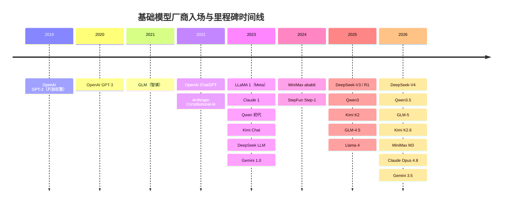
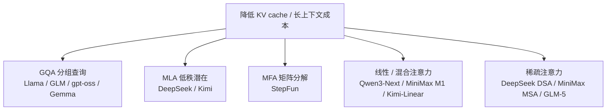

# 基础模型总览

> **本章定位**：梳理主流大厂基础模型（base model）的版图——它们是 [SFT](/sft/)、[LoRA](/lora/)、[DPO](/dpo/)、[RLHF](/rlhf/) 等一切后训练工作的起点。开源模型以技术报告 / 论文为准，闭源模型以官方博客 / 模型卡为准；我们刻意不堆砌易过期的 benchmark 数字，而是讲清楚每家的**技术路线、开源策略与选型权衡**。各厂商页给出完整模型谱系与架构细节，本页只做横向对比。

LLM 算法工程师选底座时面对的第一个问题不是"哪个最强"，而是"在我的约束下，哪条技术路线 + 哪个许可证 + 哪种部署形态最合适"。这一章把十家头部厂商放在同一坐标系里：开放权重派（Qwen / DeepSeek / GLM / Llama / Kimi / MiniMax / StepFun）与闭源 API 派（Gemini / Claude / OpenAI），稀疏 MoE 与稠密、MLA 与 GQA、一厂多线与单一主线，在效率、开放度、多模态布局上的取舍各不相同。读懂这些取舍，比记住某条榜单分数更耐用。

## 厂商总览

下表为各家截至 2026 年中的代表性配置，点击厂商名进入详情页。"思考模型"指内建或独立的长思维链 / 推理能力；"许可证"列指其**开源模型主线**的许可证（闭源厂商标注为仅 API）；"首次入场"指该厂商发布首个语言模型的年份（OpenAI 以 2019 年开放 GPT-2 权重计；表格按此列从早到晚排序）。

| 厂商 | 首次入场 | 开源旗舰 | 闭源 / API 旗舰 | 思考模型 | 多模态 | 许可证 |
|---|---|---|---|---|---|---|
| [OpenAI](/base-models/openai) | 2019 | gpt-oss-120b / 20b | GPT-5.5 / Pro | o 系列已并入 GPT-5.x | 原生多模态 + 图像生成 | 仅 API（gpt-oss 为 Apache-2.0） |
| [GLM（智谱 / Z.ai）](/base-models/glm) | 2021 | GLM-5.1 754B-A40B | GLM-5-Turbo | 混合思考（并入主线） | GLM-V / Image / Voice | MIT |
| [Llama（Meta）](/base-models/llama) | 2023 | Llama 4 Scout / Maverick | Muse Spark（MSL 闭源） | 缺位（开源侧） | Llama 4 原生图文 | 自定义 Community License |
| [Claude（Anthropic）](/base-models/claude) | 2023 | 无 | Claude Opus 4.8 | adaptive thinking（内建） | 仅视觉理解（内建） | 仅 API |
| [Qwen（阿里）](/base-models/qwen) | 2023 | Qwen3.5-397B-A17B | Qwen3.7-Max / Plus | 独立 Thinking 系列 | VL / Omni / Image / Video 全开源 | Apache-2.0（全系） |
| [Kimi（月之暗面）](/base-models/kimi) | 2023 | Kimi K2.6 1T-A32B | moonshot-v1（已淡出） | K2 Thinking | K2.5/2.6 原生视觉 + Audio | Modified MIT |
| [DeepSeek](/base-models/deepseek) | 2023 | DeepSeek-V4-Pro 1.6T | 无（全开源） | 混合思考（并入主线） | 仅视觉理解 VL / OCR | MIT |
| [Gemini（Google）](/base-models/gemini) | 2023 | Gemma 4（开源辐射） | Gemini 3.5 Flash / 3.1 Pro | 全系内建 + Deep Think | 原生多模态主线 | 仅 API（Gemma 为 Apache-2.0） |
| [MiniMax](/base-models/minimax) | 2024 | MiniMax-M2.5 / M3 | Hailuo / Speech 等生成线 | interleaved thinking（并入主线） | M3 原生多模态 + 生成矩阵 | MIT（部分受限） |
| [StepFun（阶跃星辰）](/base-models/stepfun) | 2024 | Step-3.7-Flash 198B-A11B | Step-1o（已淡出） | 三档可调推理（并入主线） | 原生 VLM + 视频/音频/图像/3D | Apache-2.0 |

读表要点：(1) **开源已成中国厂商共识**——Qwen/DeepSeek/GLM/Kimi/MiniMax/StepFun 的旗舰均开放权重，且许可证普遍收敛到 MIT/Apache-2.0；(2) 三家美国闭源厂商中，Google 与 OpenAI 仍保留开源辐射线（Gemma、gpt-oss），唯有 Anthropic 完全不放权重；(3) Meta 是唯一的"反向案例"——曾是开源旗手，2025–26 年随 MSL 成立转向闭源 Muse，开源线事实上停在 Llama 4。

## 厂商入场时间线

各厂商首个语言模型 / 代表性里程碑的出现年份（以各厂商页可考证的发布时间为准）：

## 技术路线对比

**MoE vs Dense。** 前沿规模几乎全面转向稀疏 MoE：用大总参承载知识、用小激活参数控制推理成本。差异在激活比——DeepSeek-V4-Pro 1.6T 仅激活 49B、Kimi K2 系列 1T 激活 32B、Qwen3-Next 与 MiniMax M2 把激活比压到约 3%~4%，StepFun Flash 系列 200B 总参仅激活 11B。稠密路线如今主要存在于中小尺寸（微调底座、端侧）与 Llama 3.x 这类"暴力堆数据"的历史旗舰；Llama 3.1-405B 是公开训练细节最透明的稠密前沿模型，仍是社区预训练的参考手册。激活比越低，部署时对显存带宽与专家并行（EP）的要求越特殊，与稠密模型差异很大，选型时不能只看"激活 X B 等于 X B 稠密"。

**注意力机制：MLA / GQA / 线性 / 稀疏。** 这是各家差异化最激烈的战场，目标都是压低长上下文下的 [KV cache](/inference/kv-cache) 开销：

GQA 是最保守稳妥的工业标准；MLA（DeepSeek 首创，KV 压缩约 93%）是其低价 API 的根本来源，被 Kimi 复用；StepFun 的 MFA 是另一条低秩压缩路线。更激进的线性 / 混合注意力（Gated DeltaNet、Lightning、KDA 按 3:1 与全注意力交错）把 KV 压力近似常数化，但 MiniMax 在 M2 上一度"折返"回全注意力——说明混合注意力在 agentic 场景仍有工程与精度代价。最新趋势是稀疏注意力（先检索 top-K KV 再算），DeepSeek DSA、MiniMax MSA、GLM-5 都在此收敛，把长上下文复杂度降到近线性。

**开源策略差异。** 大致分四档：(1) **彻底开放**——DeepSeek/GLM 连前沿旗舰、技术报告全部 MIT 开放，无"仅 API"闭源层；Qwen 全系 Apache-2.0 且谱系最全；(2) **开源旗舰 + 闭源增值线**——Kimi/MiniMax/StepFun 开放权重旗舰，但生成式媒体（视频/语音/音乐）或 Turbo 版走 API；(3) **闭源主线 + 开源辐射**——Google 主线闭源但下放 Gemma，OpenAI 主线闭源但放 gpt-oss；(4) **全闭源**——Anthropic 不放任何权重。注意"开放权重"不等于 OSI 开源：Llama 的 Community License 有 7 亿月活上限并限制欧盟实体使用多模态版，Kimi/MiniMax 的 Modified MIT 附带署名或商用授权条款，生产前必须读 HF 仓库当前的 LICENSE 文件。

**思考能力的收敛。** 推理线普遍从"独立系列"走向"并入主线"：OpenAI o 系列并入 GPT-5.x，Gemini 2.5 起全系内建，Claude 做 adaptive thinking，GLM/Qwen/StepFun/MiniMax 各以混合或可调档位收编。唯一显著的反例是 DeepSeek——R 系列虽已并入主线 thinking mode，但仍保留 Speciale 这类"推理拉满"的独立变体。值得记住的公开教训：Qwen3 曾在单模型内统一 thinking/non-thinking，三个月后发现折损、改为分开训练，这是关于混合推理模型代价的重要行业证据。

## 选型建议

| 维度 | 首选方向 | 说明 |
|---|---|---|
| **必须私有化 / 可微调** | Qwen、DeepSeek、GLM、Kimi、MiniMax、StepFun；OpenAI gpt-oss、Google Gemma | 闭源三家中只有 OpenAI/Google 给开源辐射线；Anthropic 完全无权重 |
| **API 优先、要最强能力** | Claude Opus、Gemini Pro、GPT-5.x、Qwen-Max | 不想运维、追求上限时闭源仍有优势，但要为模型退役预留迁移路径 |
| **中文 / 中文文化场景** | Qwen、DeepSeek、GLM、Kimi、StepFun | 国产厂商中文语料与文字渲染（如 GLM-Image / Qwen-Image）优势明显 |
| **超长上下文** | Gemini（1M，业界最长）、Kimi/MiniMax（1M 混合注意力）、DeepSeek-V4（1M） | 闭源看 Gemini，开源看混合 / 稀疏注意力系；超长文档场景注意"宣称值"需自测 |
| **推理 / 数学竞赛** | DeepSeek（V3.2-Speciale / Math-V2 / Prover）、Gemini Deep Think、GPT-5 Pro | 形式化证明走 DeepSeek-Prover；可验证任务的 RL 范式源头是 DeepSeekMath 的 [GRPO](/rlhf/grpo) |
| **agentic 编码 / 长程自治** | Claude（SWE-bench 标杆）、GLM-5.1、Kimi K2.6、MiniMax-M2.5、Qwen3-Coder | 开源侧 agentic 工程能力第一梯队已逼近闭源；激活比低、部署成本可控 |
| **多模态生成（图 / 视频 / 语音）** | StepFun（生成线全栈开源）、Gemini（Veo/Imagen）、OpenAI（gpt-image）、Qwen（Image/Wan） | Claude/DeepSeek 不做生成式媒体；需要开源权重首选 StepFun/Qwen |
| **端侧 / 单卡微调底座** | Qwen 小尺寸、Gemma 4 E2B/E4B、Llama 3.1-8B、gpt-oss-20b | 看尺寸梯队是否齐全与社区微调生态；Qwen 是事实上的开源蒸馏底座 |
| **RAG 检索 / Embedding** | Qwen3-Embedding、Gemini Embedding、OpenAI text-embedding-3 | 注意 Anthropic 不做 embedding（官方推荐第三方 Voyage） |

一条贯穿性提示：**做评测或成本核算时务必锁定具体模型快照与推理档位**。闭源厂商的实时路由器、adaptive thinking 会让同一请求的算力消耗不确定（GPT-5、Claude、Gemini 均如此）；开源 MoE 的"激活 X B"也不等价于同规模稠密的部署成本。

## 如何使用本章

- **先读这页建立横向地图**，再点进单个厂商页看完整谱系、架构细节与许可证逐项核对。
- 想理解"模型该做多大、喂多少数据、算力怎么分配"的底层规律，见 [Scaling Laws（规模定律）](/base-models/scaling-laws)——读懂它才看得明白各厂模型的"参数/训练 token"配比。
- 各厂商页结构统一：一句话定位 → 模型系列总览（语言 / VL / 思考 / Omni / 其他多条产品线）→ 架构与训练亮点（含 mermaid 演化图）→ 许可证与选型建议 → 参考链接。
- 选好底座后，按目标接入后训练章节：监督微调见 [SFT](/sft/) 与 [LoRA](/lora/)，偏好对齐见 [DPO](/dpo/) 与 [RLHF](/rlhf/)，蒸馏见 [蒸馏](/distillation/)，推理部署见 [推理优化](/inference/)，agent 工程见 [Harness](/harness/) 与 [Agent](/agent/)。
- 事实纪律：本章不堆砌易过期的榜单分数，模型谱系与日期以官方为准；引用具体数字前请回到各厂商页的参考链接核实。
