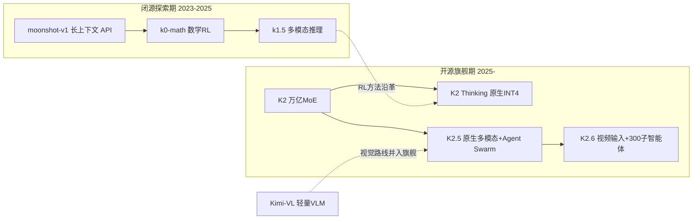

# Kimi（Moonshot AI / 月之暗面）

> **一句话定位**：以自研训练效率技术栈（Muon/MuonClip 优化器、INT4 QAT、KDA 线性注意力、MoBA 稀疏注意力、Mooncake 推理架构）为杠杆，把 1T 级超稀疏 MoE 旗舰全部开放权重，并将"长上下文 + 端到端 agentic RL"推到极致的"开源 Agentic Intelligence"路线。
>
> 首发年份：2023（Kimi Chat，2023-10；Moonshot AI 2023-03 成立）· 机构：月之暗面 / Moonshot AI · 代表版本：Kimi K2.6 1T-A32B（2026-04）
>
> 相关阅读：[DeepSeek](/base-models/deepseek)（MLA/MoE 架构同源）、[Qwen](/base-models/qwen)（Kimi-Dev / Kimi-Audio 的底座）、[Agentic RL](/agent/agentic-rl/)、[量化](/inference/quantization)

月之暗面 2023 年 10 月以 Kimi Chat（20 万汉字无损输入，当时全球最长上下文）切入市场，2024 年 3 月将上下文内测推至 200 万字。2025 年 7 月 Kimi K2 开放权重是其路线转折点：从闭源长上下文产品公司转向开源万亿参数 agentic 旗舰，此后 K2 Thinking、K2.5、K2.6 均沿这条线迭代。

## 模型系列总览

### 语言模型

| 模型 | 发布时间 | 开源 | 要点 | 链接 |
|---|---|---|---|---|
| moonshot-v1-8k/32k/128k | 2024 年初 | 否（API） | 最早的闭源 API 系列，OpenAI 兼容接口，支持工具调用与 context caching；2025 年初补充 vision-preview，现已被 K2.x 取代为平台主推 | [平台文档](https://platform.moonshot.ai/) |
| Kimi K2（Base/Instruct） | 2025-07-11 | 是 | 1T 总参 / 32B 激活超稀疏 MoE（384 专家选 8 + 1 共享），MLA，128K 上下文；MuonClip 优化器 15.5T token 预训练零崩溃 | [论文](https://arxiv.org/abs/2507.20534) |
| Kimi-K2-Instruct-0905 | 2025-09 | 是 | 上下文 128K→256K，强化 agentic coding | [模型卡](https://huggingface.co/moonshotai/Kimi-K2-Instruct-0905) |

### VL 与多模态旗舰

| 模型 | 发布时间 | 开源 | 要点 | 链接 |
|---|---|---|---|---|
| Kimi-VL-A3B（Instruct/Thinking） | 2025-04 | 是 | 16B 总参 / 约 3B 激活轻量 MoE VLM，400M MoonViT 原生分辨率编码器，128K 上下文；2025-06 推出 Thinking-2506 升级版 | [论文](https://arxiv.org/abs/2504.07491) |
| Kimi K2.5 | 2026-01-27 | 是 | K2-Base 上用约 15T 视觉+文本 token 继续预训练的原生多模态 agentic 模型；MoonViT-3D 支持视频帧理解，256K 上下文；Instant/Thinking/Agent/Agent Swarm 四模式，PARL 训练最多 100 并行子智能体、约 1500 协同步 | [论文](https://arxiv.org/abs/2602.02276) |
| Kimi K2.6 | 2026-04-20 | 是 | 上下文 262,144；新增视频文件输入（官方 API 限定）；Agent Swarm 扩到 300 领域子智能体 / 4000 协同步，主打长程 agentic coding（SWE-Bench Pro 约 58.6%）；无独立技术报告，沿用 K2.5 论文 | [官方博客](https://www.kimi.com/blog/kimi-k2-6.html) |

2026 年起 Moonshot 不再单独迭代 VL 小模型，视觉/视频原生融入旗舰（K2.5 零视觉 SFT、文本-视觉联合 RL），K2.5/K2.6 即"VL 旗舰"。

### 思考 / 推理系列

| 模型 | 发布时间 | 开源 | 要点 | 链接 |
|---|---|---|---|---|
| k0-math | 2024-11 | 否 | 首个推理模型，RL + 长思维链专攻数学，对标 o1-mini，仅产品内提供 | [报道](https://www.globaltimes.cn/page/202411/1323248.shtml) |
| Kimi k1.5 | 2025-01-20 | 否（报告公开） | 文本+视觉联合训练的多模态推理模型；核心是"长上下文扩展 + 改进策略优化"的简洁 RL 框架（不用 MCTS / 价值函数 / 过程奖励模型），long-CoT 版 AIME 77.5、MATH500 96.2 | [论文](https://arxiv.org/abs/2501.12599) |
| kimi-thinking-preview | 2025 年中 | 否（已停服） | API 专用思考模型，2025-11-11 停服，官方建议迁移 kimi-k2.6 | [模型列表](https://platform.kimi.ai/docs/models) |
| Kimi K2 Thinking | 2025-11-06 | 是 | 1T/32B MoE，256K 上下文；MoE 层量化感知训练（QAT）的**原生 INT4**（权重约 594GB，推理约 2 倍提速且基准无损）；可稳定连续执行 200–300 次顺序工具调用，HLE、BrowseComp 等创当时开源 SOTA | [模型卡](https://huggingface.co/moonshotai/Kimi-K2-Thinking) |

### Omni / 音频

| 模型 | 发布时间 | 开源 | 要点 | 链接 |
|---|---|---|---|---|
| Kimi-Audio-7B（/-Instruct） | 2025-04 | 是 | 基于 Qwen2.5-7B 改造的音频基础模型：12.5Hz 音频 tokenizer、连续特征输入 + 离散 token 输出、flow matching 分块流式解码器，预训练超 1300 万小时音频；ASR / 音频问答 / 情感识别 / 端到端语音对话一体 | [论文](https://arxiv.org/abs/2504.18425) |

注意：Moonshot 没有以 "Omni" 命名的全模态模型，其全模态路线 = 旗舰原生视觉化（K2.5/K2.6）+ 独立 Kimi-Audio；也没有图像/视频生成与公开 Embedding 模型——多媒体方向止于理解，不做生成式媒体。

### 架构研究与垂直模型

| 模型 / 系统 | 发布时间 | 开源 | 要点 | 链接 |
|---|---|---|---|---|
| Moonlight-16B-A3B | 2025-02 | 是 | Muon 优化器验证模型：16B/3B MoE（DeepSeek-V3 风格 MLA+MoE）训练 5.7T token，证明 Muon 对 AdamW 约 2 倍样本效率，并开源分布式 Muon 实现 | [论文](https://arxiv.org/abs/2502.16982) |
| MoBA | 2025-02 | 是（代码） | 把 MoE 思想用于注意力的块稀疏机制，可与全注意力无缝切换，已实际部署支撑 Kimi 长上下文请求 | [论文](https://arxiv.org/abs/2502.13189) |
| Kimi-Dev-72B | 2025-06 | 是 | 基于 Qwen2.5-72B，mid-training + 大规模 RL（Docker 中自主修补真实仓库、全测试通过才给奖励），SWE-bench Verified 60.4%，当时开源 SOTA | [模型卡](https://huggingface.co/moonshotai/Kimi-Dev-72B) |
| Kimi-Linear-48B-A3B | 2025-10-30 | 是 | KDA（细粒度门控线性注意力）与全注意力 MLA 按 3:1 层间混合；48B/3B，最长 1M 上下文，KV cache 节省最多 75%、1M 解码吞吐最高 6 倍 | [论文](https://arxiv.org/abs/2510.26692) |
| Kimi-Researcher | 2025-06 | 否 | 端到端 agentic RL 训练的深度研究智能体：无预设流程，单轨迹平均 23 步、检索 200+ URL，HLE Pass@1 26.9% | [官方博客](https://moonshotai.github.io/Kimi-Researcher/) |
| Mooncake | 2024（论文） | 是（系统） | KVCache 为中心的预填充/解码分离服务架构，FAST'25 最佳论文，支撑 Kimi 线上推理 | [论文](https://arxiv.org/abs/2407.00079) |

## 架构与训练亮点

**超稀疏 MoE + MLA 的"一个架构吃到底"**。K2 至 K2.6 始终是 1T 总参 / 32B 激活、384 专家 top-8 + 1 共享专家、hidden dim 7168 的同一骨架（注意力为 MLA，与 [DeepSeek](/base-models/deepseek) V3 同源），升级靠继续预训练（K2.5 约 15T 视觉+文本混合 token）和后训练，而非重训架构。这让 INT4 QAT、推理 kernel 等基础设施投入可以跨代复用。

**MuonClip：万亿模型的训练稳定性方案**。Muon 优化器先在 Moonlight 上验证约 2 倍于 AdamW 的样本效率，K2 在其上加 QK-Clip 抑制 attention logit 爆炸，15.5T token 预训练全程零 loss spike——这是开源社区少见的、公开承认并解决"万亿 MoE 训练崩溃"问题的工作。

> 图源：Kimi Team, *Kimi K2: Open Agentic Intelligence*, [arXiv:2507.20534](https://arxiv.org/abs/2507.20534)（用于学习注解，版权归原作者）

**原生 INT4 而非事后量化**。K2 Thinking 对 MoE 层做量化感知训练，权重发布即 INT4（约 594GB），推理约 2 倍提速且基准无损。对万亿模型而言这是部署可行性问题，不是锦上添花，详见[量化](/inference/quantization)。

**注意力效率三连**：MoBA（块稀疏，已上线）、KDA/Kimi Linear（线性注意力混合，1M 上下文实验）、Mooncake（KVCache 为中心的 P/D 分离 serving）构成从训练、架构到推理的长上下文全栈，KV cache 的瓶颈背景见 [KV Cache](/inference/kv-cache)。

**端到端 agentic RL 的递进**：k1.5 确立"长上下文扩展 + 改进策略优化"的简洁 RL 框架（明确不用 MCTS、价值函数、过程奖励模型，思路与 [RLHF 系列方法](/rlhf/)中的简化趋势一致）→ Kimi-Researcher 验证端到端自主研究 → K2 Thinking 做到 200–300 次连续工具调用不崩 → K2.5/K2.6 用 PARL（Parallel Agent Reinforcement Learning）直接训练多智能体协同（Agent Swarm，最多 300 子智能体 / 4000 协同步），与 [Agentic RL](/agent/agentic-rl/)、[多智能体](/agent/multi-agent)两条线都强相关。

## 许可证与选型建议

| 许可证 | 覆盖模型 |
|---|---|
| Modified MIT | K2 全家族（Base/Instruct/0905、K2 Thinking、K2.5、K2.6）；在 MIT 基础上附加条款，要求超大规模商业产品（如月活或收入超过阈值）显著展示 "Kimi K2" 标识，细节以许可证文本为准 |
| 标准 MIT | Kimi-VL、Moonlight、Kimi-Linear、Kimi-Dev-72B |
| Apache-2.0 + MIT 混合 | Kimi-Audio（Qwen2.5 派生部分为 Apache-2.0） |
| 不开放权重 | moonshot-v1 系列、k0-math、k1.5、kimi-thinking-preview、Kimi-Researcher |

Moonshot 从未使用 Llama 式限制性许可，开源模型商用基本无障碍。选型参考：

- **旗舰 agentic / coding**：K2.6（多模态 + Agent Swarm）或 K2 Thinking（INT4 部署成本更低、长程工具调用稳定）；注意 1T 级权重即使 INT4 也约 594GB，多机部署是前提。
- **资源受限的多模态**：Kimi-VL-A3B（约 3B 激活），轻量 VLM 中少有的带长思考版本的选择。
- **音频理解 + 语音对话**：Kimi-Audio-7B-Instruct，理解/生成/对话一体。
- **单机可部署的代码模型**：Kimi-Dev-72B（dense，基于 Qwen2.5-72B）。
- **长上下文架构研究**：Kimi-Linear-48B-A3B（KDA kernel 已集成 vLLM）、MoBA 代码、Moonlight 的分布式 Muon 实现。

## 参考链接

- Kimi Team, 2025. Kimi K2: Open Agentic Intelligence. arXiv:2507.20534
- Kimi Team, 2026. Kimi K2.5: Visual Agentic Intelligence. arXiv:2602.02276
- Kimi Team, 2025. Kimi k1.5: Scaling Reinforcement Learning with LLMs. arXiv:2501.12599
- Kimi Team, 2025. Kimi-VL Technical Report. arXiv:2504.07491
- Kimi Team, 2025. Kimi-Audio Technical Report. arXiv:2504.18425
- Liu et al., 2025. Muon is Scalable for LLM Training. arXiv:2502.16982
- Kimi Team, 2025. Kimi Linear: An Expressive, Efficient Attention Architecture. arXiv:2510.26692
- Lu et al., 2025. MoBA: Mixture of Block Attention for Long-Context LLMs. arXiv:2502.13189
- Qin et al., 2024. Mooncake: A KVCache-centric Disaggregated Architecture for LLM Serving. arXiv:2407.00079
- [Hugging Face: moonshotai 组织页](https://huggingface.co/moonshotai)
- [Kimi K2.6 官方发布博客](https://www.kimi.com/blog/kimi-k2-6.html)
- [Kimi-Researcher 技术博客](https://moonshotai.github.io/Kimi-Researcher/)
