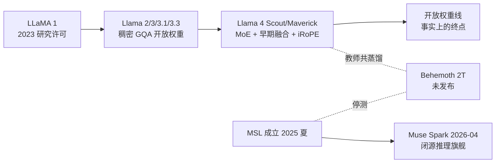

# Llama（Meta）

> **一句话定位**：Meta 把"前沿规模的开放权重"本身当作技术路线与生态武器——从 LLaMA 1 泄露引爆开源浪潮，到 405B 稠密硬刚闭源旗舰，再到早期融合原生多模态 MoE（17B 激活 + iRoPE 撑出 10M 上下文），持续免费开放以 commoditize the complement；直到 2025–26 年 Meta Superintelligence Labs（MSL）主导下首次裂变为"开放存量 Llama + 闭源 Muse 前沿"双轨。
>
> 首发年份：2023（LLaMA 1，2023-02）· 机构：Meta AI / FAIR（后由 Meta Superintelligence Labs 主导）· 代表版本：Llama 4 Scout / Maverick（2025-04）、Muse Spark（2026-04 闭源）
>
> 前置阅读：[基础模型总览](/base-models/)；对比阅读：[Qwen](/base-models/qwen)（同为开放权重路线）、[OpenAI](/base-models/openai)（开闭源策略的镜像）

## 模型系列总览

### 语言模型主线

| 模型 | 发布时间 | 开源 | 要点 | 链接 |
|---|---|---|---|---|
| LLaMA 1 | 2023-02 | 研究许可（权重泄露） | 7B/13B/33B/65B 稠密，仅公开数据训练；13B 多数基准超 GPT-3 175B，开启开源 LLM 浪潮 | [论文](https://arxiv.org/abs/2302.13971) |
| Llama 2 | 2023-07 | 开放权重 | 7B/13B/70B（论文另含未发布的 34B），4K 上下文，70B 引入 GQA；首次允许商用（Community License），与 Azure 联合首发 | [论文](https://arxiv.org/abs/2307.09288) |
| Llama 3 | 2024-04 | 开放权重 | 8B/70B，8K 上下文，全尺寸 GQA，~15T token 预训练 | [博客](https://ai.meta.com/blog/meta-llama-3/) |
| Llama 3.1 | 2024-07 | 开放权重 | 8B/70B/405B，128K 上下文；405B 用 1.6 万+ 张 H100 训练，首个开放权重前沿级模型；许可证首次明确允许蒸馏 | [论文](https://arxiv.org/abs/2407.21783) |
| Llama 3.3 | 2024-12 | 开放权重 | 纯文本 70B Instruct，8 语种、128K 上下文；"以 70B 成本逼近 405B 性能"的效率版收官 | [模型卡](https://huggingface.co/meta-llama/Llama-3.3-70B-Instruct) |
| Llama 4 Scout / Maverick | 2025-04 | 开放权重 | 首个 MoE + 原生多模态家族；Scout 109B 总参/17B 激活/16 专家、宣称 10M 上下文，Maverick 400B/17B/128 专家、1M 上下文；最高 40T token、200 种语言 | [博客](https://ai.meta.com/blog/llama-4-multimodal-intelligence/) |
| Llama 4 Behemoth | 未发布 | — | ~2T 总参/288B 激活的多模态 MoE 教师模型，2025-04 仅预览，用于共蒸馏 Scout/Maverick；多次推迟后随 MSL 成立停测，事实上被搁置 | [博客](https://ai.meta.com/blog/llama-4-multimodal-intelligence/) |

注意：**Llama 4 没有官方 arXiv 技术报告**——arXiv 上的《The Llama 4 Herd》（2601.11659）系冒名提交、已被撤稿，引用时只用官方博客与 HF 发布文。后续路线方面，据多家媒体报道，下一代模型（内部代号 Avocado，曾称 Llama 4.5）由 MSL 主导且转向闭源（仅 API、不放权重），自 2025 年底起多次跳票，截至 2026 年 6 月未发布；网传"开放权重 Llama 5 已发布"缺乏主流信源与 HF 权重佐证，应按传闻处理。

### VL / 多模态理解

两代路线泾渭分明：先外挂适配器，再原生融合。

| 模型 | 发布时间 | 开源 | 要点 | 链接 |
|---|---|---|---|---|
| Chameleon（研究先导） | 2024-05 | 研究发布 | FAIR 出品，从头将图文统一为单一 token 流的早期融合架构，混合模态输入与生成，是 Llama 4 路线的技术原型 | [论文](https://arxiv.org/abs/2405.09818) |
| Llama 3.2 Vision | 2024-09 | 开放权重 | 11B/90B，在 Llama 3.1 文本模型上加 cross-attention 视觉适配器，可作文本版直接替换；同发 1B/3B 端侧纯文本模型（128K 上下文，Day-1 适配高通/联发科/Arm） | [博客](https://ai.meta.com/blog/llama-3-2-connect-2024-vision-edge-mobile-devices/) |
| Llama 4（原生多模态） | 2025-04 | 开放权重 | 文本+图像 token 早期融合进同一骨干，图像理解输入、文本输出 | [HF 发布文](https://huggingface.co/blog/llama4-release) |

### 思考 / 推理

Meta 在开放权重推理模型上长期缺位（同期 DeepSeek-R1、Qwen 已抢占），这一空缺最终由闭源新线补上：

| 模型 | 发布时间 | 开源 | 要点 | 链接 |
|---|---|---|---|---|
| Llama 4 Reasoning | 预告未发布 | — | 2025-04 LlamaCon 前后预告（meta.ai 曾现 "Made with Llama 4 Reasoning" 字样），此后再无下文 | — |
| Muse Spark | 2026-04 | 闭源 | MSL 首个模型、Muse 系列开篇，Llama 时代以来 Meta 首个闭源模型；"小而快"原生多模态推理（图文输入输出），Contemplating 模式编排并行推理子智能体；App/meta.ai 免费用，API 先私测 | [博客](https://ai.meta.com/blog/introducing-muse-spark-msl/) |

### Omni / 全模态

截至 2026 年中**空缺**：没有 Llama 品牌的端到端"文本+图像+语音"一体模型（Llama 4 图文输入/文本输出，Muse Spark 图文输入输出、无端到端语音）。语音/翻译由独立研究线承担——SeamlessM4T（2023-08）单模型覆盖语音↔文本五类任务、约 100 种语言，开源但限非商用（[论文](https://arxiv.org/abs/2308.11596)）。

### 其他：代码、安全与生成式研究线

| 项目 | 发布时间 | 开源 | 要点 | 链接 |
|---|---|---|---|---|
| Code Llama | 2023-08 | 开放权重 | 基于 Llama 2 续训，7B–70B，基础/Python/Instruct 三口味，16K 训练序列、支持 infilling | [论文](https://arxiv.org/abs/2308.12950) |
| CWM（Code World Model） | 2025-09 | 研究许可 | FAIR 32B 稠密模型，在 Python 解释器与 agentic Docker 环境的观察-动作轨迹上 mid-training 学"代码执行世界模型"，再做可验证 RL；SWE-bench Verified 65.8% | [论文](https://arxiv.org/abs/2510.02387) |
| Llama Guard 系列 | 2023-12 起 | 开放权重 | 基于 Llama 的输入/输出安全分类器，随主线迭代出 2/3/4 与 Prompt Guard，组成 Llama Protections 工具链 | [论文](https://arxiv.org/abs/2312.06674) |
| Movie Gen | 2024-10 | 闭源（仅研究展示） | 30B 视频 Transformer，16 秒 1080p 带同步音频 | [论文](https://arxiv.org/abs/2410.13720) |
| Emu | 2023-09 | 闭源 | latent diffusion + 高质量小数据 quality-tuning，驱动 Meta AI 图像功能 | [论文](https://arxiv.org/abs/2309.15807) |
| V-JEPA 2 | 2025-06 | 开放权重 | 100 万小时视频自监督的视频理解/预测/机器人规划世界模型 | [论文](https://arxiv.org/abs/2506.09985) |

无知名通用 embedding 商用模型（仅 Contriever/DRAGON 等研究工作）。

## 架构与训练亮点

**稠密暴力美学（Llama 1–3.3）**：架构上保守到近乎"标准答案"——decoder-only + RMSNorm + SwiGLU + RoPE，Llama 2 起用 GQA 压缩 KV 头数省显存带宽（推理收益见 [KV Cache](/inference/kv-cache)）。提升全靠数据与算力堆叠：预训练 token 从 1.4T（LLaMA 1）涨到 ~15T（Llama 3），405B 是公开训练细节最透明的前沿模型，《The Llama 3 Herd of Models》报告把数据配比、退火、并行策略全部写明，事实上成为社区预训练的参考手册。

> 图源：Llama Team, AI @ Meta, *The Llama 3 Herd of Models*, [arXiv:2407.21783](https://arxiv.org/abs/2407.21783)（用于学习注解，版权归原作者）

**MoE + 原生多模态转身（Llama 4）**：两款模型共享 17B 激活参数，靠专家数（16 vs 128）拉开总参差距；图文 token 早期融合进同一骨干（路线源自 Chameleon）。长上下文靠 **iRoPE**：每 4 层插入一个无位置编码（NoPE）的全局注意力层并施加温度缩放，其余 RoPE 层用 8K 分块注意力，Scout 另加 QK-Norm——以此从 256K 预训练外推出宣称的 10M 上下文。训练上由 ~2T 参数的 Behemoth 对 Scout/Maverick 做共蒸馏（codistillation，参见[白盒蒸馏](/distillation/white-box)）；但教师模型自身始终未发布。

**战略转折（2025–26）**：Meta 重组 AI 部门成立 MSL，以约 143 亿美元投资 Scale AI 并引入 Alexandr Wang 任首席 AI 官；随后 Behemoth 停测、下一代模型改道闭源，2026-04 落地为 Muse Spark。媒体共识是 Scout/Maverick 为可见未来内最后的开放权重版本，Meta 转向"mostly closed"，与 OpenAI 重拾开放权重恰成镜像。

## 许可证与选型建议

**许可证**：Meta 从不用 Apache-2.0/MIT，全系自定义条款，选型前必读：

- **Llama Community License**（Llama 2 起）：免费商用，但月活超 7 亿需向 Meta 单独申请（Meta 可拒绝）；衍生模型命名须带 "Llama"；不符合 OSI 开源定义，准确说法是 open-weights。
- **蒸馏合法化**：Llama 3.1 起明确允许用输出做合成数据/训练其他模型（此前灰色地带），这是它成为社区蒸馏教师首选的法律前提。
- **欧盟限制**：Llama 3.2 多模态版与 Llama 4 的许可证明文禁止欧盟注册实体使用多模态模型（纯文本不受限），被视为对 EU AI Act 的规避动作。
- **研究线**（CWM/SeamlessM4T/V-JEPA 2 等）多为 FAIR 非商用许可或 CC-BY-NC；Muse Spark 完全无权重。

**选型建议**（需要可微调/可私有化的开放权重时）：

| 场景 | 推荐 | 理由 |
|---|---|---|
| 通用微调底座、生态兼容性最好 | Llama 3.1 8B / 70B | 工具链与论文复现的事实标准，128K 上下文 |
| 单机部署的最强文本性能 | Llama 3.3 70B | 接近 405B 效果，部署成本仅 70B |
| 蒸馏教师 / 合成数据源 | Llama 3.1 405B | 开放权重中训练细节最透明的前沿稠密模型 |
| 多模态 + 超长上下文 | Llama 4 Scout / Maverick | 17B 激活推理成本低；但 10M 上下文为宣称值，长文档场景需自行实测 |
| 代码 agent 研究 | CWM 32B | 注意非商用许可 |

若需要更新的开放权重推理模型，Meta 当前没有答案，应转向 [DeepSeek](/base-models/deepseek)、[Qwen](/base-models/qwen)、[GLM](/base-models/glm)。

## 参考链接

- Touvron et al., 2023. LLaMA: Open and Efficient Foundation Language Models. arXiv:2302.13971
- Touvron et al., 2023. Llama 2: Open Foundation and Fine-Tuned Chat Models. arXiv:2307.09288
- Llama Team, 2024. The Llama 3 Herd of Models. arXiv:2407.21783
- Team Chameleon, 2024. Chameleon: Mixed-Modal Early-Fusion Foundation Models. arXiv:2405.09818
- [Llama 4 官方博客（唯一权威技术来源，无 arXiv 报告）](https://ai.meta.com/blog/llama-4-multimodal-intelligence/)
- [Hugging Face：Llama 4 发布解读](https://huggingface.co/blog/llama4-release)
- [Muse Spark 发布公告](https://ai.meta.com/blog/introducing-muse-spark-msl/)
- Rozière et al., 2023. Code Llama: Open Foundation Models for Code. arXiv:2308.12950
- Inan et al., 2023. Llama Guard: LLM-based Input-Output Safeguard. arXiv:2312.06674
