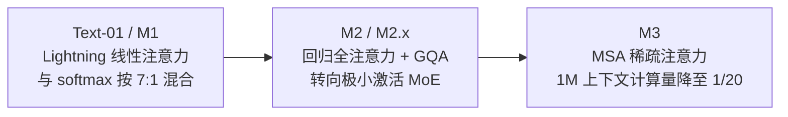

# MiniMax

> **一句话定位**：MiniMax（稀宇科技，2026 年 1 月港交所上市）是把"注意力机制本身"当作主战场的效率派厂商——从 Lightning 线性混合注意力（Text-01/M1）到极小激活 MoE（M2 系列 230B 总参仅 10B 激活）再到 MSA 稀疏注意力（M3），用架构创新把 1M 上下文与 agentic 推理的成本压到前沿闭源模型的零头。
>
> 首发年份：2024（abab6，中国首个 MoE 架构 LLM，2024-01；稀宇科技 2021-12 成立）· 机构：MiniMax（稀宇科技）· 代表版本：MiniMax-M2.5 / M3（2026）
>
> 前置阅读：[基础模型总览](/base-models/)

## 模型系列总览

MiniMax 的版图分两条主线：**语言/Agent 模型**走开放权重路线（M1 起），是其技术叙事的核心；**多模态生成矩阵**（视频 Hailuo、语音 Speech、音乐 Music、图像 Image）全部闭源、走产品与 API 路线。

### 语言 / Agent 系列

| 模型 | 发布时间 | 开源 | 要点 | 链接 |
|---|---|---|---|---|
| abab6 | 2024-01 | 否（API） | 中国首个 MoE 架构 LLM；前代 abab5.5 为稠密模型 | — |
| abab6.5 / 6.5s | 2024-04 | 否（API） | 万亿参数级 MoE，200K 上下文 | [官方博客](https://www.minimax.io/news/abab65-series) |
| MiniMax-Text-01 | 2025-01 | 是 | MoE 456B/45.9B 激活、32 专家；Lightning 线性注意力与 softmax 注意力 7:1 混合；训练 1M、推理外推 4M 上下文 | [arXiv:2501.08313](https://arxiv.org/abs/2501.08313) |
| MiniMax-M2 | 2025-10-27 | 是（MIT） | MoE 230B/10B 激活，62 层；放弃线性混合注意力、回归全注意力 + GQA（48Q/8KV）；预训练 29.2T tokens，约 200K 上下文，interleaved thinking；定价约 Claude Sonnet 的 8% | [arXiv:2605.26494](https://arxiv.org/abs/2605.26494) |
| MiniMax-M2.1 | 2025-12 下旬 | 是（MIT） | 重点增强 Rust/Java/Go/C++/Kotlin/TS 多语言编程 | [官方博客](https://www.minimax.io/news/minimax-m21) |
| MiniMax-M2.5 / Lightning | 2026-02-12 | 是（MIT） | 在 20 万+ 真实环境上大规模 RL；SWE-Bench Verified 80.2%、Multi-SWE-Bench 51.3%、BrowseComp 76.3%；官方定位"首个原生面向 Agent 场景的生产级模型"，约 $1/小时（100 tok/s 连续运行） | [arXiv:2605.26494](https://arxiv.org/abs/2605.26494) |
| MiniMax-M2.7 | 2026-03-18（API）/ 04-12（权重） | 是（受限许可） | 256 专家、200K 上下文；"自我进化"——模型深度参与自身研发（自主优化编程脚手架 100+ 轮提升 30%）；SWE-Pro 56.22%、Terminal Bench 2 57.0% | [官方博客](https://www.minimax.io/news/minimax-m27-en) |
| MiniMax M3 | 2026-06-01 | 已宣布，权重待发布 | 全新 MSA 稀疏注意力；1M 上下文下单 token 计算量降至上代 1/20，prefill 提速 >9 倍、decoding >15 倍；从第 0 步起文本/图像/视频混合训练（原生多模态输入）；SWE-Bench Pro 59.0% | [官方博客](https://www.minimax.io/blog/minimax-m3) |

### VL / 多模态理解系列

| 模型 | 发布时间 | 开源 | 要点 | 链接 |
|---|---|---|---|---|
| MiniMax-VL-01 | 2025-01 | 是 | ViT-MLP-LLM 框架（约 300M ViT 接 456B Text-01 底座），动态分辨率 | [arXiv:2501.08313](https://arxiv.org/abs/2501.08313) |

VL-01 之后没有独立 VL 续作，多模态理解能力在 M3 中以原生多模态输入的形式并入主线。

### 思考 / 推理系列

| 模型 | 发布时间 | 开源 | 要点 | 链接 |
|---|---|---|---|---|
| MiniMax-M1-40k / 80k | 2025-06 | 是（Apache-2.0） | 全球首个开放权重的大规模混合注意力推理模型；基于 Text-01，原生 1M 上下文，40k/80k 两档思考预算；提出 CISPO 算法，完整 RL 仅用 512 张 H800 三周（租金约 53.47 万美元）；生成 100K token 的 FLOPs 约为 DeepSeek R1 的 25% | [arXiv:2506.13585](https://arxiv.org/abs/2506.13585) |

M2 起推理能力（interleaved thinking）并入语言/Agent 主线，不再单列。

### Omni / 全模态

MiniMax 没有以"Omni"命名的独立全模态系列。其全模态能力由两部分组成：输入侧靠 M3 的原生多模态（文本+图像+视频混合训练）；输出侧靠下面的 Hailuo/Speech/Music/Image 生成矩阵，并通过 2026 年 4 月发布的 MMX-CLI 把这些能力统一暴露给 Agent 调用。

### 其他：视频 / 语音 / 音乐 / 图像 / Embedding（全部闭源，仅 API）

| 模型 | 发布时间 | 要点 | 链接 |
|---|---|---|---|
| video-01（Hailuo） | 2024-08 | 720p/25fps/6s，以人物动作与电影感运镜出圈；2025-01 追加 Director 运镜导演版 | [官方博客](https://www.minimax.io/news/video-01) |
| Hailuo 02 | 2025-06-18 | NCR（Noise-aware Compute Redistribution）框架，同参数效率提升 2.5 倍；原生 1080p | [官方博客](https://www.minimax.io/news/minimax-hailuo-02) |
| Hailuo 2.3 / Fast | 2025-10-28 | 1080p/6s 或 768p/10s；强化肢体、微表情与风格化；Fast 版成本降约 50% | [官方博客](https://www.minimax.io/news/minimax-hailuo-23) |
| Speech-02 | 2025-04 | 自回归 Transformer TTS，可学习说话人编码器实现免转写 zero-shot 克隆，Flow-VAE，32 语言；论文公开 | [arXiv:2505.07916](https://arxiv.org/abs/2505.07916) |
| Speech 2.5 / 2.6 / 2.8 | 2025-08 / 2025-10 / 2026-01 | 2.6 主打语音 Agent 低延迟；2.8 引入原生 Sound Tags（口语填充词、笑声）与高保真克隆 | [官方博客](https://www.minimax.io/news/minimax-speech-28) |
| Music-01 → 2.6 | 2024-08 → 2026-04 | 伴奏+人声同时生成；1.5 起时长至 4 分钟、风格/情绪/场景可控 | [官方博客](https://www.minimax.io/news/minimax-music-20) |
| Image-01 | 2025-02 | 首个文生图，16:9–21:9 全比例、单次 9 图，约 $0.0035/图 | [官方博客](https://www.minimax.io/news/image-01) |
| embo-01 | — | 1536 维 embedding，区分 db/query 两种类型；配套能力，无技术报告 | [平台文档](https://platform.minimax.io/docs/release-notes/models) |

## 架构与训练亮点

### 注意力机制的三段式演化

MiniMax 是少数把注意力机制改造作为代际主轴的厂商，路线经历了一次明显的"折返"：

- **线性混合（Text-01/M1）**：每 8 层中 7 层用 Lightning Attention（线性复杂度），1 层保留 softmax 注意力，换来 1M 训练上下文、4M 外推，以及推理时近乎常数的 [KV cache](/inference/kv-cache) 压力。
- **回归全注意力（M2）**：据 M2 系列技术报告，agentic 场景下混合注意力存在工程与精度问题，M2 改回全注意力 + GQA，效率诉求转由"230B 总参仅 9.8B 激活"的极小激活 MoE 承担。
- **稀疏注意力（M3）**：以 MSA（MiniMax Sparse Attention）重拾效率注意力路线，官方称 1M 上下文下单 token 计算量降至上一代的 1/20。

### RL 体系：CISPO 与 Forge

M1 提出的 **CISPO** 是 [GRPO](/rlhf/grpo)/[DAPO](/rlhf/dapo) 同族的策略优化改造：不裁剪 token 更新本身，而是裁剪重要性采样权重 $\rho_t$，保留低概率关键 token（如反思转折词）的梯度。配合混合注意力的低生成成本，M1 的完整 RL 训练仅用 512 张 H800 三周完成。

> 图源：MiniMax, *MiniMax-M1: Scaling Test-Time Compute Efficiently with Lightning Attention*, [arXiv:2506.13585](https://arxiv.org/abs/2506.13585)（用于学习注解，版权归原作者）M2 系列则建设了 agent 原生 RL 基础设施 **Forge**（windowed-FIFO 调度 + 前缀树合并），支撑 M2.5 在 20 万+ 真实环境上做大规模 [agentic RL](/agent/agentic-rl/)；M2.7 进一步展示了"自我进化"——模型参与自身研发流程，自主迭代编程脚手架百余轮带来约 30% 提升。

### 原生多模态预训练

M3 从训练第 0 步起就做文本/图像/视频混合模态训练，而非先训文本底座再做视觉对齐（VL-01 的 ViT-MLP-LLM 接驳式做法），这与 [Gemini](/base-models/gemini) 的原生多模态路线同向。

## 许可证与选型建议

| 模型 | 许可证 |
|---|---|
| Text-01 / VL-01 | 自定义 MiniMax Model License（产品 MAU 超 1 亿需另行授权） |
| M1 | Apache-2.0 |
| M2 / M2.1 / M2.5 | MIT |
| M2.7 | 先 MIT，后改为商用需书面授权的受限许可（非商业不受限） |
| M3 | 已宣布开放权重，许可证截至本文撰写未公布 |
| Hailuo / Speech / Music / Image / embo-01 | 闭源，仅 API |

注意 **M2.7 的许可证变更事件**：最初以 MIT 发布，随后改为商业部署需书面授权，官方解释是防止托管商以错误模板或激进量化部署"劣化版"。这是 MiniMax 上市后首次背离完全开放惯例，生产选型时应以 Hugging Face 仓库当前的 LICENSE 文件为准，不要默认"M 系列都是 MIT"。

选型参考：

- **生产级 agentic coding / 工具调用**：M2.5（MIT，许可证干净，SWE-Bench Verified 80.2%，激活仅 10B 部署成本低）；追求最强能力且能接受受限许可再考虑 M2.7。
- **超长上下文 + 推理研究**：M1（Apache-2.0，1M 上下文，混合注意力开放权重的稀缺样本）；Text-01 适合研究线性注意力 scaling，但许可证非标准。
- **观望项**：M3 能力（原生多模态 + MSA）显著领先，但权重与许可证未落地前不宜纳入生产规划。
- **多模态生成**：Hailuo/Speech/Music 只能走 API，按闭源供应商管理依赖风险。

与同为开放权重路线的 [DeepSeek](/base-models/deepseek)（MLA + 大激活 MoE）、[Qwen](/base-models/qwen)（全尺寸覆盖）、[Kimi](/base-models/kimi) 相比，MiniMax 的差异化在于注意力架构激进创新 + 极小激活比 + agentic RL 基础设施三件套，代价是架构非标准带来的推理框架适配成本。

## 参考链接

- MiniMax, 2025. MiniMax-01: Scaling Foundation Models with Lightning Attention. arXiv:2501.08313
- MiniMax, 2025. MiniMax-M1: Scaling Test-Time Compute Efficiently with Lightning Attention. arXiv:2506.13585
- MiniMax, 2026. The MiniMax-M2 Series: Mini Activations Unleashing Max Real-World Intelligence. arXiv:2605.26494
- MiniMax, 2025. MiniMax-Speech: Intrinsic Zero-Shot Text-to-Speech with a Learnable Speaker Encoder. arXiv:2505.07916
- [MiniMax M3 官方博客](https://www.minimax.io/blog/minimax-m3) · [平台模型 Release Notes](https://platform.minimax.io/docs/release-notes/models)
