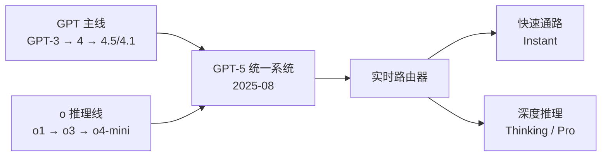

# OpenAI（GPT 系列）

> **一句话定位**：OpenAI 以 GPT-3（2020）确立"规模 + 少样本提示"范式、以 ChatGPT（2022-11）引爆生成式 AI，又以 o1（2024-09）首创"大规模 RL 训练思维链 + 测试时计算扩展"的推理范式；GPT-5（2025-08）起用实时路由器把快/慢模型统一为单一系统，在几乎全闭源、仅 API 的前提下将文本-视觉-语音-图像-编码全模态垂直整合进 ChatGPT 一个入口，仅以 Apache-2.0 的 gpt-oss 作为战略性开放试点。
>
> 首发年份：2019（GPT-2 开放权重）/ 2020（GPT-3）/ 2022-11（ChatGPT 引爆）· 机构：OpenAI · 代表版本：GPT-5.5 / Pro（2026-04）、开源 gpt-oss-120b/20b（2025-08）
>
> 前置阅读：[基础模型总览](/base-models/)；对比阅读：[Claude](/base-models/claude)、[Gemini](/base-models/gemini)

## 模型系列总览

与 Anthropic 的"单一主线"相反，OpenAI 是典型的"一厂多线"：GPT 主线、o 推理线（已并线）、Omni 实时多模态、图像、视频（已停服）、Coder、Embedding、开放权重各成体系。没有独立的 VL 分支——视觉理解自 GPT-4 起就并入主线。

### 语言模型主线

| 模型 | 发布时间 | 开源 | 要点 | 链接 |
|---|---|---|---|---|
| GPT-2 | 2019-02（权重 2019-11 全量放出） | Modified MIT | 1.5B，约 40GB 数据；gpt-oss 之前最后一次开放语言模型权重 | [发布说明](https://openai.com/index/gpt-2-1-5b-release/) |
| GPT-3 | 2020-05 | 闭源 | 175B 稠密自回归；确立"规模 + 少样本提示"范式，2020-06 开放 API | [论文](https://arxiv.org/abs/2005.14165) |
| ChatGPT（GPT-3.5） | 2022-11-30 | 闭源 | 5 天破百万用户、2 个月破亿月活，引爆生成式 AI 浪潮 | [博客](https://openai.com/index/chatgpt/) |
| GPT-4 | 2023-03 | 闭源 | 图文输入；技术报告明确不披露架构/参数；模拟律师资格考试达人类前 10% | [技术报告](https://arxiv.org/abs/2303.08774) |
| GPT-4 Turbo | 2023-11 | 闭源 | 128K 上下文（GPT-4 的 4 倍），输入价降至 1/3 | [博客](https://openai.com/index/new-models-and-developer-products-announced-at-devday/) |
| GPT-4.5（Orion） | 2025-02 | 闭源 | 当时用算力/数据最多的预训练模型（$75/$150 每百万 token）；纯预训练 scaling 路线的尾声 | [博客](https://openai.com/index/introducing-gpt-4-5/) |
| GPT-4.1 / mini / nano | 2025-04 | 闭源 | 上下文跃升至 1M；主打编码与指令遵循（SWE-bench Verified 54.6%） | [博客](https://openai.com/index/gpt-4-1/) |
| GPT-5 / mini / nano | 2025-08 | 闭源 | "统一系统"：快模型 + Thinking + 实时路由器；272K 输入 + 128K 输出；SWE-bench Verified 74.9%、AIME 2025 无工具 94.6% | [博客](https://openai.com/index/introducing-gpt-5/) |
| GPT-5.1 | 2025-11 | 闭源 | Instant 引入自适应推理（自行决定是否先思考）+ Thinking；8 种人格预设 | [博客](https://openai.com/index/gpt-5-1/) |
| GPT-5.2 | 2025-12 | 闭源 | Instant / Thinking / Pro 三模式；API 上下文 400K、输出 128K | [博客](https://openai.com/index/introducing-gpt-5-2/) |
| GPT-5.5 / Pro | 2026-04 | 闭源 | 上下文升至约 105 万 token；$5/$30（Pro $30/$180），超 272K 输入按 2 倍计费；主打代理式工作 | [博客](https://openai.com/index/introducing-gpt-5-5/) |

ChatGPT 端的默认模型另有快速迭代节奏：2026-03 上线的 GPT-5.3 Instant 是过渡版默认模型，两个月后即被 [GPT-5.5 Instant](https://openai.com/index/gpt-5-5-instant/)（2026-05 起全量推送）取代。

### 思考 / 推理系列（o 系列 → 并入 GPT-5）

| 模型 | 发布时间 | 开源 | 要点 | 链接 |
|---|---|---|---|---|
| o1-preview / o1-mini | 2024-09 | 闭源 | 开创"大规模 RL 训练思维链 + 测试时计算扩展"范式：AIME 解题 12.5/15 vs GPT-4o 的 1.8/15 | [博客](https://openai.com/index/introducing-openai-o1-preview/) |
| o1 / o1 pro mode | 2024-12 | 闭源 | 完整版随 ChatGPT Pro 发布，pro mode 用更多测试时计算换可靠性 | [博客](https://openai.com/index/introducing-chatgpt-pro/) |
| o3-mini | 2025-01 | 闭源 | 低成本 STEM 推理；首个支持函数调用/结构化输出的小型推理模型，low/medium/high 三档 effort | [博客](https://openai.com/index/openai-o3-mini/) |
| o3 / o4-mini | 2025-04 | 闭源 | 首次让推理模型在思维链中代理式调用全部工具（搜索/Python/图像），可"用图像思考"；o3-pro 2025-06 跟进 | [博客](https://openai.com/index/introducing-o3-and-o4-mini/) |
| Deep Research | 2025-02 | 闭源 | 基于 o3 优化变体的多步联网研究代理；2025-06 以 o3/o4-mini-deep-research 进 API | [博客](https://openai.com/index/introducing-deep-research/) |

GPT-5 发布后独立 o 系列停止推新，推理路线由 GPT-5.x 的 Thinking / Pro 模式延续（GPT-5 Pro 于 2025-10 DevDay 进 API，$15/$120）。这条"RL 教会模型在回答前思考"的路线是当今推理模型训练（参见 [RLHF 总览](/rlhf/)、[GRPO](/rlhf/grpo)）的源头。

### VL / 多模态理解（内建于主线）

无独立 VL 系列。图像理解自 GPT-4（2023-03）起内建，GPT-4o 改为端到端原生多模态，GPT-5 的 MMMU 达 84.2%；o3 的"用图像思考"（在思维链中裁剪、变换图像后继续推理）把视觉并入了推理过程而非仅作输入编码。视觉**生成**则单独成线（见下文图像生成）。

### Omni / 实时多模态

| 模型 | 发布时间 | 开源 | 要点 | 链接 |
|---|---|---|---|---|
| GPT-4o | 2024-05 | 闭源 | 单一网络端到端处理文本/视觉/音频，音频响应均值 320ms（最快 232ms）；比 GPT-4 Turbo 快 2 倍、便宜 50% | [博客](https://openai.com/index/hello-gpt-4o/) |
| GPT-4o mini | 2024-07 | 闭源 | $0.15/$0.60 每百万 token，MMLU 82%，取代 GPT-3.5 Turbo 成低价主力 | [博客](https://openai.com/index/gpt-4o-mini-advancing-cost-efficient-intelligence/) |
| gpt-4o-transcribe / mini-tts | 2025-03 | 闭源 | 转写 WER 优于 Whisper；可指示"怎么说"的可控 TTS | [博客](https://openai.com/index/introducing-our-next-generation-audio-models/) |
| gpt-realtime | 2025-08 | 闭源 | 语音到语音 GA：远程 MCP、图像输入、SIP 电话接入，捕捉非语言线索 | [博客](https://openai.com/index/introducing-gpt-realtime/) |
| GPT-Realtime-2 家族 | 2026-05 | 闭源 | 首个具备 GPT-5 级推理的语音模型；另含 Translate（70+ 语种实时同传）与 Whisper（流式转写） | [博客](https://openai.com/index/advancing-voice-intelligence-with-new-models-in-the-api/) |

### 其他：开放权重、图像/视频、Coder、Embedding

**开放权重**（专有体系中的少数例外）：

| 模型 | 发布时间 | 许可证 | 要点 | 链接 |
|---|---|---|---|---|
| Whisper | 2022-09 | MIT | 编码器-解码器 Transformer（38M~1.5B），68 万小时弱监督多语数据，零样本接近监督 SOTA | [论文](https://arxiv.org/abs/2212.04356) |
| gpt-oss-120b / 20b | 2025-08 | Apache-2.0 | GPT-2 以来首批开放权重语言模型；120b 接近 o4-mini（单张 80GB GPU 可跑）、20b 接近 o3-mini（16GB 内存可跑） | [模型卡](https://arxiv.org/abs/2508.10925) |
| gpt-oss-safeguard | 2025-10 | Apache-2.0 | 策略条件化安全分类器：推理时直接解读开发者自定义政策，改政策无需重训 | [博客](https://openai.com/index/introducing-gpt-oss-safeguard/) |

**图像与视频生成**：

| 模型 | 发布时间 | 开源 | 要点 | 链接 |
|---|---|---|---|---|
| DALL·E 3 | 2023-10 | 闭源 | 由 ChatGPT 代写提示词驱动；2025-03 起被 4o 原生生图取代 | [博客](https://openai.com/index/dall-e-3/) |
| gpt-image-1 | 2025-04 | 闭源 | 自回归原生多模态生图（ChatGPT 端 2025-03 上线，首周 1.3 亿用户生成 7 亿张图），最高 4096²，强项文字渲染与精确编辑 | [博客](https://openai.com/index/image-generation-api/) |
| gpt-image-1.5 / 2 | 2025-12 / 2026-04 | 闭源 | image-2 生成前先代理式研究规划、非拉丁文字字符级准确渲染、联网事实核查 | [博客](https://openai.com/index/introducing-chatgpt-images-2-0/) |
| Sora / Sora 2 | 2024-12 / 2025-09 | 闭源（已停服） | Sora 2 实现同步音画、更准物理与真人 cameo，配 TikTok 式社交 App；2026-03 宣布停服（应用 2026-04 下线、API 2026-09 终止） | [博客](https://openai.com/index/sora-2/) |

**Coder**：2021 年初代 Codex 模型曾是 GitHub Copilot 底座；现今 Codex 指云端软件工程智能体产品（agent 设计参见 [Agent Loop](/harness/agent-loop)、[沙箱](/harness/sandbox)）。

| 模型 | 发布时间 | 开源 | 要点 | 链接 |
|---|---|---|---|---|
| Codex 智能体（codex-1） | 2025-05 | 闭源 | 基于 o3 用真实编码任务 RL 微调；云端沙箱并行写功能、修 bug、提 PR | [博客](https://openai.com/index/introducing-codex/) |
| GPT-5-Codex | 2025-09 | 闭源 | 按任务复杂度动态分配思考时间（简单请求省 93.7% token），实测独立连续工作 7 小时以上 | [博客](https://openai.com/index/introducing-upgrades-to-codex/) |
| GPT-5.1-Codex-Max → 5.3-Codex | 2025-11 → 2026-02 | 闭源 | Max 引入 compaction 跨多上下文窗口长时程工作；5.3 合并 Codex 与 GPT-5 训练栈、提速约 25%；Spark 变体实时编码超 1000 token/s | [博客](https://openai.com/index/introducing-gpt-5-3-codex/) |

**Embedding**：text-embedding-3-small / large（2024-01，闭源）至今仍是主力——large 最高 3072 维，`dimensions` 参数支持套娃式降维（256 维仍优于 ada-002 的 1536 维），MIRACL 多语检索从 31.4% 提至 54.9%（[博客](https://openai.com/index/new-embedding-models-and-api-updates/)）。

## 架构与训练亮点

**自 GPT-4 起架构全面保密**。GPT-4 技术报告开了"不披露架构、参数量、训练数据"的先例（坊间流传 GPT-4 为约 1.8T 总参的 16 专家 MoE，但来自泄露分析，OpenAI 从未证实，不可当作事实引用）。目前唯一的官方架构窗口是 gpt-oss 模型卡：MoE Transformer，120b 为 36 层 / 116.8B 总参 / 5.1B 激活、128 专家 top-4 路由；GQA（64 查询头、8 KV 头）；注意力交替使用带宽 128 的带状稀疏与全稠密模式（沿袭 GPT-3 的设计）；RoPE + YaRN 原生 128K 上下文；权重原生 MXFP4 量化（参见 [量化](/inference/quantization)）。可以合理推断主线模型与此同源，但无法核实。

**三个范式接力**勾勒出 OpenAI 的技术主轴：

1. **预训练 scaling**（2020–2025-02）：GPT-3 证明"参数 × 数据 × 算力"换少样本能力；GPT-4.5 是这条路线的尾声——官方坦承它"不是 frontier model"，纯堆预训练的边际收益已显著下降。
2. **测试时计算**（2024-09 起）：o1 用大规模 RL 训练思维链，让模型回答前思考，准确率随思考 token 数扩展。这是当前所有推理模型（DeepSeek-R1、Gemini Thinking 等）的共同源头。
3. **统一系统与路由**（2025-08 起）：GPT-5 用实时路由器在快模型与深度推理模型间自动调度；GPT-5.1 进一步把"是否思考"内化为模型自适应决策。API 侧以 `reasoning_effort`（含 minimal）与 `verbosity` 参数暴露控制面。

**产品反哺训练**是另一条暗线：Codex 用真实世界编码任务做 RL 微调、Deep Research 用浏览任务训练代理行为，工具调用（参见 [工具调用](/agent/tool-use)、[Agentic RL](/agent/agentic-rl/)）从外挂函数变成 RL 优化的策略行为。

## 许可证与选型建议

**许可证**：绝大多数模型（GPT-4/4.x/5.x、o 系列、GPT-4o、Sora、gpt-image、Codex、embedding）为专有、仅 API/产品访问。开放权重例外仅三处：gpt-oss 与 gpt-oss-safeguard 为 Apache-2.0（无 Llama 式自定义限制条款，商用友好），Whisper 为 MIT，GPT-2 为 Modified MIT。需要可微调权重做 [SFT](/sft/) / [LoRA](/lora/) 时，gpt-oss 是 OpenAI 系内唯一选项，否则转向 [Qwen](/base-models/qwen)、[DeepSeek](/base-models/deepseek)、[Llama](/base-models/llama)。

**在役模型选型**（截至 2026 年中，价格为每百万 token 输入/输出）：

| 场景 | 推荐 | 要点 |
|---|---|---|
| 通用旗舰 / 长程 agent | GPT-5.5 | 约 1M 上下文，$5/$30（超 272K 输入按 2 倍计费） |
| 最难推理任务 | GPT-5.5 Pro | $30/$180，更多测试时计算换可靠性 |
| 低成本高吞吐 | gpt-5-mini / nano | API 三档中的低价位 |
| agentic 编码 | GPT-5.3-Codex（Spark 用于实时补全） | 仅 Responses API |
| 实时语音 | GPT-Realtime-2 | GPT-5 级推理的语音到语音 |
| 检索 / RAG | text-embedding-3-large | 3072 维，dimensions 可降维省存储 |
| 私有化部署 / 微调 | gpt-oss-120b / 20b | Apache-2.0，单卡 80GB / 16GB 内存可跑 |

实践提示：其一，路由器与自适应推理使同一请求的算力消耗不确定，做评测或成本核算时应固定具体模型与 `reasoning_effort`，避免使用自动路由入口；其二，Sora 从发布到停服不足 18 个月（API 仅存活约一年），依赖 OpenAI 闭源 API 的产品需为模型退役预留迁移路径；其三，ChatGPT 默认模型（5.3 Instant → 5.5 Instant）与 API 版本节奏不同步，复现实验须锁定 API 模型快照而非产品入口。

## 参考链接

- Brown et al., 2020. Language Models are Few-Shot Learners. arXiv:2005.14165
- OpenAI, 2023. GPT-4 Technical Report. arXiv:2303.08774
- Radford et al., 2022. Robust Speech Recognition via Large-Scale Weak Supervision. arXiv:2212.04356
- OpenAI, 2025. gpt-oss-120b & gpt-oss-20b Model Card. arXiv:2508.10925
- [OpenAI News（全部发布公告）](https://openai.com/news/)
- [ChatGPT 模型发布说明](https://help.openai.com/en/articles/9624314-model-release-notes)
- [gpt-oss-120b 权重（Hugging Face）](https://huggingface.co/openai/gpt-oss-120b)
