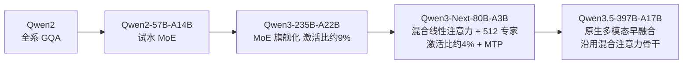

# Qwen（阿里巴巴）

> **一句话定位**：阿里通义千问（Qwen）走"全家桶式全面开源 + 效率优先的架构激进主义"路线——以 Apache-2.0 开源覆盖语言 / VL / Omni / 代码 / Embedding / 语音 / 图像 / 视频的完整模型矩阵（0.6B 到 397B、119→201 种语言），率先把极稀疏 MoE（激活比低至 ~4%）与 Gated DeltaNet 混合线性注意力推成开源旗舰标配，同时保留闭源 Max/Plus 万亿参数商业线双轨并行。
>
> 首发年份：2023（Qwen 初代 7B，2023-08）· 机构：阿里巴巴 / 通义千问团队 · 代表版本：Qwen3.5-397B-A17B（2026-02）
>
> 前置阅读：[基础模型总览](/base-models/)；对比阅读：[DeepSeek](/base-models/deepseek)、[Llama](/base-models/llama)

## 模型系列总览

与 Anthropic"单一主线"相反，Qwen 是典型的"一厂多线"：语言基座之外，VL、推理、Omni、Coder、Embedding、语音、图像视频生成各开一条产品线，且几乎每条线都坚持开放权重；闭源的只有 Max/Plus 商业 API 线。

### 语言模型主线

| 模型 | 发布时间 | 开源 | 要点 | 链接 |
|---|---|---|---|---|
| Qwen 初代（1.8B/7B/14B/72B） | 2023-08~12 | 开放权重（通义千问许可证） | 当时主流 dense Transformer；7B 于 8 月率先开源，14B 于 9 月、1.8B/72B 于年底跟进 | [论文](https://arxiv.org/abs/2309.16609) |
| Qwen1.5 | 2024-02 | 多数尺寸开源 | 0.5B~110B 共 8 档 + MoE-A2.7B；代码并入 HF transformers | [博客](https://qwenlm.github.io/blog/qwen1.5/) |
| Qwen2 | 2024-06 | Apache-2.0（72B 除外） | 0.5B–72B dense + 57B-A14B MoE，全系 GQA，约 30 种语言 | [论文](https://arxiv.org/abs/2407.10671) |
| Qwen2.5 | 2024-09 | Apache-2.0（3B/72B 除外） | 预训练数据 7T→18T tokens；128K 上下文（YaRN 外推） | [论文](https://arxiv.org/abs/2412.15115) |
| Qwen2.5-1M | 2025-01 | Apache-2.0 | 7B/14B 上下文扩到 1M，配套稀疏注意力推理框架 3-7 倍 prefill 加速 | [论文](https://arxiv.org/abs/2501.15383) |
| Qwen2.5-Max | 2025-01 | 闭源 | 超大规模 MoE、预训练超 20T tokens，仅 API | [博客](https://qwenlm.github.io/blog/qwen2.5-max/) |
| Qwen3 | 2025-04 | Apache-2.0（全系） | 0.6B–235B dense+MoE（旗舰 235B-A22B）；单模型 thinking/non-thinking 双模式；119 种语言 | [论文](https://arxiv.org/abs/2505.09388) |
| Qwen3-2507 | 2025-07 | Apache-2.0 | 放弃混合思考，Instruct 与 Thinking 分开训练；上下文升至 262K | [模型卡](https://huggingface.co/Qwen/Qwen3-235B-A22B-Instruct-2507) |
| Qwen3-Next-80B-A3B | 2025-09 | Apache-2.0 | Gated DeltaNet 与 Gated Attention 3:1 混合 + 512 专家极稀疏 MoE（激活仅 ~3B）+ MTP；训练成本不到 Qwen3-32B 的 10% | [模型卡](https://huggingface.co/Qwen/Qwen3-Next-80B-A3B-Instruct) |
| Qwen3-Max | 2025-09 | 闭源 | Qwen 首个总参超 1T 的稀疏 MoE，预训练约 36T tokens，262K 上下文 | [博客](https://www.alibabacloud.com/blog/qwen3-max-just-scale-it_602621) |
| Qwen3.5 | 2026-02 | Apache-2.0 | 旗舰 397B-A17B 原生多模态（早期融合视觉-语言），沿用混合注意力骨干；201 种语言；另有 4B/9B/27B dense 与中档 MoE 梯队 | [模型卡](https://huggingface.co/Qwen/Qwen3.5-397B-A17B) |
| Qwen3.6 | 2026-04 | Apache-2.0 | 35B-A3B（MoE）与 27B（dense），默认 262K 上下文 | [GitHub](https://github.com/QwenLM/Qwen3.6) |
| Qwen3.7-Max / Plus | 2026-05~06 | 闭源 | 定位智能体模型：上下文翻倍至 1M，内建扩展思考，主打长程自主任务（演示连续运行约 35 小时、千余次工具调用） | [报道](https://technode.com/2026/05/21/alibaba-introduces-qwen3-7-max-as-next-gen-ai-agent-model/) |

### VL / 多模态理解

| 模型 | 发布时间 | 开源 | 要点 | 链接 |
|---|---|---|---|---|
| Qwen-VL | 2023-08 | 开放权重（Qwen 许可证） | 视觉感受器 + 三阶段训练，率先把 grounding 与文字阅读做进开源 LVLM | [论文](https://arxiv.org/abs/2308.12966) |
| Qwen2-VL | 2024-08~09 | 2B/7B Apache-2.0，72B Qwen 许可 | Naive Dynamic Resolution（任意分辨率→动态视觉 token）+ M-RoPE | [论文](https://arxiv.org/abs/2409.12191) |
| Qwen2.5-VL | 2025-01~03 | Apache-2.0（72B 除外） | 从零训练带窗口注意力的原生动态分辨率 ViT；绝对时间编码处理长视频；强化文档解析与 GUI agent | [论文](https://arxiv.org/abs/2502.13923) |
| Qwen3-VL | 2025-09~11 | Apache-2.0（全系） | 旗舰 235B-A22B 到 2B dense 全梯队；Interleaved-MRoPE、DeepStack 多层 ViT 特征融合、Text-Timestamp Alignment；256K 上下文可扩 1M | [论文](https://arxiv.org/abs/2511.21631) |

### 思考 / 推理

| 模型 | 发布时间 | 开源 | 要点 | 链接 |
|---|---|---|---|---|
| QwQ-32B-Preview | 2024-11 | Apache-2.0 | 开源界最早一批 o1 式长思考模型 | [模型卡](https://huggingface.co/Qwen/QwQ-32B-Preview) |
| QVQ-72B-Preview | 2024-12 | 权重开放 | 基于 Qwen2-VL-72B 的实验性视觉推理模型 | [模型卡](https://huggingface.co/Qwen/QVQ-72B-Preview) |
| QwQ-32B 正式版 | 2025-03 | Apache-2.0 | 结果驱动的两阶段 RL（数学验证器 + 代码执行服务器），32B 推理能力比肩 671B 的 DeepSeek-R1 | [博客](https://qwenlm.github.io/blog/qwq-32b/) |

2025-04 起推理并入主线：Qwen3 首发单模型双模式（`/think` 开关）→ 发现折损后 2025-07 改为独立 Thinking 模型（235B-A22B-Thinking-2507）；此后 VL/Omni/Next 各线均提供 Thinking 版，闭源侧另有 Qwen3-Max-Thinking。RL 训练范式可参考 [GRPO](/rlhf/grpo) 与 [RLHF 总览](/rlhf/)——Qwen 团队提出的 GSPO 见 [GSPO](/rlhf/gspo)。

### Omni 全模态

| 模型 | 发布时间 | 开源 | 要点 | 链接 |
|---|---|---|---|---|
| Qwen2.5-Omni | 2025-03 | Apache-2.0 | 首创 Thinker-Talker 架构（Talker 直接以 Thinker 隐状态自回归产音频 token）+ TMRoPE + 滑窗 DiT 流式解码；端到端文本/图像/音频/视频输入、流式文本+语音输出 | [论文](https://arxiv.org/abs/2503.20215) |
| Qwen3-Omni | 2025-09 | Apache-2.0 | Thinker/Talker 均升级为 MoE（30B-A3B），自研 AuT 音频编码器；官方称首个各单模态无性能折损的全模态模型 | [论文](https://arxiv.org/abs/2509.17765) |
| Qwen3.5-Omni | 2026-03 | 发布时仅 API | Thinker/Talker 均为混合注意力 MoE，规模扩至数千亿参；支持 10 小时以上音频理解 | [论文](https://arxiv.org/abs/2604.15804) |

### 其他：Coder、Embedding、语音与生成式多模态

| 模型 | 发布时间 | 开源 | 要点 | 链接 |
|---|---|---|---|---|
| Qwen2.5-Coder | 2024-09~11 | Apache-2.0（主体） | 0.5B–32B，5.5T+ token 代码续训 | [论文](https://arxiv.org/abs/2409.12186) |
| Qwen3-Coder | 2025-07 | Apache-2.0 | 480B-A35B，大规模可执行任务的 [Agentic RL](/agent/agentic-rl/) 训练，对标 Claude Sonnet 4；后出 30B-A3B Flash 版 | [博客](https://qwenlm.github.io/blog/qwen3-coder/) |
| Qwen3-Coder-Next | 2026-02 | Apache-2.0 | 基于 Qwen3-Next-80B-A3B，3B 激活参数达 10-20 倍激活规模模型的编码 agent 性能，面向本地化编码 agent | [模型卡](https://huggingface.co/Qwen/Qwen3-Coder-Next) |
| Qwen3-Embedding / Reranker | 2025-06 | Apache-2.0 | 0.6B/4B/8B，弱监督合成数据 + 模型合并，MTEB 多语言榜登顶 | [论文](https://arxiv.org/abs/2506.05176) |
| Qwen-Audio / Qwen2-Audio | 2023-11 / 2024-07 | Apache-2.0（Qwen2-Audio） | 30+ 音频任务统一训练；语音对话与音频分析双模式 | [论文](https://arxiv.org/abs/2407.10759) |
| Qwen3-TTS / Qwen3-ASR | 2026-01 | Apache-2.0 | TTS：10 语种、3 秒声音克隆；ASR：52 语种，1.7B 版达开源 SOTA | [论文](https://arxiv.org/abs/2601.15621) |
| Qwen-Image / Image-Edit | 2025-08 | Apache-2.0 | 20B MMDiT，渐进式文字渲染课程使中文等表意文字渲染业界领先 | [论文](https://arxiv.org/abs/2508.02324) |
| Wan2.1 / Wan2.2 | 2025-02 / 2025-07 | Apache-2.0 | 视频 DiT 套件，1.3B 版可跑消费级 GPU；Wan2.2 首个把 MoE 引入视频扩散去噪；Wan2.5-Preview（2025-09）闭源仅 API | [论文](https://arxiv.org/abs/2503.20314) |

## 架构与训练亮点

**效率优先的架构激进主义**。Qwen 是头部厂商中最敢把激进架构直接上旗舰的：从 Qwen2 全系 GQA，到 Qwen3 把 MoE 做成旗舰（235B 总参/22B 激活，激活比 ~9%），再到 Qwen3-Next 同时押注三件事——线性注意力（Gated DeltaNet 与标准 Gated Attention 按 3:1 交替，KV 开销随序列近似常数化，原理参考 [KV Cache](/inference/kv-cache)）、极稀疏 MoE（512 专家、激活比 ~4%）与 Multi-Token Prediction，换来不到 dense 32B 十分之一的训练成本和相当的性能。这套混合骨干随后成为 Qwen3.5 的默认架构。

**数据与上下文的持续 scaling**：预训练语料 Qwen2.5 从 7T 扩到 18T tokens，Qwen3-Max 约 36T；上下文从 128K（YaRN 外推）→ Qwen2.5-1M 率先开源 1M → Qwen3-2507 起 262K 原生 → 混合线性注意力让 1M 推理在工程上可负担。

> 图源：Qwen Team, *Qwen3 Technical Report*, [arXiv:2505.09388](https://arxiv.org/abs/2505.09388)（用于学习注解，版权归原作者）

**thinking 模式的一次公开试错**。Qwen3 首创在同一模型内统一 thinking/non-thinking 双模式，但三个月后即放弃——分开训练的 Instruct-2507/Thinking-2507 均明显更强。这次"合了再拆"成为行业关于混合推理模型折损的重要公开证据（对比 Claude 坚持单模型 adaptive thinking 的路线，见 [Claude](/base-models/claude)）。

**多模态从分线到融合**：VL 线四代积累（动态分辨率、M-RoPE、时间编码）+ Omni 线 Thinker-Talker 流式语音架构，最终在 Qwen3.5 收敛为原生早融合多模态基座——语言旗舰本身就是 VL 模型。

## 许可证与选型建议

**许可证三阶段演进**：2023 年初代用自定义通义千问许可证（商用 1 亿 MAU 限制）→ Qwen1.5/2/2.5 时代多数尺寸 Apache-2.0，但 72B（Qwen 许可）与 3B（Qwen Research 许可）例外，选型需逐档核对 → 2025-04 Qwen3 起全系（含 VL/Omni/Coder/Embedding/TTS/ASR、Wan、Qwen-Image）统一 Apache-2.0，开放程度在头部厂商中最彻底。闭源的仅 Max/Plus 商业线与个别 Preview（Wan2.5-Preview、Qwen3.5-Omni 发布时）。

**选型速查**（截至 2026 年中）：

| 场景 | 推荐 | 理由 |
|---|---|---|
| 自部署旗舰、多模态主力 | Qwen3.5-397B-A17B | 激活仅 17B，原生多模态，Apache-2.0 |
| 中等算力 / 单机部署 | Qwen3.6-35B-A3B、Qwen3.6-27B | 3B 激活或 27B dense，262K 上下文 |
| 端侧 / 微调底座 | Qwen3.5 4B/9B 或 Qwen3 小尺寸 | 全尺寸梯队齐全，社区微调生态成熟（见 [LoRA](/lora/)） |
| 本地编码 agent | Qwen3-Coder-Next | 80B 总参/3B 激活，专为 agent 场景 RL 训练 |
| RAG 检索 / 重排 | Qwen3-Embedding / Reranker | MTEB 多语言登顶，0.6B 档可 CPU 部署 |
| 语音 / 全模态交互 | Qwen3-Omni | 端到端流式语音，Apache-2.0 |
| 不部署、要最强 agent | Qwen3.7-Max（API） | 1M 上下文 + 长程自主任务，但闭源 |

实践提示：Qwen 是目前开源微调与蒸馏生态的事实底座——大量社区推理模型（如 DeepSeek-R1 蒸馏版）选 Qwen 作学生模型（参见 [黑盒蒸馏](/distillation/black-box)）；自部署 MoE 版本时注意极稀疏 MoE 对显存带宽和专家并行的要求与 dense 模型差异很大。

## 参考链接

- Bai et al., 2023. Qwen Technical Report. arXiv:2309.16609
- Yang et al., 2024. Qwen2 Technical Report. arXiv:2407.10671
- Yang et al., 2024. Qwen2.5 Technical Report. arXiv:2412.15115
- Qwen Team, 2025. Qwen3 Technical Report. arXiv:2505.09388
- Qwen Team, 2025. Qwen3-VL Technical Report. arXiv:2511.21631
- Qwen Team, 2025. Qwen3-Omni Technical Report. arXiv:2509.17765
- [Qwen 官方博客](https://qwenlm.github.io/blog/)、[Qwen HuggingFace 组织](https://huggingface.co/Qwen)、[GitHub QwenLM](https://github.com/QwenLM)
