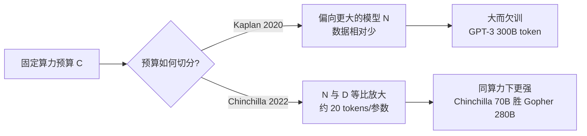

# Scaling Laws（规模定律）

> **一句话**：Scaling Law 用幂律刻画"模型规模 $N$ / 数据量 $D$ / 计算量 $C$"与预训练损失之间的关系，回答"给定算力，该把钱花在更大的模型还是更多的数据上"这一投资决策；Kaplan 2020 起步并倾向"砸大模型"，Chinchilla 2022 修正为参数与数据**等比例放大**（约 20 tokens/参数），后续又延伸到涌现之争、数据墙与推理感知三条现实分支。
>
> 关键年份：Kaplan 2020（arXiv:2001.08361）· Chinchilla 2022（arXiv:2203.15556）· Emergent Abilities 2022（2206.07682）· Mirage 2023（2304.15004）· 数据受限 2023（2305.16264）· Beyond-Chinchilla 2024（2401.00448）
>
> 前置阅读：[基础模型总览](/base-models/) · [模型架构总览](/architecture/)

## 什么是 scaling law，为什么重要

预训练一个前沿模型是一次性的、动辄数百万美元的"豪赌"：算力预算 $C$ 大体固定，工程师必须**提前**决定把它分配给"更大的模型"还是"更多的数据"——而一旦开训，几乎没有反悔的机会。Scaling Law 的价值正在于此：它用小规模（廉价）实验拟合出损失随规模变化的**幂律曲线**，再外推到目标规模，从而把"拍脑袋选参数"变成"可预测的工程决策"。

幂律（power law）意味着：损失 $L$ 与某个规模量 $X$ 在对数坐标下呈直线，即 $\log L = -\alpha \log X + \text{const}$，等价于

$$
L(X) \propto X^{-\alpha}.
$$

幂律的两个工程含义：(1) 收益是**持续但递减**的——每翻一倍规模带来固定的损失下降量，没有断崖、也没有饱和上限（在观测范围内）；(2) 因为在 log-log 图上是直线，所以可以用便宜的小模型外推昂贵的大模型，这才是 scaling law 能当"投资工具"用的根本原因。

## Kaplan 2020：幂律三要素 $L(N, D, C)$

Kaplan 等人（OpenAI，《Scaling Laws for Neural Language Models》，arXiv:2001.08361）系统刻画了交叉熵损失与三个量的关系：模型参数量 $N$、数据集大小 $D$、训练计算量 $C$。核心发现：

- 当**不受其他因素瓶颈**时，损失分别对 $N$、$D$、$C$ 呈幂律，趋势跨越多个数量级：

$$
L(N) \propto N^{-\alpha_N},\qquad L(D) \propto D^{-\alpha_D},\qquad L(C) \propto C^{-\alpha_C}.
$$

  （三个指数 $\alpha$ 的具体数值以原文为准，量级上均为小于 1 的正数，意味着规模翻倍只带来固定的、温和的损失下降。）
- **架构细节（宽度、深度、注意力头数等）影响很小**——在很宽的范围内，规模总量比形状重要。
- **大模型样本效率更高**：在固定算力下，最优做法是训练一个**很大的模型、喂相对适量的数据、并在收敛前就停下**。

这条"偏大模型"的结论深刻影响了 2020–2021 年的实践（GPT-3 175B 用约 300B token，正是这种思路的产物）。但它埋了一个隐患：Kaplan 的实验在调整学习率调度等设置上不够充分，导致系统性地高估了"应该把预算投向参数"的程度。这一点两年后被 Chinchilla 纠正。

## Chinchilla 2022：compute-optimal 与等比放大

Hoffmann 等人（DeepMind，《Training Compute-Optimal Large Language Models》，arXiv:2203.15556）训练了 **400 多个**不同规模的模型，重新拟合了 compute-optimal 的分配方式，结论与 Kaplan 截然不同：

> 在固定算力预算下，**模型规模 $N$ 与训练 token 数 $D$ 应当等比例放大**——参数每翻一倍，训练数据也应翻一倍。

换言之，最优配比近似一个常数：每个参数约 **20 个训练 token**（"~20 tokens/参数"，确切系数以原文拟合为准）。用幂律写出来就是

$$
N_{\text{opt}} \propto C^{a},\qquad D_{\text{opt}} \propto C^{b},\qquad a \approx b \approx 0.5,
$$

即两者各分得约一半的"算力弹性"（对比 Kaplan 给出的 $a$ 明显大于 $b$、把预算更多压向参数）。这背后利用了 $C \approx 6 N D$ 的近似关系（每 token 每参数约 6 次浮点运算）。

**IsoFLOP 思路**：Chinchilla 用了三种互补方法，其中最直观的是 IsoFLOP——固定若干个算力预算（每条等算力曲线就是一条 IsoFLOP curve），在每条曲线上扫不同的 $(N, D)$ 组合（大模型少数据 vs 小模型多数据），观察损失，找到曲线**最低点**就是该预算下的最优配比；把不同预算的最低点连起来，就外推出 $N_{\text{opt}}(C)$ 与 $D_{\text{opt}}(C)$。

**经验铁证**：在与 Gopher 完全相同的算力下，DeepMind 用 **70B 参数 + 约 4 倍数据** 训出的 Chinchilla，在大量下游任务上一致且显著地胜过 **280B 的 Gopher**，也超过 GPT-3（175B）、Jurassic-1、Megatron-Turing NLG（530B）等更大的模型——MMLU 平均准确率达 67.5%，比 Gopher 高 7 个百分点以上。这直接证明：当时主流模型**普遍训练不足**（参数太大、数据太少）。

| 对比维度 | Kaplan 2020 | Chinchilla 2022 |
|---|---|---|
| 机构 / 时间 | OpenAI / 2020-01 | DeepMind / 2022-03 |
| 给定算力，预算该投向 | 更多投向**参数**（砸大模型） | 参数与数据**等比例**放大 |
| 最优配比 | 偏向大 $N$、相对少 $D$ | 约 **20 tokens / 参数** |
| 算力弹性 $N \propto C^a$ | $a$ 明显大于 $b$ | $a \approx b \approx 0.5$ |
| 代表性后果 | GPT-3 等"大而欠训" | Chinchilla 70B 胜 Gopher 280B |
| 拟合方法 | 单点拟合为主 | IsoFLOP + 参数化损失多法交叉验证 |

## 涌现之争：Emergent Abilities vs Mirage

幂律描述的是**平滑的损失曲线**，但下游任务表现似乎并不总是平滑——这引出了一场重要争论。

- **Wei et al. 2022《Emergent Abilities of Large Language Models》（arXiv:2206.07682）** 提出"涌现能力"：某些能力（如多步推理）在小模型上接近随机水平，到了某个规模阈值后才**突然出现**，无法靠外推小模型预测。论文把涌现定义为"量变引起质变"。
- **Schaeffer et al. 2023《Are Emergent Abilities of Large Language Models a Mirage?》（arXiv:2304.15004）** 给出反方解释：所谓涌现很可能是**评测指标选择**造成的"假象"。当使用**非线性 / 不连续**指标（如"全对才得分"的精确匹配、多步任务的乘积式准确率）时，平滑改善会被压成一条看似突变的阶跃曲线；换成**线性 / 连续**指标（如 token 级编辑距离、对数似然），同样的模型族就呈现平滑可预测的提升。作者甚至能通过改指标，在简单网络上"人工诱导"出涌现假象。

工程启示：两篇并非完全对立——平滑的**损失**与突变的**任务指标**可以同时为真。看到"X 规模才会做某事"时，先问一句"这是模型能力的真实台阶，还是 all-or-nothing 指标制造的视觉效果"，再决定要不要为跨过那个阈值买单。

## 现实修正：数据墙与推理感知

Chinchilla 的"20 tokens/参数"是 **compute-optimal**，但现实里两个约束让最优点发生偏移。

**① 数据受限（数据墙）。** Muennighoff et al. 2023《Scaling Data-Constrained Language Models》（arXiv:2305.16264）研究"高质量文本不够用"时该怎么办：在固定算力下重复使用数据（多 epoch）。结论是——**重复至多约 4 个 epoch，损失与用全新数据几乎没有差别**；但再往上重复，新增算力的边际收益**迅速衰减到接近零**，多出来的参数同样开始贬值。作者据此提出了一个把"重复 token 贬值"和"过量参数贬值"都纳入的修正 scaling law。这给"数据墙"时代一个量化护栏：缺数据时复用前几轮是划算的，无限刷同一批语料则是浪费。

**② 推理感知（Beyond-Chinchilla）。** Sardana & Frankle 2024《Beyond Chinchilla-Optimal: Accounting for Inference in Language Model Scaling Laws》（arXiv:2401.00448）指出：Chinchilla 只算了**训练**成本，忽略了**推理**成本。一旦把"模型要服务多少请求"算进总成本，最优解就偏向**更小、训练更久**的模型——因为小模型每次推理都更便宜，把这份省下来的钱乘以海量请求，足以抵消"训练时多喂数据"的额外开销。论文给出修正公式，并用 47 个模型验证：当把每参数 token 数推到极端范围（高达约 10,000 tokens/参数）时，模型质量**仍在持续改善**。

这正是为什么今天大量模型"训练 token 数远超 20×参数"：当一个模型预计被部署、被海量调用，**故意 over-train 一个小模型**比训练一个 Chinchilla-optimal 的大模型更省总账。Llama 系列把 7B/8B 喂到十几 T token，正是这一逻辑的产物——它在纯训练账上"过度"，在训练+推理总账上"最优"。

## 对工程的启示

- **读懂"参数 / 训练 token"配比。** 看到一个模型时，把训练 token 数除以参数量得到 tokens/参数：约 20 是 Chinchilla-optimal；远大于 20（几百到上千）说明它是**面向推理刻意 over-train 的小模型**，目标是部署成本而非"同算力下损失最低"。这个比值比单看参数量更能告诉你模型的设计意图。
- **为什么 7B 也能喂十几 T token。** 这不是浪费，而是 Beyond-Chinchilla 的直接应用：小尺寸 + 海量数据 → 推理便宜、可端侧、易微调，总拥有成本（训练+推理）最优。端侧与高并发场景尤其偏好这种"小而过训"的底座。
- **scaling law 是地图不是地标。** 幂律给的是"在当前架构与数据分布下、损失如何随规模变化"的趋势外推；换了架构（如 [MoE](/architecture/moe)、[线性注意力](/architecture/attention)）、换了数据质量、换了下游指标，曲线就会平移甚至改变斜率。用它做预算决策，但不要把某条具体系数当成物理常数。
- **配合本图谱其它章节。** 选定底座规模后，后训练阶段的算力分配是另一套账：监督微调见 [SFT](/sft/)，偏好对齐见 [RLHF](/rlhf/)；推理侧的成本优化（量化、KV cache）见 [推理优化](/inference/)，它直接决定 Beyond-Chinchilla 里"推理成本"那一项的大小。

## 参考文献

- Kaplan et al., 2020. *Scaling Laws for Neural Language Models*. arXiv:2001.08361（OpenAI）
- Hoffmann et al., 2022. *Training Compute-Optimal Large Language Models*（Chinchilla）. arXiv:2203.15556（DeepMind）
- Wei et al., 2022. *Emergent Abilities of Large Language Models*. arXiv:2206.07682
- Schaeffer et al., 2023. *Are Emergent Abilities of Large Language Models a Mirage?*. arXiv:2304.15004
- Muennighoff et al., 2023. *Scaling Data-Constrained Language Models*. arXiv:2305.16264
- Sardana & Frankle, 2024. *Beyond Chinchilla-Optimal: Accounting for Inference in Language Model Scaling Laws*. arXiv:2401.00448
